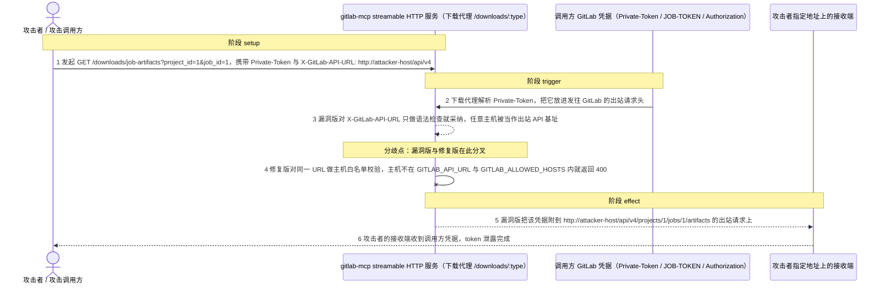
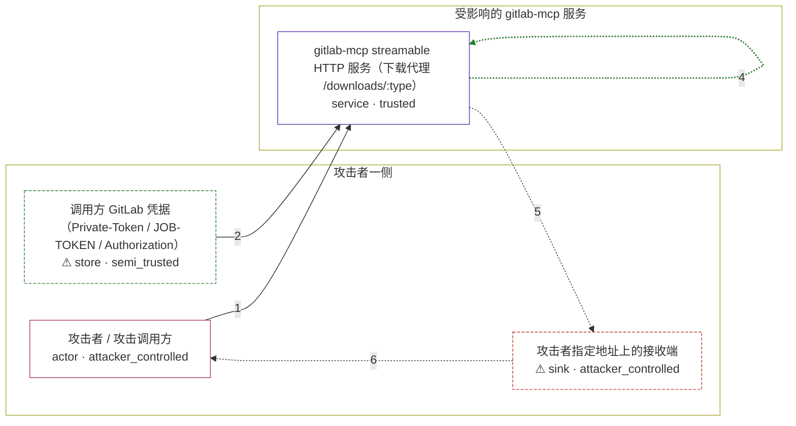

# gitlab-mcp / CVE-2026-61559

状态：草稿，未完成环境和复现。这个目录由模板生成，不构成漏洞确认。

图解的唯一来源是 `diagram.toml`：编辑后运行 `python3 -m runner diagram gitlab-mcp/CVE-2026-61559` 重新生成下方的图解区块。图解必须覆盖漏洞涉及的每个主体，并标出漏洞版/修复版的分歧步骤。

<!-- diagram:begin (generated from diagram.toml by `python3 -m runner diagram`; edit diagram.toml, not this block) -->
## 漏洞图解 — gitlab-mcp / CVE-2026-61559 漏洞图解

开启 ENABLE_DYNAMIC_API_URL 与 REMOTE_AUTHORIZATION 后，gitlab-mcp 的下载代理只对请求头 X-GitLab-API-URL 做 new URL() 语法检查，不校验主机，就把它当成出站 GitLab API 基址。于是调用方可以用一个请求把 Private-Token / JOB-TOKEN / Authorization 凭据附到发往任意主机的出站请求上，凭据随即落到攻击者指定地址。修复版改用 GITLAB_API_URL 与 GITLAB_ALLOWED_HOSTS 构成的主机白名单，未列入白名单的主机让请求在发出前被拒。

### 涉及主体

| 主体 | 类型 | 信任级别 | 在漏洞里的作用 | 来源 |
| --- | --- | --- | --- | --- |
| 攻击者 / 攻击调用方 (`attacker`) | `actor` | `attacker_controlled` | 自带一个 GitLab token 调用 HTTP 传输，并任意选择 X-GitLab-API-URL 指向的主机；它想要的是被服务端转发的凭据。 | — |
| ⚠ 调用方 GitLab 凭据（Private-Token / JOB-TOKEN / Authorization） (`marker_token`) | `store` | `semi_trusted` | 这次调用携带的 GitLab 访问凭据，是攻击者真正想截获的东西；复现里用合成 marker 值代替真实 PAT。 | — |
| gitlab-mcp streamable HTTP 服务（下载代理 /downloads/:type） (`mcp_server`) | `service` | `trusted` | 在 registerDownloadProxy 的 /downloads/:type 处理器里读取 X-GitLab-API-URL 并当作出站 API 基址。漏洞版只做 new URL() 语法检查，不校验主机；修复版改为 resolveTrustedGitLabApiUrl() 白名单校验。 | index.ts:11541 @ 74a8c834424ff557ad8bc6f225e4dc5acf80aa13 |
| ⚠ 攻击者指定地址上的接收端 (`receiver`) | `sink` | `attacker_controlled` | 攻击者用自己的地址充当出站目标，接收服务端转发过来的凭据；它只接收，不转发到任何真实 GitLab。 | — |

**信任边界**

- **攻击者一侧** (`attacker_side`)：成员 `attacker`、`marker_token`、`receiver`。攻击者能决定这次请求的路径、查询参数与 X-GitLab-API-URL，也能决定自己接收端的地址；它拿不到的是服务端自己的信任判断。
- **受影响的 gitlab-mcp 服务** (`product`)：成员 `mcp_server`。出站 GitLab API 基址本应来自自身配置，这个边界保证服务端不会把凭据发到配置以外的任何主机。

标 ⚠ 的主体是本仓库合成的替身或无害效果载体，不代表真实外部目标。

### 触发过程

### 主体与信任边界

箭头上的数字是上面的步骤编号；方框只标主体和信任级别，具体动作见「触发过程」。

**分歧点**：第 3 步（`vulnerable_only`）漏洞版对 X-GitLab-API-URL 只做语法检查就采纳，任意主机被当作出站 API 基址。
**分歧点**：第 4 步（`patched_only`）修复版对同一 URL 做主机白名单校验，主机不在 GITLAB_API_URL 与 GITLAB_ALLOWED_HOSTS 内就返回 400。
<!-- diagram:end -->

## 公告与机制

TODO：官方公告、漏洞根因、Agent 信任边界、受影响范围和修复来源。

## 前提

TODO：认证要求、用户交互、已有批准、工具权限、攻击者能控制的内容。

## 版本与启动

TODO：补全 metadata、Dockerfile/镜像 digest 和 Compose，再写出精确启动命令。

Compose 中 `vulnerable` 与 `patched` profiles 分开使用；未指定 profile 不启动服务。镜像变量未配置时 Compose 会明确报错。此模板不暴露宿主端口，也不挂载主机数据。

## 机制复现

`reproduce.py` 不重写漏洞函数：它启动镜像内固定的上游构建产物 `build/index.js`，再向它发一个请求。

- 上游构建树位置：镜像必须把该 variant 的上游源码（按 `metadata.toml` 的 commit）连同
  `npm ci` 依赖与 `tsc` 产物放在 `/lab/upstream`，入口为 `/lab/upstream/build/index.js`。
  `reproduce.py` 也接受 `AVH_UPSTREAM_DIR` 覆盖该路径。
- 启动环境：`HOST=127.0.0.1 PORT=9955 STREAMABLE_HTTP=true REMOTE_AUTHORIZATION=true
  ENABLE_DYNAMIC_API_URL=true GITLAB_API_URL=http://127.0.0.1:9977/api/v4 GITLAB_ALLOWED_HOSTS=`（空）。
  前三项缺一不可：`ENABLE_DYNAMIC_API_URL` 必须与 `REMOTE_AUTHORIZATION` 成对，否则配置校验直接退出。
- 受控端点：`reproduce.py` 在容器内起两个 HTTP 端点。`127.0.0.1:9977` 代表服务端自己配置并信任的
  GitLab API 地址（修复版白名单由 `GITLAB_API_URL` 推导，因此它必须在这里）；`127.0.0.1:9966`
  代表调用方通过 `X-GitLab-API-URL` 指定的攻击者地址。两个端口刻意不同：修复版按 host 建白名单，
  若两者同 host，攻击地址也会被放行，对照就没有意义。
- 场景：`attack` 用 `fixtures/attack_request.json` 发
  `GET /downloads/job-artifacts?project_id=1&job_id=1` 带 `Private-Token` 与
  `X-GitLab-API-URL: http://127.0.0.1:9966/api/v4`；`benign` 用 `fixtures/benign_request.json`
  发同一路径但不带 `X-GitLab-API-URL`，出站地址由服务端自己的配置决定。
- 效果文件：`observation.json`（`target_ready`、`execution_status`、HTTP 状态）、
  `request.json`、`transmission.json`、`attacker_receiver_hits.json`、`configured_api_hits.json`。
  命中文件里记录方法、路径、全部请求头与来源，凭据是否外泄以攻击者端点是否收到 marker 为准。
- 超时：健康检查最长 60s，单次请求 30s，服务端 SIGTERM 后最多等 10s 再 SIGKILL。

完成实现后使用 `python3 -m runner reproduce gitlab-mcp/CVE-2026-61559 --build --rounds 3`。
两脚本统一接受 `--context <context.json> --output <目录>`，详细字段见仓库 `docs/environment-contract.md`。
PoC 输出 `facts.json` 和效果文件；验证器只读证据，输出含 `target_ready` 及对应效果断言的 `verdict.json`。
镜像必须包含 Python 3 和 `/lab/` 下的脚本、fixtures；`runtime.mode` 选择 `oneshot` 或有 healthcheck 的 `service`。

## 端到端复现

不适用：本漏洞的效果是服务端出站请求携带凭据，与模型无关，`end_to_end.py` 不做真实模型调用。

## 验证与修复对照

`verify.py` 只读 `facts.json`、`observation.json` 与效果文件，不重跑攻击，判定三类检查之一：

- `vulnerable_effect_observed`（漏洞版攻击）：`target_ready` 为真、`execution_status` 为 `completed`、
  下载代理返回 2xx，且 `attacker_receiver_hits.json` 里至少一条命中带 `private-token` 等于
  `fixtures/marker-token.txt` 的合成 marker，路径为 `/api/v4/projects/1/jobs/1/artifacts`。
- `patched_effect_blocked`（修复版攻击）：代理返回 400（`Invalid X-GitLab-API-URL`），
  攻击者端点命中数为 0、配置端点命中数为 0，即凭据没有离开进程。
- `benign_task_passed`（正常任务）：代理返回 2xx，配置端点命中数为 1，攻击者端点命中数为 0；
  这证明修复是白名单而不是一律拒绝。

启动失败、健康检查失败和超时都不能当作修复阻断。

## 清理

默认运行器按每个测试的唯一 Compose project 清理容器、网络和 volume。
`--keep-on-failure` 保留失败项目，项目标识和 Compose 配置在结果目录中；仅清理该项目，不能使用全局 prune。

## 失败诊断

TODO：为本漏洞写出预期效果缺失、修复版仍有越界效果、正常任务失败及前提不满足时的具体排查路径。
启动失败、健康检查失败和超时都不能当作修复阻断。报告中应能定位到阶段、预期、实际和受控证据。

## 构建与输入

TODO：填写两版源码 archive、完整 commit，记录 `build.inputs` 中每个下载的 SHA-256；依赖安装必须支持禁网构建。
固定攻击和正常输入放入 `fixtures/` 并登记到 `fixtures/manifest.toml`。固定 seed、环境变量，说明无害效果与真实影响的关系。

## 隔离例外

默认无例外。确需例外时同时填写 `runtime.exceptions`、理由及最小范围，晋升由两位维护者审阅。

## 来源与许可

TODO：列出引用代码、fixtures 和镜像的来源及许可。
