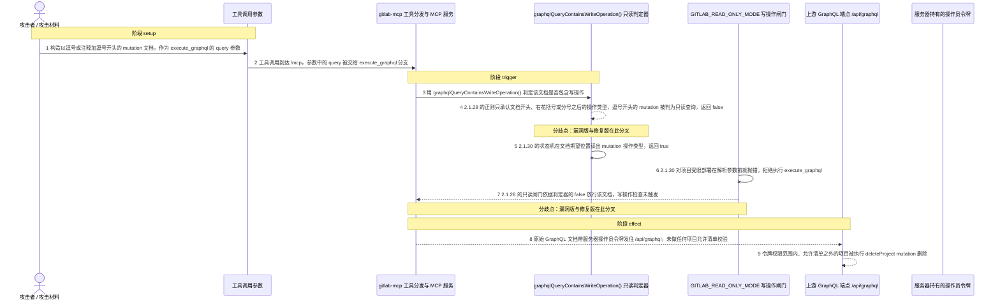
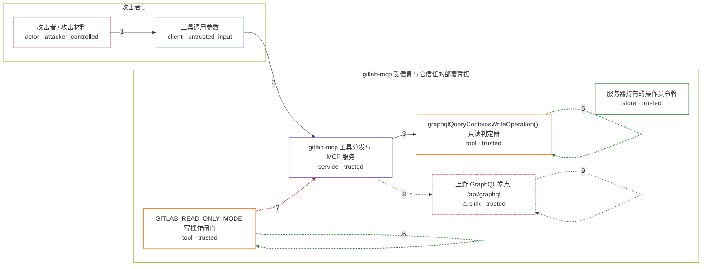

# gitlab-mcp / GHSA-5648-RGJ9-V224

状态：草稿，未完成环境和复现。这个目录由模板生成，不构成漏洞确认。

图解的唯一来源是 `diagram.toml`：编辑后运行 `python3 -m runner diagram gitlab-mcp/GHSA-5648-RGJ9-V224` 重新生成下方的图解区块。图解必须覆盖漏洞涉及的每个主体，并标出漏洞版/修复版的分歧步骤。

<!-- diagram:begin (generated from diagram.toml by `python3 -m runner diagram`; edit diagram.toml, not this block) -->
## 漏洞图解 — gitlab-mcp / GHSA-5648-rgj9-v224 漏洞图解

gitlab-mcp 的 execute_graphql 在只读模式下用 graphqlQueryContainsWriteOperation() 判定请求文档是不是写操作，而 2.1.28 的判定器是一条正则：它只在文档开头、} 或 ; 之后识别操作类型，却不认识 GraphQL 里同样被忽略的逗号。攻击者把 mutation 前的分隔符写成逗号，或以注释加逗号开头，判定器就返回“只读”，只读闸门因此不拦截，原始 GraphQL 文档经服务器持有的操作员令牌发往 /api/graphql，以写操作执行。同一工具分支也不检查 GITLAB_PROJECT_ID / GITLAB_ALLOWED_PROJECT_IDS，所以该令牌能触及的任意项目都可以被这条 mutation 修改，越过项目允许清单。2.1.30 换成按花括号深度扫描、只在文档期望位置接受操作类型的状态机，并对项目受限部署直接拒绝 execute_graphql，两类请求都在到达上游前被阻断。

### 涉及主体

| 主体 | 类型 | 信任级别 | 在漏洞里的作用 | 来源 |
| --- | --- | --- | --- | --- |
| 攻击者 / 攻击材料 (`attacker`) | `actor` | `attacker_controlled` | 构造这次 execute_graphql 工具调用的 GraphQL 文档，把写操作伪装成只读查询。 | — |
| 工具调用参数 (`tool_arguments`) | `client` | `untrusted_input` | 攻击者提交的 MCP 工具调用参数，其中 query 字段是攻击者完全可控的 GraphQL 文档；它同时携带指向允许清单之外项目的写操作。 | fixtures/cases.json |
| gitlab-mcp 工具分发与 MCP 服务 (`mcp_server`) | `service` | `trusted` | 按 params.name 分发工具调用；execute_graphql 分支负责取出 query、调用只读判定器，并把通过检查的文档 POST 到上游 GraphQL 端点。 | — |
| graphqlQueryContainsWriteOperation() 只读判定器 (`graphql_parser`) | `tool` | `trusted` | utils/graphql-query.ts 中的写操作判定器：2.1.28 用正则匹配 normalized 文档中的 mutation/subscription；2.1.30 改为按 { } 深度扫描的状态机。它返回的布尔值就是只读闸门的全部依据。 | — |
| GITLAB_READ_ONLY_MODE 写操作闸门 (`read_only_guard`) | `tool` | `trusted` | execute_graphql 分支里唯一的写操作防护：GITLAB_READ_ONLY_MODE 为真且判定器报告写操作时抛错；判定器误报只读时该闸门静默放行。 | — |
| ⚠ 上游 GraphQL 端点 /api/graphql (`graphql_endpoint`) | `sink` | `trusted` | 接收经服务器凭据认证的原始 GraphQL 文档并执行其中的 mutation；本环境用它承载受控的删除效果，不代表真实外部实例。 | — |
| 服务器持有的操作员令牌 (`server_token`) | `store` | `trusted` | gitlab-mcp 进程用来访问 GitLab 的凭据，权限覆盖该令牌可见的全部项目；受影响的部署把它当作部署级信任，而不是调用者身份。 | — |

**信任边界**

- **攻击者侧** (`attacker_side`)：成员 `attacker`、`tool_arguments`。攻击者能控制的只有这次工具调用的参数文本：GraphQL 文档内容与其中的项目标识；它既拿不到服务器令牌，也不能直接调用上游 API。
- **gitlab-mcp 受信侧与它信任的部署凭据** (`product`)：成员 `mcp_server`、`graphql_parser`、`read_only_guard`、`graphql_endpoint`、`server_token`。这道边界要求工具调用只能读到调用者被允许的项目、且只读模式不得产生写操作；漏洞让攻击者文本以只读查询的名义穿过闸门，再由部署凭据执行写操作。

标 ⚠ 的主体是本仓库合成的替身或无害效果载体，不代表真实外部目标。

### 触发过程

### 主体与信任边界

箭头上的数字是上面的步骤编号；方框只标主体和信任级别，具体动作见「触发过程」。

**分歧点**：第 4 步（`vulnerable_only`）2.1.28 的正则只承认文档开头、右花括号或分号之后的操作类型，逗号开头的 mutation 被判为只读查询，返回 false。
**分歧点**：第 5 步（`patched_only`）2.1.30 的状态机在文档期望位置读出 mutation 操作类型，返回 true。
**分歧点**：第 7 步（`vulnerable_only`）2.1.28 的只读闸门依据判定器的 false 放行该文档，写操作检查未触发。
<!-- diagram:end -->

## 公告与机制

canonical identifier：`GHSA-5648-rgj9-v224`（无 alias，注意不要与同一仓库的 `GHSA-cv3r-c5h8-f4g5` / CVE-2026-61560 混淆）。
公告把问题拆成 5 个 finding，本环境只复现 F1：

| 编号 | 上游位置 | 结论 |
| --- | --- | --- |
| F1（HIGH） | `index.ts` 的 `execute_graphql` 分支 + `utils/graphql-query.ts` | 只读模式与项目允许清单被同时绕过，本环境的复现对象 |
| F2（HIGH） | Streamable HTTP `/mcp` 在 cookie / OAuth 凭据下无 MCP 层认证 | 依赖具体部署凭据形态，未纳入本环境 |
| F3（MEDIUM） | SSE 默认无认证、无 Origin/Host 校验 | 同上 |
| F4（HIGH） | 伪造 token 即可耗尽会话槽位（`MAX_SESSIONS` 默认 1000） | 数值可被部署改写，未纳入本环境 |
| F5（LOW） | CI job trace 原样进入模型上下文 | prompt-injection 面，未纳入本环境 |

受影响范围：npm `@zereight/mcp-gitlab` `>= 0, < 2.1.30`；OSV 记录 `fixed: 2.1.30`。CWE-863（Incorrect Authorization），CVSS 3.1 `AV:N/AC:L/PR:L/UI:N/S:U/C:H/I:H/A:N`。

- 漏洞版：tag `v2.1.28`，commit `139a479147a52f65d47e8fee142214c4d5392468`。advisory 自己 review 的 commit 是 `60adcc0de5b0e96c4c2029f7a25d2775946421d8`（package.json 版本同样写 `2.1.28`），其中 `utils/graphql-query.ts` 与 tag 内容逐字节相同，sha256 都是 `0ee49475446ca2eb4add393eca0014ad04e526281bd3d3171c538f04729e47e7`，所以这里用 tag 作为规范引用。
- 修复版：tag `v2.1.30`，commit `cff3ebeec272d7cc609d9b3cab57f52cb15fae96`。修复主 PR 是 #571；中间提交 `3eab537…` 的正则版本和 `3fda768…` 的回退版本都不是 advisory 声明的修复状态，因此修复侧只钉 `v2.1.30`。

根因有两层，都在 `execute_graphql` 分支。

1. **只读判定器漏判。** 2.1.28 的 `graphqlQueryContainsWriteOperation()` 先去掉注释与字符串，再用 `/(?:^|[};]\s*)(mutation|subscription)\b/` 判定。GraphQL 把逗号当作可忽略分隔符，而这条正则只承认文档开头、右花括号或分号之后的操作类型，于是 `,mutation DeleteProject { … }` 规范化后以逗号起首，判定器返回 `false`；`# 注释` 开头的文档被折叠成一个空格后同样以逗号起首，结果相同。判定器是只读闸门的唯一依据，闸门因此静默放行，文档原样 POST 到 `/api/graphql` 并以写操作执行。
2. **工具级授权缺失。** 同一分支在 2.1.28 里不调用 `rejectIfProjectScopedDeployment()`，而同文件里 `fork_repository`、`create_repository`、`create_group` 等项目级工具都调用了它。`GITLAB_PROJECT_ID` / `GITLAB_ALLOWED_PROJECT_IDS` 只约束走 REST 封装的项目参数，`execute_graphql` 却把原始 GraphQL 文档直接发给 `/api/graphql`，用的是服务器自己的凭据，可以访问该令牌能访问的任意项目。

2.1.30 的修复是两件事一起做：`execute_graphql` 分支第一行加入 `rejectIfProjectScopedDeployment("execute_graphql")`；判定器不再用正则，而是按 `{` / `}` 深度扫描，只在文档期望位置接受 `query|mutation|subscription`（`/\s*(?:,\s*)?(query|mutation|subscription)\b/y`），逗号开头的 mutation 因此被正确判为写操作。

来源：[GitHub Advisory](https://github.com/advisories/GHSA-5648-rgj9-v224)、[OSV 记录](https://api.osv.dev/v1/vulns/GHSA-5648-rgj9-v224)、[修复 PR #571](https://github.com/zereight/gitlab-mcp/pull/571)、[v2.1.30 release](https://github.com/zereight/gitlab-mcp/releases/tag/v2.1.30)、[CHANGELOG 记录提交](https://github.com/zereight/gitlab-mcp/commit/69e784da33e96e64867b511c6f14d3f21f91ba8b)。

## 前提

- 部署以 `GITLAB_READ_ONLY_MODE` 启动，并且 `execute_graphql` 在 `tools/registry.ts` 的 `readOnlyTools` 集合里（2.1.28 与 2.1.30 都如此），所以该工具在只读模式下本身是被允许调用的。
- 调用者能提交 `execute_graphql` 工具调用，即通过任意一种 transport 到达 `tools/call`。
- 攻击者能控制的只有这次调用的参数文本：GraphQL 文档内容以及文档里指向的项目标识。它拿不到服务器令牌，也不能直接调用上游 API。
- **不需要**向真实 GitLab 实例发请求：机制复现只调用上游判定器，效果落在受控端点。允许清单那条路径以工具分支的结构事实记录，不在复现里真的删除任何项目。
- 与 finding 无关但会影响路径的部署开关：`GITLAB_PROJECT_ID`、`GITLAB_ALLOWED_PROJECT_IDS` 决定是否启用受限拒绝分支；`GITLAB_PERMISSION_MODE` 是 2.1.30 新增的权限分层，替代已废弃的 `GITLAB_READ_ONLY_MODE`。

## 版本与启动

两版源码都以 GitHub tag tarball 钉死，构建阶段把它们写进 `metadata.toml` 的 `build.inputs`：

| 角色 | 版本 | commit | archive | SHA-256 |
| --- | --- | --- | --- | --- |
| vulnerable | 2.1.28 | `139a479147a52f65d47e8fee142214c4d5392468` | `https://codeload.github.com/zereight/gitlab-mcp/tar.gz/refs/tags/v2.1.28` | `36448687dde8d9356c9cbf0c286e9bb56b635e0d740ea03ff292d4ed9b121753` |
| patched | 2.1.30 | `cff3ebeec272d7cc609d9b3cab57f52cb15fae96` | `https://codeload.github.com/zereight/gitlab-mcp/tar.gz/refs/tags/v2.1.30` | `4e24c056b736897732ea151a90fa4520701bdffc327e8b9960bdfdd33b3c148a` |

镜像需要固定的 Node（>= 18；执行路径用到类型剥离，按 Node 22+ 选择）与仓库源码。构建时把 tarball 解到 `/lab/upstream/vulnerable` 与 `/lab/upstream/patched`，让顶层 `index.ts`、`tools/`、`utils/` 直接位于该目录下；`fixtures/pin.json` 记录同样的 archive 哈希与模块哈希，构建产物可据此核对。`metadata.toml`、`Dockerfile`、compose 与精确启动命令由 build 阶段补全。

Compose 中 `vulnerable` 与 `patched` profiles 分开使用；未指定 profile 不启动服务。镜像变量未配置时 Compose 会明确报错。此模板不暴露宿主端口，也不挂载主机数据。

## 机制复现

`reproduce.py` 在容器内运行，直接执行上游未编译的源码，不重写任何判定逻辑：

1. 从 `/lab/fixtures/pin.json` 读出当前 variant 的 `repo_dir` 与 `utils/graphql-query.ts` 的 SHA-256；
2. 用 `node --experimental-strip-types` 运行 `fixtures/graphql-driver.mjs`，由它 `import` 该目录下的上游模块并调用 `graphqlQueryContainsWriteOperation()`；驱动先核对模块哈希，不一致就直接失败；
3. 驱动同时读取该目录下的 `index.ts`，抽出 `case "execute_graphql"` 分支体与 `rejectIfProjectScopedDeployment` 定义，记录分支里是否存在项目作用域守卫；
4. 输出 `driver-results.json`、`driver-stdout.txt`、`driver-stderr.txt`，再写 `observation.json` 与 `facts.json`；`target_ready` 只有在模块哈希与 pin 一致、驱动成功、且有逐条判定时才为真。

场景按 `context["scenario"]` 选择互斥的固定输入：`attack` 用 `fixtures/cases.json` 的 `attack_queries`（逗号开头的 mutation、注释加逗号的 mutation、逗号后的 subscription，以及一个明文 mutation 对照），`benign` 只用 `benign_queries`（普通只读查询、带参数的只读查询、字段名含 `subscription` 的查询、别名含 `mutation` 的查询）。攻击场景断言只读绕过被观察到，正常场景断言只读查询全部被允许；`fixtures/allowlist-scope.json` 提供允许清单之外的项目标识与原始端点，只在攻击场景的观测里出现。

运行位置与参数：`python3 /lab/reproduce.py --context /lab/results/context.json --output /lab/results`，超时 120 秒；容器内不需要网络。若镜像把源码装在别处，用环境变量 `AVH_UPSTREAM_ROOT` 指向替换 `/lab` 的目录，`upstream/<variant>` 部分保持不变。

## 端到端复现

不适用：F1 是纯本地、确定性的机制路径，不需要真实 GitLab 实例，也不需要模型；`end_to_end.py` 不参与本环境的判定，`metadata.toml` 的 `verification.end_to_end.status` 保持 `not_applicable`。若后续要接真实实例，必须另立环境并重新固定 base image 与凭据来源。

## 验证与修复对照

`verify.py` 由 validate / solve 阶段实现。它只读 `facts.json`、`observation.json` 与效果文件，用 `lab_support.verify()` 判定三类检查，不重跑攻击：

- `vulnerable_effect_observed`：漏洞版攻击里 `read_only_bypass_observed` 为真（连同注释与分隔符两条），且 `project_scope_guard_present` 为假；
- `patched_effect_blocked`：修复版攻击里判定器对同一条 payload 返回 `true`（`bypass_query_flagged`），且 `project_scope_guard_present` 为真；
- `benign_task_passed`：正常场景里 `benign_queries_allowed` 为真。

当前 `verify.py` 仍是模板桩，因此本环境尚无声称通过的验证结论。

## 清理

默认运行器按每个测试的唯一 Compose project 清理容器、网络和 volume。
`--keep-on-failure` 保留失败项目，项目标识和 Compose 配置在结果目录中；仅清理该项目，不能使用全局 prune。

## 失败诊断

- `driver-results.json` 缺失或 `target_ready` 为假：先看 `driver-stderr.txt` 与 `observation.json` 的 `driver_returncode`；模块哈希不一致说明镜像里的源码与 pin 不符。
- 修复版仍出现 `read_only_bypass_observed`：核对 `loaded_module_sha256` 是否等于 pin 中 patched 的 `4fc7128c…`；若不是，说明镜像装错了版本，而不是断言太严。
- 正常任务失败：确认 benign 场景只带 `benign_queries`，且没有把攻击场景才有的字段当成正常任务的判定项。
- 前提不满足：`GITLAB_READ_ONLY_MODE` 未开启时只读闸门本来就不触发；`GITLAB_PROJECT_ID` / `GITLAB_ALLOWED_PROJECT_IDS` 未设置时受限拒绝分支不会被走到。

启动失败、健康检查失败和超时都不能当作修复阻断；报告中应能定位到阶段、预期、实际和受控证据。

## 构建与输入

- 源码与依赖：两版 GitHub tag tarball（上表 URL + SHA-256）写入 `build.inputs`；解包布局必须满足 `/lab/upstream/<variant>/utils/graphql-query.ts` 与 `/lab/upstream/<variant>/index.ts`。
- 运行时是 Python 3 标准库加 Node；执行路径只 import 上游单个 `.ts` 文件并做类型剥离，不需要安装 npm 依赖。
- 固定输入：`fixtures/cases.json`（攻击与正常文档）、`fixtures/allowlist-scope.json`（允许清单范围）、`fixtures/pin.json`（两版 commit 与哈希）、`fixtures/graphql-driver.mjs`（调用上游模块的驱动），全部登记在 `fixtures/manifest.toml`。`reproduce.py` 启动时会重新核对这四个文件的 SHA-256 与 manifest 是否一致。
- `PYTHONHASHSEED=0`、`TZ=UTC` 在 `compose.yaml` 中固定；复现不依赖随机数。

## 隔离例外

默认无例外：`runtime.exceptions` 为空，容器不挂载宿主数据、不需要网络，效果只落在复现输出目录里的受控端点记录。

## 来源与许可

- 上游代码：`https://github.com/zereight/gitlab-mcp`（MIT），v2.1.28 / v2.1.30 的 tag tarball，仅用于在复现中调用其判定器与读取其分支结构。
- 公告与修复：见「公告与机制」小节的外链。
- fixtures：全部为本环境自行编写的合成输入，不含真实凭据、真实实例地址或宿主路径；`fixtures/allowlist-scope.json` 与 `fixtures/cases.json` 中的项目标识都是保留值。
