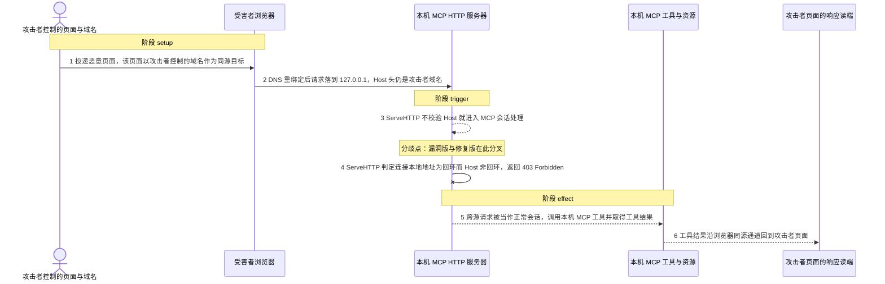
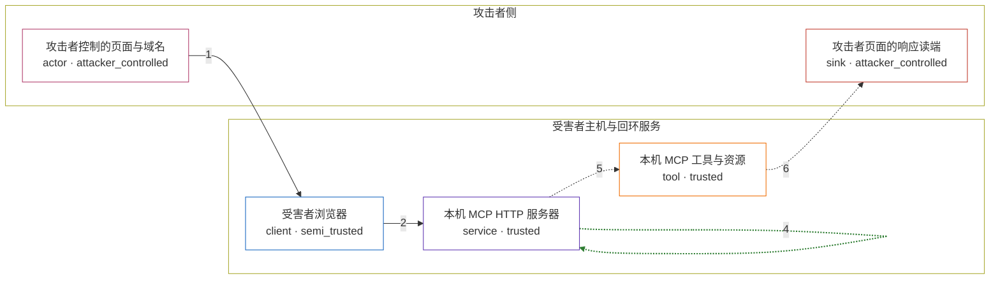

# go-sdk / CVE-2026-34742

状态：草稿，未完成环境和复现。这个目录由模板生成，不构成漏洞确认。

图解的唯一来源是 `diagram.toml`：编辑后运行 `python3 -m runner diagram go-sdk/CVE-2026-34742` 重新生成下方的图解区块。图解必须覆盖漏洞涉及的每个主体，并标出漏洞版/修复版的分歧步骤。

<!-- diagram:begin (generated from diagram.toml by `python3 -m runner diagram`; edit diagram.toml, not this block) -->
## 漏洞图解 — MCP Go SDK 本机 HTTP 服务器 DNS 重绑定防护缺失

本机 MCP 服务器用 StreamableHTTPHandler 在回环地址上提供无认证的 HTTP 传输，但漏洞版的 ServeHTTP 只解析 Accept 与会话头，既不校验 Host，也不判断请求是否经回环抵达。DNS 重绑定后，受害者浏览器把攻击者域名的请求发到 127.0.0.1，Host 头仍是攻击者域名，于是跨源请求被当作正常 MCP 会话处理。攻击者由此可以代表用户调用该服务器暴露的工具与资源，并把工具结果读回自己的页面。修复版在 ServeHTTP 开头用 util.IsLoopback 同时比较连接本地地址与 Host，对非回环 Host 返回 403 Forbidden。

### 涉及主体

| 主体 | 类型 | 信任级别 | 在漏洞里的作用 | 来源 |
| --- | --- | --- | --- | --- |
| 攻击者控制的页面与域名 (`attacker`) | `actor` | `attacker_controlled` | 托管恶意页面并控制该域名的解析结果；它能决定的只是浏览器发出的请求内容，以及其中的 Host 值。 | fixtures/requests.json |
| 受害者浏览器 (`victim_browser`) | `client` | `semi_trusted` | DNS 重绑定后仍按同源策略把请求发往攻击者域名，实际连接落在 127.0.0.1，而 Host 头保持为攻击者域名。 | — |
| 本机 MCP HTTP 服务器 (`localhost_mcp`) | `service` | `trusted` | 用 mcp.StreamableHTTPHandler 在回环地址上提供无认证的 MCP over HTTP；漏洞版 ServeHTTP 不校验 Host 就进入会话处理，修复版在此处返回 403。 | mcp/streamable.go |
| 本机 MCP 工具与资源 (`mcp_toolset`) | `tool` | `trusted` | 服务器代表用户暴露的工具与资源；正常情况下只有本机来源的调用才应当到达这里。 | — |
| 攻击者页面的响应读端 (`attacker_receiver`) | `sink` | `attacker_controlled` | 攻击者页面读取 MCP 响应的通道；工具结果经浏览器同源通道回到这里。 | — |

**信任边界**

- **攻击者侧** (`attacker_side`)：成员 `attacker`、`attacker_receiver`。攻击者只控制自己的页面、域名解析与读端，无法直接访问受害者主机，跨源请求必须借浏览器送进回环。
- **受害者主机与回环服务** (`victim_host`)：成员 `victim_browser`、`localhost_mcp`、`mcp_toolset`。边界内是受害者浏览器与无认证的本机 MCP 服务器。服务器本应只接受 Host 为 localhost 的请求，漏洞版缺失该校验，任何到达回环的连接都被当作本机来源。

### 触发过程

### 主体与信任边界

箭头上的数字是上面的步骤编号；方框只标主体和信任级别，具体动作见「触发过程」。

**分歧点**：第 3 步（`vulnerable_only`）ServeHTTP 不校验 Host 就进入 MCP 会话处理。
**分歧点**：第 4 步（`patched_only`）ServeHTTP 判定连接本地地址为回环而 Host 非回环，返回 403 Forbidden。
<!-- diagram:end -->

## 公告与机制

TODO：官方公告、漏洞根因、Agent 信任边界、受影响范围和修复来源。

## 前提

TODO：认证要求、用户交互、已有批准、工具权限、攻击者能控制的内容。

## 版本与启动

TODO：补全 metadata、Dockerfile/镜像 digest 和 Compose，再写出精确启动命令。

Compose 中 `vulnerable` 与 `patched` profiles 分开使用；未指定 profile 不启动服务。镜像变量未配置时 Compose 会明确报错。此模板不暴露宿主端口，也不挂载主机数据。

## 机制复现

TODO：实现 `reproduce.py`，固定输入并执行真实漏洞路径，注明运行位置、参数和超时。

完成实现后使用 `python3 -m runner reproduce go-sdk/CVE-2026-34742 --build --rounds 3`。
两脚本统一接受 `--context <context.json> --output <目录>`，详细字段见仓库 `docs/environment-contract.md`。
PoC 输出 `facts.json` 和效果文件；验证器只读证据，输出含 `target_ready` 及对应效果断言的 `verdict.json`。
镜像必须包含 Python 3 和 `/lab/` 下的脚本、fixtures；`runtime.mode` 选择 `oneshot` 或有 healthcheck 的 `service`。

## 端到端复现

TODO：实现 `end_to_end.py`；若不需要模型，明确写出不适用原因。真实模型的结果与机制复现分开统计。

## 验证与修复对照

TODO：实现 `verify.py`。记录漏洞版无害效果、修复版阻断和正常任务成功的证据，不能把服务启动失败当成阻断。

## 清理

默认运行器按每个测试的唯一 Compose project 清理容器、网络和 volume。
`--keep-on-failure` 保留失败项目，项目标识和 Compose 配置在结果目录中；仅清理该项目，不能使用全局 prune。

## 失败诊断

TODO：为本漏洞写出预期效果缺失、修复版仍有越界效果、正常任务失败及前提不满足时的具体排查路径。
启动失败、健康检查失败和超时都不能当作修复阻断。报告中应能定位到阶段、预期、实际和受控证据。

## 构建与输入

TODO：填写两版源码 archive、完整 commit，记录 `build.inputs` 中每个下载的 SHA-256；依赖安装必须支持禁网构建。
固定攻击和正常输入放入 `fixtures/` 并登记到 `fixtures/manifest.toml`。固定 seed、环境变量，说明无害效果与真实影响的关系。

## 隔离例外

默认无例外。确需例外时同时填写 `runtime.exceptions`、理由及最小范围，晋升由两位维护者审阅。

## 来源与许可

TODO：列出引用代码、fixtures 和镜像的来源及许可。
