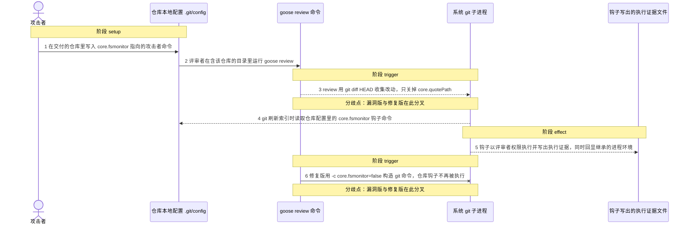
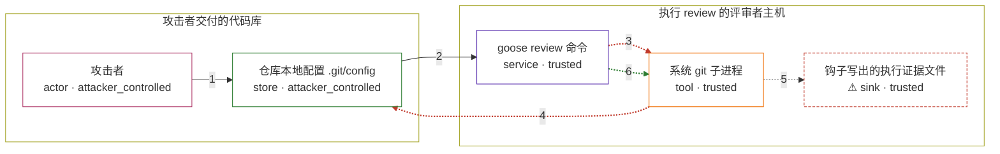

# goose / CVE-2026-72718

状态：草稿，未完成环境和复现。这个目录由模板生成，不构成漏洞确认。

图解的唯一来源是 `diagram.toml`：编辑后运行 `python3 -m runner diagram goose/CVE-2026-72718` 重新生成下方的图解区块。图解必须覆盖漏洞涉及的每个主体，并标出漏洞版/修复版的分歧步骤。

<!-- diagram:begin (generated from diagram.toml by `python3 -m runner diagram`; edit diagram.toml, not this block) -->
## 漏洞图解 — goose review 通过仓库 core.fsmonitor 执行任意命令

goose review 用只加 -c core.quotePath=off 的 git 命令收集改动：仓库本地配置里的 core.fsmonitor 会被 git 当作钩子命令执行，且发生在任何会话或工具审批之前。攻击者只要交付一个 .git/config 可控的仓库即可在评审者机器上以同等权限执行任意命令，并继承该进程的环境变量；修复版强制 -c safe.bareRepository=explicit -c core.fsmonitor=false 后不再执行该钩子。

### 涉及主体

| 主体 | 类型 | 信任级别 | 在漏洞里的作用 | 来源 |
| --- | --- | --- | --- | --- |
| 攻击者 (`attacker`) | `actor` | `attacker_controlled` | 交付一个自带仓库配置的代码库，把要执行的命令写进仓库本地的 core.fsmonitor，等待评审者在其中运行 review。 | — |
| 仓库本地配置 .git/config (`poisoned_config`) | `store` | `attacker_controlled` | 承载攻击者可控的 core.fsmonitor 字符串；它是随仓库一起到达的数据，却被当作可信配置交给 git。 | https://raw.githubusercontent.com/aaif-goose/goose/249dbd6fbac4627f1cd5723b28277c2651b42766/crates/goose-cli/src/commands/review/handler.rs |
| goose review 命令 (`goose_review`) | `service` | `trusted` | 受影响的组件。它用 git diff HEAD 收集评审上下文，却没有把 core.fsmonitor 从仓库配置里剥离，因此这条执行路径不经过模型也不经过工具审批。 | https://raw.githubusercontent.com/aaif-goose/goose/249dbd6fbac4627f1cd5723b28277c2651b42766/crates/goose-cli/src/commands/review/handler.rs |
| 系统 git 子进程 (`git_cli`) | `tool` | `trusted` | 被 review 调用的命令。刷新索引时按仓库配置执行 core.fsmonitor 钩子，命令因此运行在评审者机器上。 | — |
| ⚠ 钩子写出的执行证据文件 (`marker_file`) | `sink` | `trusted` | 受控效果落点：钩子在这里留下执行痕迹，并回显它继承到的进程环境，证明命令确实在评审者权限下运行。 | — |

**信任边界**

- **攻击者交付的代码库** (`attacker_side`)：成员 `attacker`、`poisoned_config`。攻击者只控制随仓库到达的文件，包括 .git/config；它不能直接登录评审者机器，也不需要接触评审者的凭据。
- **执行 review 的评审者主机** (`review_host`)：成员 `goose_review`、`git_cli`、`marker_file`。这道边界本应让仓库数据只作为被评审的内容；review 把仓库配置当参数交给 git 后，边界内就开始执行仓库指定的命令。

标 ⚠ 的主体是本仓库合成的替身或无害效果载体，不代表真实外部目标。

### 触发过程

### 主体与信任边界

箭头上的数字是上面的步骤编号；方框只标主体和信任级别，具体动作见「触发过程」。

**分歧点**：第 3 步（`vulnerable_only`）review 用 git diff HEAD 收集改动，只关掉 core.quotePath。
**分歧点**：第 4 步（`vulnerable_only`）git 刷新索引时读取仓库配置里的 core.fsmonitor 钩子命令。
**分歧点**：第 6 步（`patched_only`）修复版用 -c core.fsmonitor=false 构造 git 命令，仓库钩子不再被执行。
<!-- diagram:end -->

## 公告与机制

TODO：官方公告、漏洞根因、Agent 信任边界、受影响范围和修复来源。

## 前提

TODO：认证要求、用户交互、已有批准、工具权限、攻击者能控制的内容。

## 版本与启动

TODO：补全 metadata、Dockerfile/镜像 digest 和 Compose，再写出精确启动命令。

Compose 中 `vulnerable` 与 `patched` profiles 分开使用；未指定 profile 不启动服务。镜像变量未配置时 Compose 会明确报错。此模板不暴露宿主端口，也不挂载主机数据。

## 机制复现

TODO：实现 `reproduce.py`，固定输入并执行真实漏洞路径，注明运行位置、参数和超时。

完成实现后使用 `python3 -m runner reproduce goose/CVE-2026-72718 --build --rounds 3`。
两脚本统一接受 `--context <context.json> --output <目录>`，详细字段见仓库 `docs/environment-contract.md`。
PoC 输出 `facts.json` 和效果文件；验证器只读证据，输出含 `target_ready` 及对应效果断言的 `verdict.json`。
镜像必须包含 Python 3 和 `/lab/` 下的脚本、fixtures；`runtime.mode` 选择 `oneshot` 或有 healthcheck 的 `service`。

## 端到端复现

TODO：实现 `end_to_end.py`；若不需要模型，明确写出不适用原因。真实模型的结果与机制复现分开统计。

## 验证与修复对照

TODO：实现 `verify.py`。记录漏洞版无害效果、修复版阻断和正常任务成功的证据，不能把服务启动失败当成阻断。

## 清理

默认运行器按每个测试的唯一 Compose project 清理容器、网络和 volume。
`--keep-on-failure` 保留失败项目，项目标识和 Compose 配置在结果目录中；仅清理该项目，不能使用全局 prune。

## 失败诊断

TODO：为本漏洞写出预期效果缺失、修复版仍有越界效果、正常任务失败及前提不满足时的具体排查路径。
启动失败、健康检查失败和超时都不能当作修复阻断。报告中应能定位到阶段、预期、实际和受控证据。

## 构建与输入

TODO：填写两版源码 archive、完整 commit，记录 `build.inputs` 中每个下载的 SHA-256；依赖安装必须支持禁网构建。
固定攻击和正常输入放入 `fixtures/` 并登记到 `fixtures/manifest.toml`。固定 seed、环境变量，说明无害效果与真实影响的关系。

## 隔离例外

默认无例外。确需例外时同时填写 `runtime.exceptions`、理由及最小范围，晋升由两位维护者审阅。

## 来源与许可

TODO：列出引用代码、fixtures 和镜像的来源及许可。
