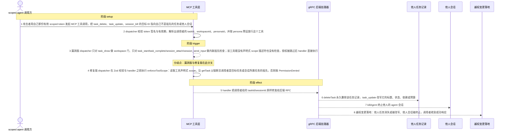
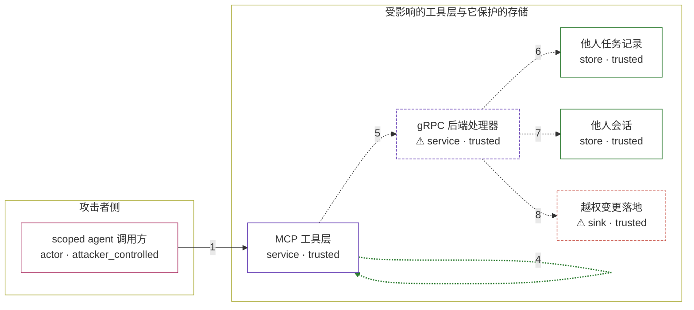

# grackle / GHSA-F9FF-5X35-7GFW

状态：草稿，未完成环境和复现。这个目录由模板生成，不构成漏洞确认。

图解的唯一来源是 `diagram.toml`：编辑后运行 `python3 -m runner diagram grackle/GHSA-F9FF-5X35-7GFW` 重新生成下方的图解区块。图解必须覆盖漏洞涉及的每个主体，并标出漏洞版/修复版的分歧步骤。

<!-- diagram:begin (generated from diagram.toml by `python3 -m runner diagram`; edit diagram.toml, not this block) -->
## 漏洞图解 — grackle MCP 工具层 fail-open 授权（跨任务/跨会话 IDOR）

MCP 工具层是 scoped agent 唯一的授权边界：后端 gRPC 处理器只接收请求消息、不校验调用者身份，因此工具层必须自己按父链判定调用者是不是目标任务或会话的祖先。漏洞版 dispatcher 只对 task_start、task_complete、session_attach、session_send_input 做了内联祖先检查，而 task_update、task_delete、task_resume、session_kill 既没有声明式 scope 描述符也没有检查，授权于是 fail open。攻击者只需出示自己那份有效 scoped token 并把 taskId/sessionId 指向自己不是祖先的任务或他人会话，就能永久删除、改写他人任务或终止他人会话；修复版在 dispatcher 中于 handler 之前统一执行 enforceToolScope，非祖先一律抛 PermissionDenied。

### 涉及主体

| 主体 | 类型 | 信任级别 | 在漏洞里的作用 | 来源 |
| --- | --- | --- | --- | --- |
| scoped agent 调用方 (`scoped_agent`) | `actor` | `attacker_controlled` | 持有一份由平台签发、绑定自己 task/workspace/persona 的 scoped token。它实际能控制的只有这次 MCP 工具调用的工具名与 taskId/sessionId 参数，以及是否出示这份 token；签名密钥不在它手里。 | — |
| MCP 工具层 (`mcp_tool_layer`) | `service` | `trusted` | dispatcher 用服务器 API key 校验 scoped token，解析出调用者的 taskId、workspaceId、personaId，再按 persona 预设决定这次工具调用是否可见。后端 handler 不接收调用者身份，所以父链祖先断言是保护他人任务与会话的唯一检查；漏洞版只把它写在 task_start、task_complete、session_attach、session_send_input 里，task_update、task_delete、task_resume、session_kill 没有。 | — |
| ⚠ gRPC 后端处理器 (`grpc_backend`) | `service` | `trusted` | 只接收请求消息、没有 AuthContext，直接执行 deleteTask、updateTask、killAgent 等变更。本环境用内存替身扮演它，替身只按参数改写内存里的任务与会话记录并逐条记录收到的 RPC，不参与任何授权判断，也不替换被验证的工具层代码。 | — |
| 他人任务记录 (`victim_task`) | `store` | `trusted` | 调用者不是其祖先的任务：同级任务、人类父任务以及跨 workspace 的任务。它们会被永久删除，或被改写状态、依赖与预算。 | — |
| 他人会话 (`victim_session`) | `store` | `trusted` | 他人 agent 的会话记录。拿到会话 ID 后可以被跨会话 SIGKILL，或对陌生会话执行 resume。 | — |
| ⚠ 越权变更落地 (`mutation_effect`) | `sink` | `trusted` | 漏洞触发后效果最终落到的地方：他人任务消失或状态被改写、他人会话被终止，调用者收到成功响应。这里承载的是受控的无害效果，不针对真实外部目标。 | — |

**信任边界**

- **攻击者侧** (`attacker_side`)：成员 `scoped_agent`。攻击者只有自己那份有效 scoped 身份和这次调用的参数；它不能伪造 token 签名，也不能直接读写后端的任务与会话存储。
- **受影响的工具层与它保护的存储** (`product_side`)：成员 `mcp_tool_layer`、`grpc_backend`、`victim_task`、`victim_session`、`mutation_effect`。正常情况下 MCP 工具层要按父链判定调用者是不是目标的祖先，后端不做二次鉴权，所以这道检查是保护他人任务与会话的唯一屏障。

标 ⚠ 的主体是本仓库合成的替身或无害效果载体，不代表真实外部目标。

### 触发过程



### 主体与信任边界

箭头上的数字是上面的步骤编号；方框只标主体和信任级别，具体动作见「触发过程」。



**分歧点**：第 3 步（`vulnerable_only`）漏洞版 dispatcher 只对 task_show 做 workspace 门、只对 task_start/task_complete/session_attach/session_send_input 做内联祖先检查；该工具既没有声明式 scope 描述符也没有检查，授权被跳过后 handler 直接执行。
**分歧点**：第 4 步（`patched_only`）修复版 dispatcher 在 Zod 校验与 handler 之前执行 enforceToolScope：读取工具声明式 scope，沿 getTask 父链断言调用者是目标任务或会话所属任务的祖先，否则抛 PermissionDenied。
<!-- diagram:end -->

## 公告与机制

- 公告：<https://github.com/advisories/GHSA-f9ff-5x35-7gfw>（仓库侧 <https://github.com/nick-pape/grackle/security/advisories/GHSA-f9ff-5x35-7gfw>），HIGH，CWE-862 / CWE-639 / CWE-613。
- 受影响的 npm 包：`@grackle-ai/mcp`、`@grackle-ai/plugin-core`、`@grackle-ai/auth`，rolled up 到 `last_affected = 0.132.1`。
- 脆弱版本 `c298ba6a26e483aeb3afb6377ce07aa621928449`（tag `v0.132.1`）；修复提交 `5bc21007193d0047c1db6e51d5b79d9b012beec3`，首个含修复的发行版 `1b503d6e720404370ac493c862f8c87efbcfc67e`（tag `v0.133.0`）。
- 根因：后端 `plugin-core` 的 task/session handler 只接收请求消息、没有 `AuthContext`，出站 gRPC 一律使用完整的服务器 API key，所以 scoped agent 的唯一授权边界就是 MCP 工具层。该边界原本由每个工具内联实现，`task_update`/`task_delete`/`task_resume`/`session_kill` 漏掉了祖先检查，于是 fail open。
- 本环境复现的是公告中的 **F2（task_update/delete/resume 缺祖先校验，High）** 与 **F6（session_kill/resume 缺祖先校验，Medium）**；F7（无 workspace scoped token 读到所有 workspace）与 F12（`revokeTask` 无调用方）不在本环境的机制取舍内，见「机制复现」。
- 修复方式：`tool-registry.ts` 新增声明式 `ToolScope`，`scope-enforcement.ts` 新增 `enforceToolScope`/`enforceReadMembership`，dispatcher 在 Zod 校验与 handler 之前统一执行；`task_update`/`task_delete`/`task_resume` 标注 `scope: { taskIdArg: "taskId" }`，`session_*` 标注 `scope: { sessionIdArg: "sessionId" }`。

## 前提

- 调用者持有一份**自己合法的** scoped token：HMAC-SHA256、密钥即服务器 API key，claims 为 `{sub, pid, per, sid}`。攻击者不需要伪造签名，也不需要宿主权限。
- 该 token 的 persona 允许调用 `task_update`/`task_delete`/`task_resume`/`session_kill`——上游 `ORCHESTRATOR_MCP_TOOLS` 正是如此，所以 orchestrator persona 的 scoped agent 天然可达这些工具。
- 目标任务或会话已经存在，且调用者不是它的祖先（同级任务、人类父任务、跨 workspace 任务）。
- 攻击者能控制的只有这次调用的工具名与 `taskId`/`sessionId` 参数；它读不到凭据、也改不了宿主机文件。

## 版本与启动

TODO：补全 metadata、Dockerfile/镜像 digest 和 Compose，再写出精确启动命令。

Compose 中 `vulnerable` 与 `patched` profiles 分开使用；未指定 profile 不启动服务。镜像变量未配置时 Compose 会明确报错。此模板不暴露宿主端口，也不挂载主机数据。

## 机制复现

`reproduce.py`（Python，`runtime.harness = "python3"`）把一段 Node ESM 驱动脚本写到临时目录后执行；
驱动脚本**按绝对路径导入镜像内被固定的 `@grackle-ai/mcp` 本体**，不重写、不抽取任何上游授权逻辑：

1. 用上游自己的 `createScopedToken` 铸造攻击者的 scoped token，再用上游自己的 `authenticateMcpRequest` 校验它，得到与 dispatcher 相同的 `AuthContext`；
2. 用上游自己的 `createToolRegistry` 与 `resolveToolForAuth`，按 persona 预设解析这次工具调用；
3. 调用上游的 `enforceReadMembership` + `enforceToolScope`（顺序与 dispatcher 一致，且同样在 Zod 校验与 handler 之前）——漏洞版包里**没有**这两个导出，所以这一步自然成为 no-op；
4. 用工具自己的 Zod schema 校验参数；
5. 调用工具自己的 `handler`，client 是内存替身，逐条记录收到的 RPC。

唯一的粘合是第 3 步：`createMcpServerInstance`（真正持有 dispatcher 的函数）未导出，因此无法直接走到 MCP-over-HTTP 入口；dispatcher 还会在 gate 之前用 scoped token 注入 `rawArgs.workspaceId`，此处省略——被探测工具的 Zod schema 都没有 `workspaceId` 字段且会剥离未知键，而 gate 读的是 `authContext.workspaceId` 而不是该参数，所以不影响授权判定。其余每一步都是上游代码本体，判定依据是「handler 是否被调用、后端收到哪个 RPC」，不是进程退出码。

覆盖面与局限：

- 复现 F2 与 F6，即公告标题里的跨任务/跨会话变更；**F7** 的 fail-open 写在漏洞版 dispatcher 的内联 workspace 门里，用本路线复现它等于抄写那段有缺陷的判断，因此不纳入；**F12** 涉及 token 生命周期，与本环境的授权边界无关。
- 后端是内存替身，扮演的是公告里「不做调用者鉴权的 gRPC handler」这一角色；它不替换被验证的工具层代码。真实端到端（真 `@grackle-ai/server` + MCP HTTP 入口）见「端到端复现」。
- 镜像必须同时具备 Node.js（上游 `engines.node >= 22.0.0`）与 python3；`node` 不在 PATH 时 PoC 以 `not_run` 退出，不会伪造结论。

`runtime.mode = "oneshot"`，无网络、无端口。运行方式：

```sh
python3 -m runner reproduce grackle/GHSA-F9FF-5X35-7GFW --build --rounds 3
```

完成实现后使用 `python3 -m runner reproduce grackle/GHSA-F9FF-5X35-7GFW --build --rounds 3`。
两脚本统一接受 `--context <context.json> --output <目录>`，详细字段见仓库 `docs/environment-contract.md`。
PoC 输出 `facts.json` 和效果文件；验证器只读证据，输出含 `target_ready` 及对应效果断言的 `verdict.json`。
镜像必须包含 Python 3 和 `/lab/` 下的脚本、fixtures；`runtime.mode` 选择 `oneshot` 或有 healthcheck 的 `service`。

## 端到端复现

TODO：实现 `end_to_end.py`；若不需要模型，明确写出不适用原因。真实模型的结果与机制复现分开统计。

## 验证与修复对照

TODO：实现 `verify.py`。记录漏洞版无害效果、修复版阻断和正常任务成功的证据，不能把服务启动失败当成阻断。

## 清理

默认运行器按每个测试的唯一 Compose project 清理容器、网络和 volume。
`--keep-on-failure` 保留失败项目，项目标识和 Compose 配置在结果目录中；仅清理该项目，不能使用全局 prune。

## 失败诊断

TODO：为本漏洞写出预期效果缺失、修复版仍有越界效果、正常任务失败及前提不满足时的具体排查路径。
启动失败、健康检查失败和超时都不能当作修复阻断。报告中应能定位到阶段、预期、实际和受控证据。

## 构建与输入

TODO：填写两版源码 archive、完整 commit，记录 `build.inputs` 中每个下载的 SHA-256；依赖安装必须支持禁网构建。
固定攻击和正常输入放入 `fixtures/` 并登记到 `fixtures/manifest.toml`。固定 seed、环境变量，说明无害效果与真实影响的关系。

## 隔离例外

默认无例外。确需例外时同时填写 `runtime.exceptions`、理由及最小范围，晋升由两位维护者审阅。

## 来源与许可

- 上游源码：`https://github.com/nick-pape/grackle`（npm 元数据 `license: MIT`），vulnerable `c298ba6a26e483aeb3afb6377ce07aa621928449`、patched `5bc21007193d0047c1db6e51d5b79d9b012beec3`；归档 URL 与 SHA-256 由 build 阶段登记在 `metadata.toml` 的 `build.inputs`。
- `fixtures/*.json`：本环境自行编写的合成输入（task 树、会话表、攻击与正常工具调用），不含任何真实凭据或用户数据；`api_key` 是 `deadbeef` × 8 的可见标记。哈希见 `fixtures/manifest.toml`。
- 消息与工具名取自上游 `packages/common/src/mcp-tool-presets.ts`、`packages/mcp/src/tools/{task,session}.ts` 与 `packages/auth/src/{auth-middleware,scoped-token}.ts`，仅用于让合成输入与真实调用形状一致。
