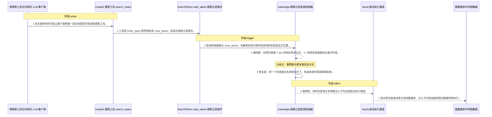
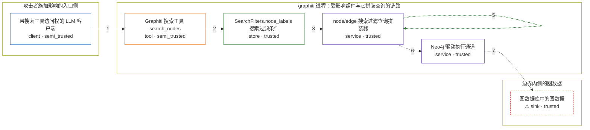

# graphiti / CVE-2026-32247

状态：草稿，未完成环境和复现。这个目录由模板生成，不构成漏洞确认。

图解的唯一来源是 `diagram.toml`：编辑后运行 `python3 -m runner diagram graphiti/CVE-2026-32247` 重新生成下方的图解区块。图解必须覆盖漏洞涉及的每个主体，并标出漏洞版/修复版的分歧步骤。

<!-- diagram:begin (generated from diagram.toml by `python3 -m runner diagram`; edit diagram.toml, not this block) -->
## 漏洞图解 — graphiti SearchFilters.node_labels 标签表达式 Cypher 注入

graphiti-core 的 SearchFilters 把搜索请求里的实体类型列表收进 node_labels，漏洞版只用 '|'.join 加 'n:' 前缀把它拼成 Cypher 标签表达式，没有任何字符校验。用户可控的列表项因此能闭合标签上下文，从被引用的标签值变成一段独立的 Cypher 子句。修复版在构造 SearchFilters 时用 ^[A-Za-z_][A-Za-z0-9_]*$ 白名单校验每个标签，并在查询拼装器里再校验一次，同一输入被直接拒绝。

### 涉及主体

| 主体 | 类型 | 信任级别 | 在漏洞里的作用 | 来源 |
| --- | --- | --- | --- | --- |
| 带搜索工具访问权的 LLM 客户端 (`llm_client`) | `client` | `semi_trusted` | 攻击者施加影响的入口。它处理的内容里混进了攻击者可控的文本，于是它带着构造好的实体类型列表去调用搜索工具；它本身不是攻击者的机器，只是把不可信内容转进了受信流程。 | fixtures/attack.json |
| Graphiti 搜索工具 search_nodes (`mcp_search_tool`) | `tool` | `semi_trusted` | 受影响的入口工具。它把调用参数 entity_types 原样映射成 SearchFilters.node_labels，中间不做任何校验或白名单过滤，是恶意列表进入 core 的通道。 | mcp_server/src/graphiti_mcp_server.py |
| SearchFilters.node_labels 搜索过滤条件 (`search_filters`) | `store` | `trusted` | 承载 node_labels 的过滤条件对象。它只声明这个字段是 list[str] / None，漏洞版没有字段校验器，所以构造出来的对象里就存着攻击者的整段载荷。 | fixtures/attack.json |
| node/edge 搜索过滤查询拼装器 (`query_constructor`) | `service` | `trusted` | 出问题的上游组件 node_search_filter_query_constructor 与 edge_search_filter_query_constructor。它们把标签列表拼进查询文本的标签表达式位置（不是参数位），漏洞版直接 '/'.join + 'n:' 拼接；修复版在拼接前先调用 validate_node_labels，白名单不通过就抛 NodeLabelValidationError。 | graphiti_core/search/search_filters.py |
| Neo4j 驱动执行通道 (`neo4j_driver`) | `service` | `trusted` | 把拼装好的查询文本按原文发给图数据库的执行通道。它自己不解析标签，注入片段就是在这一跳变成数据库语句的一部分。 | graphiti_core/driver/neo4j/operations/search_ops.py |
| ⚠ 图数据库中的图数据 (`graph_db`) | `sink` | `trusted` | 攻击者真正想要的位置：图里的节点与关系。注入子句按连接权限在这里执行，可越范围读取、修改或删除，并绕过查询层的 group_id 隔离。本环境里它是受控的标记载体，不是真实外部数据库。 | graphiti_core/search/search_utils.py |

**信任边界**

- **攻击者施加影响的入口侧** (`attacker_side`)：成员 `llm_client`。攻击者能让这里的模型处理自己可控的文本，所以这一侧的调用内容不可信。它自己读不到图数据，也无法直接连图数据库——能直接读就不用绕这一圈了。
- **graphiti 进程：受影响组件与它拼装查询的链路** (`graphiti_process`)：成员 `mcp_search_tool`、`search_filters`、`query_constructor`、`neo4j_driver`。这道边界本来把「用户提供的搜索参数」和「要交给数据库的查询文本」隔开。漏洞让参数里的标签字符串闭合上下文、变成独立子句，穿过了它。
- **边界内侧的图数据** (`graph_data`)：成员 `graph_db`。攻击者够不着的受保护数据。注入子句以连接权限在数据库侧执行，这个边界被从查询文本内部绕过。

标 ⚠ 的主体是本仓库合成的替身或无害效果载体，不代表真实外部目标。

### 触发过程

### 主体与信任边界

箭头上的数字是上面的步骤编号；方框只标主体和信任级别，具体动作见「触发过程」。

**分歧点**：第 4 步（`vulnerable_only`）漏洞版：标签列表被 '|'.join 拼成标签表达式，'n:' 前缀后直接跟攻击者字符串。。
**分歧点**：第 5 步（`patched_only`）修复版：同一个列表被白名单校验拦下，构造查询时直接报错拒绝。。
<!-- diagram:end -->

## 公告与机制

TODO：官方公告、漏洞根因、Agent 信任边界、受影响范围和修复来源。

## 前提

TODO：认证要求、用户交互、已有批准、工具权限、攻击者能控制的内容。

## 版本与启动

TODO：补全 metadata、Dockerfile/镜像 digest 和 Compose，再写出精确启动命令。

Compose 中 `vulnerable` 与 `patched` profiles 分开使用；未指定 profile 不启动服务。镜像变量未配置时 Compose 会明确报错。此模板不暴露宿主端口，也不挂载主机数据。

## 机制复现

TODO：实现 `reproduce.py`，固定输入并执行真实漏洞路径，注明运行位置、参数和超时。

完成实现后使用 `python3 -m runner reproduce graphiti/CVE-2026-32247 --build --rounds 3`。
两脚本统一接受 `--context <context.json> --output <目录>`，详细字段见仓库 `docs/environment-contract.md`。
PoC 输出 `facts.json` 和效果文件；验证器只读证据，输出含 `target_ready` 及对应效果断言的 `verdict.json`。
镜像必须包含 Python 3 和 `/lab/` 下的脚本、fixtures；`runtime.mode` 选择 `oneshot` 或有 healthcheck 的 `service`。

## 端到端复现

TODO：实现 `end_to_end.py`；若不需要模型，明确写出不适用原因。真实模型的结果与机制复现分开统计。

## 验证与修复对照

TODO：实现 `verify.py`。记录漏洞版无害效果、修复版阻断和正常任务成功的证据，不能把服务启动失败当成阻断。

## 清理

默认运行器按每个测试的唯一 Compose project 清理容器、网络和 volume。
`--keep-on-failure` 保留失败项目，项目标识和 Compose 配置在结果目录中；仅清理该项目，不能使用全局 prune。

## 失败诊断

TODO：为本漏洞写出预期效果缺失、修复版仍有越界效果、正常任务失败及前提不满足时的具体排查路径。
启动失败、健康检查失败和超时都不能当作修复阻断。报告中应能定位到阶段、预期、实际和受控证据。

## 构建与输入

TODO：填写两版源码 archive、完整 commit，记录 `build.inputs` 中每个下载的 SHA-256；依赖安装必须支持禁网构建。
固定攻击和正常输入放入 `fixtures/` 并登记到 `fixtures/manifest.toml`。固定 seed、环境变量，说明无害效果与真实影响的关系。

## 隔离例外

默认无例外。确需例外时同时填写 `runtime.exceptions`、理由及最小范围，晋升由两位维护者审阅。

## 来源与许可

TODO：列出引用代码、fixtures 和镜像的来源及许可。
