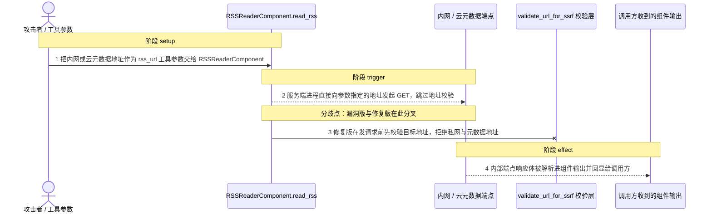
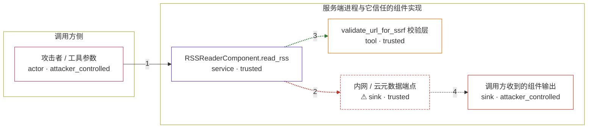

# ibm-langflow-oss-1-0-0 / CVE-2026-10564

状态：草稿，未完成环境和复现。这个目录由模板生成，不构成漏洞确认。

图解的唯一来源是 `diagram.toml`：编辑后运行 `python3 -m runner diagram ibm-langflow-oss-1-0-0/CVE-2026-10564` 重新生成下方的图解区块。图解必须覆盖漏洞涉及的每个主体，并标出漏洞版/修复版的分歧步骤。

<!-- diagram:begin (generated from diagram.toml by `python3 -m runner diagram`; edit diagram.toml, not this block) -->
## 漏洞图解 — ibm-langflow-oss-1-0-0 / CVE-2026-10564 漏洞图解

Langflow OSS 1.0.0 至 1.9.6（lfx 0.4.6）的 legacy RSSReaderComponent 把工具参数 rss_url 直接交给 requests.get，从未调用同包内已有的 validate_url_for_ssrf()，因此 1.9.3 起默认开启的 SSRF 保护层对这条路径完全失效。攻击者用一个内网或云元数据地址作为 RSS 源，服务端进程就会向该地址发起请求，并把响应体解析进 DataFrame 的 summary 字段返回给调用方；1.10.0 改用 ssrf_safe_get() 后，同一请求在发出前就被拒绝。

### 涉及主体

| 主体 | 类型 | 信任级别 | 在漏洞里的作用 | 来源 |
| --- | --- | --- | --- | --- |
| 攻击者 / 工具参数 (`attacker`) | `actor` | `attacker_controlled` | 控制 rss_url 这一个工具参数：可以是 127.0.0.1、169.254.169.254、192.168.x 等内网或云元数据地址。攻击者拿不到这些地址背后的数据，只能指定服务端去取。 | fixtures/attack-input.json |
| RSSReaderComponent.read_rss (`rss_reader`) | `service` | `trusted` | 受影响的上游组件。read_rss() 直接 requests.get(self.rss_url, timeout=self.timeout)，既不校验目标地址，也不在重定向的每一跳上重新校验，用户可控的 URL 因此决定了服务端进程的连接目标。 | src/lfx/src/lfx/components/data_source/rss.py |
| ⚠ 内网 / 云元数据端点 (`internal_service`) | `sink` | `trusted` | 被读取的目标：只有服务端进程所在网络能访问的内部端点，响应体里带着实例元数据式的合成凭据。它是无害的效果载体，不是真实的外部目标。 | fixtures/attack-internal-rss.xml |
| validate_url_for_ssrf 校验层 (`ssrf_guard`) | `tool` | `trusted` | 同包里已经存在的 SSRF 校验层：解析主机名、比对私网与元数据网段 denylist，并由 ssrf_protection_enabled 控制开关。它是漏洞前提，legacy 组件从不调用它。 | src/lfx/src/lfx/utils/ssrf_protection.py |
| 调用方收到的组件输出 (`response_receiver`) | `sink` | `attacker_controlled` | 漏洞效果落点：内部响应体被解析进 DataFrame 的 title/link/summary 后交回调用方，这些列值成为调用方可直接读取的内容。 | fixtures/attack-input.json |

**信任边界**

- **调用方侧** (`caller_side`)：成员 `attacker`。攻击面只是这一次工具调用的参数。攻击者能指定任意 URL，但拿不到目标端点里的数据，也不控制服务端进程的文件系统或网络配置。
- **服务端进程与它信任的组件实现** (`product_side`)：成员 `rss_reader`、`ssrf_guard`、`internal_service`、`response_receiver`。这层边界本来由 validate_url_for_ssrf 把守：只有通过校验的目标才允许发起请求，内网与云元数据地址应被拒绝。legacy 组件绕过校验后，服务端进程实际可以连接边界内侧的任何地址。

标 ⚠ 的主体是本仓库合成的替身或无害效果载体，不代表真实外部目标。

### 触发过程

### 主体与信任边界

箭头上的数字是上面的步骤编号；方框只标主体和信任级别，具体动作见「触发过程」。

**分歧点**：第 2 步（`vulnerable_only`）服务端进程直接向参数指定的地址发起 GET，跳过地址校验。
**分歧点**：第 3 步（`patched_only`）修复版在发请求前先校验目标地址，拒绝私网与元数据地址。
<!-- diagram:end -->

## 公告与机制

TODO：官方公告、漏洞根因、Agent 信任边界、受影响范围和修复来源。

## 前提

TODO：认证要求、用户交互、已有批准、工具权限、攻击者能控制的内容。

## 版本与启动

TODO：补全 metadata、Dockerfile/镜像 digest 和 Compose，再写出精确启动命令。

Compose 中 `vulnerable` 与 `patched` profiles 分开使用；未指定 profile 不启动服务。镜像变量未配置时 Compose 会明确报错。此模板不暴露宿主端口，也不挂载主机数据。

## 机制复现

`reproduce.py` 从镜像里安装的上游发行版导入 `lfx.components.data_source.rss.RSSReaderComponent`，只设置工具参数 `rss_url` 与超时，然后调用它真实的 `read_rss()`；不重写、不抽取漏洞函数。
按 `context["scenario"]` 读取 `fixtures/attack-input.json` 或 `fixtures/benign-input.json`，显式把 `LANGFLOW_SSRF_PROTECTION_ENABLED` 设为 `true`（绕开 settings service 依赖），并在 `127.0.0.1` 上启动一个本地 RSS 端点；该端点同时充当 `HTTP_PROXY`，因此正常任务可以用一个公开地址通过 SSRF 校验、又不需要外网。

- `attack`：`rss_url = http://127.0.0.1:<port>/internal/feed.xml`。vulnerable（lfx 0.4.6）真的发出请求并把响应 `<description>` 里的合成 marker 解析进 `DataFrame` 的 `summary`；patched（lfx 1.10.0）的 `ssrf_safe_get()` 在发请求前抛 `SSRFProtectionError`（`ValueError` 子类），被 `read_rss()` 捕获后返回 `title == "Error"` 的 `DataFrame`，本地端点命中数为 0。
- `benign`：`rss_url = http://93.184.216.34/public/feed.xml`，由本地代理应答；两版都必须解析出公开 feed 的文章。

PoC 把组件输出、端点命中记录和模块版本/源码 SHA-256 写进 `--output`（`component-output.json`、`sink-requests.log`、`component-provenance.json`），并把 `target_ready`、`execution_status`、命中数与 marker 命中情况写进 `observation.json`。

完成实现后使用 `python3 -m runner reproduce ibm-langflow-oss-1-0-0/CVE-2026-10564 --build --rounds 3`。
两脚本统一接受 `--context <context.json> --output <目录>`，详细字段见仓库 `docs/environment-contract.md`。
PoC 输出 `facts.json` 和效果文件；验证器只读证据，输出含 `target_ready` 及对应效果断言的 `verdict.json`。
镜像必须包含 Python 3 和 `/lab/` 下的脚本、fixtures；`runtime.mode` 选择 `oneshot` 或有 healthcheck 的 `service`。

## 端到端复现

TODO：实现 `end_to_end.py`；若不需要模型，明确写出不适用原因。真实模型的结果与机制复现分开统计。

## 验证与修复对照

TODO：实现 `verify.py`。记录漏洞版无害效果、修复版阻断和正常任务成功的证据，不能把服务启动失败当成阻断。

## 清理

默认运行器按每个测试的唯一 Compose project 清理容器、网络和 volume。
`--keep-on-failure` 保留失败项目，项目标识和 Compose 配置在结果目录中；仅清理该项目，不能使用全局 prune。

## 失败诊断

TODO：为本漏洞写出预期效果缺失、修复版仍有越界效果、正常任务失败及前提不满足时的具体排查路径。
启动失败、健康检查失败和超时都不能当作修复阻断。报告中应能定位到阶段、预期、实际和受控证据。

## 构建与输入

TODO：填写两版源码 archive、完整 commit，记录 `build.inputs` 中每个下载的 SHA-256；依赖安装必须支持禁网构建。
固定攻击和正常输入放入 `fixtures/` 并登记到 `fixtures/manifest.toml`。固定 seed、环境变量，说明无害效果与真实影响的关系。

## 隔离例外

默认无例外。确需例外时同时填写 `runtime.exceptions`、理由及最小范围，晋升由两位维护者审阅。

## 来源与许可

TODO：列出引用代码、fixtures 和镜像的来源及许可。
