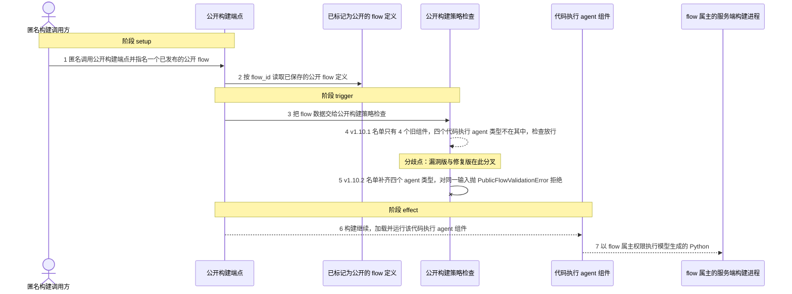
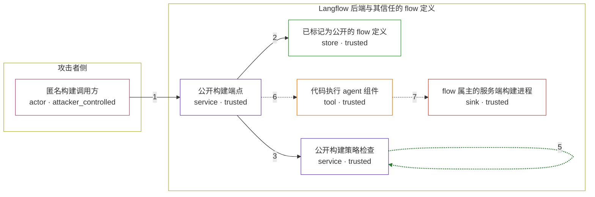

# ibm-langflow-oss-1-0-0 / CVE-2026-13448

状态：草稿，未完成环境和复现。这个目录由模板生成，不构成漏洞确认。

图解的唯一来源是 `diagram.toml`：编辑后运行 `python3 -m runner diagram ibm-langflow-oss-1-0-0/CVE-2026-13448` 重新生成下方的图解区块。图解必须覆盖漏洞涉及的每个主体，并标出漏洞版/修复版的分歧步骤。

<!-- diagram:begin (generated from diagram.toml by `python3 -m runner diagram`; edit diagram.toml, not this block) -->
## 漏洞图解 — ibm-langflow-oss-1-0-0 / CVE-2026-13448 漏洞图解

Langflow OSS 的公开构建端点 POST /api/v1/build_public_tmp/{flow_id}/flow 无需认证，任何匿名调用方指名一个公开 flow，就能让服务端以该 flow 属主的权限构建它。v1.10.1 在构建前调用的 validate_public_flow_no_code_execution() 只拒绝 4 个旧的代码执行组件，漏掉了 CSVAgent、CodeActAgentSmolagents、Cuga、OpenDsStarAgent 这四个会执行模型生成 Python 的 agent 组件，于是含这些组件的公开 flow 通过检查并继续构建，最终落到服务端的代码执行 sink。v1.10.2 把四个类型补进同一份名单后，同一输入被 PublicFlowValidationError 拒绝。

### 涉及主体

| 主体 | 类型 | 信任级别 | 在漏洞里的作用 | 来源 |
| --- | --- | --- | --- | --- |
| 匿名构建调用方 (`anonymous_caller`) | `actor` | `attacker_controlled` | 无需认证即可调用公开构建端点，并指名一个已标记为公开的 flow。它不能改写该 flow 的存储定义，只能决定打哪个 flow、带哪些输入，所以它拿到的是属主权限下的执行能力，而不是属主自己的数据。 | — |
| 已标记为公开的 flow 定义 (`public_flow`) | `store` | `trusted` | 构建路径按 flow_id 直接读取的存储定义。它由 flow 属主发布并标记为公开，其中含一个代码执行 agent 组件。这是漏洞前提而非攻击动作：IBM 给出 AC:H，正是因为要先存在这样一个公开 flow。 | fixtures/attack/structured_data_analysis_agent.json |
| 公开构建端点 (`build_endpoint`) | `service` | `trusted` | POST /api/v1/build_public_tmp/{flow_id}/flow 通过 get_current_user_optional 接收匿名调用，docstring 明确说明它以 flow 属主权限构建。它会先跑策略检查，再做可信代码替换并继续构建。 | — |
| 公开构建策略检查 (`denylist_gate`) | `service` | `trusted` | validate_public_flow_no_code_execution() 对每个节点按声明的 type 或 code 哈希匹配拒绝名单。名单是否完整，决定了这道边界能否拦住匿名构建，也正是本漏洞的分歧点。 | — |
| 代码执行 agent 组件 (`code_execution_agent`) | `tool` | `trusted` | CSVAgent、CodeActAgentSmolagents、Cuga、OpenDsStarAgent 都会在构建或运行时把模型生成的 Python 交给服务端执行；v1.10.1 的拒绝名单里没有它们。 | — |
| flow 属主的服务端构建进程 (`owner_runtime`) | `sink` | `trusted` | 组件最终执行代码的落点，权限来自 flow 属主而不是匿名调用方。攻击者本来够不着这里，这正是漏洞要换到的东西。 | — |

**信任边界**

- **攻击者侧** (`attacker_side`)：成员 `anonymous_caller`。攻击者只能构造匿名的公开构建请求并指名 flow；已保存的 flow 定义不在它的控制范围内。
- **Langflow 后端与其信任的 flow 定义** (`deployment`)：成员 `public_flow`、`build_endpoint`、`denylist_gate`、`code_execution_agent`、`owner_runtime`。这道边界本应由公开构建策略守住：任何会在服务端执行模型生成代码的组件，都不该被匿名构建加载。

### 触发过程

### 主体与信任边界

箭头上的数字是上面的步骤编号；方框只标主体和信任级别，具体动作见「触发过程」。

**分歧点**：第 4 步（`vulnerable_only`）v1.10.1 名单只有 4 个旧组件，四个代码执行 agent 类型不在其中，检查放行。
**分歧点**：第 5 步（`patched_only`）v1.10.2 名单补齐四个 agent 类型，对同一输入抛 PublicFlowValidationError 拒绝。
<!-- diagram:end -->

## 公告与机制

TODO：官方公告、漏洞根因、Agent 信任边界、受影响范围和修复来源。

## 前提

TODO：认证要求、用户交互、已有批准、工具权限、攻击者能控制的内容。

## 版本与启动

TODO：补全 metadata、Dockerfile/镜像 digest 和 Compose，再写出精确启动命令。

Compose 中 `vulnerable` 与 `patched` profiles 分开使用；未指定 profile 不启动服务。镜像变量未配置时 Compose 会明确报错。此模板不暴露宿主端口，也不挂载主机数据。

## 机制复现

TODO：实现 `reproduce.py`，固定输入并执行真实漏洞路径，注明运行位置、参数和超时。

完成实现后使用 `python3 -m runner reproduce ibm-langflow-oss-1-0-0/CVE-2026-13448 --build --rounds 3`。
两脚本统一接受 `--context <context.json> --output <目录>`，详细字段见仓库 `docs/environment-contract.md`。
PoC 输出 `facts.json` 和效果文件；验证器只读证据，输出含 `target_ready` 及对应效果断言的 `verdict.json`。
镜像必须包含 Python 3 和 `/lab/` 下的脚本、fixtures；`runtime.mode` 选择 `oneshot` 或有 healthcheck 的 `service`。

## 端到端复现

TODO：实现 `end_to_end.py`；若不需要模型，明确写出不适用原因。真实模型的结果与机制复现分开统计。

## 验证与修复对照

TODO：实现 `verify.py`。记录漏洞版无害效果、修复版阻断和正常任务成功的证据，不能把服务启动失败当成阻断。

## 清理

默认运行器按每个测试的唯一 Compose project 清理容器、网络和 volume。
`--keep-on-failure` 保留失败项目，项目标识和 Compose 配置在结果目录中；仅清理该项目，不能使用全局 prune。

## 失败诊断

TODO：为本漏洞写出预期效果缺失、修复版仍有越界效果、正常任务失败及前提不满足时的具体排查路径。
启动失败、健康检查失败和超时都不能当作修复阻断。报告中应能定位到阶段、预期、实际和受控证据。

## 构建与输入

TODO：填写两版源码 archive、完整 commit，记录 `build.inputs` 中每个下载的 SHA-256；依赖安装必须支持禁网构建。
固定攻击和正常输入放入 `fixtures/` 并登记到 `fixtures/manifest.toml`。固定 seed、环境变量，说明无害效果与真实影响的关系。

## 隔离例外

默认无例外。确需例外时同时填写 `runtime.exceptions`、理由及最小范围，晋升由两位维护者审阅。

## 来源与许可

TODO：列出引用代码、fixtures 和镜像的来源及许可。
