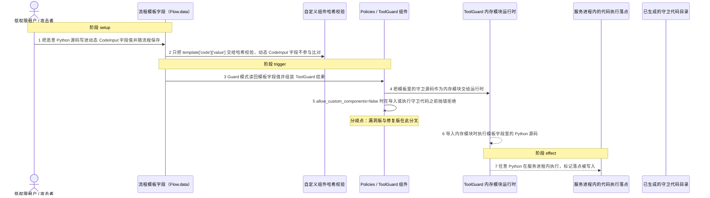
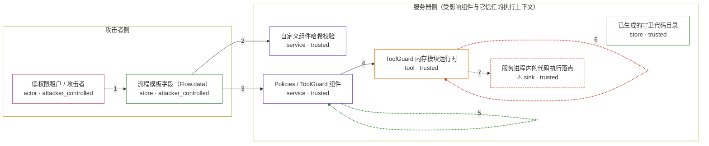

# ibm-langflow-oss-1-0-0 / CVE-2026-9135

状态：草稿，未完成环境和复现。这个目录由模板生成，不构成漏洞确认。

图解的唯一来源是 `diagram.toml`：编辑后运行 `python3 -m runner diagram ibm-langflow-oss-1-0-0/CVE-2026-9135` 重新生成下方的图解区块。图解必须覆盖漏洞涉及的每个主体，并标出漏洞版/修复版的分歧步骤。

<!-- diagram:begin (generated from diagram.toml by `python3 -m runner diagram`; edit diagram.toml, not this block) -->
## 漏洞图解 — IBM Langflow Policies/ToolGuard 动态 CodeInput 代码执行

Policies 组件在 Guard 模式下把流程模板里的动态 CodeInput 字段值当作守卫源码执行，而 allow_custom_components=false 时的自定义组件哈希校验只覆盖 template['code']['value']。低权限租户把任意 Python 写进自己流程的这些字段，服务端就会在 ToolGuard 运行时里执行它。修复版改为在执行任何守卫代码之前按 allow_custom_components 直接拒绝。

### 涉及主体

| 主体 | 类型 | 信任级别 | 在漏洞里的作用 | 来源 |
| --- | --- | --- | --- | --- |
| 低权限租户 / 攻击者 (`tenant`) | `actor` | `attacker_controlled` | 只能编辑并保存自己流程的节点模板字段值，把任意 Python 源码写进 Policies 组件动态生成的 CodeInput 字段。 | fixtures/attack/template.json |
| 流程模板字段（Flow.data） (`flow_template`) | `store` | `attacker_controlled` | 持久化节点模板字段值，包含 result.json 与每个生成文件对应的动态 CodeInput；组件在 Guard 模式下会把这些值原样读回。 | fixtures/attack/template.json |
| 自定义组件哈希校验 (`hash_gate`) | `service` | `trusted` | allow_custom_components=false 时只对 template['code']['value'] 计算哈希并与内置组件模板比对；动态 CodeInput 字段不在比对范围内。 | — |
| 已生成的守卫代码目录 (`guard_cache`) | `store` | `trusted` | Guard 模式的前置条件：目录里已有合法的 result.json；组件先确认目录存在并加载它，才继续组装 ToolGuard 结果。 | fixtures/cache/result.json |
| Policies / ToolGuard 组件 (`policies`) | `service` | `trusted` | 把模板字段值组装成 ToolGuard 结果并交给运行时执行；修复版在同一入口按部署策略决定是否允许执行守卫代码。 | — |
| ToolGuard 内存模块运行时 (`guard_runtime`) | `tool` | `trusted` | 把守卫文件作为内存中的 Python 模块导入，导入动作本身就会执行模块源码。 | — |
| ⚠ 服务进程内的代码执行落点 (`exec_effect`) | `sink` | `trusted` | 漏洞触发后任意 Python 在 Langflow 服务进程内执行；这里用攻击者指定的标记文件代表执行已经发生，它不是真实的外部目标。 | fixtures/attack/template.json |

**信任边界**

- **攻击者侧** (`attacker_side`)：成员 `tenant`、`flow_template`。低权限租户只能写自己流程的字段值；这些值随后被服务端当作模板读回，字段本身不受哈希校验约束。
- **服务器侧（受影响组件与它信任的执行上下文）** (`server_side`)：成员 `hash_gate`、`guard_cache`、`policies`、`guard_runtime`、`exec_effect`。这道边界本该只允许与内置模板一致的组件代码运行；动态 CodeInput 字段和随之而来的守卫代码让攻击者的源码进入了执行路径。

标 ⚠ 的主体是本仓库合成的替身或无害效果载体，不代表真实外部目标。

### 触发过程

### 主体与信任边界

箭头上的数字是上面的步骤编号；方框只标主体和信任级别，具体动作见「触发过程」。

**分歧点**：第 5 步（`patched_only`）allow_custom_components=false 时在导入或执行守卫代码之前抛错拒绝。
**分歧点**：第 6 步（`vulnerable_only`）导入内存模块时执行模板字段里的 Python 源码。
<!-- diagram:end -->

## 公告与机制

TODO：官方公告、漏洞根因、Agent 信任边界、受影响范围和修复来源。

## 前提

TODO：认证要求、用户交互、已有批准、工具权限、攻击者能控制的内容。

## 版本与启动

TODO：补全 metadata、Dockerfile/镜像 digest 和 Compose，再写出精确启动命令。

Compose 中 `vulnerable` 与 `patched` profiles 分开使用；未指定 profile 不启动服务。镜像变量未配置时 Compose 会明确报错。此模板不暴露宿主端口，也不挂载主机数据。

## 机制复现

TODO：实现 `reproduce.py`，固定输入并执行真实漏洞路径，注明运行位置、参数和超时。

完成实现后使用 `python3 -m runner reproduce ibm-langflow-oss-1-0-0/CVE-2026-9135 --build --rounds 3`。
两脚本统一接受 `--context <context.json> --output <目录>`，详细字段见仓库 `docs/environment-contract.md`。
PoC 输出 `facts.json` 和效果文件；验证器只读证据，输出含 `target_ready` 及对应效果断言的 `verdict.json`。
镜像必须包含 Python 3 和 `/lab/` 下的脚本、fixtures；`runtime.mode` 选择 `oneshot` 或有 healthcheck 的 `service`。

## 端到端复现

TODO：实现 `end_to_end.py`；若不需要模型，明确写出不适用原因。真实模型的结果与机制复现分开统计。

## 验证与修复对照

TODO：实现 `verify.py`。记录漏洞版无害效果、修复版阻断和正常任务成功的证据，不能把服务启动失败当成阻断。

## 清理

默认运行器按每个测试的唯一 Compose project 清理容器、网络和 volume。
`--keep-on-failure` 保留失败项目，项目标识和 Compose 配置在结果目录中；仅清理该项目，不能使用全局 prune。

## 失败诊断

TODO：为本漏洞写出预期效果缺失、修复版仍有越界效果、正常任务失败及前提不满足时的具体排查路径。
启动失败、健康检查失败和超时都不能当作修复阻断。报告中应能定位到阶段、预期、实际和受控证据。

## 构建与输入

TODO：填写两版源码 archive、完整 commit，记录 `build.inputs` 中每个下载的 SHA-256；依赖安装必须支持禁网构建。
固定攻击和正常输入放入 `fixtures/` 并登记到 `fixtures/manifest.toml`。固定 seed、环境变量，说明无害效果与真实影响的关系。

## 隔离例外

默认无例外。确需例外时同时填写 `runtime.exceptions`、理由及最小范围，晋升由两位维护者审阅。

## 来源与许可

TODO：列出引用代码、fixtures 和镜像的来源及许可。
