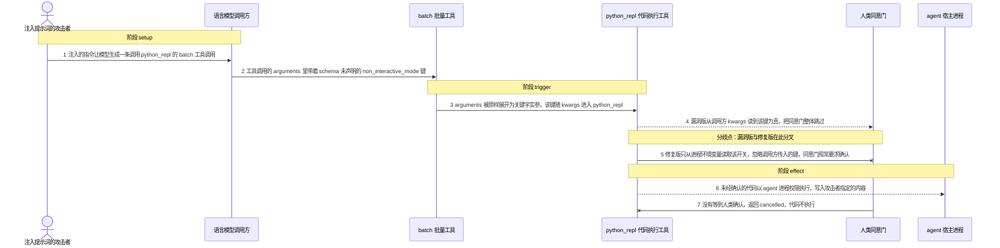
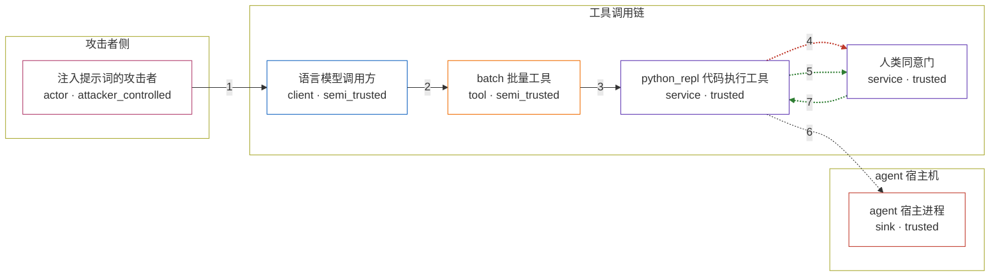

# improper-neutralization-of-input-used-for-llm-pr / CVE-2026-78379

状态：草稿，未完成环境和复现。这个目录由模板生成，不构成漏洞确认。

图解的唯一来源是 `diagram.toml`：编辑后运行 `python3 -m runner diagram improper-neutralization-of-input-used-for-llm-pr/CVE-2026-78379` 重新生成下方的图解区块。图解必须覆盖漏洞涉及的每个主体，并标出漏洞版/修复版的分歧步骤。

<!-- diagram:begin (generated from diagram.toml by `python3 -m runner diagram`; edit diagram.toml, not this block) -->
## 漏洞图解 — improper-neutralization-of-input-used-for-llm-pr / CVE-2026-78379 漏洞图解

python_repl 用调用方关键字实参 non_interactive_mode 决定是否请求人类确认，而这个键从未出现在它的工具 schema 中。batch 工具把 LLM 给出的 arguments 原样展开成关键字实参，工具直调链又不过滤 schema 未声明的键，于是提示词注入就能让模型置位该开关。同意门被短路后，攻击者指定的 Python 代码以 agent 进程权限在宿主机执行。修复版把该开关改为只能来自进程环境变量，调用方再也无法注入。

### 涉及主体

| 主体 | 类型 | 信任级别 | 在漏洞里的作用 | 来源 |
| --- | --- | --- | --- | --- |
| 注入提示词的攻击者 (`attacker`) | `actor` | `attacker_controlled` | 在进入 agent 的文本里植入指令，诱导模型产出一条调用 python_repl 的 batch 工具调用；它能控制的只有这次调用的参数内容。 | — |
| 语言模型调用方 (`llm`) | `client` | `semi_trusted` | 把受污染的提示词翻译成工具调用，arguments 中同时带上 schema 已声明的 code 和 schema 未声明的 non_interactive_mode 键。 | — |
| batch 批量工具 (`batch_tool`) | `tool` | `semi_trusted` | 把每个 invocation 的 arguments 原样展开为关键字实参转发给目标工具，不对键名做 schema 过滤。 | — |
| python_repl 代码执行工具 (`python_repl`) | `service` | `trusted` | 受影响的上游组件：从调用方关键字实参读取 non_interactive_mode，并据此决定是否请求人类确认。 | — |
| 人类同意门 (`consent_gate`) | `service` | `trusted` | 在执行代码前要求明确的人类同意；调用方置位那个开关后，这个检查被整体跳过。 | — |
| agent 宿主进程 (`agent_host`) | `sink` | `trusted` | 以 agent 进程权限执行 Python 代码，并携带该进程可访问的文件与凭据；这是攻击者真正想要却本来够不着的落点。 | — |

**信任边界**

- **攻击者侧** (`attacker_side`)：成员 `attacker`。攻击者只能控制进入 agent 的文本与由此产生的工具调用参数，不能直接读写 agent 宿主机的文件。
- **工具调用链** (`tool_chain`)：成员 `llm`、`batch_tool`、`python_repl`、`consent_gate`。工具调用参数在这里被展开、信任并决定是否执行代码；schema 未声明的键没有被过滤，同意门又把它当成可信开关。
- **agent 宿主机** (`host_side`)：成员 `agent_host`。只有通过同意门的代码才能在这里执行；漏洞让没有经过确认的代码直接落到这个边界内侧。

### 触发过程

### 主体与信任边界

箭头上的数字是上面的步骤编号；方框只标主体和信任级别，具体动作见「触发过程」。

**分歧点**：第 4 步（`vulnerable_only`）漏洞版从调用方 kwargs 读到该键为真，把同意门整体跳过。
**分歧点**：第 5 步（`patched_only`）修复版只从进程环境变量读取该开关，忽略调用方传入的键，同意门照常要求确认。
<!-- diagram:end -->

## 公告与机制

- NVD `CVE-2026-78379`（[详情](https://nvd.nist.gov/vuln/detail/CVE-2026-78379)）、同源 [GHSA-qc8m-4887-8wwh](https://github.com/strands-agents/tools/security/advisories/GHSA-qc8m-4887-8wwh)，CNA 为 Amazon（`AMZN`）。
- 分类：`CWE-1427`（Improper Neutralization of Input Used for LLM Prompting），影响类别 `CAPEC-248`。CVSS 4.0 `9.2 CRITICAL`（`AT:P`：需要 agent 同时注册 `batch` 与 `python_repl`），CVSS 3.1 `8.1 HIGH`。
- 受影响组件：PyPI `strands-agents-tools`（仓库 [`strands-agents/tools`](https://github.com/strands-agents/tools)），公告口径 `< 0.8.5`；按可下载产物核对，最后一个脆弱发行版是 `0.8.3`，修复实际随 `0.8.4` 发布。
- 根因：`src/strands_tools/python_repl.py`（v0.8.3 第 615 行）用调用方关键字实参决定同意门：
  `non_interactive_mode = kwargs.get("non_interactive_mode", False)`，而 `non_interactive_mode` **从未出现在 `python_repl.TOOL_SPEC["inputSchema"]["properties"]`**。`src/strands_tools/batch.py` 第 112 行把 LLM 给出的 `arguments` 原样展开（`tool_fn(record_direct_tool_call=False, **arguments)`），SDK 的 `PythonAgentTool.stream` 又直接执行 `self._tool_func(tool_use, **invocation_state)`，不做 schema 过滤，于是提示词注入可以把这个未声明的键一路送进 `**kwargs`，同意门被整体跳过，代码直接执行。
- 信任边界：LLM 工具调用参数（不可信）→ `batch` → `python_repl` 的 `**kwargs` → 同意门 → agent 宿主机进程权限。
- 修复：提交 [`07ebfb3`](https://github.com/strands-agents/tools/commit/07ebfb3c2f0ab7d1b153821b697883bb0f647b00)（tag `v0.8.4`）只改这一处，把开关来源换成进程环境变量 `STRANDS_NON_INTERACTIVE`；门条件本身未改，`batch` 也未改（上游选择在 sink 端收敛，而不是收紧 `arguments` schema）。

## 前提

- agent 同时注册了 `batch` 与 `python_repl`（CVSS 向量的 `AT:P`）。
- 未设置 `BYPASS_TOOL_CONSENT=true`；若已设置，同意门本就被合法关闭，不属于本漏洞。
- 攻击者能让模型产出一次 `batch` 调用，其 `arguments` 里带 `"non_interactive_mode": true`。
- 机制复现不调用真实模型：`metadata.runtime.requires_model = false`，工具调用参数由 `fixtures/` 固定。

## 版本与启动

TODO：补全 metadata、Dockerfile/镜像 digest 和 Compose，再写出精确启动命令。

Compose 中 `vulnerable` 与 `patched` profiles 分开使用；未指定 profile 不启动服务。镜像变量未配置时 Compose 会明确报错。此模板不暴露宿主端口，也不挂载主机数据。

## 机制复现

`reproduce.py` 只驱动镜像里安装的上游本体：它导入 `strands_tools.batch` 与 `strands_tools.python_repl`，用 `batch` 真实展开 invocation 的 `arguments`，并把 `python_repl` 模块工具按 SDK 的绑法交给它（`PythonAgentTool.stream` 执行 `self._tool_func(tool_use, **invocation_state)`）。同意门的人类输入用 `unittest.mock` 换成确定性记录器：它记录门是否被调用，并按 `fixtures/*.json` 里的 `gate_response` 回答，从而把「门有没有被短路」变成一个布尔量，不依赖容器里没有的 TTY。漏洞判定点本身没有被重写。

- 输入：`/lab/fixtures/{attack,benign}.json`（`AVH_FIXTURES` 可覆盖，便于离线调试）。
- 运行位置与命令：由运行器在目标容器内执行 `python3 /lab/reproduce.py --context /lab/results/context.json --output /lab/results`；`runtime.mode = oneshot`，`harness = python3`。
- 关卡：`AVH_ROOT=/home/hejunjie/agent-vulhub/staging python3 -m runner reproduce improper-neutralization-of-input-used-for-llm-pr/CVE-2026-78379 --build --rounds 3`。

三态对照（`observation.json` 里可直接核对）：

| 场景 | 转发到 `python_repl` 的键 | 预期 |
| --- | --- | --- |
| vulnerable + attack | `non_interactive_mode=True` | 同意门未被调用（`consent_gate_invoked=false`），代码执行，`executed.py.out` 写入攻击 marker |
| patched + attack | 同一组键 | 键被忽略，同意门被调用并拒绝，返回 `cancelled`，不产生 `executed.py.out` |
| vulnerable/patched + benign | 无 `non_interactive_mode` | 同意门被调用并同意，正常任务在两个版本都完成 |

效果物是固定 marker 文件（`AVH-CVE-2026-78379-CONSENT-BYPASS-EXECUTED` / `AVH-CVE-2026-78379-BENIGN-TASK-OK`），代表漏洞在真实环境下会以 agent 进程权限执行的任意代码；它不是真实外部目标。

## 端到端复现

`end_to_end.py` 保留模板状态。本漏洞的机制在 Python 工具层即可确定复现，真实模型只影响「模型是否会产出这次 `batch` 调用」，属于可选的模型侧实验；`metadata.verification.end_to_end` 保持 `not_applicable`，机制结果不得表述为真实模型端到端复现。

## 验证与修复对照

TODO：实现 `verify.py`。记录漏洞版无害效果、修复版阻断和正常任务成功的证据，不能把服务启动失败当成阻断。

## 清理

默认运行器按每个测试的唯一 Compose project 清理容器、网络和 volume。
`--keep-on-failure` 保留失败项目，项目标识和 Compose 配置在结果目录中；仅清理该项目，不能使用全局 prune。

## 失败诊断

TODO：为本漏洞写出预期效果缺失、修复版仍有越界效果、正常任务失败及前提不满足时的具体排查路径。
启动失败、健康检查失败和超时都不能当作修复阻断。报告中应能定位到阶段、预期、实际和受控证据。

## 构建与输入

TODO：填写两版源码 archive、完整 commit，记录 `build.inputs` 中每个下载的 SHA-256；依赖安装必须支持禁网构建。
固定攻击和正常输入放入 `fixtures/` 并登记到 `fixtures/manifest.toml`。固定 seed、环境变量，说明无害效果与真实影响的关系。

## 隔离例外

默认无例外。确需例外时同时填写 `runtime.exceptions`、理由及最小范围，晋升由两位维护者审阅。

## 来源与许可

TODO：列出引用代码、fixtures 和镜像的来源及许可。
