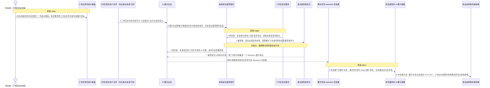
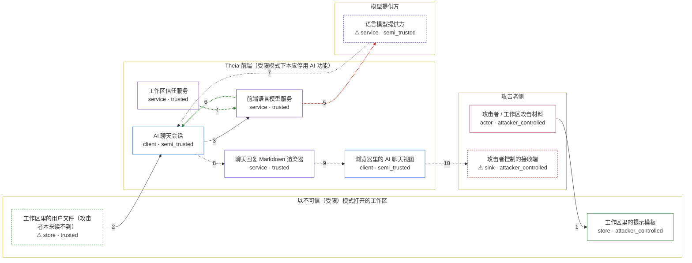

# in-eclipse-theia-versions / CVE-2026-22551

状态：草稿，未完成环境和复现。这个目录由模板生成，不构成漏洞确认。

图解的唯一来源是 `diagram.toml`：编辑后运行 `python3 -m runner diagram in-eclipse-theia-versions/CVE-2026-22551` 重新生成下方的图解区块。图解必须覆盖漏洞涉及的每个主体，并标出漏洞版/修复版的分歧步骤。

<!-- diagram:begin (generated from diagram.toml by `python3 -m runner diagram`; edit diagram.toml, not this block) -->
## 漏洞图解 — Theia AI 聊天把 Markdown 图片地址当可信内容，工作区数据随图片请求外带

Eclipse Theia 1.71.0 之前的 AI 聊天把模型回复直接当 Markdown 渲染：markdown-it 产出的图片标签经通用净化后挂进活动文档，浏览器随即向图片地址自动发起 HTTP GET，图片主机不受任何限制。攻击者只要让不可信工作区里的提示模板把工作区内容注入提示，模型回复就会把这段内容编进图片地址，数据随请求离开前端。修复版没有改渲染器，而是在发送请求前先问工作区是否受信任：不可信工作区直接抛错、根本不调用模型；漏洞版没有这道检查，受限模式下的请求照常发往模型提供方。

### 涉及主体

| 主体 | 类型 | 信任级别 | 在漏洞里的作用 | 来源 |
| --- | --- | --- | --- | --- |
| 攻击者 / 工作区攻击材料 (`attacker`) | `actor` | `attacker_controlled` | 攻击者。它能控制的是提交进工作区的提示模板内容，以及自己接收请求的地址。工作区里的用户文件它自己读不到，所以要借 AI 的手把它送出来。 | fixtures/attack_request.json |
| 工作区里的提示模板 (`prompt_template`) | `store` | `attacker_controlled` | 不可信工作区携带的提示模板。受限模式下它仍会被加载，内容被拼进会话提示，注入指令就写在这里。 | fixtures/attack_prompttemplate.md |
| ⚠ 工作区里的用户文件（攻击者本来读不到） (`workspace_secret`) | `store` | `trusted` | 工作区中的用户文件，内容通过 AI 变量进入提示。攻击者自己读不到它，这正是它要外带的目标；这里放的是受控标记，不是真实凭据。 | fixtures/workspace_secret_marker.txt |
| AI 聊天会话 (`ai_chat_session`) | `client` | `semi_trusted` | 半可信的调用方。它把工作区提示模板和变量拼成请求交给语言模型服务，拿到回复后再当 Markdown 交给渲染器；工作区可不可信不归它判断。 | — |
| 前端语言模型服务 (`frontend_language_model_service`) | `service` | `trusted` | 漏洞的分叉点。它把聊天请求发给模型提供方：1.71.0 先查询工作区信任状态，不可信就直接抛错；更早的版本没有这道检查。 | packages/ai-core/src/browser/frontend-language-model-service.ts |
| 工作区信任服务 (`workspace_trust_service`) | `service` | `trusted` | 给出当前工作区是否受信任。受限模式下它返回未受信任，修复版据此关闭 AI 功能。 | — |
| ⚠ 语言模型提供方 (`language_model`) | `service` | `semi_trusted` | 按请求生成回复的模型提供方。被注入的指令让它把工作区内容编进 Markdown 图片地址；机制验证用固定的回复协议代替真实模型。 | fixtures/attack_response.md |
| 聊天回复 Markdown 渲染器 (`markdown_renderer`) | `service` | `trusted` | 把模型回复当 Markdown 渲染：markdown-it 产出图片标签，通用净化放行 http(s) 图片地址，随后标签被挂进活动文档。这一处两个版本完全相同。 | packages/ai-chat-ui/src/browser/chat-response-renderer/markdown-part-renderer.tsx |
| 浏览器里的 AI 聊天视图 (`chat_view`) | `client` | `semi_trusted` | 承载回复的实时文档。图片标签一挂进来，浏览器就会自动向该地址发起请求，不需要用户点击。 | — |
| ⚠ 攻击者控制的接收端 (`receiver`) | `sink` | `attacker_controlled` | 攻击者自己的 HTTP 接收端。工作区内容随图片请求的查询参数落到这里，数据在这一步真正离开用户机器。 | — |

**信任边界**

- **攻击者侧** (`attacker_side`)：成员 `attacker`、`receiver`。攻击者能控制的是提交进工作区的提示模板和自己的接收地址；工作区里的用户文件它读不到，接收端也只是效果落点。
- **以不可信（受限）模式打开的工作区** (`workspace`)：成员 `prompt_template`、`workspace_secret`。工作区内容都是不可信输入，其中提示模板在受限模式下仍会被 AI 读取；工作区里同时放着攻击者想要但拿不到的用户文件。
- **Theia 前端（受限模式下本应停用 AI 功能）** (`theia_frontend`)：成员 `ai_chat_session`、`frontend_language_model_service`、`workspace_trust_service`、`markdown_renderer`、`chat_view`。修复版把工作区信任收口在语言模型服务上，不可信工作区连请求都发不出去；漏洞版没有这道门，不可信内容可以一路走到模型和渲染器。
- **模型提供方** (`model_provider`)：成员 `language_model`。回复文本由模型产生。Theia 把它当不可信内容渲染，却对图片地址的来源没有任何限制。

标 ⚠ 的主体是本仓库合成的替身或无害效果载体，不代表真实外部目标。

### 触发过程

### 主体与信任边界

箭头上的数字是上面的步骤编号；方框只标主体和信任级别，具体动作见「触发过程」。

**分歧点**：第 5 步（`vulnerable_only`）漏洞版：没有这道信任检查，受限模式下的请求照常发往模型提供方。
**分歧点**：第 6 步（`patched_only`）修复版：未受信任的工作区不提供 AI 功能，请求在这里被拒绝。
<!-- diagram:end -->

## 公告与机制

- NVD：<https://nvd.nist.gov/vuln/detail/CVE-2026-22551>；GHSA：<https://github.com/advisories/GHSA-qwjm-9c66-w4q4>；Eclipse CNA work item #115：<https://gitlab.eclipse.org/security/cve-assignment/-/work_items/115>
- 受影响范围：Eclipse Theia `< 1.71.0`（vulnerable `8d67ec4a64515e41bfcbf720011ffaabebe48cf0`，v1.70.0）。CVSS 3.1 `6.5 MEDIUM`，`AV:N/AC:L/PR:N/UI:R`，CWE-201 / CWE-829。
- 根因与信任边界：AI 聊天把模型回复当 Markdown 渲染。`markdown-it` 把 `` 渲染成 ``，`DOMPurify.sanitize(..., { ALLOW_UNKNOWN_PROTOCOLS: true })` 放行 http(s) 图片地址，随后 `appendChild` 把标签挂进活动 DOM，浏览器立即自动发起 HTTP GET。代码里唯一的拦截是处理 `<a>` 点击的 `handleClick`，对图片加载不生效；仓库中也没有限制 `img-src` 的 CSP。信任边界是「来自模型的文本 = 不可信内容」，而图片地址完全不受该边界约束。
- 修复来源：commit `e3fdfe6992389bc5fa611058d00c39d7408508ed`（PR #17364，*Hook workspace trust into AI features*）。修复**没有改渲染器**：`markdown-part-renderer.tsx` 在两版字节相同（sha256 `cd70dba2…`）。修复把工作区信任接进 AI 功能，单一收口点是 `packages/ai-core/src/browser/frontend-language-model-service.ts` 的 `sendRequest`——不可信工作区直接抛错 `AI features are not available in untrusted workspaces.`，模型不会被调用。跟踪 issue #16892 把「外部图片加载」列为应单独处理，因此渲染层的图片加载在 1.71.0 中依然存在，只是受限模式下 AI 已被停用。

## 前提

- 工作区以**不可信（受限）模式**打开：`security.workspace.trust.enabled` 默认 `true`、`startupPrompt` 默认 `always`。这是环境前提，两版使用同一份固定输入；vulnerable/patched 的差异只来自代码。
- 用户让 AI 处理工作区里的文件，文件内容通过 AI 变量进入提示（`UI:R`/`UI:A`）。
- 攻击者能控制的是**提交进工作区的提示模板内容**和自己的接收地址；工作区里的用户文件它自己读不到——那正是它要外带的目标。
- 上游没有 `img-src` CSP；容器内接收端位于回环地址，不需要外网。
- 不需要真实模型：回复文本是固定输入，机制验证只关心「请求能否到达模型」与「回复如何被渲染」。

## 机制复现

`reproduce.py` 在镜像内 `/lab` 运行，入口固定为 `--context <context.json> --output <目录>`，并按 `context["scenario"]`（`attack` / `benign`）从 `/lab/fixtures/` 读取固定输入：

- 被固定的 Theia 源码树放在 `/lab/app`（按 `VARIANT` 选择 v1.70.0 或 v1.71.0）。`theia_preload.cjs` 用 typescript 现场转译 `.ts`/`.tsx`，只替换 DI 装饰器与若干无副作用协作者；`theia_harness.cjs` 直接 `require` 真实模块本体，没有重写或抽取漏洞函数。
- `frontend-language-model-service.ts` 的 `sendRequest` 被真正调用，模型提供方用固定回复协议代替；随后 `markdown-part-renderer.tsx` 的 `useMarkdownRendering` 在 jsdom 文档里跑真实的 `markdown-it` + `DOMPurify` 渲染链。
- 回环接收端 `127.0.0.1:8731` 记录渲染后 DOM 里图片标签触发的自动请求；子进程超时 300 秒。
- 效果文件：`mechanism.json`（两段调用的原始结果）、`rendered_dom.html`（净化后挂进文档的 HTML）、`receiver_hits.json`（接收端记录）；`observation.json` 里显式给出 `target_ready` 与 `execution_status`。
- 退出码：机制调用完成（包括修复版按设计拒绝）为 `0`；前提缺失为 `2`（`not_run`）；其他失败为 `1`。

四场景实测（同一份固定输入，只换源码树）：

| 场景 | 源码树 | `send_request` | `model_called` | 图片请求 | 说明 |
| --- | --- | --- | --- | --- | --- |
| attack | vulnerable | `completed` | `true` | 1 次，查询参数带工作区标记 | 漏洞版把数据送了出去 |
| attack | patched | `rejected` | `false` | 0 次 | 信任门抛错，模型未被调用 |
| benign | vulnerable | `completed` | `true` | 0 次 | 正常任务完成 |
| benign | patched | `completed` | `true` | 0 次 | 正常任务完成 |

运行：`python3 -m runner reproduce in-eclipse-theia-versions/CVE-2026-22551 --build --rounds 3`。

## 版本与启动

TODO：补全 metadata、Dockerfile/镜像 digest 和 Compose，再写出精确启动命令。

Compose 中 `vulnerable` 与 `patched` profiles 分开使用；未指定 profile 不启动服务。镜像变量未配置时 Compose 会明确报错。此模板不暴露宿主端口，也不挂载主机数据。

## 机制复现

TODO：实现 `reproduce.py`，固定输入并执行真实漏洞路径，注明运行位置、参数和超时。

完成实现后使用 `python3 -m runner reproduce in-eclipse-theia-versions/CVE-2026-22551 --build --rounds 3`。
两脚本统一接受 `--context <context.json> --output <目录>`，详细字段见仓库 `docs/environment-contract.md`。
PoC 输出 `facts.json` 和效果文件；验证器只读证据，输出含 `target_ready` 及对应效果断言的 `verdict.json`。
镜像必须包含 Python 3 和 `/lab/` 下的脚本、fixtures；`runtime.mode` 选择 `oneshot` 或有 healthcheck 的 `service`。

## 端到端复现

TODO：实现 `end_to_end.py`；若不需要模型，明确写出不适用原因。真实模型的结果与机制复现分开统计。

> 本环境 `requires_model = false`：机制复现用固定回复协议代替真实模型，端到端真实模型测试不适用；`end_to_end.py` 保持 `not_applicable`，不会把模拟结果当成提示注入成功的证明。

## 验证与修复对照

TODO：实现 `verify.py`。记录漏洞版无害效果、修复版阻断和正常任务成功的证据，不能把服务启动失败当成阻断。

## 清理

默认运行器按每个测试的唯一 Compose project 清理容器、网络和 volume。
`--keep-on-failure` 保留失败项目，项目标识和 Compose 配置在结果目录中；仅清理该项目，不能使用全局 prune。

## 失败诊断

TODO：为本漏洞写出预期效果缺失、修复版仍有越界效果、正常任务失败及前提不满足时的具体排查路径。
启动失败、健康检查失败和超时都不能当作修复阻断。报告中应能定位到阶段、预期、实际和受控证据。

## 构建与输入

TODO：填写两版源码 archive、完整 commit，记录 `build.inputs` 中每个下载的 SHA-256；依赖安装必须支持禁网构建。
固定攻击和正常输入放入 `fixtures/` 并登记到 `fixtures/manifest.toml`。固定 seed、环境变量，说明无害效果与真实影响的关系。

## 隔离例外

机制本体没有被替代，只替换了与漏洞无关的协作者。这些是**机制隔离范围**，不是容器/网络隔离例外：本环境不需要额外的 `runtime.exceptions`（接收端在容器回环上，`internal = true` 的网络不变）。

- **DI 与基础桶文件**：`@theia/core/shared/inversify` 的装饰器、`@theia/core` 的 `Emitter`/`URI`、`PreferenceService` 令牌、`nls.localize`、`OpenerService`/`open`。它们不参与信任判断，也不参与渲染。
- **协作者协议**：`WorkspaceTrustService` 与（修复版）`TrustAwarePreferenceReader` 的信任/偏好读取由 harness 注入；工作区信任状态来自固定输入字段 `workspace_trusted`。被求值的 `sendRequest` 与它里面的信任检查是真实源码。
- **浏览器子资源加载**：jsdom 在缺少原生 `canvas` 包时不会加载 ``，因此由 harness 扮演浏览器，只对**真实渲染 DOM 中出现的** `img[src]` 发起 GET，不凭空构造 URL。
- **模型提供方**：没有真实模型（`requires_model = false`），回复文本是固定输入，代表被注入后模型会给出的答案。

被求值的真实上游文件（未改写、未抽取）：`frontend-language-model-service.ts`、`language-model-service.ts`、`language-model.ts`、`ai-core-preferences.ts`、`trust-aware-preference-reader.ts`（仅修复版）、`prioritizeable.ts`、`markdown-part-renderer.tsx`。

## 来源与许可

TODO：列出引用代码、fixtures 和镜像的来源及许可。
