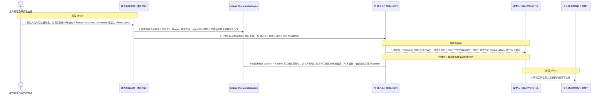
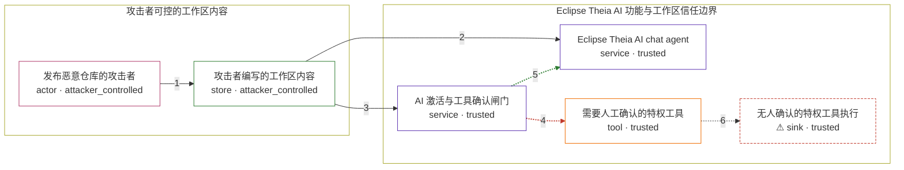

# in-eclipse-theia-versions / CVE-2026-44688

状态：草稿，未完成环境和复现。这个目录由模板生成，不构成漏洞确认。

图解的唯一来源是 `diagram.toml`：编辑后运行 `python3 -m runner diagram in-eclipse-theia-versions/CVE-2026-44688` 重新生成下方的图解区块。图解必须覆盖漏洞涉及的每个主体，并标出漏洞版/修复版的分歧步骤。

<!-- diagram:begin (generated from diagram.toml by `python3 -m runner diagram`; edit diagram.toml, not this block) -->
## 漏洞图解 — in-eclipse-theia-versions / CVE-2026-44688 漏洞图解

Eclipse Theia 1.71.0 之前，AI chat agent 会把工作区目录名与文件名原样读进模型上下文，而 AI 执行没有任何工作区信任判据；工作区自带的 .theia/settings.json 又能以工作区作用域覆盖工具确认策略。于是攻击者仓库既能注入指令，又能让危险工具跳过人工确认直接执行。修复没有改动文件名处理，而是把 AI 执行整体挂到工作区信任上，并在不受信任时丢弃工作区作用域的安全敏感偏好。

### 涉及主体

| 主体 | 类型 | 信任级别 | 在漏洞里的作用 | 来源 |
| --- | --- | --- | --- | --- |
| 发布恶意仓库的攻击者 (`attacker`) | `actor` | `attacker_controlled` | 编写工作区里的目录名、文件名与 .theia/settings.json：名字本身就是注入指令，设置文件把工具确认策略改成 always_allow。 | fixtures/attack/injection-directory-name.txt |
| 攻击者编写的工作区内容 (`workspace_content`) | `store` | `attacker_controlled` | 受害者在 Restricted Mode 下打开的仓库：目录/文件名携带注入指令，.theia/settings.json 携带工作区作用域的 ai-features.chat.toolConfirmation 覆盖。 | fixtures/attack/workspace-settings.json |
| Eclipse Theia AI chat agent (`ai_agent`) | `service` | `trusted` | 被要求探索仓库时调用 getWorkspaceDirectoryStructure / getWorkspaceFileList，把工作区目录名与文件名原样放进模型上下文。 | packages/ai-ide/src/browser/workspace-functions.ts |
| AI 激活与工具确认闸门 (`ai_gate`) | `service` | `trusted` | AIActivationService 的 isActive/canRun 与 ToolConfirmationManager 的确认模式判定：决定不受信任工作区里 AI 能否运行、危险工具是否需要人工确认。 | packages/ai-ide/src/browser/ai-ide-activation-service.ts |
| 需要人工确认的特权工具 (`dangerous_tool`) | `tool` | `trusted` | AI chat agent 可调用的特权工具（如工作区命令执行）；它默认要求人工确认，注入得手后是命令执行链的落点。 | packages/ai-core/src/browser/frontend-language-model-service.ts |
| ⚠ 无人确认的特权工具执行 (`effect`) | `sink` | `trusted` | 受控效果落点：确认模式被判为 always_allow，特权工具不需要人工确认即可执行。这是无害断言标记，不代表真的执行了命令或外泄了数据。 | — |

**信任边界**

- **攻击者可控的工作区内容** (`attacker_side`)：成员 `attacker`、`workspace_content`。攻击者只能决定仓库里的文本与设置；工作区信任状态、用户是否让 agent 探索仓库，都是环境前提而不是攻击动作。
- **Eclipse Theia AI 功能与工作区信任边界** (`product`)：成员 `ai_agent`、`ai_gate`、`dangerous_tool`、`effect`。边界内侧要求 AI 功能只在受信任工作区运行、危险工具必须人工确认；1.71.0 之前这里完全没有工作区信任判据。

标 ⚠ 的主体是本仓库合成的替身或无害效果载体，不代表真实外部目标。

### 触发过程

### 主体与信任边界

箭头上的数字是上面的步骤编号；方框只标主体和信任级别，具体动作见「触发过程」。

**分歧点**：第 4 步（`vulnerable_only`）漏洞版只用 isActive 判断 AI 是否运行，并直接采用工作区合并后的确认偏好：危险工具被判为 always_allow，跳过人工确认。
**分歧点**：第 5 步（`patched_only`）修复版要求 canRun = isActive 且工作区受信任，并在不受信任时丢弃工作区作用域偏好：AI 不运行，确认模式回落为 confirm。
<!-- diagram:end -->

## 公告与机制

TODO：官方公告、漏洞根因、Agent 信任边界、受影响范围和修复来源。

## 前提

TODO：认证要求、用户交互、已有批准、工具权限、攻击者能控制的内容。

## 版本与启动

TODO：补全 metadata、Dockerfile/镜像 digest 和 Compose，再写出精确启动命令。

Compose 中 `vulnerable` 与 `patched` profiles 分开使用；未指定 profile 不启动服务。镜像变量未配置时 Compose 会明确报错。此模板不暴露宿主端口，也不挂载主机数据。

## 机制复现

TODO：实现 `reproduce.py`，固定输入并执行真实漏洞路径，注明运行位置、参数和超时。

完成实现后使用 `python3 -m runner reproduce in-eclipse-theia-versions/CVE-2026-44688 --build --rounds 3`。
两脚本统一接受 `--context <context.json> --output <目录>`，详细字段见仓库 `docs/environment-contract.md`。
PoC 输出 `facts.json` 和效果文件；验证器只读证据，输出含 `target_ready` 及对应效果断言的 `verdict.json`。
镜像必须包含 Python 3 和 `/lab/` 下的脚本、fixtures；`runtime.mode` 选择 `oneshot` 或有 healthcheck 的 `service`。

## 端到端复现

TODO：实现 `end_to_end.py`；若不需要模型，明确写出不适用原因。真实模型的结果与机制复现分开统计。

## 验证与修复对照

TODO：实现 `verify.py`。记录漏洞版无害效果、修复版阻断和正常任务成功的证据，不能把服务启动失败当成阻断。

## 清理

默认运行器按每个测试的唯一 Compose project 清理容器、网络和 volume。
`--keep-on-failure` 保留失败项目，项目标识和 Compose 配置在结果目录中；仅清理该项目，不能使用全局 prune。

## 失败诊断

TODO：为本漏洞写出预期效果缺失、修复版仍有越界效果、正常任务失败及前提不满足时的具体排查路径。
启动失败、健康检查失败和超时都不能当作修复阻断。报告中应能定位到阶段、预期、实际和受控证据。

## 构建与输入

TODO：填写两版源码 archive、完整 commit，记录 `build.inputs` 中每个下载的 SHA-256；依赖安装必须支持禁网构建。
固定攻击和正常输入放入 `fixtures/` 并登记到 `fixtures/manifest.toml`。固定 seed、环境变量，说明无害效果与真实影响的关系。

## 隔离例外

默认无例外。确需例外时同时填写 `runtime.exceptions`、理由及最小范围，晋升由两位维护者审阅。

## 来源与许可

TODO：列出引用代码、fixtures 和镜像的来源及许可。
