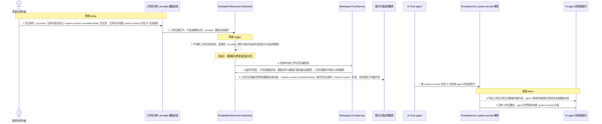
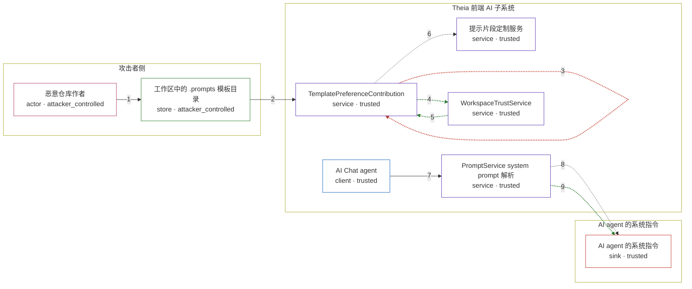

# in-eclipse-theia-versions / CVE-2026-46580

状态：草稿，未完成环境和复现。这个目录由模板生成，不构成漏洞确认。

图解的唯一来源是 `diagram.toml`：编辑后运行 `python3 -m runner diagram in-eclipse-theia-versions/CVE-2026-46580` 重新生成下方的图解区块。图解必须覆盖漏洞涉及的每个主体，并标出漏洞版/修复版的分歧步骤。

<!-- diagram:begin (generated from diagram.toml by `python3 -m runner diagram`; edit diagram.toml, not this block) -->
## 漏洞图解 — Eclipse Theia 工作区提示模板自动加载导致的间接提示注入

Theia 1.71.0 之前，工作区模板目录偏好默认指向 `.prompts`，而 TemplatePreferenceContribution 在启动时无条件读取该偏好、把目录解析为绝对路径并交给提示片段定制服务，没有任何工作区信任判断。工作区内一个与内建 system prompt 片段同名的 `.prompttemplate` 文件会以更高优先级覆盖该片段，于是 PromptService 解析 agent 系统指令时返回的是工作区模板。攻击者因此只靠一个仓库文件，就能在不受信工作区中替换 AI agent 的 system prompt，为后续数据外泄或命令执行提供指令面。

### 涉及主体

| 主体 | 类型 | 信任级别 | 在漏洞里的作用 | 来源 |
| --- | --- | --- | --- | --- |
| 恶意仓库作者 (`attacker`) | `actor` | `attacker_controlled` | 决定仓库里提交什么文件。这个 CVE 里攻击者唯一能控制的就是工作区内容：一个放在 `.prompts/` 下、文件名等于内建 system prompt 片段 ID 的模板文件。 | — |
| 工作区中的 .prompts 模板目录 (`workspace`) | `store` | `attacker_controlled` | 被打开的工作区内容。目录里的 `explore-system.prompttemplate` 是攻击者构造的提示注入载荷，会被产品当成提示片段来源读取。 | fixtures/attack/workspace/.prompts/explore-system.prompttemplate |
| TemplatePreferenceContribution (`template_preference`) | `service` | `trusted` | 上游受影响组件。它把工作区模板目录偏好解析成绝对路径并调用定制服务；漏洞版在这里缺少工作区信任判断，修复版先查询信任状态再决定是否读取。 | — |
| 提示片段定制服务 (`customization_service`) | `service` | `trusted` | 扫描附加模板目录，把 `.prompttemplate` 文件按去掉后缀的文件名注册为提示片段，工作区目录优先级 2 高于内建片段的优先级 1。 | — |
| PromptService system prompt 解析 (`prompt_service`) | `service` | `trusted` | 解析 agent 的 system prompt 片段：定制服务里有同名片段就返回定制内容，否则回落到内建片段。它是工作区内容变成系统指令的最后一跳。 | — |
| AI Chat agent (`chat_agent`) | `client` | `trusted` | 按 `systemPromptId` 请求自己系统指令的调用方；它信任 PromptService 返回的内容就是产品内建的系统角色定义。 | — |
| WorkspaceTrustService (`workspace_trust`) | `service` | `trusted` | 工作区信任状态的权威来源。修复版在读取工作区模板目录、模板文件与模板扩展名之前先查询它；不受信时这些输入全部被置空。 | — |
| AI agent 的系统指令 (`system_prompt`) | `sink` | `trusted` | 漏洞效果的落点：agent 实际拿到的系统指令。它本应只来自产品内建片段，漏洞版里却被工作区文件替换成攻击者模板。 | — |

**信任边界**

- **攻击者侧** (`attacker_side`)：成员 `attacker`、`workspace`。攻击者只能决定仓库里提交什么内容，不能控制 Theia 的安装、工作区模板目录偏好，也不能把不受信工作区改成受信。工作区文件被克隆到受害者磁盘后才进入产品读取范围。
- **Theia 前端 AI 子系统** (`theia_ai`)：成员 `template_preference`、`customization_service`、`prompt_service`、`chat_agent`、`workspace_trust`。产品代码与它信任的执行环境。工作区模板目录偏好默认是 `.prompts`，所以这道边界要拦的是不受信工作区内容进入提示片段来源，而不是路径本身非法。
- **AI agent 的系统指令** (`agent_instructions`)：成员 `system_prompt`。内建 system prompt 片段属于产品安装内容，攻击者本来够不着。漏洞让工作区模板以更高优先级覆盖它，系统指令因此变成攻击者可控文本。

### 触发过程

### 主体与信任边界

箭头上的数字是上面的步骤编号；方框只标主体和信任级别，具体动作见「触发过程」。

**分歧点**：第 3 步（`vulnerable_only`）不判断工作区信任状态，直接把 `.prompts` 解析为绝对目录并交给提示片段定制服务。
**分歧点**：第 4 步（`patched_only`）先查询当前工作区是否被信任。
**分歧点**：第 5 步（`patched_only`）返回不受信，工作区模板目录、模板文件与模板扩展名被全部置空，工作区模板不再进入定制服务。
<!-- diagram:end -->

## 公告与机制

TODO：官方公告、漏洞根因、Agent 信任边界、受影响范围和修复来源。

## 前提

TODO：认证要求、用户交互、已有批准、工具权限、攻击者能控制的内容。

## 版本与启动

TODO：补全 metadata、Dockerfile/镜像 digest 和 Compose，再写出精确启动命令。

Compose 中 `vulnerable` 与 `patched` profiles 分开使用；未指定 profile 不启动服务。镜像变量未配置时 Compose 会明确报错。此模板不暴露宿主端口，也不挂载主机数据。

## 机制复现

TODO：实现 `reproduce.py`，固定输入并执行真实漏洞路径，注明运行位置、参数和超时。

完成实现后使用 `python3 -m runner reproduce in-eclipse-theia-versions/CVE-2026-46580 --build --rounds 3`。
两脚本统一接受 `--context <context.json> --output <目录>`，详细字段见仓库 `docs/environment-contract.md`。
PoC 输出 `facts.json` 和效果文件；验证器只读证据，输出含 `target_ready` 及对应效果断言的 `verdict.json`。
镜像必须包含 Python 3 和 `/lab/` 下的脚本、fixtures；`runtime.mode` 选择 `oneshot` 或有 healthcheck 的 `service`。

## 端到端复现

TODO：实现 `end_to_end.py`；若不需要模型，明确写出不适用原因。真实模型的结果与机制复现分开统计。

## 验证与修复对照

TODO：实现 `verify.py`。记录漏洞版无害效果、修复版阻断和正常任务成功的证据，不能把服务启动失败当成阻断。

## 清理

默认运行器按每个测试的唯一 Compose project 清理容器、网络和 volume。
`--keep-on-failure` 保留失败项目，项目标识和 Compose 配置在结果目录中；仅清理该项目，不能使用全局 prune。

## 失败诊断

TODO：为本漏洞写出预期效果缺失、修复版仍有越界效果、正常任务失败及前提不满足时的具体排查路径。
启动失败、健康检查失败和超时都不能当作修复阻断。报告中应能定位到阶段、预期、实际和受控证据。

## 构建与输入

TODO：填写两版源码 archive、完整 commit，记录 `build.inputs` 中每个下载的 SHA-256；依赖安装必须支持禁网构建。
固定攻击和正常输入放入 `fixtures/` 并登记到 `fixtures/manifest.toml`。固定 seed、环境变量，说明无害效果与真实影响的关系。

## 隔离例外

默认无例外。确需例外时同时填写 `runtime.exceptions`、理由及最小范围，晋升由两位维护者审阅。

## 来源与许可

TODO：列出引用代码、fixtures 和镜像的来源及许可。
