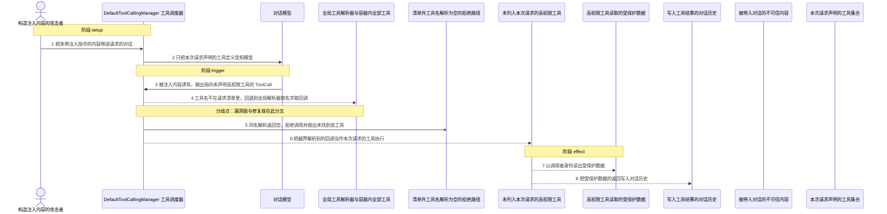
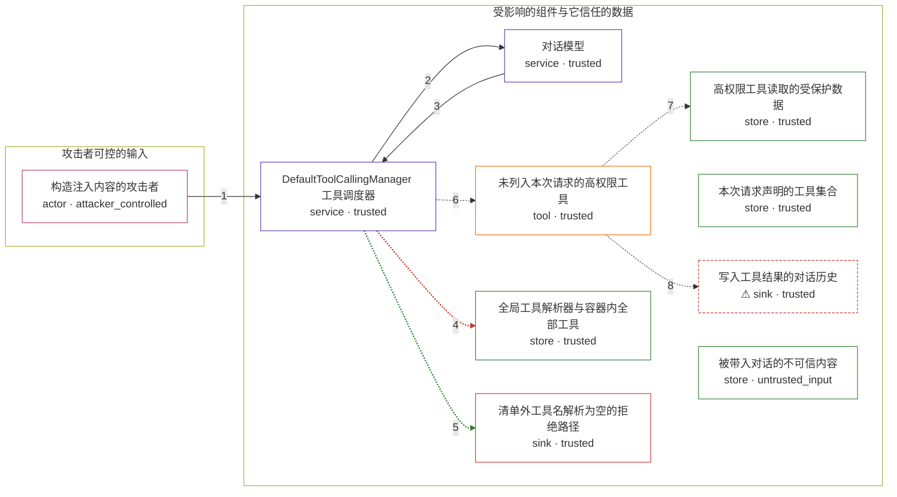

# in-spring-ai-s-tool-calling-support / CVE-2026-59318

状态：草稿。图解与机制 PoC 已写出，环境与镜像尚未构建，机制尚未在容器内验收，不构成漏洞确认。

图解的唯一来源是 `diagram.toml`：编辑后运行 `python3 -m runner diagram in-spring-ai-s-tool-calling-support/CVE-2026-59318` 重新生成下方的图解区块。图解必须覆盖漏洞涉及的每个主体，并标出漏洞版/修复版的分歧步骤。

<!-- diagram:begin (generated from diagram.toml by `python3 -m runner diagram`; edit diagram.toml, not this block) -->
## 漏洞图解 — in-spring-ai-s-tool-calling-support / CVE-2026-59318 漏洞图解

DefaultToolCallingManager 把本次请求的工具清单告知模型，却在工具名不在清单里时无条件回退到全局 ToolCallbackResolver 按名字解析并执行。于是“告知模型的清单”看起来是授权边界，实际却拦不住任何注册进容器的工具，被注入内容诱导的模型只要输出一个越界工具名，该工具就会照常执行。修复版把这次回退门控为默认关闭，清单之外的名字解析不到回调，只能拒绝执行。

### 涉及主体

| 主体 | 类型 | 信任级别 | 在漏洞里的作用 | 来源 |
| --- | --- | --- | --- | --- |
| 构造注入内容的攻击者 (`attacker`) | `actor` | `attacker_controlled` | 低权限调用者：它控制进入对话的提示内容，想让模型去调用一个从未列入本次请求工具清单的高权限工具。它拿不到高权限工具本身，只能靠诱导。 | — |
| 被带入对话的不可信内容 (`untrusted_content`) | `store` | `untrusted_input` | 前提条件：应用把外部获得的内容原样拼进对话。攻击者的指令藏在这里，由模型读取，攻击者并不需要额外的调用权限。 | — |
| 本次请求声明的工具集合 (`declared_tools`) | `store` | `trusted` | 前提条件：本次请求的 ToolCallingChatOptions 只挂载低权限工具，它是系统打算让模型使用的全集，也是本该被强制执行的授权边界。 | — |
| DefaultToolCallingManager 工具调度器 (`manager`) | `service` | `trusted` | 受影响组件：它既负责把本次请求的工具定义告知模型，又负责按模型给出的工具名取回调执行。按名字取回调时它无条件回退到全局解析器，没有校验这个名字是否属于本次请求的清单。 | — |
| 对话模型 (`model`) | `service` | `trusted` | 只收到本次请求声明的工具定义；它读到的注入内容让它输出一个越界工具名。它不执行任何工具，只产生 ToolCall，因此不是授权判定的地方。 | — |
| 全局工具解析器与容器内全部工具 (`global_registry`) | `store` | `trusted` | 应用上下文里所有 ToolCallback 与 ToolCallbackProvider 登记成的全局集合，含高权限工具。它本应只服务于清单内解析，却成了越界名字的兜底来源。 | — |
| 未列入本次请求的高权限工具 (`privileged_tool`) | `tool` | `trusted` | 受害者侧的能力：它属于全局集合但不属于本次请求清单，被越界名字解析出来后在调用者的权限语境里执行，返回本不该对该调用者开放的数据。 | — |
| 高权限工具读取的受保护数据 (`protected_store`) | `store` | `trusted` | 攻击者够不着的数据：只有高权限工具能访问，越界调用让它绕过逐请求授权被读出。 | — |
| ⚠ 写入工具结果的对话历史 (`conversation`) | `sink` | `trusted` | 漏洞效果落点：越界调用的返回值进入对话历史并随响应回到调用者手里。这里记录的是可以公开检查的标记值，不代表真实凭据或真实外部目标。 | — |
| 清单外工具名解析为空的拒绝路径 (`blocked`) | `sink` | `trusted` | 修复版的落点：回退默认关闭后，清单之外的名字解析不到回调，调度器抛出“未找到该工具的 ToolCallback”，越界工具不会被执行。 | — |

**信任边界**

- **攻击者可控的输入** (`attacker_side`)：成员 `attacker`。攻击者只能决定进入对话的文本内容：注入指令与它想让模型输出的工具名。它不能注册工具、不能修改请求的清单，也不能直接调用高权限工具。
- **受影响的组件与它信任的数据** (`app_side`)：成员 `manager`、`model`、`privileged_tool`、`protected_store`、`global_registry`、`declared_tools`、`conversation`、`blocked`、`untrusted_content`。边界本来就存在：清单是本次请求允许执行的工具全集，高权限工具只应由声明它的请求调用。漏洞让调度器在清单之外继续按名字解析，边界因此失效。

标 ⚠ 的主体是本仓库合成的替身或无害效果载体，不代表真实外部目标。

### 触发过程



### 主体与信任边界

箭头上的数字是上面的步骤编号；方框只标主体和信任级别，具体动作见「触发过程」。



**分歧点**：第 4 步（`vulnerable_only`）工具名不在请求清单里，回退到全局解析器按名字取回调。
**分歧点**：第 5 步（`patched_only`）同名解析返回空，拒绝调用并抛出未找到该工具。
<!-- diagram:end -->

## 公告与机制

- canonical：`CVE-2026-59318`，别名 `GHSA-wmqr-wxf2-6449`，MEDIUM，CVSS v3.1 `6.5`（`CVSS:3.1/AV:N/AC:H/PR:L/UI:R/S:C/C:H/I:L/A:N`），CWE-863。
- 公告：<https://github.com/advisories/GHSA-wmqr-wxf2-6449>、<https://nvd.nist.gov/vuln/detail/CVE-2026-59318>、<https://spring.io/security/cve-2026-59318>。
- 根因：`DefaultToolCallingManager.resolveToolDefinitions` 只把 `chatOptions.getToolCallbacks()` 告知模型，而 `executeToolCall` 在模型给出的 `toolName` 不在该清单里时，会无条件调用 `this.toolCallbackResolver.resolve(toolName)`。自动配置装配的 `DelegatingToolCallbackResolver`/`StaticToolCallbackResolver` 覆盖容器内**全部** `ToolCallback` 与 `ToolCallbackProvider`，因此逐请求清单并不是执行边界。
- 修复：提交 `096f140bfee26e3fe7867f14f96d95a86fcb2b34`（"Make tool resolution fallback configurable"）把该回退改为 `this.resolutionFallbackEnabled ? this.toolCallbackResolver.resolve(toolName) : null`，新增字段 `DEFAULT_RESOLUTION_FALLBACK_ENABLED = false`、Builder 开关与配置属性 `spring.ai.tools.resolution.fallback.enabled`；默认关闭后清单之外的名字解析为 `null`，走原有 `IllegalStateException("No ToolCallback found for tool name: ...")` 分支。
- 受影响范围：`2.0.0`、`1.1.0`–`1.1.8`、`1.0.0`–`1.0.9`；OSS 修复版本 `2.0.1`（`1.1.9`/`1.0.10` 仅企业支持，公开分支未修，因此本环境只对照 `2.0.0` → `2.0.1`）。
- Agent 信任边界：漏洞位于工具调度/授权层，与具体模型无关；伪造一条含越界 `ToolCall` 的 `AssistantMessage` 即可触发，机制复现不需要真实 LLM。

## 前提

- 机制级前提，不需要认证，也没有用户交互要求；不需要真实模型：模型输出由 PoC 直接构造。
- 应用把不可信内容带入对话（提示注入的入口），并且容器里存在一个未被本次请求声明的高权限工具。
- 本次请求的 `ToolCallingChatOptions` 只挂载低权限工具；全局解析器仍能按名字解析出高权限工具。
- 攻击者能控制的只有对话文本与模型输出的工具名；它不能注册工具、不能修改请求清单，也不能直接调用高权限工具。
- 判定用的效果是受保护数据进入 `ToolResponseMessage`，即受害产品自身产生的效果，不依赖任何自报字段。

## 版本与启动

两版都固定 Maven Central 构件，版本号即变体：`vulnerable` = `spring-ai-model` `2.0.0`（tag `v2.0.0` = `ef502dab692e26b953a75be4029dba7f1acdc88c`），`patched` = `2.0.1`（tag `v2.0.1` = `c9107fdac0a6c88489c08bb88abcee74c146981d`）。

- `2.0.0` sources jar sha256 `0e518165adf511c8e90509575f5686b3b74c8659195a27ae76ec9d14e01b2430`
- `2.0.1` sources jar sha256 `6d26fb85d2264ba78ba7a97b51b052f899830718e9f2f38b56cb6cba202e7072`

镜像需要 JDK（`javac`/`java`）与 Maven 离线 `~/.m2`（`org.springframework.ai:spring-ai-model` 的完整运行时闭包外加 `maven-dependency-plugin`），或直接提供 `classpath-<version>.txt`。`Dockerfile`、`build.inputs` 与镜像 digest 由 build 阶段补齐。

```sh
# 构建并跑四场景三轮（需要 Docker）
AVH_ROOT=/home/hejunjie/agent-vulhub/staging python3 -m runner reproduce in-spring-ai-s-tool-calling-support/CVE-2026-59318 --build --rounds 3
```

Compose 中 `vulnerable` 与 `patched` profiles 分开使用，`runtime.mode = "oneshot"`；未指定 profile 不启动服务。镜像变量未配置时 Compose 会明确报错。此环境不暴露宿主端口，也不挂载主机数据。

## 机制复现

`reproduce.py` 从 `fixtures/artifacts.json` 读出该变体固定的 `sources` 构件，校验 SHA-256 后从 jar 中取出上游 `org/springframework/ai/model/tool/DefaultToolCallingManager.java`，与 `fixtures/driver/MechanismRepro.java` 一起用 `javac` 编译，再调用 `executeToolCalls`。判定逻辑全部来自这份上游源码，PoC 只负责构造请求并记录上游行为。

- 链路：请求声明 `account.lookup_public_profile` → 伪造的 `AssistantMessage` 含一条 `ToolCall(name=admin.read_secret)` → `executeToolCalls` → 观察 `ToolResponseMessage` 与工具是否真的被调用。
- 攻击输入 `fixtures/attack_input.json`；正常输入 `fixtures/benign_input.json`。
- 观察文件：`tool_dispatch.json`（`called_tool_executed`、`tool_responses`、`exception`、`class_location`、`resolution_fallback_field_present`）与 `observation.json`。
- `target_ready` 要求：sources jar 哈希匹配、编译成功、驱动执行完成，且从加载到的类本身读出的 `resolutionFallbackEnabled` 字段存在性与固定版本一致（`2.0.0` 无、`2.0.1` 有）；不一致即判 failed。
- 预期结果：漏洞版 `tool_responses = ["admin.read_secret"]`、`called_tool_executed = true`；修复版 `tool_responses = []`、`called_tool_executed = false`，异常为 `java.lang.IllegalStateException`；两版正常任务都执行 `account.lookup_public_profile`。
- 超时：编译 240s、运行 180s、Maven 解析 300s；`runner reproduce` 单测试总期限默认 1200s。

```sh
python3 -m runner reproduce in-spring-ai-s-tool-calling-support/CVE-2026-59318 --build --rounds 3
```

两脚本统一接受 `--context <context.json> --output <目录>`，详细字段见仓库 `docs/environment-contract.md`。PoC 输出 `facts.json` 和效果文件；验证器只读证据，输出含 `target_ready` 及对应效果断言的 `verdict.json`（由 validate/solve 阶段实现）。

## 端到端复现

不需要真实模型：漏洞在工具调度层，伪造的 `AssistantMessage` 就是模型的输出，因此 `end_to_end.py` 保持不适用（`metadata.toml` 的 `requires_model = false`、`verification.end_to_end.status = "not_applicable"`）。真实模型的结果不能与这里的机制结果混同统计。

## 验证与修复对照

`verify.py` 由 validate 阶段产出首版、solve 阶段加固；它只读 `facts.json`、`observation.json` 与 `tool_dispatch.json`，不重跑攻击。对应断言：

| 变体 | 场景 | 效果文件事实 | 断言 id |
| --- | --- | --- | --- |
| `vulnerable` | `attack` | `tool_responses` 含 `admin.read_secret`、`called_tool_executed = true` | `vulnerable_effect_observed` |
| `patched` | `attack` | `called_tool_executed = false`、`exception` 含 `No ToolCallback found` | `patched_effect_blocked` |
| `vulnerable` / `patched` | `benign` | `tool_responses` 含 `account.lookup_public_profile` | `benign_task_passed` |

修复对照锚定 `2.0.0` → `2.0.1`。`1.1.9`/`1.0.10` 无公开 OSS 提交，不声称已对照。服务启动失败、健康检查失败和超时都不能算修复阻断。

## 清理

默认运行器按每个测试的唯一 Compose project 清理容器、网络和 volume。
`--keep-on-failure` 保留失败项目，项目标识和 Compose 配置在结果目录中；仅清理该项目，不能使用全局 prune。

## 失败诊断

- 漏洞版攻击未执行高权限工具：检查 `observation.json` 的 `sources_jar_sha256`、`classpath_origin` 与 `manager_class_location`；若 `resolution_fallback_matches_pin = false`，说明加载到的不是固定版本。
- `execution_status = "not_run"`：`error` 会指出是缺构件、缺 `javac`/`java`、类路径无法解析还是编译失败；`javac_stderr`、`java_stderr` 会截断保留。
- 修复版攻击仍执行了高权限工具：对照检查 `resolution_fallback_field_present` 是否确实为 `true`，否则就是版本或类路径弄错，而不是修复未生效。
- 正常任务失败：说明镜像或依赖不可用，不能据此说漏洞不存在或已被修复。
- 启动失败、健康检查失败和超时都不能当作修复阻断；报告中应能定位到阶段、预期、实际和受控证据。

## 构建与输入

`build.inputs` 必须固定：两版 `spring-ai-model-<version>-sources.jar`（仅为校验与取源码，sha256 见上）、运行所需的 `spring-ai-model-<version>.jar` 与其完整运行时闭包，或一份预生成的 `classpath-<version>.txt`，以及固定 digest 的基础镜像。依赖安装必须支持 `--network none`。固定攻击和正常输入放在 `fixtures/` 并登记到 `fixtures/manifest.toml`；`fixtures/README.md` 记录了每个文件的作用与预期观察结果。判定使用的 secret 是本仓库生成的合成标记（`AVH-CANARY-...`），不是真实凭据。

## 隔离例外

默认无例外。确需例外时同时填写 `runtime.exceptions`、理由及最小范围，晋升由两位维护者审阅。

## 来源与许可

- 上游：<https://github.com/spring-projects/spring-ai>（Apache-2.0），构件取自 Maven Central。
- 固定版本与修复提交：`v2.0.0` = `ef502dab692e26b953a75be4029dba7f1acdc88c`，`v2.0.1` = `c9107fdac0a6c88489c08bb88abcee74c146981d`，修复提交 `096f140bfee26e3fe7867f14f96d95a86fcb2b34`。
- `reproduce.py`、`diagram.toml`、`fixtures/` 内文件为本仓库原创，采用与上游兼容的 Apache-2.0。镜像尚未发布，发布后需在此登记两版 digest。
