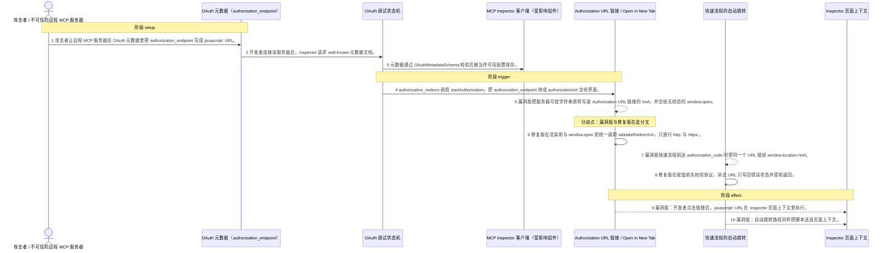
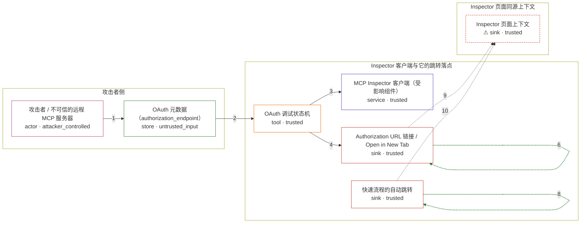

# inspector / CVE-2025-58444

状态：草稿，未完成环境和复现。这个目录由模板生成，不构成漏洞确认。

图解的唯一来源是 `diagram.toml`：编辑后运行 `python3 -m runner diagram inspector/CVE-2025-58444` 重新生成下方的图解区块。图解必须覆盖漏洞涉及的每个主体，并标出漏洞版/修复版的分歧步骤。

<!-- diagram:begin (generated from diagram.toml by `python3 -m runner diagram`; edit diagram.toml, not this block) -->
## 漏洞图解 — inspector / CVE-2025-58444 漏洞图解

MCP Inspector 在 OAuth 调试流程里把远程 MCP 服务器返回的 authorization_endpoint 直接当成可信导航目标。元数据校验只要求它是字符串，不限制协议，所以不可信服务器可以给出 javascript: URL。漏洞版把它原样写进「Authorization URL」链接的 href、交给 window.open，并在快速流程里赋给 window.location.href；开发者一点，脚本就在 Inspector 页面同源上下文里执行，而该页面与本地代理同源，可继续调用代理接口。修复版新增 validateRedirectUrl，在三处跳转前统一要求协议为 http: 或 https:，非 http(s) 的授权 URL 被拒绝并以错误状态呈现，不再发生导航。

### 涉及主体

| 主体 | 类型 | 信任级别 | 在漏洞里的作用 | 来源 |
| --- | --- | --- | --- | --- |
| 攻击者 / 不可信的远程 MCP 服务器 (`attacker`) | `actor` | `attacker_controlled` | 攻击者。它控制开发者主动连接的那台远程 MCP 服务器，能决定服务器返回的 OAuth 元数据内容。它自己进不了开发者本机的 Inspector 页面，只能把恶意 authorization_endpoint 放进元数据里，等开发者的浏览器替它打开。 | fixtures/attack.json |
| OAuth 元数据（authorization_endpoint） (`oauth_metadata`) | `store` | `untrusted_input` | 服务器提供的授权服务器元数据。authorization_endpoint 是攻击载荷的载体，schema 只要求它是字符串、不校验协议，javascript: URL 因此原样通过。 | fixtures/attack.json |
| MCP Inspector 客户端（受影响组件） (`inspector_client`) | `service` | `trusted` | 出问题的上游组件。它从远程服务器发现元数据、拼出 authorizationUrl，并在界面上提供跳转入口。它本该只把 http(s) 地址当作导航目标。 | client/src/components/OAuthFlowProgress.tsx |
| OAuth 调试状态机 (`oauth_state_machine`) | `tool` | `trusted` | 按步骤执行 OAuth 调试流程的组件。metadata_discovery 从远程服务器取元数据，authorization_redirect 调用 SDK 的 startAuthorization 把 authorization_endpoint 变成 authorizationUrl；两处都不检查协议。 | client/src/lib/oauth-state-machine.ts |
| Authorization URL 链接 / Open in New Tab (`authorization_link`) | `sink` | `trusted` | 漏洞版真正出事的两处界面落点：一个 href 直接绑到服务器可控字符串的链接，和一个无校验调用 window.open 的按钮。修复版把链接换成按钮，并在 window.open 之前先校验协议。 | client/src/components/OAuthFlowProgress.tsx |
| 快速流程的自动跳转 (`auto_redirect`) | `sink` | `trusted` | 另一处跳转落点。快速 OAuth 流程到达 authorization_code 步骤时把 authorizationUrl 赋给 window.location.href，漏洞版赋值前没有任何协议校验。 | client/src/components/AuthDebugger.tsx |
| ⚠ Inspector 页面上下文 (`inspector_page`) | `sink` | `trusted` | 脚本最终执行的地方。它与本地 Inspector 代理同源，因此脚本可以继续调用代理接口。这里承载的是无害的页面内标记，用来证明脚本确实在页面上下文里跑起来了。 | fixtures/attack.json |

**信任边界**

- **攻击者侧** (`attacker_side`)：成员 `attacker`、`oauth_metadata`。攻击者完全控制这里：它想写什么元数据就写什么。它自己不能在这个边界之外执行代码——能执行就不用绕这一圈了。
- **Inspector 客户端与它的跳转落点** (`inspector_client_side`)：成员 `inspector_client`、`oauth_state_machine`、`authorization_link`、`auto_redirect`。这道边界本来把「服务器给的数据」和「浏览器导航目标」隔开。漏洞让服务器可控的字符串穿过它，变成页面会打开的地址。
- **Inspector 页面同源上下文** (`page_context`)：成员 `inspector_page`。攻击者想要但本来够不着的地方。它与本地代理同源，脚本一旦在这里执行就继承了页面的权限。

标 ⚠ 的主体是本仓库合成的替身或无害效果载体，不代表真实外部目标。

### 触发过程

### 主体与信任边界

箭头上的数字是上面的步骤编号；方框只标主体和信任级别，具体动作见「触发过程」。

**分歧点**：第 5 步（`vulnerable_only`）漏洞版把服务器可控字符串原样写进 Authorization URL 链接的 href，并交给无校验的 window.open。。
**分歧点**：第 6 步（`patched_only`）修复版在渲染前与 window.open 前统一调用 validateRedirectUrl，只放行 http: 与 https:。。
<!-- diagram:end -->

## 公告与机制

TODO：官方公告、漏洞根因、Agent 信任边界、受影响范围和修复来源。

## 前提

TODO：认证要求、用户交互、已有批准、工具权限、攻击者能控制的内容。

## 版本与启动

TODO：补全 metadata、Dockerfile/镜像 digest 和 Compose，再写出精确启动命令。

Compose 中 `vulnerable` 与 `patched` profiles 分开使用；未指定 profile 不启动服务。镜像变量未配置时 Compose 会明确报错。此模板不暴露宿主端口，也不挂载主机数据。

## 机制复现

TODO：实现 `reproduce.py`，固定输入并执行真实漏洞路径，注明运行位置、参数和超时。

完成实现后使用 `python3 -m runner reproduce inspector/CVE-2025-58444 --build --rounds 3`。
两脚本统一接受 `--context <context.json> --output <目录>`，详细字段见仓库 `docs/environment-contract.md`。
PoC 输出 `facts.json` 和效果文件；验证器只读证据，输出含 `target_ready` 及对应效果断言的 `verdict.json`。
镜像必须包含 Python 3 和 `/lab/` 下的脚本、fixtures；`runtime.mode` 选择 `oneshot` 或有 healthcheck 的 `service`。

## 端到端复现

TODO：实现 `end_to_end.py`；若不需要模型，明确写出不适用原因。真实模型的结果与机制复现分开统计。

## 验证与修复对照

TODO：实现 `verify.py`。记录漏洞版无害效果、修复版阻断和正常任务成功的证据，不能把服务启动失败当成阻断。

## 清理

默认运行器按每个测试的唯一 Compose project 清理容器、网络和 volume。
`--keep-on-failure` 保留失败项目，项目标识和 Compose 配置在结果目录中；仅清理该项目，不能使用全局 prune。

## 失败诊断

TODO：为本漏洞写出预期效果缺失、修复版仍有越界效果、正常任务失败及前提不满足时的具体排查路径。
启动失败、健康检查失败和超时都不能当作修复阻断。报告中应能定位到阶段、预期、实际和受控证据。

## 构建与输入

TODO：填写两版源码 archive、完整 commit，记录 `build.inputs` 中每个下载的 SHA-256；依赖安装必须支持禁网构建。
固定攻击和正常输入放入 `fixtures/` 并登记到 `fixtures/manifest.toml`。固定 seed、环境变量，说明无害效果与真实影响的关系。

## 隔离例外

默认无例外。确需例外时同时填写 `runtime.exceptions`、理由及最小范围，晋升由两位维护者审阅。

## 来源与许可

TODO：列出引用代码、fixtures 和镜像的来源及许可。
