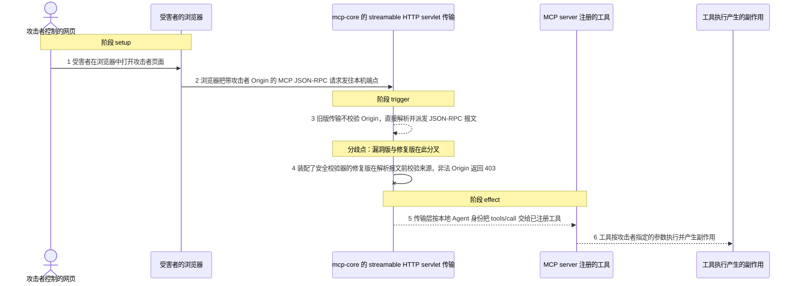
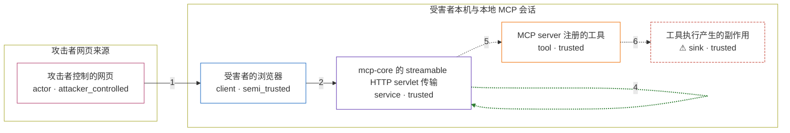

# java-sdk / CVE-2026-35568

状态：草稿。图解、固定输入与机制 PoC 已实现；镜像配方与独立验证器仍待后续阶段完成，本目录不构成漏洞确认。

图解的唯一来源是 `diagram.toml`：编辑后运行 `python3 -m runner diagram java-sdk/CVE-2026-35568` 重新生成下方的图解区块。图解必须覆盖漏洞涉及的每个主体，并标出漏洞版/修复版的分歧步骤。

<!-- diagram:begin (generated from diagram.toml by `python3 -m runner diagram`; edit diagram.toml, not this block) -->
## 漏洞图解 — java-sdk / CVE-2026-35568 漏洞图解

mcp-core 的 HTTP server 传输在 1.0.0 之前完全不校验 Origin 请求头，任何跨源网页都能把 JSON-RPC 报文送到本机 MCP server。DNS 重绑定让攻击者页面对其自有域名发出的请求实际落到 127.0.0.1，浏览器因此把跨源请求送进本地信任域，缺少来源校验的传输层直接把它当作本地 Agent 的调用来解析执行。修复版在解析报文之前校验 Origin 与 Host，非法来源返回 403 并终止请求。

### 涉及主体

| 主体 | 类型 | 信任级别 | 在漏洞里的作用 | 来源 |
| --- | --- | --- | --- | --- |
| 攻击者控制的网页 (`attacker_page`) | `actor` | `attacker_controlled` | 攻击者唯一能控制的东西：页面的来源（Origin 取值）与发往 MCP 端点的 JSON-RPC 报文内容。它够不到受害者本机，只能借浏览器发起请求。 | fixtures/attack.json |
| 受害者的浏览器 (`browser`) | `client` | `semi_trusted` | 把攻击者页面对重绑定域名的请求当作同源请求发往 127.0.0.1。浏览器本身执行同源策略，但 DNS 重绑定让攻击者域名与本地服务共用同一个来源，策略不再是障碍。 | — |
| mcp-core 的 streamable HTTP servlet 传输 (`mcp_transport`) | `service` | `trusted` | 受影响的上游组件：1.0.0 之前的实现直接反序列化并派发 JSON-RPC 报文，既不校验 Origin 也不校验 Host，没有任何来源检查能挡住第 2 步到达的请求。修复版在这里插入 securityValidator.validateHeaders(headers)，非法来源以 403 结束。 | mcp-core/src/main/java/io/modelcontextprotocol/server/transport/HttpServletStreamableServerTransportProvider.java |
| MCP server 注册的工具 (`mcp_tool`) | `tool` | `trusted` | 被漏洞链调用的工具。传输层放行后，它按 JSON-RPC 参数执行，调用者身份被当作已连接的本地 Agent，因此攻击者拿到的是一次以受害者名义执行的工具调用。 | — |
| ⚠ 工具执行产生的副作用 (`tool_side_effect`) | `sink` | `trusted` | 受控效果落点：工具执行后留下的可观测结果。机制复现里它是一段固定无害标记，不是真实外部目标；真实场景中它等同于攻击者以受害者身份触发的任意工具行为，且响应带 Access-Control-Allow-Origin: * 时攻击者页面可以直接读取结果。 | — |

**信任边界**

- **攻击者网页来源** (`attacker_origin`)：成员 `attacker_page`。攻击者只控制自己的页面来源和请求内容，无法直接访问受害者本机；它必须借浏览器把请求送进本地信任域。
- **受害者本机与本地 MCP 会话** (`victim_runtime`)：成员 `browser`、`mcp_transport`、`mcp_tool`、`tool_side_effect`。这道边界本来靠传输层校验 Origin（以及 Host）来区分本地 MCP Agent 与跨源网页。校验缺失时，浏览器带来的跨源请求被当作可信的本地调用进入 MCP 处理流程。

标 ⚠ 的主体是本仓库合成的替身或无害效果载体，不代表真实外部目标。

### 触发过程

### 主体与信任边界

箭头上的数字是上面的步骤编号；方框只标主体和信任级别，具体动作见「触发过程」。

**分歧点**：第 3 步（`vulnerable_only`）旧版传输不校验 Origin，直接解析并派发 JSON-RPC 报文。
**分歧点**：第 4 步（`patched_only`）装配了安全校验器的修复版在解析报文前校验来源，非法 Origin 返回 403。
<!-- diagram:end -->

## 公告与机制

- canonical identifier：`CVE-2026-35568`；alias：`GHSA-8jxr-pr72-r468`；CWE-346（Origin Validation Error）；GHSA 严重级别 `HIGH`。
- 受影响包：Maven `io.modelcontextprotocol.sdk:mcp-core`。OSV 事件为 `introduced: "0"` → `fixed: "1.0.0"`，枚举版本到 `1.0.0-RC3` 为止（不含 `1.0.0`）。
- 根因：`mcp-core` 的 HTTP server 传输在 1.0.0 之前完全不校验 `Origin` 请求头，直接反序列化并派发 JSON-RPC 报文。这违反 MCP 规范 Transports 安全警告第 1 条（server 必须校验 `Origin` 以阻止 DNS rebinding）。
- Agent 信任边界：受害者的浏览器（攻击者可控的网页来源）→ 本机 `localhost` 上运行的 MCP HTTP server。DNS 重绑定把攻击者域名解析到 `127.0.0.1`，浏览器于是把跨源请求同源地送进本地信任域，缺少来源校验的传输层把它当作本地 MCP Agent 的调用执行，攻击者因此可以发起任意 tool call。
- 修复来源（上游真实历史，非推测）：`96c9bbe7452a5ca216b9f1fffa075adfa675000e`（`Add Origin header validation`，正文 `Fixes #695`）新增 `ServerTransportSecurityValidator` / `DefaultServerTransportSecurityValidator` / `ServerTransportSecurityException`，并在每个 HTTP 入口解析报文之前插入 `securityValidator.validateHeaders(headers)`，非法 `Origin` 返回 403；`f6c3fde7f4e2a72fd082e9c3b5a8c588f931b96b` 在同一校验器里补上 `Host` 检查（不匹配返回 421）；`b57b1269d07b676fe5a703eb351a8755962fdec4` 抽出 `HttpServletRequestUtils`。
- 两处必须如实说明的上游事实：
  1. `v1.0.0` 里各传输 Builder 的默认值是 `private ServerTransportSecurityValidator securityValidator = ServerTransportSecurityValidator.NOOP;`，即校验是 **opt-in**。默认配置的 1.0.0 仍然放行跨源请求，修复版变体必须按上游 API 显式装配 `DefaultServerTransportSecurityValidator`，否则会出现“修复版仍有越界效果”的假阴性。
  2. GHSA 写的是 “Prior to 1.0.0 no Origin header validation was occurring”，但 `96c9bbe` 在 `v0.18.0` 就已包含，`v1.0.0-RC3` 与 `v1.0.0` 代码相同。因此 OSV 枚举的 `0.18.x` / `1.0.0-RC3` 在代码层面已经含该校验；确实无校验的基线取 `v0.17.2` / `a47920ca`。

## 前提

- 受害者本机运行一个使用 `HttpServletStreamableServerTransportProvider` 的 MCP HTTP server，监听 loopback，且端点不做认证。
- 受害者用浏览器打开攻击者控制的页面，该页面域名被 DNS 重绑定解析到 `127.0.0.1`。
- 攻击者能控制的东西只有两样：请求的 `Origin` 取值，以及 JSON-RPC 报文内容（`initialize` / `tools/call` 及其参数）。它不控制受害者主机、不控制 server 配置，也无法直接读写本机文件。
- 不需要模型 API、不需要外网、不需要真实域名。机制复现用“带攻击者 Origin 的直连请求”等价表达 DNS rebinding 之后的跨源请求。

## 版本与启动

- vulnerable：`v0.17.2`，commit `8fa411033b4cf10429663bab00eb9e5b1fa71ea8`；最小 diff 基线为修复提交的父提交 `a47920ca072565a80377cbc5e8fef7048d940920`。两者都 grep 不到任何 `Origin` / `Host` 校验，只有 `Access-Control-Allow-Origin: *`。
- patched：公告指定的修复版本 `v1.0.0`，commit `3c87155b9ac11ab3f72dfc01d2238510537de69a`（首个包含修复的发布版本是 `v0.18.0`，commit `d82a928231505eac26d1b9100ee1e6946a5898d4`）。
- 编译要求：Java 17、Maven 多模块；`mcp-core` 运行期依赖 `slf4j-api`、`jackson-annotations`、`reactor-core`、`jakarta.servlet-api`（`jakarta.*` 命名空间）。JSON 实现由 `mcp-json-jackson2` 通过 `ServiceLoader` 提供（`v0.17.2` 走 `McpJsonMapper.getDefault()`，`v1.0.0` 走 `McpJsonDefaults.getMapper()`）。
- 镜像需在 `/lab/upstream` 放置按 commit 构建的上游产物，并提供 `/lab/upstream/classpath.txt`（每行一个 jar 或 classes 目录；也可直接放 jar 让脚本递归发现）。驱动源码 `fixtures/harness/McpOriginHarness.java` 在运行时用 `javac` 编译，因此镜像需带 JDK；若镜像预编译到 `/lab/harness/classes` 或 `/lab/harness/harness.jar`，则只需 JRE。嵌入式 servlet 容器用上游测试同款的 `org.apache.tomcat.embed:tomcat-embed-core`（上游 `tomcat.version` 为 `11.0.2`）。
- Dockerfile 与 Compose 仍是模板：`metadata.toml` 的 `vulnerable`/`patched`/`build.inputs` 由 build 阶段补全，镜像 digest 固定后再写精确启动命令。

## 机制复现

- `reproduce.py` 不重写漏洞函数。它在镜像内启动 `fixtures/harness/McpOriginHarness.java`，由该驱动把上游 `HttpServletStreamableServerTransportProvider` 挂到嵌入式 Tomcat 上并注册一个无害 marker 工具；驱动自身没有任何来源校验逻辑。
- 攻击输入是 `fixtures/attack.json`（`Origin: http://attacker.example`），正常输入是 `fixtures/benign.json`（`Origin: http://localhost:<port>`），两者是同一套 `initialize` → `notifications/initialized` → `tools/call` 交换。`reproduce.py` 按 `context["scenario"]` 选择文件，逐字节发出固定请求并记录状态码、响应头与响应体。
- patched 变体上，驱动通过反射调用上游 Builder 的 `securityValidator(...)` 显式装配 `DefaultServerTransportSecurityValidator`（允许的 Origin/Host 为本次 loopback 端口），并在 stdout 打印 `security_validator=configured|unavailable`。若 patched 变体报告 `unavailable`，`reproduce.py` 判定 `target_ready = false`、`execution_status = failed`，不把“没装校验器”当成阻断。
- 可观察效果：工具 handler 把 `tool=<name>` / `marker=<value>` 追加到效果文件。漏洞版攻击会留下攻击者 marker；修复版攻击在 `initialize` 就收到 403，工具不被调用。
- 输出：`observation.json`（含 `target_ready`、`execution_status`、`security_validator`、每个请求的状态码）、`http_exchange.json`、`tool_effect.txt`、`harness_log.txt`。
- 超时：驱动启动等待 90s；每次请求读取 3s（响应在 SSE 上保持连接，读到数据即止）；效果文件轮询 15s。
- 退出码：`execution_status=completed` 返回 0，`failed` 返回 1。修复版攻击被 403 阻断仍属 `completed`，由 `verify.py` 判定。

## 端到端复现

不适用：该漏洞完全发生在 HTTP 传输层，输入确定、无随机性、不需要模型。`metadata.toml` 的 `runtime.requires_model = false`，`verification.end_to_end.status = not_applicable`，`end_to_end.py` 保持未实现。

## 验证与修复对照

预期断言（由 validate 阶段写出的 `verify.py` 实现，只读 `facts.json`、`observation.json` 与效果文件，不重跑攻击）：

- 漏洞版攻击：`initialize` 为 200 并下发 session，`tools/call` 后 `tool_effect.txt` 含攻击者 marker → `vulnerable_effect_observed`。
- 修复版攻击：`initialize` 为 403，`tool_invoked = false`、效果文件为空，且 `security_validator = configured` → `patched_effect_blocked`。
- 正常任务（两版）：`Origin: http://localhost:<port>` 时工具被调用并留下 benign marker → `benign_task_passed`。
- 启动失败、超时、缺证据都不算阻断；`target_ready` 为假时不得判为通过。

当前 `verify.py` 仍是脚手架桩，属于 validate 阶段的工作。

## 清理

默认运行器按每个测试的唯一 Compose project 清理容器、网络和 volume。
`--keep-on-failure` 保留失败项目，项目标识和 Compose 配置在结果目录中；仅清理该项目，不能使用全局 prune。

## 失败诊断

- 效果文件缺失：先看 `harness_log.txt` 是否出现 `LAB_READY`，再看 `http_exchange.json` 里 `initialize` 的状态码。403 在修复版是预期，在漏洞版说明镜像里的源码 revision 不对。
- 修复版仍有越界效果：检查 `observation.json` 的 `security_validator`；为 `unavailable` 表示 patched 镜像没有把校验器装上去（默认 NOOP），是镜像问题而不是漏洞未修复。
- 正常任务失败：确认 benign 的 `Origin` 与允许列表一致（`http://localhost:<port>`），并确认 `Host` 是 `127.0.0.1:<port>`。
- 驱动无法启动：`javac`/`java` 不在 PATH、`/lab/upstream/classpath.txt` 缺 jar、或所选端口被占用。`reproduce.py` 会把最后一次启动输出写进 `harness_log.txt`。

## 构建与输入

- 两版源码 archive 与完整 commit 由 build 阶段写入 `metadata.toml`；`build.inputs` 必须包含源码归档与离线构建所需的全部依赖（Maven 插件闭包、`slf4j-api`、`jackson`、`reactor-core`、`jakarta.servlet-api`、`tomcat-embed-core`），并逐项记录 URL 与 SHA-256。
- 固定攻击/正常输入在 `fixtures/attack.json`、`fixtures/benign.json`，驱动源码在 `fixtures/harness/McpOriginHarness.java`；三者都登记在 `fixtures/manifest.toml`。
- 无随机性；不使用真实凭据；marker 是固定的合成字符串，只用于证明工具 handler 是否被执行。

## 隔离例外

默认无例外。机制复现只在容器内使用 loopback 端口，不暴露宿主端口，不访问外网。

## 来源与许可

- 上游仓库：<https://github.com/modelcontextprotocol/java-sdk>（Apache-2.0）。
- 修复提交：<https://github.com/modelcontextprotocol/java-sdk/commit/96c9bbe7452a5ca216b9f1fffa075adfa675000e>、<https://github.com/modelcontextprotocol/java-sdk/commit/f6c3fde7f4e2a72fd082e9c3b5a8c588f931b96b>、<https://github.com/modelcontextprotocol/java-sdk/commit/b57b1269d07b676fe5a703eb351a8755962fdec4>。
- 公告：<https://github.com/modelcontextprotocol/java-sdk/security/advisories/GHSA-8jxr-pr72-r468>、<https://nvd.nist.gov/vuln/detail/CVE-2026-35568>。
- 本目录的 fixtures 与驱动均为合成内容，随本仓库以相同许可分发。
