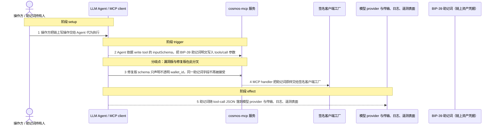
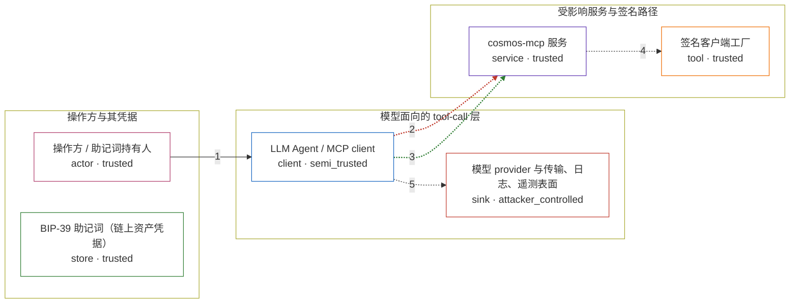

# junoclaw / CVE-2026-43992

状态：草稿，未完成环境和复现。这个目录由模板生成，不构成漏洞确认。

图解的唯一来源是 `diagram.toml`：编辑后运行 `python3 -m runner diagram junoclaw/CVE-2026-43992` 重新生成下方的图解区块。图解必须覆盖漏洞涉及的每个主体，并标出漏洞版/修复版的分歧步骤。

<!-- diagram:begin (generated from diagram.toml by `python3 -m runner diagram`; edit diagram.toml, not this block) -->
## 漏洞图解 — junoclaw / CVE-2026-43992 漏洞图解

JunoClaw 的 cosmos-mcp 把 BIP-39 助记词当成 write tool 的显式入参：7 个写工具的 inputSchema 都声明 mnemonic: string，签名客户端工厂也直接以明文助记词构造钱包。LLM Agent 因此必须把 seed 明文写进 tools/call 的 JSON 参数，助记词跨出操作方进程，落到模型 provider 与传输、日志、遥测表面。修复版把该字段换成不透明 wallet_id，助记词改为带外注册，明文不再进入 MCP 协议边界。

### 涉及主体

| 主体 | 类型 | 信任级别 | 在漏洞里的作用 | 来源 |
| --- | --- | --- | --- | --- |
| 操作方 / 助记词持有人 (`wallet_owner`) | `actor` | `trusted` | 持有 BIP-39 助记词与链上资产，只有它能授权写操作；它把链上写请求交给 Agent 代为执行，但拿不到 Agent 与模型之间的请求内容。 | — |
| BIP-39 助记词（链上资产凭据） (`mnemonic`) | `store` | `trusted` | 控制链上资产的 seed，是漏洞要保护的凭据。漏洞版要求它逐次以明文出现在 write tool 的调用参数里，修复版只允许它经带外注册后以不透明句柄引用。 | — |
| LLM Agent / MCP client (`agent_client`) | `client` | `semi_trusted` | 按 write tool 的 inputSchema 组装 tools/call 参数的一方；schema 要求 mnemonic 时，它只能把助记词明文放进发给模型的请求 JSON。 | fixtures/attack-send-tokens.json |
| cosmos-mcp 服务 (`mcp_server`) | `service` | `trusted` | JunoClaw 的 MCP 服务器。漏洞版在 7 个 write tool 的 schema 里声明 mnemonic: z.string()，并在 handler 里把该字段原样转发；修复版改为 wallet_id 并把签名路径整体移出明文助记词。 | mcp/src/index.ts @ a16860855a38efe68c8f12604d1dbf8d01b22319 / 339701ee439e7d8f60a565d2bcf280126f96524a |
| 签名客户端工厂 (`signing_factory`) | `tool` | `trusted` | getSigningClient(chain, mnemonic) 直接以明文助记词调用 DirectSecp256k1HdWallet.fromMnemonic；修复提交把整个函数删除，改为 WalletStore.signFor(walletId, chain)。 | mcp/src/utils/cosmos-client.ts |
| 模型 provider 与传输、日志、遥测表面 (`exposure_surface`) | `sink` | `attacker_controlled` | tool-call JSON 在模型 provider 与 MCP 进程之间经过的一切表面；读到该 JSON 的一方即取得明文助记词，也就取得了链上资产的控制权。 | — |

**信任边界**

- **操作方与其凭据** (`owner_side`)：成员 `wallet_owner`、`mnemonic`。助记词本应只留在操作方控制的进程与存储内；漏洞让它以明文跨出这道边界，进入模型面向的层。
- **模型面向的 tool-call 层** (`model_side`)：成员 `agent_client`、`exposure_surface`。这一层本应只承载不透明句柄与公开参数；漏洞版把 BIP-39 助记词明文放进来，使传输、日志与遥测都能读到它。
- **受影响服务与签名路径** (`service_side`)：成员 `mcp_server`、`signing_factory`。服务本应在不接触明文助记词的前提下完成签名；漏洞版让工具 schema 与函数签名都要求明文 seed 才能调用。

### 触发过程

### 主体与信任边界

箭头上的数字是上面的步骤编号；方框只标主体和信任级别，具体动作见「触发过程」。

**分歧点**：第 2 步（`vulnerable_only`）Agent 依据 write tool 的 inputSchema，把 BIP-39 助记词明文写入 tools/call 参数。
**分歧点**：第 3 步（`patched_only`）修复版 schema 只声明不透明 wallet_id，同一助记词字段不再被接受。
<!-- diagram:end -->

## 公告与机制

TODO：官方公告、漏洞根因、Agent 信任边界、受影响范围和修复来源。

## 前提

TODO：认证要求、用户交互、已有批准、工具权限、攻击者能控制的内容。

## 版本与启动

TODO：补全 metadata、Dockerfile/镜像 digest 和 Compose，再写出精确启动命令。

Compose 中 `vulnerable` 与 `patched` profiles 分开使用；未指定 profile 不启动服务。镜像变量未配置时 Compose 会明确报错。此模板不暴露宿主端口，也不挂载主机数据。

## 机制复现

TODO：实现 `reproduce.py`，固定输入并执行真实漏洞路径，注明运行位置、参数和超时。

完成实现后使用 `python3 -m runner reproduce junoclaw/CVE-2026-43992 --build --rounds 3`。
两脚本统一接受 `--context <context.json> --output <目录>`，详细字段见仓库 `docs/environment-contract.md`。
PoC 输出 `facts.json` 和效果文件；验证器只读证据，输出含 `target_ready` 及对应效果断言的 `verdict.json`。
镜像必须包含 Python 3 和 `/lab/` 下的脚本、fixtures；`runtime.mode` 选择 `oneshot` 或有 healthcheck 的 `service`。

## 端到端复现

TODO：实现 `end_to_end.py`；若不需要模型，明确写出不适用原因。真实模型的结果与机制复现分开统计。

## 验证与修复对照

TODO：实现 `verify.py`。记录漏洞版无害效果、修复版阻断和正常任务成功的证据，不能把服务启动失败当成阻断。

## 清理

默认运行器按每个测试的唯一 Compose project 清理容器、网络和 volume。
`--keep-on-failure` 保留失败项目，项目标识和 Compose 配置在结果目录中；仅清理该项目，不能使用全局 prune。

## 失败诊断

TODO：为本漏洞写出预期效果缺失、修复版仍有越界效果、正常任务失败及前提不满足时的具体排查路径。
启动失败、健康检查失败和超时都不能当作修复阻断。报告中应能定位到阶段、预期、实际和受控证据。

## 构建与输入

TODO：填写两版源码 archive、完整 commit，记录 `build.inputs` 中每个下载的 SHA-256；依赖安装必须支持禁网构建。
固定攻击和正常输入放入 `fixtures/` 并登记到 `fixtures/manifest.toml`。固定 seed、环境变量，说明无害效果与真实影响的关系。

## 隔离例外

默认无例外。确需例外时同时填写 `runtime.exceptions`、理由及最小范围，晋升由两位维护者审阅。

## 来源与许可

TODO：列出引用代码、fixtures 和镜像的来源及许可。
