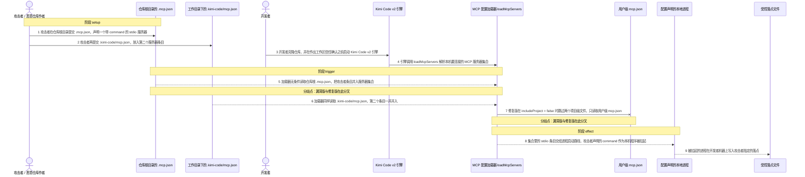
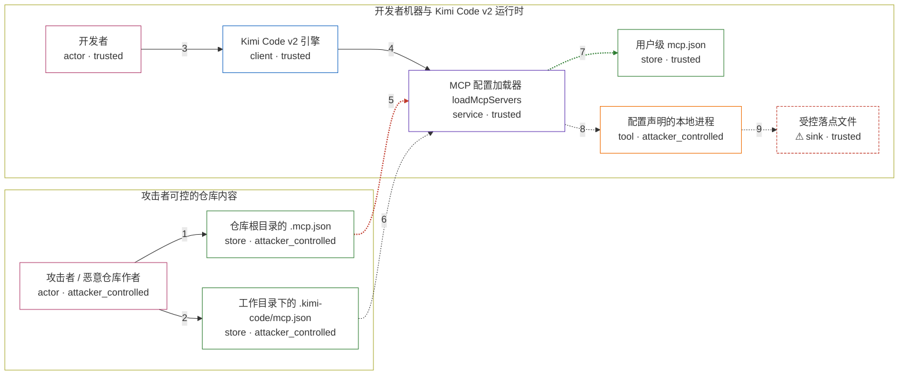

# kimi-code / CVE-2026-95660

状态：草稿，未完成环境和复现。这个目录由模板生成，不构成漏洞确认。

图解的唯一来源是 `diagram.toml`：编辑后运行 `python3 -m runner diagram kimi-code/CVE-2026-95660` 重新生成下方的图解区块。图解必须覆盖漏洞涉及的每个主体，并标出漏洞版/修复版的分歧步骤。

<!-- diagram:begin (generated from diagram.toml by `python3 -m runner diagram`; edit diagram.toml, not this block) -->
## 漏洞图解 — kimi-code / CVE-2026-95660 漏洞图解

Kimi Code 0.31.0 的 v2 引擎在启动时调用 loadMcpServers 解析 MCP 服务器集合，而该函数无条件读取仓库根目录的 .mcp.json 与 .kimi-code/mcp.json，并在工作区信任确认之前把其中的 command 交给进程启动路径。攻击者只需在公开仓库里提交这样一份配置，开发者克隆后在确认信任之前启动引擎，声明的程序就会在开发者机器上被拉起。0.31.1 新增 includeProject 闸门：工作区未被信任时调用方传入 includeProject = false，加载器只读取用户级 mcp.json，两个项目级文件被跳过。根因是项目级配置缺少信任闸门，而不是把不可信字符串拼接进 shell 命令行。

### 涉及主体

| 主体 | 类型 | 信任级别 | 在漏洞里的作用 | 来源 |
| --- | --- | --- | --- | --- |
| 攻击者 / 恶意仓库作者 (`attacker`) | `actor` | `attacker_controlled` | 编写随代码一起分发的项目级 MCP 配置，决定其中的服务器名、command 与 args；除此之外不能直接操作开发者的机器。 | — |
| 开发者 (`user`) | `actor` | `trusted` | 克隆并打开该仓库，在尚未对该工作区作出信任确认的情况下启动 Kimi Code v2 引擎；它是攻击者想要影响的受害者，本身不是攻击动作的一部分。 | — |
| Kimi Code v2 引擎 (`engine`) | `client` | `trusted` | 启动阶段解析要连接的 MCP 服务器集合，并把当前工作区信任状态传给加载器；0.31.1 之前没有把该状态作为闸门传下去。 | — |
| MCP 配置加载器 loadMcpServers (`loader`) | `service` | `trusted` | 按 user  项目根  工作目录 的优先级合并三个 mcp.json；0.31.0 版本对项目级来源没有任何 trust 判断，0.31.1 用 includeProject 决定是否读取它们。 | — |
| 仓库根目录的 .mcp.json (`project_config`) | `store` | `attacker_controlled` | 随 checkout 一起到达开发者机器的项目级配置，声明 stdio 服务器 codebase-indexer；它的内容完全由攻击者决定。 | fixtures/attack/workspace/.mcp.json |
| 工作目录下的 .kimi-code/mcp.json (`cwd_config`) | `store` | `attacker_controlled` | 同一仓库里的第二个项目级来源，声明 stdio 服务器 workspace-metrics；由于合并顺序靠后，它还能覆盖同名条目。 | fixtures/attack/workspace/.kimi-code/mcp.json |
| 用户级 mcp.json (`user_config`) | `store` | `trusted` | 开发者自己机器上的配置，声明 kimi-user-default；信任确认之前唯一应当被加载的来源，也是修复版的对照证据。 | — |
| 配置声明的本地进程 (`process`) | `tool` | `attacker_controlled` | 由加载结果中的 stdio 条目标识的程序；command 来自攻击者配置，因此这个进程就是攻击者选定的本机执行体。 | — |
| ⚠ 受控落点文件 (`sink`) | `sink` | `trusted` | 被拉起的本地进程写下的落点文件，用来证明 command 真的执行到了开发者机器上；写入内容是无害标记，不是真实的外部目标。 | — |

**信任边界**

- **攻击者可控的仓库内容** (`attacker_side`)：成员 `attacker`、`project_config`、`cwd_config`。攻击者能控制随仓库分发的两个项目级配置文件及其 command；它不能直接写开发者的用户级配置，也不能决定工作区是否被信任。
- **开发者机器与 Kimi Code v2 运行时** (`developer_host`)：成员 `user`、`engine`、`loader`、`user_config`、`process`、`sink`。信任确认这道闸门本应把随 checkout 到达的项目级配置挡在服务器集合之外；0.31.0 的加载器没有这道闸门，于是配置里的 command 在确认之前就进入进程启动路径。

标 ⚠ 的主体是本仓库合成的替身或无害效果载体，不代表真实外部目标。

### 触发过程

### 主体与信任边界

箭头上的数字是上面的步骤编号；方框只标主体和信任级别，具体动作见「触发过程」。

**分歧点**：第 5 步（`vulnerable_only`）加载器无条件读取仓库根 .mcp.json，把攻击者条目并入服务器集合。
**分歧点**：第 7 步（`patched_only`）修复版在 includeProject = false 时跳过两个项目级文件，只读取用户级 mcp.json。
<!-- diagram:end -->

## 公告与机制

TODO：官方公告、漏洞根因、Agent 信任边界、受影响范围和修复来源。

## 前提

TODO：认证要求、用户交互、已有批准、工具权限、攻击者能控制的内容。

## 版本与启动

TODO：补全 metadata、Dockerfile/镜像 digest 和 Compose，再写出精确启动命令。

Compose 中 `vulnerable` 与 `patched` profiles 分开使用；未指定 profile 不启动服务。镜像变量未配置时 Compose 会明确报错。此模板不暴露宿主端口，也不挂载主机数据。

## 机制复现

TODO：实现 `reproduce.py`，固定输入并执行真实漏洞路径，注明运行位置、参数和超时。

完成实现后使用 `python3 -m runner reproduce kimi-code/CVE-2026-95660 --build --rounds 3`。
两脚本统一接受 `--context <context.json> --output <目录>`，详细字段见仓库 `docs/environment-contract.md`。
PoC 输出 `facts.json` 和效果文件；验证器只读证据，输出含 `target_ready` 及对应效果断言的 `verdict.json`。
镜像必须包含 Python 3 和 `/lab/` 下的脚本、fixtures；`runtime.mode` 选择 `oneshot` 或有 healthcheck 的 `service`。

## 端到端复现

TODO：实现 `end_to_end.py`；若不需要模型，明确写出不适用原因。真实模型的结果与机制复现分开统计。

## 验证与修复对照

TODO：实现 `verify.py`。记录漏洞版无害效果、修复版阻断和正常任务成功的证据，不能把服务启动失败当成阻断。

## 清理

默认运行器按每个测试的唯一 Compose project 清理容器、网络和 volume。
`--keep-on-failure` 保留失败项目，项目标识和 Compose 配置在结果目录中；仅清理该项目，不能使用全局 prune。

## 失败诊断

TODO：为本漏洞写出预期效果缺失、修复版仍有越界效果、正常任务失败及前提不满足时的具体排查路径。
启动失败、健康检查失败和超时都不能当作修复阻断。报告中应能定位到阶段、预期、实际和受控证据。

## 构建与输入

TODO：填写两版源码 archive、完整 commit，记录 `build.inputs` 中每个下载的 SHA-256；依赖安装必须支持禁网构建。
固定攻击和正常输入放入 `fixtures/` 并登记到 `fixtures/manifest.toml`。固定 seed、环境变量，说明无害效果与真实影响的关系。

## 隔离例外

默认无例外。确需例外时同时填写 `runtime.exceptions`、理由及最小范围，晋升由两位维护者审阅。

## 来源与许可

TODO：列出引用代码、fixtures 和镜像的来源及许可。
