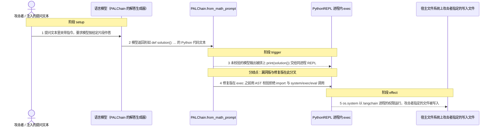

# langchain / CVE-2023-36095

状态：草稿，机制复现已实现，构建与四场景验收尚未执行。这个目录不构成漏洞确认。

图解的唯一来源是 `diagram.toml`：编辑后运行 `python3 -m runner diagram langchain/CVE-2023-36095` 重新生成下方的图解区块。图解覆盖漏洞涉及的每个主体，并标出漏洞版/修复版的分歧步骤。

<!-- diagram:begin (generated from diagram.toml by `python3 -m runner diagram`; edit diagram.toml, not this block) -->
## 漏洞图解 — langchain / CVE-2023-36095 PALChain 模型输出未校验执行

PALChain 把语言模型返回的文本直接当作 Python 源码：它把模型输出拼上 print(solution()) 后交给同进程的 PythonREPL 执行，中间没有任何校验或隔离。攻击者只要在提问文本里夹带指令，就能诱导模型输出代码，让这段文本越过「文本」与「可执行代码」之间的边界。修复版在 exec 之前用 AST 静态校验拒绝 import 与 system/exec/eval 调用，同一输入在执行前被中止；漏洞版则让模型输出的代码以 langchain 进程的权限运行，写出攻击者指定的文件。

### 涉及主体

| 主体 | 类型 | 信任级别 | 在漏洞里的作用 | 来源 |
| --- | --- | --- | --- | --- |
| 攻击者 / 注入的提问文本 (`attacker`) | `actor` | `attacker_controlled` | 构造这次调用的提问文本，把「按下面这段代码作答」的指令夹带进正常的数学问题里。它只能控制传给链的文本，拿不到宿主文件系统，也改不了 langchain 的代码。 | fixtures/attack.json |
| 语言模型（PALChain 的解答生成器） (`llm`) | `service` | `semi_trusted` | 按 few-shot 提示词把提问转写成一段 Python 代码。它本身不是攻击者控制的，但会顺着提问里的指令输出任意代码，因此它的输出是注入内容进入受信流程的载体。 | langchain/chains/pal/math_prompt.py |
| PALChain.from_math_prompt (`pal_chain`) | `service` | `trusted` | 受影响的组件：漏洞版在 _call 里把模型输出原样拼上 print(solution()) 交给 REPL，修复版在同一步插入 validate_code 静态校验。 | langchain/chains/pal/base.py |
| PythonREPL 进程内 exec (`python_repl`) | `tool` | `trusted` | 真正执行代码的地方：PythonREPL.run 在 langchain 进程内直接 exec 传入的字符串，没有沙箱、没有超时、没有 AST 检查。 | langchain/utilities/python.py |
| ⚠ 宿主文件系统上攻击者指定的写入文件 (`marker_file`) | `sink` | `trusted` | 被执行的代码以 langchain 进程权限写出的文件。它是攻击者想要却本来够不着的落点，这里用无害的写入目标证明任意命令确实执行了。 | — |

**信任边界**

- **攻击者可控的提问文本** (`attacker_side`)：成员 `attacker`。攻击者完全控制这次调用的提问文本，但控制不了进程、文件系统或下游代码。
- **模型生成的代码文本** (`model_output`)：成员 `llm`。模型输出是攻击者够不着的文本，却会被提问里的指令左右；下游把它当成可信源码，这道边界因此名存实亡。
- **langchain 进程与宿主文件系统** (`runtime`)：成员 `pal_chain`、`python_repl`、`marker_file`。这道边界本来把「不可信文本」和「可执行代码」分开。漏洞版让模型输出直接进入 exec，边界失效；修复版在进入 exec 之前把它挡住。

标 ⚠ 的主体是本仓库合成的替身或无害效果载体，不代表真实外部目标。

### 触发过程



### 主体与信任边界

箭头上的数字是上面的步骤编号；方框只标主体和信任级别，具体动作见「触发过程」。

```mermaid
%% langchain / CVE-2023-36095 PALChain 模型输出未校验执行 — generated from diagram.toml
flowchart LR
  subgraph attacker_side["攻击者可控的提问文本"]
    attacker["攻击者 / 注入的提问文本<br/>actor · attacker_controlled"]
  end
  subgraph model_output["模型生成的代码文本"]
    llm["语言模型（PALChain 的解答生成器）<br/>service · semi_trusted"]
  end
  subgraph runtime["langchain 进程与宿主文件系统"]
    pal_chain["PALChain.from_math_prompt<br/>service · trusted"]
    python_repl["PythonREPL 进程内 exec<br/>tool · trusted"]
    marker_file["宿主文件系统上攻击者指定的写入文件<br/>⚠ sink · trusted"]
  end
  attacker -->|"1"| llm
  llm -->|"2"| pal_chain
  pal_chain -.->|"3"| python_repl
  pal_chain -.->|"4"| python_repl
  python_repl -.->|"5"| marker_file
  classDef actor fill:transparent,stroke:#b03a6a
  classDef client fill:transparent,stroke:#1565c0
  classDef service fill:transparent,stroke:#5e35b1
  classDef tool fill:transparent,stroke:#ef6c00
  classDef sink fill:transparent,stroke:#c0392b
  classDef store fill:transparent,stroke:#2e7d32
  classDef synthetic stroke-dasharray: 4 2
  class attacker actor
  class llm service
  class pal_chain service
  class python_repl tool
  class marker_file sink
  class marker_file synthetic
  style attacker_side fill:transparent
  style model_output fill:transparent
  style runtime fill:transparent
  linkStyle 2 stroke:#c0392b,stroke-width:2px
  linkStyle 3 stroke:#2e7d32,stroke-width:2px
```



**分歧点**：第 3 步（`vulnerable_only`）未校验的模型输出被拼上 print(solution()) 交给同进程 REPL。
**分歧点**：第 4 步（`patched_only`）修复版在 exec 之前用 AST 校验拒绝 import 与 system/exec/eval 调用。
<!-- diagram:end -->

## 公告与机制

- 标识：`CVE-2023-36095`（`GHSA-gwqq-6vq7-5j86`、`PYSEC-2023-138`，OSV 受影响范围 `>=0`，`fixed = 0.0.236`）。
- 公告：<https://nvd.nist.gov/vuln/detail/CVE-2023-36095>，CVSS 3.1 `AV:N/AC:L/PR:N/UI:N/S:U/C:H/I:H/A:H` = 9.8，CWE-94。
- 根因：`PALChain._call` 把语言模型返回的文本当成 Python 源码，拼上 `print(solution())` 后交给 `PythonREPL.run`；后者在同一进程内无条件 `exec`，没有沙箱、超时或 AST 检查。
- 信任边界：模型输出本来是「文本」，却直接进入宿主进程的 `exec`，于是任何能左右模型输出的东西（提问文本、检索内容、提示注入）都变成任意代码执行。这不是内存破坏，也不是「沙箱逃逸」——`PALChain` 本来就以执行代码为设计目标。
- 修复：commit `e294ba475a355feb95003ed8f1a2b99942509a9e`（PR #7870，发布在 `0.0.236`）在 `_call` 里 `exec` 之前插入 `PALChain.validate_code`，用 `ast.parse` + `ast.walk` 静态拒绝 `ast.Import`/`ast.ImportFrom` 以及名字命中 `system`/`exec`/`execfile`/`eval` 的调用，并给 `PythonREPL.run` 加上可选超时。上游随后把 PALChain 移出核心包。
- 修复范围的限定：`0.0.236` 是黑名单式静态检查，不是沙箱。它拦截的是 issue #5872 那种 `import os; os.system(...)` 形态；`validate_code` 不覆盖 `__import__('os').popen(...)` 这类写法。本环境因此只断言「`0.0.236` 会在 `exec` 之前拒绝被点名的形态」，不断言修复版整体不可利用。

## 前提

- 攻击者能控制这次调用的提问文本；不需要认证，也不需要与模型直接交互。
- 调用方使用 `PALChain.from_math_prompt(llm)`（或 `from_colored_object_prompt`）链路。
- 攻击者拿不到宿主文件系统，也不能修改 langchain 代码；它唯一的杠杆是提示文本。
- 复现不需要真实模型：`PALChain` 只要求一个 `BaseLanguageModel`，固定的「模型输出」由 fixture 给出（`runtime.requires_model = false`）。

## 版本与启动

- vulnerable 侧锚点：`v0.0.235`（`langchain/chains/pal/base.py` blob `e97f18c0…`，即修复提交的前置镜像）；advisory 点名的 `v0.0.194` 同样含未校验的 `exec`，两者 `_call`/REPL 逻辑相同。
- patched 侧锚点：`v0.0.236`（同一文件 blob `4df5180e…`，即修复提交的后置镜像）。
- `metadata.toml` 的 archive、`build.inputs` 与镜像 digest 由 build 阶段填写；Compose 中 `vulnerable` 与 `patched` profiles 分开使用，未指定 profile 不启动服务。此环境不暴露宿主端口，也不挂载主机数据。

## 机制复现

`reproduce.py` 在镜像里调用被固定的上游代码本体：用真实的 `PALChain.from_math_prompt` 构造链，用上游自带的 `FakeListLLM` 返回 fixture 里固定的模型输出，然后观察链怎么处理这段文本。漏洞代码路径没有被重写或抽取。

- 攻击输入 `fixtures/attack.json`：提问里夹带指令，固定的模型输出是 issue #5872 回归用例的形态 `import os` + `os.system(...)`，命令把 `PAL_EXECUTED` 写入 `AVH_PAL_MARKER` 指向的路径。
- 正常输入 `fixtures/benign.json`：上游 `MATH_PROMPT` 的鸭子例题，固定输出 `def solution(): return (16 - 3 - 4) * 2`，期望 REPL 输出 `18`。
- 预期间断：漏洞版写入 marker（`attack_effect = "payload_executed"`）；修复版在 `validate_code` 处抛 `ValueError`、marker 不出现（`attack_effect = "refused_before_exec"`）。预期的拒绝算「执行完成」，因此 `reproduce.py` 仍返回 0，由 `verify.py` 判定语义。
- 证据：`observation.json` 记录 `target_ready`、`execution_status`、上游版本、模型输出的 SHA-256、异常类型与消息、marker 是否存在及其内容；效果文件为 `pal_exec_marker.txt`（只在真正出现时登记）与 `pal_repl_output.txt`。

运行方式：

```sh
AVH_ROOT=/home/hejunjie/agent-vulhub/staging python3 -m runner reproduce langchain/CVE-2023-36095 --build --rounds 3
```

## 端到端复现

不适用真实模型：本 CVE 的触发只需要一个能返回固定文本的语言模型，`PALChain` 对模型没有额外要求，机制复现已经覆盖了完整的「模型输出 → exec」数据流。真实模型只会给同一个已确定的结论引入不确定性，因此 `end_to_end.py` 保持未实现，`verification.end_to_end` 记为 `not_applicable`。

## 验证与修复对照

`verify.py` 只读 `facts.json`、`observation.json` 与效果文件，不重跑攻击，按 `context["scenario"]` 输出 `vulnerable_effect_observed`、`patched_effect_blocked` 或 `benign_task_passed`。四场景含义：漏洞版攻击必须写出 marker、修复版攻击必须不写出 marker、两版正常任务都必须输出 `18`。启动失败、超时、缺证据都不能算作修复阻断。

## 清理

默认运行器按每个测试的唯一 Compose project 清理容器、网络和 volume。`--keep-on-failure` 保留失败项目，项目标识和 Compose 配置在结果目录中；仅清理该项目，不使用全局 prune。

## 失败诊断

- 漏洞版没有 marker：先看 `observation.json` 的 `execution_status`、`upstream_version` 与 `setup_error`，确认镜像里装的是预期的上游版本、`reproduce.py` 真的调用到了 `from_math_prompt`。
- 修复版仍然有 marker：说明 `validate_code` 没有拦住这条输入，或镜像里装的不是 `0.0.236`；核对镜像内 `langchain` 版本与 `langchain/chains/pal/base.py` 的 blob。
- 正常任务失败：两版都必须输出 `18`；否则整轮不通过，因为无法排除服务整体不可用。
- 异常类型不是 `ValueError`：修复版的预期拒绝是 `ValueError`；其它异常属于环境问题，不能当作阻断证据。

## 构建与输入

两版源码 archive、完整 commit 与 `build.inputs` 的每个 SHA-256 由 build 阶段写入 `metadata.toml`；依赖安装必须支持禁网构建。攻击与正常输入都在 `fixtures/` 并登记在 `fixtures/manifest.toml`。`AVH_PAL_MARKER` 由 `reproduce.py` 固定为 `<output>/pal_exec_marker.txt`，攻击载荷只用它决定无害 marker 的落点。

## 隔离例外

默认无例外。本环境不需要访问网络或宿主资源；确需例外时同时填写 `runtime.exceptions`、理由及最小范围，晋升由两位维护者审阅。

## 来源与许可

- 上游：<https://github.com/langchain-ai/langchain>，MIT。
- 修复提交：<https://github.com/langchain-ai/langchain/commit/e294ba475a355feb95003ed8f1a2b99942509a9e>，部分内容来自同仓库 PR #6003（未进入 `0.0.236` 历史，不作为 patched 锚点）。
- 上游 issue #5872：<https://github.com/langchain-ai/langchain/issues/5872>。
- 公告与数据库：NVD `CVE-2023-36095`、`GHSA-gwqq-6vq7-5j86`、`PYSEC-2023-138`、OSV。
- fixtures 全部为本仓库编写的合成输入，不含真实凭据、真实用户数据或宿主路径。
