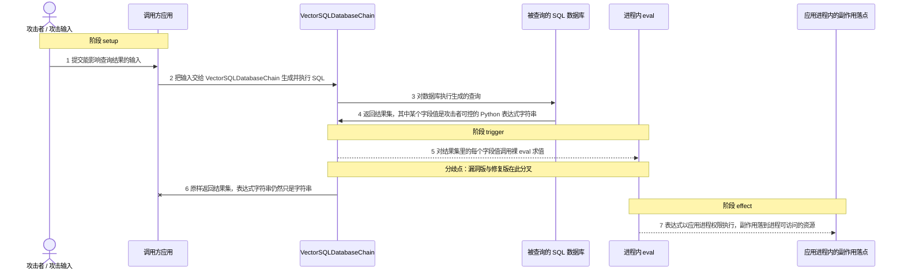
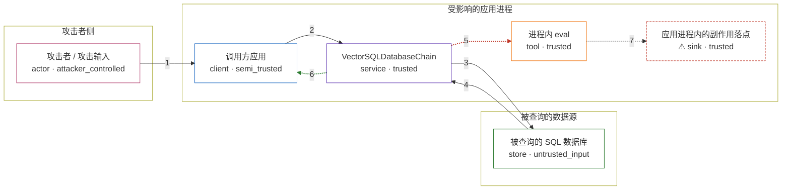

# langchain / CVE-2024-21513

状态：草稿，未完成环境和复现。这个目录由模板生成，不构成漏洞确认。

图解的唯一来源是 `diagram.toml`：编辑后运行 `python3 -m runner diagram langchain/CVE-2024-21513` 重新生成下方的图解区块。图解必须覆盖漏洞涉及的每个主体，并标出漏洞版/修复版的分歧步骤。

<!-- diagram:begin (generated from diagram.toml by `python3 -m runner diagram`; edit diagram.toml, not this block) -->
## 漏洞图解 — langchain / CVE-2024-21513 漏洞图解

VectorSQLDatabaseChain 取回 SQL 结果后，对结果集里的每个字段值调用裸 eval。数据库返回值本应只是数据，却在这里被当作 Python 代码执行，跨越了数据与代码之间的信任边界。攻击者只要让查询结果里出现一个表达式字符串，该表达式就会在应用进程内求值，从而以该进程的权限访问其资源；修复版改为原样返回结果集，不再求值。

### 涉及主体

| 主体 | 类型 | 信任级别 | 在漏洞里的作用 | 来源 |
| --- | --- | --- | --- | --- |
| 攻击者 / 攻击输入 (`attacker`) | `actor` | `attacker_controlled` | 构造能影响查询内容的输入，使结果集里出现一个 Python 表达式字符串；它自己不掌握应用进程的执行能力。 | fixtures/attack.json |
| 调用方应用 (`app`) | `client` | `semi_trusted` | 把攻击者可控的输入交给 VectorSQLDatabaseChain，并把返回的结果集当作普通数据使用。 | — |
| VectorSQLDatabaseChain (`chain`) | `service` | `trusted` | 生成并执行 SQL，然后把结果集里的每个字段值交给进程内 eval 求值；这是漏洞所在的上游组件。 | libs/experimental/langchain_experimental/sql/vector_sql.py |
| 被查询的 SQL 数据库 (`database`) | `store` | `untrusted_input` | 返回包含表达式字符串的结果集；这些字段值本应只是数据，却被下游当作代码。 | — |
| 进程内 eval (`interpreter`) | `tool` | `trusted` | chain 调用的裸 eval，把结果值当 Python 表达式求值，既没有表达式白名单也没有 globals 限制。 | — |
| ⚠ 应用进程内的副作用落点 (`effect`) | `sink` | `trusted` | 被求值的表达式以应用进程权限执行后的落点，例如进程可访问的文件；此处用无害标记代表真实影响。 | — |

**信任边界**

- **攻击者侧** (`attacker_side`)：成员 `attacker`。攻击者只能控制输入文本和它的查询结果内容，不能直接控制应用进程。
- **被查询的数据源** (`data_plane`)：成员 `database`。库里的字段值来自外部内容；它进入应用进程时仍然是数据，而不是可执行代码。
- **受影响的应用进程** (`product`)：成员 `app`、`chain`、`interpreter`、`effect`。数据进入这里后本应保持为数据；漏洞让 chain 把结果值送进 eval，于是数据变成了代码。

标 ⚠ 的主体是本仓库合成的替身或无害效果载体，不代表真实外部目标。

### 触发过程

### 主体与信任边界

箭头上的数字是上面的步骤编号；方框只标主体和信任级别，具体动作见「触发过程」。

**分歧点**：第 5 步（`vulnerable_only`）对结果集里的每个字段值调用裸 eval 求值。
**分歧点**：第 6 步（`patched_only`）原样返回结果集，表达式字符串仍然只是字符串。
<!-- diagram:end -->

## 公告与机制

TODO：官方公告、漏洞根因、Agent 信任边界、受影响范围和修复来源。

## 前提

TODO：认证要求、用户交互、已有批准、工具权限、攻击者能控制的内容。

## 版本与启动

TODO：补全 metadata、Dockerfile/镜像 digest 和 Compose，再写出精确启动命令。

Compose 中 `vulnerable` 与 `patched` profiles 分开使用；未指定 profile 不启动服务。镜像变量未配置时 Compose 会明确报错。此模板不暴露宿主端口，也不挂载主机数据。

## 机制复现

TODO：实现 `reproduce.py`，固定输入并执行真实漏洞路径，注明运行位置、参数和超时。

完成实现后使用 `python3 -m runner reproduce langchain/CVE-2024-21513 --build --rounds 3`。
两脚本统一接受 `--context <context.json> --output <目录>`，详细字段见仓库 `docs/environment-contract.md`。
PoC 输出 `facts.json` 和效果文件；验证器只读证据，输出含 `target_ready` 及对应效果断言的 `verdict.json`。
镜像必须包含 Python 3 和 `/lab/` 下的脚本、fixtures；`runtime.mode` 选择 `oneshot` 或有 healthcheck 的 `service`。

## 端到端复现

TODO：实现 `end_to_end.py`；若不需要模型，明确写出不适用原因。真实模型的结果与机制复现分开统计。

## 验证与修复对照

TODO：实现 `verify.py`。记录漏洞版无害效果、修复版阻断和正常任务成功的证据，不能把服务启动失败当成阻断。

## 清理

默认运行器按每个测试的唯一 Compose project 清理容器、网络和 volume。
`--keep-on-failure` 保留失败项目，项目标识和 Compose 配置在结果目录中；仅清理该项目，不能使用全局 prune。

## 失败诊断

TODO：为本漏洞写出预期效果缺失、修复版仍有越界效果、正常任务失败及前提不满足时的具体排查路径。
启动失败、健康检查失败和超时都不能当作修复阻断。报告中应能定位到阶段、预期、实际和受控证据。

## 构建与输入

TODO：填写两版源码 archive、完整 commit，记录 `build.inputs` 中每个下载的 SHA-256；依赖安装必须支持禁网构建。
固定攻击和正常输入放入 `fixtures/` 并登记到 `fixtures/manifest.toml`。固定 seed、环境变量，说明无害效果与真实影响的关系。

## 隔离例外

默认无例外。确需例外时同时填写 `runtime.exceptions`、理由及最小范围，晋升由两位维护者审阅。

## 来源与许可

TODO：列出引用代码、fixtures 和镜像的来源及许可。
