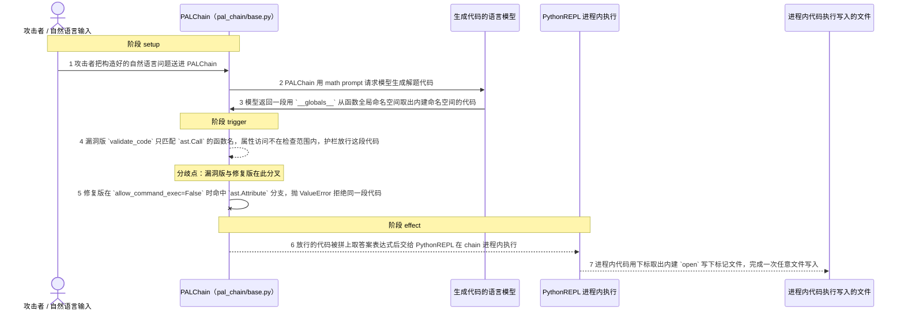
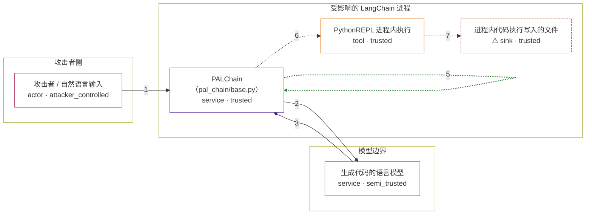

# langchain / CVE-2024-27444

状态：草稿，未完成环境和复现。这个目录由模板生成，不构成漏洞确认。

图解的唯一来源是 `diagram.toml`：编辑后运行 `python3 -m runner diagram langchain/CVE-2024-27444` 重新生成下方的图解区块。图解必须覆盖漏洞涉及的每个主体，并标出漏洞版/修复版的分歧步骤。

<!-- diagram:begin (generated from diagram.toml by `python3 -m runner diagram`; edit diagram.toml, not this block) -->
## 漏洞图解 — langchain / CVE-2024-27444 漏洞图解

PALChain 把语言模型生成的 Python 代码交给 PythonREPL 在承载 chain 的容器进程里执行（执行超时靠 fork 子进程实现，没有沙箱，也没有权限降级），`validate_code` 是生成代码与执行之间唯一的产品内护栏。漏洞版的 `validate_code` 只按名字拦截 `system`/`exec`/`eval`/`__import__` 等函数的调用（`ast.Call`），完全不管属性访问（`ast.Attribute`），因此 `__globals__`、`__subclasses__`、`__base__` 这类 dunder 属性可以穿过护栏，再从内建命名空间里用下标取出函数执行任意 Python。修复版在 `allow_command_exec=False` 时同时拦截这 8 个属性名，同一段代码在执行前被拒绝。

### 涉及主体

| 主体 | 类型 | 信任级别 | 在漏洞里的作用 | 来源 |
| --- | --- | --- | --- | --- |
| 攻击者 / 自然语言输入 (`attacker`) | `actor` | `attacker_controlled` | 构造送进 PALChain 的自然语言问题（直接输入，或经提示注入转述的第三方文本）。它只能间接影响模型写出的代码，无法直接指定那段代码。 | fixtures/attack_question.txt |
| 生成代码的语言模型 (`language_model`) | `service` | `semi_trusted` | 把受攻击者影响的提示转写成解题用的 Python 代码。它可能照做写出 dunder 属性链，但代码由它自己生成，是攻击载荷的载体而不是攻击者能直接操控的一侧。 | — |
| PALChain（pal_chain/base.py） (`pal_chain`) | `service` | `trusted` | 受影响的上游组件：`_call` 拿到模型代码后调用 `validate_code`，再交给 PythonREPL。这道检查是生成代码与进程内执行之间唯一的护栏，漏洞版在这里漏掉了属性访问。 | libs/experimental/langchain_experimental/pal_chain/base.py |
| PythonREPL 进程内执行 (`python_repl`) | `tool` | `trusted` | 在承载 chain 的容器进程里 exec 模型代码并回传标准输出；为执行超时它会 fork 子进程，但没有沙箱，也没有权限降级。 | — |
| ⚠ 进程内代码执行写入的文件 (`effect_file`) | `sink` | `trusted` | 被放行的代码在进程文件系统里写下的标记文件，代表任意代码执行最终落到哪里；它是无害效果载体，不是真实的外部目标。 | — |

**信任边界**

- **攻击者侧** (`attacker_side`)：成员 `attacker`。攻击者只能提供自然语言文本；模型输出、提示模板与代码校验都不在它手里。
- **模型边界** (`model_boundary`)：成员 `language_model`。提示可以受攻击者影响，但产出的代码由模型生成，所以模型输出是半信任的：它既能把攻击载荷带进受信流程，也不受攻击者直接控制。
- **受影响的 LangChain 进程** (`product`)：成员 `pal_chain`、`python_repl`、`effect_file`。`validate_code` 是模型代码与进程内 `exec` 之间唯一的护栏。漏洞版只匹配调用名，属性访问不受检查，护栏因此失效，生成代码直接进入进程内执行。

标 ⚠ 的主体是本仓库合成的替身或无害效果载体，不代表真实外部目标。

### 触发过程

### 主体与信任边界

箭头上的数字是上面的步骤编号；方框只标主体和信任级别，具体动作见「触发过程」。

**分歧点**：第 4 步（`vulnerable_only`）漏洞版 `validate_code` 只匹配 `ast.Call` 的函数名，属性访问不在检查范围内，护栏放行这段代码。
**分歧点**：第 5 步（`patched_only`）修复版在 `allow_command_exec=False` 时命中 `ast.Attribute` 分支，抛 ValueError 拒绝同一段代码。
<!-- diagram:end -->

## 公告与机制

TODO：官方公告、漏洞根因、Agent 信任边界、受影响范围和修复来源。

## 前提

TODO：认证要求、用户交互、已有批准、工具权限、攻击者能控制的内容。

## 版本与启动

TODO：补全 metadata、Dockerfile/镜像 digest 和 Compose，再写出精确启动命令。

Compose 中 `vulnerable` 与 `patched` profiles 分开使用；未指定 profile 不启动服务。镜像变量未配置时 Compose 会明确报错。此模板不暴露宿主端口，也不挂载主机数据。

## 机制复现

`reproduce.py` 读取 `/lab/fixtures/` 的固定输入，导入镜像里固定的 `langchain_experimental.pal_chain.base`，用上游 `PALChain.from_math_prompt` 构造 chain，只把语言模型换成返回 fixture 代码的替身，因此走的是真实的 `_call → validate_code → PythonREPL.run` 路径：

- `attack`：模型输出用 `__globals__` 从函数全局命名空间取内建命名空间，再用下标取 `open` 写 `palchain-canary.txt`；漏洞版放行并执行，修复版在 `validate_code` 抛 `ValueError`，执行前被拒。
- `benign`：模型输出 `def solution(): return 6 * 7`，两版都通过校验并返回 `42`。

运行位置为容器内 `/lab`，入口是 `python3 /lab/reproduce.py --context /lab/results/context.json --output /lab/results`，`PALChain.timeout` 沿用上游默认 10 秒。观测写入 `observation.json`，效果文件与 `facts.json` 一起作为证据。

完成实现后使用 `python3 -m runner reproduce langchain/CVE-2024-27444 --build --rounds 3`。
两脚本统一接受 `--context <context.json> --output <目录>`，详细字段见仓库 `docs/environment-contract.md`。
PoC 输出 `facts.json` 和效果文件；验证器只读证据，输出含 `target_ready` 及对应效果断言的 `verdict.json`。
镜像必须包含 Python 3 和 `/lab/` 下的脚本、fixtures；`runtime.mode` 选择 `oneshot` 或有 healthcheck 的 `service`。

## 端到端复现

TODO：实现 `end_to_end.py`；若不需要模型，明确写出不适用原因。真实模型的结果与机制复现分开统计。

## 验证与修复对照

TODO：实现 `verify.py`。记录漏洞版无害效果、修复版阻断和正常任务成功的证据，不能把服务启动失败当成阻断。

## 清理

默认运行器按每个测试的唯一 Compose project 清理容器、网络和 volume。
`--keep-on-failure` 保留失败项目，项目标识和 Compose 配置在结果目录中；仅清理该项目，不能使用全局 prune。

## 失败诊断

TODO：为本漏洞写出预期效果缺失、修复版仍有越界效果、正常任务失败及前提不满足时的具体排查路径。
启动失败、健康检查失败和超时都不能当作修复阻断。报告中应能定位到阶段、预期、实际和受控证据。

## 构建与输入

TODO：填写两版源码 archive、完整 commit，记录 `build.inputs` 中每个下载的 SHA-256；依赖安装必须支持禁网构建。
固定攻击和正常输入放入 `fixtures/` 并登记到 `fixtures/manifest.toml`。固定 seed、环境变量，说明无害效果与真实影响的关系。

## 隔离例外

默认无例外。确需例外时同时填写 `runtime.exceptions`、理由及最小范围，晋升由两位维护者审阅。

## 来源与许可

TODO：列出引用代码、fixtures 和镜像的来源及许可。
