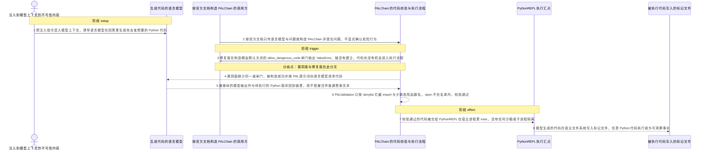
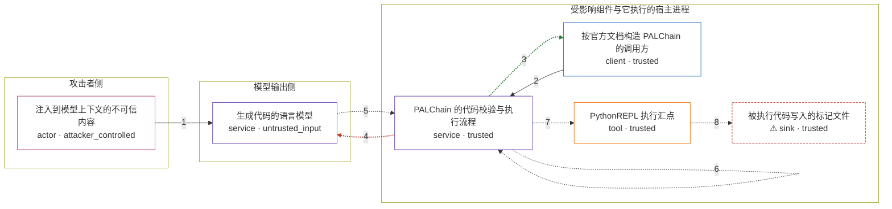

# langchain / CVE-2024-38459

状态：草稿。机制 PoC、攻击/正常输入与图解已就绪；镜像、验证器与端到端仍未完成，本目录不构成漏洞确认。

图解的唯一来源是 `diagram.toml`：编辑后运行 `python3 -m runner diagram langchain/CVE-2024-38459` 重新生成下方的图解区块。图解必须覆盖漏洞涉及的每个主体，并标出漏洞版/修复版的分歧步骤。

<!-- diagram:begin (generated from diagram.toml by `python3 -m runner diagram`; edit diagram.toml, not this block) -->
## 漏洞图解 — langchain_experimental PALChain 默认开放 Python REPL 执行

langchain_experimental 的 PALChain 把模型生成的 Python 代码直接交给宿主进程的 PythonREPL 执行，而 0.0.60 默认不要求调用方显式确认这一危险行为。代码虽然先经过 PALValidation，但它只是一份禁用了 import 和少数危险函数名的 denylist，open 这类调用不在名单内，校验因此形同虚设。被注入内容操纵出的模型输出于是穿过这条边界，在宿主文件系统上执行任意 Python 代码。修复版在构造期就用默认关闭的 allow_dangerous_code 闸门抛出 ValueError，同一条链路根本不会建立。

### 涉及主体

| 主体 | 类型 | 信任级别 | 在漏洞里的作用 | 来源 |
| --- | --- | --- | --- | --- |
| 注入到模型上下文的不可信内容 (`attacker`) | `actor` | `attacker_controlled` | 攻击者唯一能控制的东西：混进模型上下文的一段不可信文本。它不能直接调用宿主 API，只能诱导语言模型在回答里生成自己想要的代码，再由下游组件替它执行。 | fixtures/attack-model-output.py |
| 生成代码的语言模型 (`model`) | `service` | `untrusted_input` | 按 PAL 提示词把问题改写成 Python 代码。它的输出完全由上下文决定，攻击者通过注入内容影响它，因此这段文本是数据而不是程序；机制复现里用一个返回固定字符串的脚本化语言模型取其输出。 | fixtures/attack-model-output.py |
| 按官方文档构造 PALChain 的调用方 (`application`) | `client` | `trusted` | 按官方示例只传语言模型与问题就构造 PALChain 并提交问题，不传任何 opt-in 参数，因为 0.0.60 根本没有这个参数。它相信库的默认值已经把危险能力关掉。 | — |
| PALChain 的代码校验与执行流程 (`pal_chain`) | `service` | `trusted` | 受影响的上游组件。PALChain._call 先调用 PALValidation.validate_code，再交给 PythonREPL 执行；缺陷是缺少默认关闭的 opt-in 闸门，而 PALValidation 本身只是 denylist。 | langchain_experimental/pal_chain/base.py |
| PythonREPL 执行汇点 (`python_repl`) | `tool` | `trusted` | 在宿主进程里 exec 传入的字符串。它没有任何沙箱、allowlist 或子进程隔离，拿到什么就执行什么；两个版本里这段代码逐字节相同。 | — |
| ⚠ 被执行代码写入的标记文件 (`effect`) | `sink` | `trusted` | 模型生成的代码在宿主文件系统上留下的产物。它用来证明 REPL 真的执行了任意代码；这是受控的无害落点，不代表真实的外部目标。 | — |

**信任边界**

- **攻击者侧** (`attacker_side`)：成员 `attacker`。这里只有一段不可信文本。攻击者能决定模型上下文里被塞进什么，但不能直接写宿主文件、也不能调用宿主 API，只能借模型的输出把代码送进下游。
- **模型输出侧** (`model_side`)：成员 `model`。语言模型的输出只应被当作数据。它由上下文决定，可被注入内容操纵，因此跨进受信流程时必须被当成不可信输入对待。
- **受影响组件与它执行的宿主进程** (`runtime`)：成员 `application`、`pal_chain`、`python_repl`、`effect`。这道边界内是构造链的调用方、PALChain、PythonREPL 与宿主文件系统。opt-in 闸门本该是入口处的确认动作：只有调用方明确知道 REPL 能执行任意代码时才放行；0.0.60 默认放行，denylist 又拦不住 open 这类调用。

标 ⚠ 的主体是本仓库合成的替身或无害效果载体，不代表真实外部目标。

### 触发过程

### 主体与信任边界

箭头上的数字是上面的步骤编号；方框只标主体和信任级别，具体动作见「触发过程」。

**分歧点**：第 3 步（`patched_only`）修复版在构造期由默认关闭的 allow_dangerous_code 闸门抛出 ValueError，链没有建立，代码也没有机会进入执行流程。
**分歧点**：第 4 步（`vulnerable_only`）漏洞版缺少同一道闸门，链构造成功并按 PAL 提示词向语言模型请求代码。
<!-- diagram:end -->

## 公告与机制

- 公告：NVD `CVE-2024-38459`（`CWE-276` Incorrect Default Permissions，CVSS 3.1 `AV:L/AC:L/PR:N/UI:R/S:U/C:H/I:H/A:H`，base 7.8）。官方原文：`langchain_experimental before 0.0.61 for LangChain provides Python REPL access without an opt-in step`，并注明它是 `CVE-2024-27444` 修复不彻底的延续。
- 根因：`langchain-experimental` 把「用 Python REPL 执行（模型生成的）代码」的入口默认打开，调用方无需显式 opt-in。本环境固定复现 `PALChain` 这条入口：`PALChain._call` 先跑 `PALChain.validate_code`，再把 `代码 + print(solution())` 交给 `PythonREPL.run` 在宿主进程 `exec`。
- 信任边界：模型输出属于不可信数据，却未经沙箱直接进入宿主解释器。`PALValidation` 只是一份 denylist（禁用 `import` 与 `COMMAND_EXECUTION_FUNCTIONS` / `COMMAND_EXECUTION_ATTRIBUTES` 里的名字），`open` 不在其中，因此校验可以通过，任意代码执行仍然成立。
- 受影响范围：`langchain-experimental < 0.0.61`（最后一个受影响版本 `0.0.60`）。同一次修复也给 `create_pandas_dataframe_agent`、`create_spark_dataframe_agent`、`create_xorbits_agent` 加了同一道闸门；本环境只用 `PALChain`，不引入 pandas/spark/xorbits。
- 修复来源：上游提交 `ce0b0f22a175139df8f41cdcfb4d2af411112009`（PR #22860）、发布提交 `c374c98389c1c70e20f361df8c2f5078fdfaf48d`（tag `langchain-experimental==0.0.61`）。修复给 `PALChain` 新增默认 `False` 的 `allow_dangerous_code` 字段与 `@root_validator(pre=False, skip_on_failure=True)`，构造期即 `raise ValueError`。

## 前提

- CVSS 向量为 `AV:L/UI:R`：攻击面是「把该库当库用来构建 agent/chain 的开发者进程」，不是网络直接可达的服务。不满足这条前提的部署不在本环境范围内。
- 调用方像官方示例一样构造 `PALChain.from_math_prompt(llm)` 并提交问题，不传 opt-in 参数（0.0.60 也没有这个参数）。
- 攻击者能控制的是进入模型上下文的不可信内容；它不能直接读写宿主文件，只能通过诱导模型输出代码间接发挥作用。机制复现里用固定文本代表被操纵的模型输出，因此不需要任何模型凭据或网络。
- 无害效果落在受控的单个标记文件上，用来证明 REPL 真的执行了代码；它不代表对真实外部目标的攻击。

## 版本与启动

固定 revision（tag 与 PyPI sdist 双重核对，SHA-256 见 `build.inputs`，由 build 阶段写入 `metadata.toml`）：

| 变体 | 版本 | tag → commit | sdist SHA-256 |
| --- | --- | --- | --- |
| vulnerable | `langchain-experimental==0.0.60` | `48fba40fce7a5ae7b62fe9c86fb420a5a0338cf9` | `a16cbcd18cda6b86be8f41fed7963c13569295def0d8b4c6324b806d878d442c` |
| patched | `langchain-experimental==0.0.61` | `c374c98389c1c70e20f361df8c2f5078fdfaf48d` | `e9538efb994be5db3045cc582cddb9787c8299c86ffeee9d3779b7f58eef2226` |

`langchain-experimental` 的 `pyproject.toml` 没有声明 `langchain` 依赖，但 `PALChain` 直接 `import langchain.*`，镜像必须显式安装 `langchain` 0.2.x。镜像与 digest 由 build 阶段固定；在此之前没有可运行的启动命令。

Compose 中 `vulnerable` 与 `patched` profiles 分开使用；未指定 profile 不启动服务。镜像变量未配置时 Compose 会明确报错。此模板不暴露宿主端口，也不挂载主机数据。

## 机制复现

`reproduce.py` 已实现：在镜像内读取 `/lab/fixtures/` 的固定模型输出，交给真实的 `langchain_experimental.pal_chain.base.PALChain`，不重写或抽取任何漏洞函数。语言模型换成返回固定文本的脚本桩，攻击场景使用「不传 `allow_dangerous_code`」的文档写法，正常场景在存在该字段时传 `True`。`PALChain.timeout` 保持上游默认（10 秒，经 `PythonREPL` 的多进程包装执行）；这是上游真实行为，不修改。

完成实现后使用 `python3 -m runner reproduce langchain/CVE-2024-38459 --build --rounds 3`。
两脚本统一接受 `--context <context.json> --output <目录>`，详细字段见仓库 `docs/environment-contract.md`。
PoC 输出 `facts.json` 和效果文件；验证器只读证据，输出含 `target_ready` 及对应效果断言的 `verdict.json`。
镜像必须包含 Python 3 和 `/lab/` 下的脚本、fixtures；`runtime.mode` 选择 `oneshot` 或有 healthcheck 的 `service`。

## 端到端复现

真实模型端到端不适用于本 CVE 的机制判定：分歧点是「构造期 opt-in 闸门 + 本地 REPL 执行」，用固定模型输出即可确定性复现，引入真实模型只会增加不确定性而不会改变结论。`metadata.toml` 的 `verification.end_to_end.status` 记为 `not_applicable`，真实模型结果与机制复现分开统计。

## 验证与修复对照

`verify.py` 由 validate/solve 阶段产出，只读 `facts.json`、`observation.json` 与效果文件，不重跑攻击。判定口径：

- 漏洞版攻击：`observation.pal_chain.construct == "ok"` 且 `executed.marker` 存在、内容匹配固定标记 → `vulnerable_effect_observed`。
- 修复版攻击：`observation.pal_chain.construct == "blocked"`（`opt-in-gate.txt` 记录 `allow_dangerous_code` 的 `ValueError`）且 `executed.marker` 不存在 → `patched_effect_blocked`。启动失败、import 失败或超时都不能算作阻断。
- 正常任务（两版）：`benign-answer.txt` 等于 `108` → `benign_task_passed`。

## 清理

默认运行器按每个测试的唯一 Compose project 清理容器、网络和 volume。
`--keep-on-failure` 保留失败项目，项目标识和 Compose 配置在结果目录中；仅清理该项目，不能使用全局 prune。

## 失败诊断

- 漏洞版攻击没有 `executed.marker`：先看容器内 output 目录里 `observation.json` 的 `pal_chain.construct` 与 `error`；`construct == "error"` 说明固定代码/依赖有问题，不是漏洞未触发。
- 修复版攻击仍有 `executed.marker`：检查 `observation.pal_chain_has_opt_in_field` 是否为 `True`，以及攻击场景是否误传了 `allow_dangerous_code=True`。
- 正常任务失败：`benign-answer.txt` 不是 `108`，或 `execution_status` 为 `failed`；两版都失败时优先怀疑镜像依赖缺失（尤其 `langchain` 未显式安装）。
- 启动/import 失败、`PythonREPL` 的 `multiprocessing` 无法初始化、执行超时：都记为环境故障，不得当作修复阻断。
启动失败、健康检查失败和超时都不能当作修复阻断。报告中应能定位到阶段、预期、实际和受控证据。

## 构建与输入

上游源码归档与完整 commit 见「版本与启动」表格；build 阶段必须把它们与离线安装所需的全部 wheel（含显式补充的 `langchain` 及其依赖闭包）逐个登记 `url` + SHA-256 到 `metadata.toml` 的 `build.inputs`，并在 `--network none` 下可构建。

依赖矩阵（本机 pip 实测，供 build 参考）：0.0.60 可用 `langchain==0.2.4` + `langchain-core==0.2.6` + `langchain-community==0.2.4`；0.0.61 不能配 `langchain==0.2.4`（`langchain-community>=0.2.5` 要求 `langchain>=0.2.5`），需 `langchain-core>=0.2.7`、`langchain-community>=0.2.5` 与 `langchain` 0.2.x。

固定输入在 `fixtures/attack-model-output.py`（攻击）与 `fixtures/benign-model-output.py`（正常），SHA-256 登记在 `fixtures/manifest.toml`；`PYTHONHASHSEED=0`、`TZ=UTC`。攻击 payload 只写一个受控标记文件，与真实影响（宿主进程任意代码执行）分开陈述。

## 隔离例外

默认无例外。确需例外时同时填写 `runtime.exceptions`、理由及最小范围，晋升由两位维护者审阅。

## 来源与许可

- 被复现的上游代码：`langchain-ai/langchain` 的 `libs/experimental`（PyPI 包 `langchain-experimental`），MIT 许可；vulnerable `0.0.60`（`48fba40fce7a5ae7b62fe9c86fb420a5a0338cf9`）、patched `0.0.61`（`c374c98389c1c70e20f361df8c2f5078fdfaf48d`），sdist 取自 PyPI `files.pythonhosted.org`。
- 修复提交：`ce0b0f22a175139df8f41cdcfb4d2af411112009`（PR #22860）；分析与 URL 清单位于 `research/langchain/CVE-2024-38459/public.md`。
- 本环境的固定输入与图解为本仓库自撰，随环境以同样许可提供；不含任何真实凭据或用户数据。
