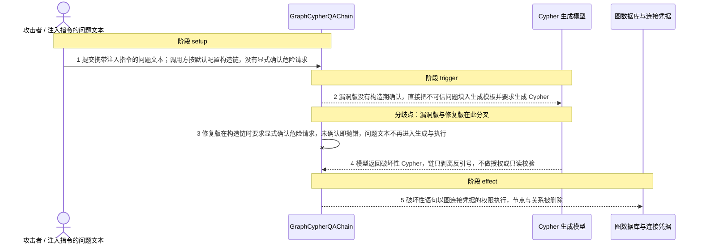
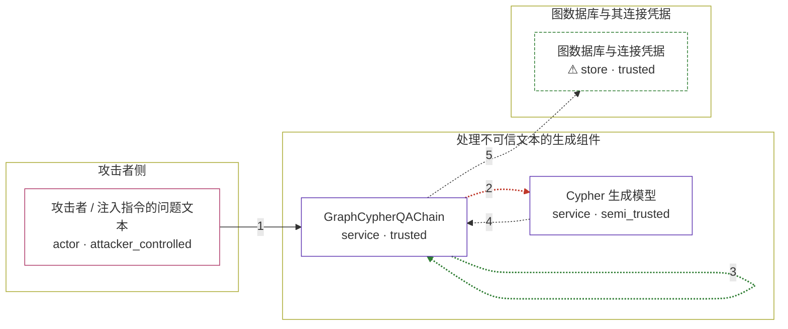

# langchain / CVE-2024-8309

状态：草稿，未完成环境和复现。这个目录由模板生成，不构成漏洞确认。

图解的唯一来源是 `diagram.toml`：编辑后运行 `python3 -m runner diagram langchain/CVE-2024-8309` 重新生成下方的图解区块。图解必须覆盖漏洞涉及的每个主体，并标出漏洞版/修复版的分歧步骤。

<!-- diagram:begin (generated from diagram.toml by `python3 -m runner diagram`; edit diagram.toml, not this block) -->
## 漏洞图解 — langchain / CVE-2024-8309 漏洞图解

GraphCypherQAChain 把模型生成的 Cypher 语句当作可信查询直接交给图数据库执行，生成与执行之间没有授权、只读校验或语句类型白名单，可选的 validate_cypher 只修正关系方向、拦不住写操作。攻击者只要在问题文本里注入指令，就能让模型输出 CREATE、MERGE、SET 或 DELETE、DETACH DELETE 之类的写操作，越过调用方与图数据库之间的访问边界。修复版在构造链时强制调用方显式确认危险请求，未确认就直接抛错，问题文本不再进入生成与执行流程。

### 涉及主体

| 主体 | 类型 | 信任级别 | 在漏洞里的作用 | 来源 |
| --- | --- | --- | --- | --- |
| 攻击者 / 注入指令的问题文本 (`attacker`) | `actor` | `attacker_controlled` | 构造并提交携带注入指令的问题文本。它只能控制这一次调用的输入，不能直接读写图数据库，所以必须借生成模型和链的手越过边界。 | fixtures/attack.json |
| Cypher 生成模型 (`cypher_llm`) | `service` | `semi_trusted` | 按上游生成模板把问题文本翻译成 Cypher。模板里“只输出 Cypher 语句”的说明只是对模型的软性提示，不是强制约束，问题文本里的指令可以改变它的输出。 | — |
| GraphCypherQAChain (`graph_cypher_chain`) | `service` | `trusted` | 受影响的上游组件。生成语句与执行之间只做反引号剥离和可选的关系方向修正，没有授权、只读校验或写操作拦截；修复版在它构造时新增了强制确认门。 | — |
| ⚠ 图数据库与连接凭据 (`graph_store`) | `store` | `trusted` | 漏洞效果落点。链持有图连接凭据，把生成的语句原样交给图数据库执行，攻击者本来够不着的数据在这里被读取或删除。复现时用记录语句的图存储承接，删除效果是受控标记而不是真实外部目标。 | — |

**信任边界**

- **攻击者侧** (`attacker_side`)：成员 `attacker`。攻击者只能控制提交的问题文本，不能直接访问图数据库或连接凭据。
- **处理不可信文本的生成组件** (`product`)：成员 `cypher_llm`、`graph_cypher_chain`。问题文本从这里进入受信流程：模型输出被当作可信语句，链不区分只读与写操作。修复版在这个边界上加了构造期确认。
- **图数据库与其连接凭据** (`data_side`)：成员 `graph_store`。攻击者想要但够不着的数据与权限；越过前面的边界后，写操作以链持有的连接凭据权限执行。

标 ⚠ 的主体是本仓库合成的替身或无害效果载体，不代表真实外部目标。

### 触发过程

### 主体与信任边界

箭头上的数字是上面的步骤编号；方框只标主体和信任级别，具体动作见「触发过程」。

**分歧点**：第 2 步（`vulnerable_only`）漏洞版没有构造期确认，直接把不可信问题填入生成模板并要求生成 Cypher。
**分歧点**：第 3 步（`patched_only`）修复版在构造链时要求显式确认危险请求，未确认即抛错，问题文本不再进入生成与执行。
<!-- diagram:end -->

## 公告与机制

TODO：官方公告、漏洞根因、Agent 信任边界、受影响范围和修复来源。

## 前提

TODO：认证要求、用户交互、已有批准、工具权限、攻击者能控制的内容。

## 版本与启动

TODO：补全 metadata、Dockerfile/镜像 digest 和 Compose，再写出精确启动命令。

Compose 中 `vulnerable` 与 `patched` profiles 分开使用；未指定 profile 不启动服务。镜像变量未配置时 Compose 会明确报错。此模板不暴露宿主端口，也不挂载主机数据。

## 机制复现

TODO：实现 `reproduce.py`，固定输入并执行真实漏洞路径，注明运行位置、参数和超时。

完成实现后使用 `python3 -m runner reproduce langchain/CVE-2024-8309 --build --rounds 3`。
两脚本统一接受 `--context <context.json> --output <目录>`，详细字段见仓库 `docs/environment-contract.md`。
PoC 输出 `facts.json` 和效果文件；验证器只读证据，输出含 `target_ready` 及对应效果断言的 `verdict.json`。
镜像必须包含 Python 3 和 `/lab/` 下的脚本、fixtures；`runtime.mode` 选择 `oneshot` 或有 healthcheck 的 `service`。

## 端到端复现

TODO：实现 `end_to_end.py`；若不需要模型，明确写出不适用原因。真实模型的结果与机制复现分开统计。

## 验证与修复对照

TODO：实现 `verify.py`。记录漏洞版无害效果、修复版阻断和正常任务成功的证据，不能把服务启动失败当成阻断。

## 清理

默认运行器按每个测试的唯一 Compose project 清理容器、网络和 volume。
`--keep-on-failure` 保留失败项目，项目标识和 Compose 配置在结果目录中；仅清理该项目，不能使用全局 prune。

## 失败诊断

TODO：为本漏洞写出预期效果缺失、修复版仍有越界效果、正常任务失败及前提不满足时的具体排查路径。
启动失败、健康检查失败和超时都不能当作修复阻断。报告中应能定位到阶段、预期、实际和受控证据。

## 构建与输入

TODO：填写两版源码 archive、完整 commit，记录 `build.inputs` 中每个下载的 SHA-256；依赖安装必须支持禁网构建。
固定攻击和正常输入放入 `fixtures/` 并登记到 `fixtures/manifest.toml`。固定 seed、环境变量，说明无害效果与真实影响的关系。

## 隔离例外

默认无例外。确需例外时同时填写 `runtime.exceptions`、理由及最小范围，晋升由两位维护者审阅。

## 来源与许可

TODO：列出引用代码、fixtures 和镜像的来源及许可。
