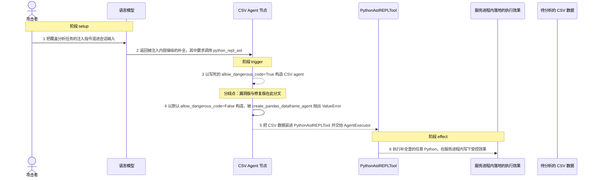
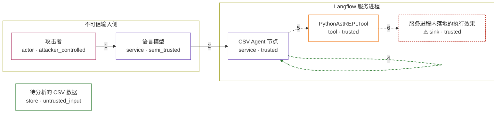

# langflow / CVE-2026-27966

状态：草稿，未完成环境和复现。这个目录由模板生成，不构成漏洞确认。

图解的唯一来源是 `diagram.toml`：编辑后运行 `python3 -m runner diagram langflow/CVE-2026-27966` 重新生成下方的图解区块。图解必须覆盖漏洞涉及的每个主体，并标出漏洞版/修复版的分歧步骤。

<!-- diagram:begin (generated from diagram.toml by `python3 -m runner diagram`; edit diagram.toml, not this block) -->
## 漏洞图解 — langflow / CVE-2026-27966 漏洞图解

Langflow 1.8.0 之前的 CSV Agent 节点把 allow_dangerous_code 写死为 True，于是 LangChain 的 create_csv_agent 无条件构造出 PythonAstREPLTool。被注入内容操纵的模型补全只要指定 python_repl_ast 工具，就越过了「必须显式选择才允许执行代码」这道边界。修复版把它改成默认 False 的显式开关，同一补全在构造 agent 时即被拒绝，服务进程内的任意 Python 执行随之消失。

### 涉及主体

| 主体 | 类型 | 信任级别 | 在漏洞里的作用 | 来源 |
| --- | --- | --- | --- | --- |
| 攻击者 (`attacker`) | `actor` | `attacker_controlled` | 构造夹带指令覆盖文本的会话输入，让节点在正常分析任务之外收到一条额外的执行指令。 | fixtures/attack/input.txt |
| 语言模型 (`llm`) | `service` | `semi_trusted` | 把攻击者影响过的提示变成模型补全；补全里带一个 python_repl_ast 工具调用，本身并不是可信指令。 | fixtures/attack/model_output.txt |
| CSV Agent 节点 (`csv_agent`) | `service` | `trusted` | langflow 的 CSVAgentComponent：读取 CSV 后调用 langchain-experimental 的 create_csv_agent 构造 agent。漏洞版把 allow_dangerous_code 写死为 True，修复版改为默认 False。 | src/lfx/src/lfx/components/langchain_utilities/csv_agent.py |
| PythonAstREPLTool (`python_repl`) | `tool` | `trusted` | langchain-experimental 提供的 Python REPL 工具，locals 里装着待分析的 DataFrame；只有 allow_dangerous_code=True 时才会被构造并交给 AgentExecutor。 | langchain_experimental/agents/agent_toolkits/pandas/base.py |
| 待分析的 CSV 数据 (`csv_data`) | `store` | `untrusted_input` | flow 中被分析的 CSV 文件，是节点的正常任务对象，随后成为 REPL 工具 locals 里的 df。 | fixtures/attack/data.csv |
| ⚠ 服务进程内落地的执行效果 (`effect`) | `sink` | `trusted` | 被执行的 Python 在 Langflow 服务进程内写下的受控效果，用来证明任意代码执行确实发生；它是无害标记，不是外部真实目标。 | fixtures/attack/marker.txt |

**信任边界**

- **不可信输入侧** (`untrusted_side`)：成员 `attacker`、`llm`。攻击者能控制的只有进入 flow 的文本；模型补全同样不受信任，它把这份影响带进受信流程。
- **Langflow 服务进程** (`server_runtime`)：成员 `csv_agent`、`python_repl`、`effect`。服务进程本应只在显式选择执行代码时才把 REPL 交给 agent；写死的 allow_dangerous_code=True 让这道门槛失效。
- 未列入上述边界：`csv_data`。

标 ⚠ 的主体是本仓库合成的替身或无害效果载体，不代表真实外部目标。

### 触发过程

### 主体与信任边界

箭头上的数字是上面的步骤编号；方框只标主体和信任级别，具体动作见「触发过程」。

**分歧点**：第 3 步（`vulnerable_only`）以写死的 allow_dangerous_code=True 构造 CSV agent。
**分歧点**：第 4 步（`patched_only`）以默认 allow_dangerous_code=False 构造，被 create_pandas_dataframe_agent 抛出 ValueError。
<!-- diagram:end -->

## 公告与机制

TODO：官方公告、漏洞根因、Agent 信任边界、受影响范围和修复来源。

## 前提

TODO：认证要求、用户交互、已有批准、工具权限、攻击者能控制的内容。

## 版本与启动

TODO：补全 metadata、Dockerfile/镜像 digest 和 Compose，再写出精确启动命令。

Compose 中 `vulnerable` 与 `patched` profiles 分开使用；未指定 profile 不启动服务。镜像变量未配置时 Compose 会明确报错。此模板不暴露宿主端口，也不挂载主机数据。

## 机制复现

TODO：实现 `reproduce.py`，固定输入并执行真实漏洞路径，注明运行位置、参数和超时。

完成实现后使用 `python3 -m runner reproduce langflow/CVE-2026-27966 --build --rounds 3`。
两脚本统一接受 `--context <context.json> --output <目录>`，详细字段见仓库 `docs/environment-contract.md`。
PoC 输出 `facts.json` 和效果文件；验证器只读证据，输出含 `target_ready` 及对应效果断言的 `verdict.json`。
镜像必须包含 Python 3 和 `/lab/` 下的脚本、fixtures；`runtime.mode` 选择 `oneshot` 或有 healthcheck 的 `service`。

## 端到端复现

TODO：实现 `end_to_end.py`；若不需要模型，明确写出不适用原因。真实模型的结果与机制复现分开统计。

## 验证与修复对照

TODO：实现 `verify.py`。记录漏洞版无害效果、修复版阻断和正常任务成功的证据，不能把服务启动失败当成阻断。

## 清理

默认运行器按每个测试的唯一 Compose project 清理容器、网络和 volume。
`--keep-on-failure` 保留失败项目，项目标识和 Compose 配置在结果目录中；仅清理该项目，不能使用全局 prune。

## 失败诊断

TODO：为本漏洞写出预期效果缺失、修复版仍有越界效果、正常任务失败及前提不满足时的具体排查路径。
启动失败、健康检查失败和超时都不能当作修复阻断。报告中应能定位到阶段、预期、实际和受控证据。

## 构建与输入

TODO：填写两版源码 archive、完整 commit，记录 `build.inputs` 中每个下载的 SHA-256；依赖安装必须支持禁网构建。
固定攻击和正常输入放入 `fixtures/` 并登记到 `fixtures/manifest.toml`。固定 seed、环境变量，说明无害效果与真实影响的关系。

## 隔离例外

默认无例外。确需例外时同时填写 `runtime.exceptions`、理由及最小范围，晋升由两位维护者审阅。

## 来源与许可

TODO：列出引用代码、fixtures 和镜像的来源及许可。
