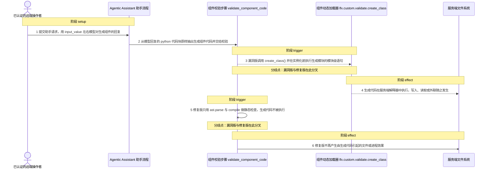
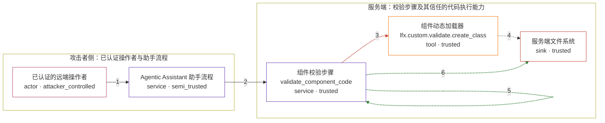

# langflow / CVE-2026-33873

状态：草稿，未完成环境和复现。这个目录由模板生成，不构成漏洞确认。

图解的唯一来源是 `diagram.toml`：编辑后运行 `python3 -m runner diagram langflow/CVE-2026-33873` 重新生成下方的图解区块。图解必须覆盖漏洞涉及的每个主体，并标出漏洞版/修复版的分歧步骤。

<!-- diagram:begin (generated from diagram.toml by `python3 -m runner diagram`; edit diagram.toml, not this block) -->
## 漏洞图解 — langflow / CVE-2026-33873 漏洞图解

Langflow Agentic Assistant 的校验步骤本应把助手模型生成的组件代码当作不可信文本，只做静态检查；在 1.9.0 之前，validate_component_code() 却从 lfx.custom.validate 取用 create_class() 并实例化生成的类，把生成模块放进服务端解释器执行。攻击者只需能触发助手把一段带副作用的代码放进回复，代码就在校验阶段于服务端运行，机密性与完整性都归攻击者；修复版对同一段代码只做 AST 解析，代码不被执行。

### 涉及主体

| 主体 | 类型 | 信任级别 | 在漏洞里的作用 | 来源 |
| --- | --- | --- | --- | --- |
| 已认证的远端操作者 (`remote_operator`) | `actor` | `attacker_controlled` | 持有低权限账号并可达 /api/v1/agentic/assist 的调用方；它能控制的只有这次请求的输入（input_value、flow_id、model_name 等），控制不了服务端解释器和文件系统。 | — |
| Agentic Assistant 助手流程 (`assistant_flow`) | `service` | `semi_trusted` | 按请求运行助手 flow 并把模型回复原样带回；回复文本里的组件代码经 extract_component_code() 抽出后进入校验，未做任何安全过滤，因此不可信的模型输出借它进入受信流程。 | — |
| 组件校验步骤 validate_component_code (`agentic_validator`) | `service` | `trusted` | 本应只做静态检查的信任边界内侧组件。漏洞版的实现调用 create_class() 并实例化生成类，从而把不可信代码当程序执行；修复版改为 ast.parse + compile，只解析不执行。 | — |
| 组件动态加载器 lfx.custom.validate.create_class (`component_loader`) | `tool` | `trusted` | Langflow 组件加载器的固有实现，用 exec() 执行生成模块的模块级语句和类体。它本身按设计执行代码，问题在于校验步骤把不可信输入交给了它。 | — |
| 服务端文件系统 (`server_file`) | `sink` | `trusted` | 生成代码在服务端执行后写入的落点。攻击者在这个进程里能执行的写入、读取与外部连接都以此为起点，因此写入本身即证明校验步骤执行了不可信代码。 | — |

**信任边界**

- **攻击者侧：已认证操作者与助手流程** (`attacker_side`)：成员 `remote_operator`、`assistant_flow`。操作者只能提交请求和左右模型输出；助手流程把模型回复当数据带回，本身不构成代码执行。
- **服务端：校验步骤及其信任的代码执行能力** (`server_side`)：成员 `agentic_validator`、`component_loader`、`server_file`。解释器与文件系统只应执行服务端自己的代码。校验步骤把助手生成的代码送进这条链路，边界即被越过。

### 触发过程

### 主体与信任边界

箭头上的数字是上面的步骤编号；方框只标主体和信任级别，具体动作见「触发过程」。

**分歧点**：第 3 步（`vulnerable_only`）漏洞版调用 create_class() 并在实例化前执行生成模块的模块级语句。
**分歧点**：第 5 步（`patched_only`）修复版只用 ast.parse 与 compile 做静态检查，生成代码不被执行。
<!-- diagram:end -->

## 公告与机制

TODO：官方公告、漏洞根因、Agent 信任边界、受影响范围和修复来源。

## 前提

TODO：认证要求、用户交互、已有批准、工具权限、攻击者能控制的内容。

## 版本与启动

TODO：补全 metadata、Dockerfile/镜像 digest 和 Compose，再写出精确启动命令。

Compose 中 `vulnerable` 与 `patched` profiles 分开使用；未指定 profile 不启动服务。镜像变量未配置时 Compose 会明确报错。此模板不暴露宿主端口，也不挂载主机数据。

## 机制复现

TODO：实现 `reproduce.py`，固定输入并执行真实漏洞路径，注明运行位置、参数和超时。

完成实现后使用 `python3 -m runner reproduce langflow/CVE-2026-33873 --build --rounds 3`。
两脚本统一接受 `--context <context.json> --output <目录>`，详细字段见仓库 `docs/environment-contract.md`。
PoC 输出 `facts.json` 和效果文件；验证器只读证据，输出含 `target_ready` 及对应效果断言的 `verdict.json`。
镜像必须包含 Python 3 和 `/lab/` 下的脚本、fixtures；`runtime.mode` 选择 `oneshot` 或有 healthcheck 的 `service`。

## 端到端复现

TODO：实现 `end_to_end.py`；若不需要模型，明确写出不适用原因。真实模型的结果与机制复现分开统计。

## 验证与修复对照

TODO：实现 `verify.py`。记录漏洞版无害效果、修复版阻断和正常任务成功的证据，不能把服务启动失败当成阻断。

## 清理

默认运行器按每个测试的唯一 Compose project 清理容器、网络和 volume。
`--keep-on-failure` 保留失败项目，项目标识和 Compose 配置在结果目录中；仅清理该项目，不能使用全局 prune。

## 失败诊断

TODO：为本漏洞写出预期效果缺失、修复版仍有越界效果、正常任务失败及前提不满足时的具体排查路径。
启动失败、健康检查失败和超时都不能当作修复阻断。报告中应能定位到阶段、预期、实际和受控证据。

## 构建与输入

TODO：填写两版源码 archive、完整 commit，记录 `build.inputs` 中每个下载的 SHA-256；依赖安装必须支持禁网构建。
固定攻击和正常输入放入 `fixtures/` 并登记到 `fixtures/manifest.toml`。固定 seed、环境变量，说明无害效果与真实影响的关系。

## 隔离例外

默认无例外。确需例外时同时填写 `runtime.exceptions`、理由及最小范围，晋升由两位维护者审阅。

## 来源与许可

TODO：列出引用代码、fixtures 和镜像的来源及许可。
