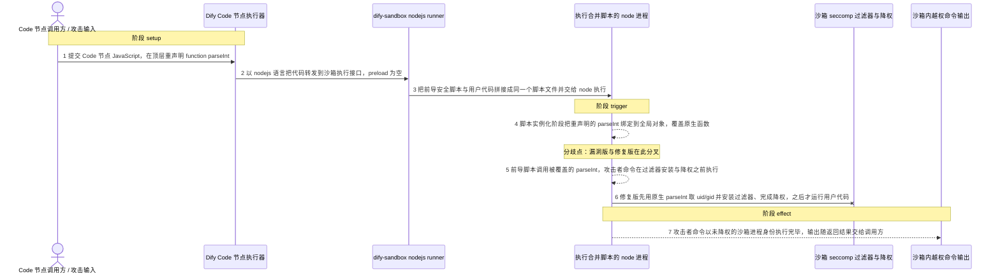
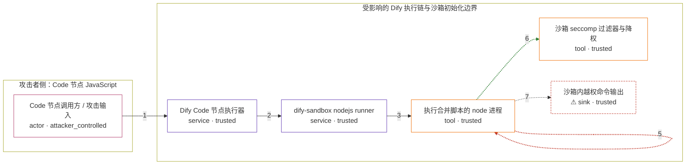

# langgenius-dify-versions-1-1-0-to-1-1-2 / CVE-2025-3466

状态：草稿，未完成环境和复现。这个目录由模板生成，不构成漏洞确认。

图解的唯一来源是 `diagram.toml`：编辑后运行 `python3 -m runner diagram langgenius-dify-versions-1-1-0-to-1-1-2/CVE-2025-3466` 重新生成下方的图解区块。图解必须覆盖漏洞涉及的每个主体，并标出漏洞版/修复版的分歧步骤。

<!-- diagram:begin (generated from diagram.toml by `python3 -m runner diagram`; edit diagram.toml, not this block) -->
## 漏洞图解 — langgenius/dify Code 节点 JavaScript 沙箱逃逸

Dify 的 Code 节点把不可信的 JavaScript 转发给 dify-sandbox，而沙箱的 nodejs runner 把负责安装 seccomp 过滤器并降权的前导脚本与用户代码拼接成同一个脚本文件。用户顶层声明的 function parseInt 在脚本实例化阶段就被提升为全局函数，覆盖前导脚本使用的原生 parseInt，于是攻击者函数在 DifySeccomp 生效之前执行任意命令，其返回的 0 又成为传给 DifySeccomp 的 uid/gid。修复版把用户代码编码后延迟到前导脚本之后执行，恶意函数不再进入沙箱初始化路径。

### 涉及主体

| 主体 | 类型 | 信任级别 | 在漏洞里的作用 | 来源 |
| --- | --- | --- | --- | --- |
| Code 节点调用方 / 攻击输入 (`attacker`) | `actor` | `attacker_controlled` | 完全控制 Code 节点的 JavaScript 文本，能够在脚本顶层重声明 parseInt，并让函数返回自己选定的 uid/gid。 | fixtures/attack_request.json |
| Dify Code 节点执行器 (`code_executor`) | `service` | `trusted` | 把 Code 节点里的 JavaScript 以 nodejs 语言转发给沙箱执行接口，不检查代码内容，也不做任何隔离。 | — |
| dify-sandbox nodejs runner (`sandbox_runner`) | `service` | `trusted` | 把前导安全脚本与用户代码拼接成一个脚本文件后交给 node 执行；缺陷就在于两者共享同一个全局作用域，没有隔离。 | — |
| 执行合并脚本的 node 进程 (`node_runtime`) | `tool` | `trusted` | 以沙箱服务进程的权限运行拼接后的脚本；脚本实例化阶段先绑定用户声明的全局函数，之后才开始执行前导脚本。 | — |
| 沙箱 seccomp 过滤器与降权 (`seccomp_guard`) | `tool` | `trusted` | 安装 seccomp 过滤器并按传入的 uid/gid 降权。漏洞版中它的入参由攻击者函数决定，且只在攻击者命令执行完之后才生效。 | — |
| ⚠ 沙箱内越权命令输出 (`effect`) | `sink` | `trusted` | 漏洞版中攻击者函数在沙箱限制生效前执行命令得到的输出。这是合成的无害标记，用于确认命令确实完成执行。 | fixtures/expected.json |

**信任边界**

- **攻击者侧：Code 节点 JavaScript** (`attacker_side`)：成员 `attacker`。攻击者只能控制提交给 Code 节点的 JavaScript 文本，不能直接改动沙箱服务、镜像或宿主文件。
- **受影响的 Dify 执行链与沙箱初始化边界** (`sandbox_scope`)：成员 `code_executor`、`sandbox_runner`、`node_runtime`、`seccomp_guard`、`effect`。这条边界本应保证不可信脚本只在过滤器安装与降权之后才运行；拼接后共享全局作用域把执行顺序反转了。

标 ⚠ 的主体是本仓库合成的替身或无害效果载体，不代表真实外部目标。

### 触发过程

### 主体与信任边界

箭头上的数字是上面的步骤编号；方框只标主体和信任级别，具体动作见「触发过程」。

**分歧点**：第 4 步（`vulnerable_only`）脚本实例化阶段把重声明的 parseInt 绑定到全局对象，覆盖原生函数。
**分歧点**：第 5 步（`vulnerable_only`）前导脚本调用被覆盖的 parseInt，攻击者命令在过滤器安装与降权之前执行。
**分歧点**：第 6 步（`patched_only`）修复版先用原生 parseInt 取 uid/gid 并安装过滤器、完成降权，之后才运行用户代码。
<!-- diagram:end -->

## 公告与机制

- 公告：<https://nvd.nist.gov/vuln/detail/CVE-2025-3466>（GHSA `GHSA-x53g-q9xm-rf4m`，CNA `@huntr_ai`，CVSS v3.0 9.8）。
- 受影响范围：`langgenius/dify` 1.1.0 ~ 1.1.2；修复版本 1.1.3。
- 根因：`dify-sandbox` 的 nodejs runner（`internal/core/runner/nodejs/nodejs.go`
  的 `InitializeEnvironment()`）把前导安全脚本 `prescript.js` 与不可信用户代码
  `code = node_sandbox_file + code` 拼成同一个脚本文件。整份脚本在
  GlobalDeclarationInstantiation 阶段就把用户顶层声明的 `function parseInt` 绑定为全局函数，
  因此 `prescript.js` 里的 `parseInt(argv[2])` / `parseInt(argv[3])` 调用的是攻击者的函数：
  命令在 `DifySeccomp(uid, gid, enable_network)` 安装 seccomp 过滤器与降权之前执行，
  且攻击者返回的 `0` 成为传给 `DifySeccomp` 的 uid/gid。
- 修复：不在 Dify 主仓库，而在 `langgenius/dify-sandbox` tag `0.2.11`
  （PR #140），把用户代码 base64 编码后交给 `eval` 在前导脚本之后执行：
  `code = node_sandbox_file + eval(Buffer.from('<base64>', 'base64').toString('utf-8'))`。
- **注意**：CVE/GHSA 引用的 <https://github.com/langgenius/dify/commit/1be0d26c1feb4bcbbdd2b4ae4eeb25874aadaddb>
  是 Dify `1.1.3` tag tip，内容是 metadata filter 修复，与本漏洞无关；按它做 diff 会得到错误的修复对照。
- 边界：漏洞打掉的是沙箱进程自身的 seccomp/降权这道边界，得到沙箱容器内的未降权执行；
  是否进一步逃逸到宿主不在本 CVE 描述范围内。

## 前提

- 攻击者能控制工作流 Code 节点提交的 JavaScript（例如作为工作流作者或调用方）。
- Dify 侧把该 JavaScript 以 `language=nodejs` 转发给沙箱；沙箱以 root 启动 node 子进程，
  由 `prescript.js` 负责安装 seccomp 过滤器并降权。
- 沙箱接口 `POST /v1/sandbox/run` 需要 `X-Api-Key`，默认值来自上游 `conf/config.yaml`（`dify-sandbox`）。
- 攻击者不能直接修改沙箱服务、镜像或宿主文件；它唯一能控制的是这次请求里的 `code` 字段。

## 版本与启动

机制层复现两个固定的 `dify-sandbox` 修订（`langgenius/dify-sandbox`）：

| 变体 | tag | 完整 commit | 说明 |
| --- | --- | --- | --- |
| vulnerable | `0.2.10` | `3a738590e71450170891d6874215e6aa8c865307` | `code = prescript + code`，共享全局作用域 |
| patched | `0.2.11` | `a0c74d335e380d0a51595cdc0ad975a064a6127b` | 用户代码 base64 + `eval`，前导脚本之后执行 |

Dify 侧的对应关系（仅依赖镜像 tag，修复即版本提升）：Dify `1.1.2`
`bf90d34c2f581a2be52e050938caa8e3be2c9a40` 用 `dify-sandbox:0.2.10`；Dify `1.1.3`
`1be0d26c1feb4bcbbdd2b4ae4eeb25874aadaddb` 用 `0.2.11`。

镜像由 `Dockerfile` 从固定源码归档离线编译，构建时按 `VARIANT` 选择对应归档；运行时只需要
`/lab/` 下的脚本、`fixtures/` 与 Python 3，漏洞服务由 `reproduce.py` 按需拉起（`runtime.mode = "oneshot"`）。
Compose 中 `vulnerable` 与 `patched` profiles 分开使用，未指定 profile 不启动服务；
镜像变量未配置时 Compose 会明确报错。两个变体都不暴露宿主端口，也不挂载主机数据。

镜像需要提供编译后的上游沙箱服务，`reproduce.py` 按以下顺序寻找入口：
`$AVH_SANDBOX_MAIN`、`/lab/sandbox/main`、`/lab/sandbox/env/main`、`/lab/sandbox/build/main`、
`/sandbox/main`、`/app/main`。入口的工作目录必须是包含 `conf/config.yaml` 与
`var/sandbox/sandbox-nodejs/nodejs.so` 的沙箱根目录（`prescript.js` 以 `./var/sandbox/...`
相对路径加载 `nodejs.so`）。若 `http://127.0.0.1:8194` 上已有服务在监听，`reproduce.py`
直接复用它，不再拉起进程。

## 机制复现

`reproduce.py` 只做三件事：读取 `context.json` 的 `scenario`、按场景读取固定请求体、
把请求体原样 `POST` 到上游沙箱的 `/v1/sandbox/run`。拼接前导脚本、全局函数提升、
`DifySeccomp` 降权全部由固定修订的上游沙箱二进制执行，脚本里没有任何对漏洞函数的抽取或重写。

- 输入：`fixtures/attack_request.json`（攻击）、`fixtures/benign_request.json`（正常任务）。
- 效果：`http_response.json`（沙箱原始响应）、`sandbox_stdout.txt`、`sandbox_stderr.txt`，
  以及拉起沙箱时的 `sandbox_service.log`；`observation.json` 含 `target_ready` 与
  `execution_status`（仅当 HTTP 200 且沙箱返回 `code == 0` 时为 `completed`）。
- 可选环境变量：`AVH_SANDBOX_URL`、`AVH_SANDBOX_API_KEY`、`AVH_SANDBOX_MAIN`、
  `AVH_SANDBOX_READY_TIMEOUT`、`AVH_SANDBOX_REQUEST_TIMEOUT`、`AVH_FIXTURES`。
- 超时：等待服务就绪默认 90s，单次执行请求默认 120s。

完整验收：`python3 -m runner reproduce langgenius-dify-versions-1-1-0-to-1-1-2/CVE-2025-3466 --build --rounds 3`。
两脚本统一接受 `--context <context.json> --output <目录>`，详细字段见仓库 `docs/environment-contract.md`。

## 端到端复现

不适用：本 CVE 的触发路径是 Code 节点 → 沙箱 nodejs runner，不需要真实模型或 Agent 框架参与。
`end_to_end.py` 只说明该结论并返回 `not_applicable`，端到端状态不参与机制验收。

## 验证与修复对照

`verify.py` 只读 `facts.json`、`observation.json` 与效果文件，不重跑攻击：

- `vulnerable_effect_observed`（漏洞版攻击）：`sandbox_stdout.txt` 含
  `AVH-3466-CODE-EXEC-BEFORE-SECCOMP`，即攻击者的 `parseInt` 在过滤器生效前执行了命令。
- `patched_effect_blocked`（修复版攻击）：`sandbox_stdout.txt` 不含攻击命令标记，且为
  `{ result: 'no-effect' }`，即恶意函数从未被前导脚本调用。
- `benign_task_passed`（两版正常任务）：`sandbox_stdout.txt` 含 `AVH-3466-BENIGN-OK` 与
  `sum: 42`。

`target_ready` 由 `observation.json` 决定；沙箱启动失败、超时或响应缺证据都不能算作修复阻断。
期望值固定在 `fixtures/expected.json`。

## 清理

默认运行器按每个测试的唯一 Compose project 清理容器、网络和 volume。
`--keep-on-failure` 保留失败项目，项目标识和 Compose 配置在结果目录中；仅清理该项目，不能使用全局 prune。

## 失败诊断

- `target_ready=false` 且 `error` 为 “no sandbox service is listening…”：镜像里没有编译好的
  沙箱入口，或路径/可执行位不对；核对 `AVH_SANDBOX_MAIN` 与构建产物位置。
- 沙箱启动后立刻退出：看 `sandbox_service.log`；常见原因是 `conf/config.yaml` 缺失、
  `var/sandbox/sandbox-nodejs/nodejs.so` 不存在，或工作目录不是沙箱根目录。
- 修复版没有 `{ result: 'no-effect' }` 而是报错：优先怀疑 seccomp 安装或降权所需的
  capability 被容器策略拦掉；这属于执行失败，不能记为修复阻断。
- 漏洞版看不到命令标记：确认 `enable_network`、`preload` 与上游测试一致，并确认响应体
  schema 中的 `data.stdout` 被正确解析。
- 正常任务失败：说明沙箱整体不可用，整轮不通过。

## 构建与输入

两版源码归档来自 `langgenius/dify-sandbox` 的 codeload tarball：

| 变体 | tag | 完整 commit | tarball SHA-256 |
| --- | --- | --- | --- |
| vulnerable | `0.2.10` | `3a738590e71450170891d6874215e6aa8c865307` | `7be5b94641114b5cd9d9ecad137dab76797eb1d2bf8274eb25db967339bfaeb3` |
| patched | `0.2.11` | `a0c74d335e380d0a51595cdc0ad975a064a6127b` | `75ba06af6eb7803415d0295389c6605b0bc25261ae80a4a9670127503ca77b29` |

离线构建需要 Go、`gcc`、`libseccomp-dev`（CGO 构建 `-buildmode=c-shared` 的 `nodejs.so`）
以及 Node.js 运行时；JS 依赖已 vendored 进仓库，runner 不需要 npm 联网，但上游 dockerfile
会从网络下载 `node-v20.11.1-linux-x64.tar.xz`，禁网构建时必须把它作为带 SHA-256 的固定输入。
`nodejs.so` 由构建产物嵌入（`//go:embed`），仓库里没有该二进制，必须现场编译。
`prescript.js` 在 0.2.10 与 0.2.11 之间逐字节相同；安全相关代码改动只有 `nodejs.go` 那 4 行。

固定攻击与正常输入在 `fixtures/`，登记于 `fixtures/manifest.toml`；效果标记是合成字符串，
真实影响是沙箱容器内未降权的任意命令执行。

## 隔离例外

默认无例外。若实测发现修复版的 seccomp 安装/降权需要额外 capability（例如 `SETUID`/`SETGID`），
必须在 `runtime.exceptions` 逐条声明精确规则名与理由，并使用 `--allow-exceptions`；晋升需两位维护者审阅。

## 来源与许可

- `langgenius/dify-sandbox`（Apache-2.0）0.2.10 / 0.2.11 源码归档，见上表。
- `langgenius/dify`（Apache-2.0）1.1.2 / 1.1.3 调用链源码。
- 修复 PR：<https://github.com/langgenius/dify-sandbox/pull/140>；
  修复 release：<https://github.com/langgenius/dify-sandbox/releases/tag/0.2.11>。
- fixtures 全部为本次分析合成的标记与请求体，不包含真实凭据或真实用户数据。
