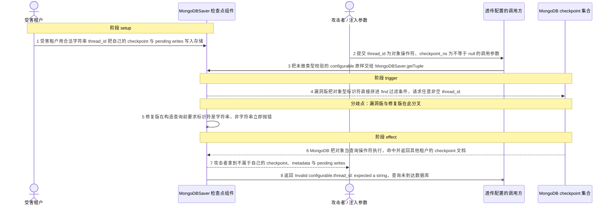
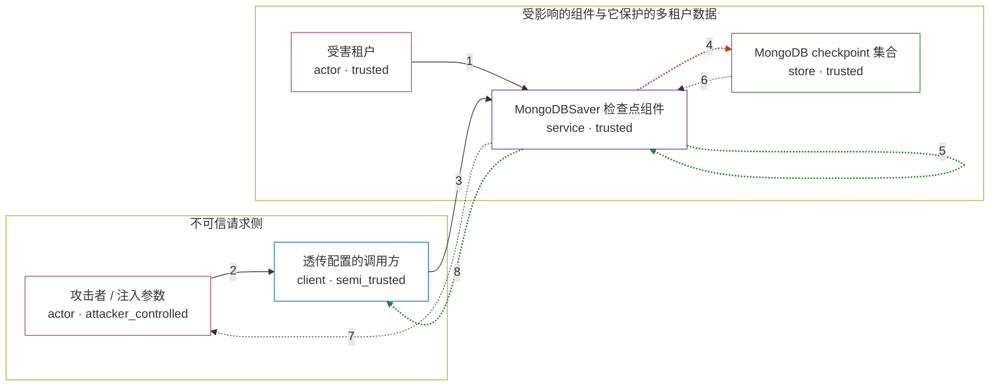

# langgraphjs / CVE-2026-48121

状态：草稿，未完成环境和复现。这个目录由模板生成，不构成漏洞确认。

图解的唯一来源是 `diagram.toml`：编辑后运行 `python3 -m runner diagram langgraphjs/CVE-2026-48121` 重新生成下方的图解区块。图解必须覆盖漏洞涉及的每个主体，并标出漏洞版/修复版的分歧步骤。

<!-- diagram:begin (generated from diagram.toml by `python3 -m runner diagram`; edit diagram.toml, not this block) -->
## 漏洞图解 — langgraphjs / CVE-2026-48121 漏洞图解

MongoDBSaver 的 getTuple 直接从 config.configurable 取出 thread_id、checkpoint_ns 与 checkpoint_id，未做字符串类型校验就把它们拼成 MongoDB 的 find 过滤条件。攻击者把调用参数里的 thread_id 换成 { $gt: '' }、checkpoint_ns 换成 { $ne: null } 这类对象后，MongoDB 会把它们当作查询操作符执行，按 thread_id 建立的租户隔离因此失效。修复版在构造查询前要求这些字段必须是字符串，非字符串会抛出 Invalid configurable.thread_id: expected a string，查询不会到达数据库。最终效果是攻击者读到其他租户的 checkpoint、metadata 与 pending writes。

### 涉及主体

| 主体 | 类型 | 信任级别 | 在漏洞里的作用 | 来源 |
| --- | --- | --- | --- | --- |
| 受害租户 (`victim_tenant`) | `actor` | `trusted` | 在存储里写入自己 checkpoint 的正常租户；它既不知道也不会授权这次读取，它的线程状态正是攻击者本不该拿到的数据。 | — |
| 攻击者 / 注入参数 (`attacker`) | `actor` | `attacker_controlled` | 控制这次调用里 config.configurable 的标识符字段，把字面字符串换成 MongoDB 查询操作符对象，并接收被越界读出的状态。 | fixtures/attack.json |
| 透传配置的调用方 (`caller`) | `client` | `semi_trusted` | 把不可信请求参数原样放进 config.configurable 再调用 MongoDBSaver，使攻击者可控的值进入受信流程。 | — |
| MongoDBSaver 检查点组件 (`saver`) | `service` | `trusted` | 本应强制按 thread_id 做租户隔离的读写组件；getTuple 缺少标识符类型校验，直接把这些值当作 find 的过滤条件。 | libs/checkpoint-mongodb/src/checkpoint.ts |
| MongoDB checkpoint 集合 (`mongodb`) | `store` | `trusted` | 存放各租户 checkpoint 与 pending writes 的存储；它按查询操作符解释过滤条件，于是匹配出属于别的租户的文档。 | — |

**信任边界**

- **不可信请求侧** (`request_side`)：成员 `attacker`、`caller`。攻击者只能控制这次调用透传进来的 configurable 字段；它没有存储凭据，也不能直接改写检索条件之外的东西。
- **受影响的组件与它保护的多租户数据** (`tenant_store`)：成员 `victim_tenant`、`saver`、`mongodb`。这道边界本来保证一次读取只命中调用者自己的 thread_id；标识符缺少类型校验后，对象型取值被当作操作符，隔离失效。

### 触发过程

### 主体与信任边界

箭头上的数字是上面的步骤编号；方框只标主体和信任级别，具体动作见「触发过程」。

**分歧点**：第 4 步（`vulnerable_only`）漏洞版把对象型标识符直接拼进 find 过滤条件，请求任意非空 thread_id。
**分歧点**：第 5 步（`patched_only`）修复版在构造查询前要求标识符是字符串，非字符串立即抛错。
<!-- diagram:end -->

## 公告与机制

TODO：官方公告、漏洞根因、Agent 信任边界、受影响范围和修复来源。

## 前提

TODO：认证要求、用户交互、已有批准、工具权限、攻击者能控制的内容。

## 版本与启动

TODO：补全 metadata、Dockerfile/镜像 digest 和 Compose，再写出精确启动命令。

Compose 中 `vulnerable` 与 `patched` profiles 分开使用；未指定 profile 不启动服务。镜像变量未配置时 Compose 会明确报错。此模板不暴露宿主端口，也不挂载主机数据。

## 机制复现

TODO：实现 `reproduce.py`，固定输入并执行真实漏洞路径，注明运行位置、参数和超时。

完成实现后使用 `python3 -m runner reproduce langgraphjs/CVE-2026-48121 --build --rounds 3`。
两脚本统一接受 `--context <context.json> --output <目录>`，详细字段见仓库 `docs/environment-contract.md`。
PoC 输出 `facts.json` 和效果文件；验证器只读证据，输出含 `target_ready` 及对应效果断言的 `verdict.json`。
镜像必须包含 Python 3 和 `/lab/` 下的脚本、fixtures；`runtime.mode` 选择 `oneshot` 或有 healthcheck 的 `service`。

## 端到端复现

TODO：实现 `end_to_end.py`；若不需要模型，明确写出不适用原因。真实模型的结果与机制复现分开统计。

## 验证与修复对照

TODO：实现 `verify.py`。记录漏洞版无害效果、修复版阻断和正常任务成功的证据，不能把服务启动失败当成阻断。

## 清理

默认运行器按每个测试的唯一 Compose project 清理容器、网络和 volume。
`--keep-on-failure` 保留失败项目，项目标识和 Compose 配置在结果目录中；仅清理该项目，不能使用全局 prune。

## 失败诊断

TODO：为本漏洞写出预期效果缺失、修复版仍有越界效果、正常任务失败及前提不满足时的具体排查路径。
启动失败、健康检查失败和超时都不能当作修复阻断。报告中应能定位到阶段、预期、实际和受控证据。

## 构建与输入

TODO：填写两版源码 archive、完整 commit，记录 `build.inputs` 中每个下载的 SHA-256；依赖安装必须支持禁网构建。
固定攻击和正常输入放入 `fixtures/` 并登记到 `fixtures/manifest.toml`。固定 seed、环境变量，说明无害效果与真实影响的关系。

## 隔离例外

默认无例外。确需例外时同时填写 `runtime.exceptions`、理由及最小范围，晋升由两位维护者审阅。

## 来源与许可

TODO：列出引用代码、fixtures 和镜像的来源及许可。
