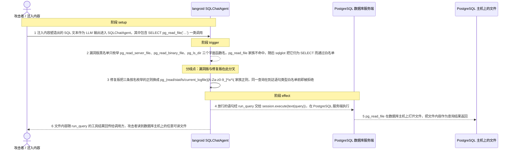
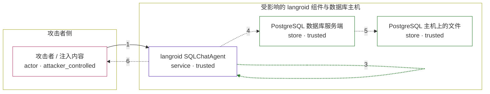

# langroid / CVE-2026-50180

状态：草稿，未完成环境和复现。这个目录由模板生成，不构成漏洞确认。

图解的唯一来源是 `diagram.toml`：编辑后运行 `python3 -m runner diagram langroid/CVE-2026-50180` 重新生成下方的图解区块。图解必须覆盖漏洞涉及的每个主体，并标出漏洞版/修复版的分歧步骤。

<!-- diagram:begin (generated from diagram.toml by `python3 -m runner diagram`; edit diagram.toml, not this block) -->
## 漏洞图解 — langroid / CVE-2026-50180 漏洞图解

langroid 的 SQLChatAgent 在默认严格配置下，用一份按具体函数名逐条枚举的正则黑名单校验 LLM 生成的 SQL。 PostgreSQL 的 pg_read_file、pg_stat_file、pg_ls_logdir/pg_ls_waldir/pg_ls_tmpdir/pg_ls_archive_statusdir 与 pg_current_logfile 和已枚举的 pg_read_server_file、pg_read_binary_file、pg_ls_dir 属于同一种服务端文件读取原语， 函数名却不含被枚举的 token，于是既躲过黑名单，又因为写法上仍是 SELECT 而通过 sqlglot 语句类型白名单。 放行的语句直达 session.execute(text(query))，由数据库服务端读取其主机上的文件并把内容作为查询结果返回给调用方， 攻击者由此拿到 PostgreSQL 进程可读的任意文件，例如 postgresql.conf、pg_hba.conf、日志与 TLS 私钥。

### 涉及主体

| 主体 | 类型 | 信任级别 | 在漏洞里的作用 | 来源 |
| --- | --- | --- | --- | --- |
| 攻击者 / 注入内容 (`attacker`) | `actor` | `attacker_controlled` | 通过直接提示，或经数据库回读内容、工具结果等间接提示注入，塑造 LLM 生成的 SQL 文本，使其包含 pg_read_file 家族的 SELECT 调用。攻击者并不掌握数据库主机上的文件。 | fixtures/attack_query.json |
| langroid SQLChatAgent (`sql_agent`) | `service` | `trusted` | 在 allow_dangerous_operations=False、allowed_statement_types=['SELECT'] 的默认配置下，对 LLM 生成的 SQL 先逐条匹配 _DANGEROUS_SQL_PATTERNS 黑名单正则，再用 sqlglot 做语句类型白名单校验，通过后由 run_query 交给 session.execute(text(query)) 执行。 | langroid/agent/special/sql/sql_chat_agent.py |
| PostgreSQL 数据库服务端 (`database`) | `store` | `trusted` | 执行 SQLChatAgent 提交的语句。pg_read_file、pg_stat_file、pg_ls_* 等函数由它在其主机上完成文件读取，并把结果作为查询结果行返回。 | — |
| PostgreSQL 主机上的文件 (`server_files`) | `store` | `trusted` | 数据库进程可读、但本应在 SQL 查询权限之外的文件，例如 postgresql.conf、pg_hba.conf、日志与 TLS 私钥；漏洞放行 pg_read_file 家族后，其内容被读出并回到调用方。 | fixtures/marker.txt |

**信任边界**

- **攻击者侧** (`attacker_side`)：成员 `attacker`。攻击者只能影响 LLM 生成的 SQL 文本（直接提示，或注入到被回读的数据与工具结果里），不能直接打开数据库主机上的文件，所以它想要的配置、日志和密钥必须在另一侧。
- **受影响的 langroid 组件与数据库主机** (`product`)：成员 `sql_agent`、`database`、`server_files`。这道边界由 _validate_query 的黑名单正则加 sqlglot 语句类型白名单守住，本应拦住文件访问与代码执行原语；黑名单按函数名逐条枚举，漏掉同族的 pg_read_file 等近名函数后，白名单又只看语句类型，边界随之失效。

### 触发过程

### 主体与信任边界

箭头上的数字是上面的步骤编号；方框只标主体和信任级别，具体动作见「触发过程」。

**分歧点**：第 2 步（`vulnerable_only`）漏洞版黑名单只枚举 pg_read_server_file、pg_read_binary_file、pg_ls_dir 三个字面函数名，pg_read_file 家族不命中，随后 sqlglot 把它归为 SELECT 而通过白名单。
**分歧点**：第 3 步（`patched_only`）修复版把三条按名枚举的正则换成 pg_(read|stat|ls|current_logfile)[A-Za-z0-9_]*\s*\( 家族正则，同一查询在到达语句类型白名单前即被拒绝。
<!-- diagram:end -->

## 公告与机制

TODO：官方公告、漏洞根因、Agent 信任边界、受影响范围和修复来源。

## 前提

TODO：认证要求、用户交互、已有批准、工具权限、攻击者能控制的内容。

## 版本与启动

TODO：补全 metadata、Dockerfile/镜像 digest 和 Compose，再写出精确启动命令。

Compose 中 `vulnerable` 与 `patched` profiles 分开使用；未指定 profile 不启动服务。镜像变量未配置时 Compose 会明确报错。此模板不暴露宿主端口，也不挂载主机数据。

## 机制复现

TODO：实现 `reproduce.py`，固定输入并执行真实漏洞路径，注明运行位置、参数和超时。

完成实现后使用 `python3 -m runner reproduce langroid/CVE-2026-50180 --build --rounds 3`。
两脚本统一接受 `--context <context.json> --output <目录>`，详细字段见仓库 `docs/environment-contract.md`。
PoC 输出 `facts.json` 和效果文件；验证器只读证据，输出含 `target_ready` 及对应效果断言的 `verdict.json`。
镜像必须包含 Python 3 和 `/lab/` 下的脚本、fixtures；`runtime.mode` 选择 `oneshot` 或有 healthcheck 的 `service`。

## 端到端复现

TODO：实现 `end_to_end.py`；若不需要模型，明确写出不适用原因。真实模型的结果与机制复现分开统计。

## 验证与修复对照

TODO：实现 `verify.py`。记录漏洞版无害效果、修复版阻断和正常任务成功的证据，不能把服务启动失败当成阻断。

## 清理

默认运行器按每个测试的唯一 Compose project 清理容器、网络和 volume。
`--keep-on-failure` 保留失败项目，项目标识和 Compose 配置在结果目录中；仅清理该项目，不能使用全局 prune。

## 失败诊断

TODO：为本漏洞写出预期效果缺失、修复版仍有越界效果、正常任务失败及前提不满足时的具体排查路径。
启动失败、健康检查失败和超时都不能当作修复阻断。报告中应能定位到阶段、预期、实际和受控证据。

## 构建与输入

TODO：填写两版源码 archive、完整 commit，记录 `build.inputs` 中每个下载的 SHA-256；依赖安装必须支持禁网构建。
固定攻击和正常输入放入 `fixtures/` 并登记到 `fixtures/manifest.toml`。固定 seed、环境变量，说明无害效果与真实影响的关系。

## 隔离例外

默认无例外。确需例外时同时填写 `runtime.exceptions`、理由及最小范围，晋升由两位维护者审阅。

## 来源与许可

TODO：列出引用代码、fixtures 和镜像的来源及许可。
