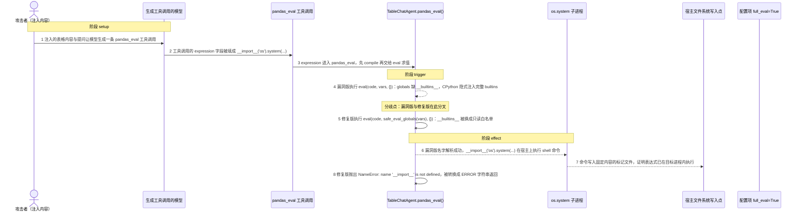
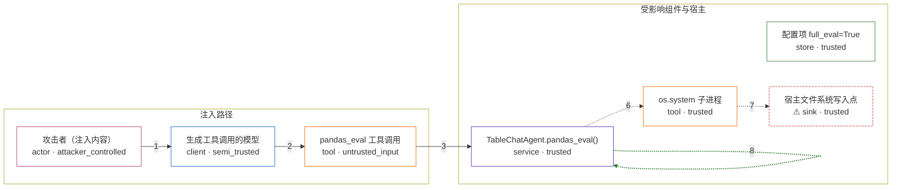

# langroid / CVE-2026-54769

状态：草稿，未完成环境和复现。这个目录由模板生成，不构成漏洞确认。

图解的唯一来源是 `diagram.toml`：编辑后运行 `python3 -m runner diagram langroid/CVE-2026-54769` 重新生成下方的图解区块。图解必须覆盖漏洞涉及的每个主体，并标出漏洞版/修复版的分歧步骤。

<!-- diagram:begin (generated from diagram.toml by `python3 -m runner diagram`; edit diagram.toml, not this block) -->
## 漏洞图解 — langroid TableChatAgent 的 eval 沙箱逃逸（CVE-2026-54769）

langroid 0.65.2 之前，TableChatAgent.pandas_eval 与 VectorStoreBase.compute_from_docs 在 full_eval=True 时把模型生成的表达式编译后交给 eval(code, vars, {})。传入的 globals 只有 df 而没有 __builtins__，CPython 会自动把真实 builtins 注入该字典，所以 locals={} 形同虚设。攻击者只要通过注入内容让模型产出 expression 为 __import__('os').system(...) 的 pandas_eval 工具调用，就能在目标进程所在宿主上执行任意命令。修复版改为 eval(code, safe_eval_globals(vars), {})，显式把 __builtins__ 换成只读白名单，同一表达式因 __import__ 未定义而抛出 NameError。

### 涉及主体

| 主体 | 类型 | 信任级别 | 在漏洞里的作用 | 来源 |
| --- | --- | --- | --- | --- |
| 攻击者（注入内容） (`attacker`) | `actor` | `attacker_controlled` | 在表格数据或提问中植入指令，间接决定下游工具调用的 expression 字段。它自己不能调用 pandas_eval，也不能直接读写目标进程的文件。 | fixtures/attack_expression.json |
| 生成工具调用的模型 (`llm`) | `client` | `semi_trusted` | 把注入内容转写成固定格式的 pandas_eval 工具调用：它只负责填 expression 字段，既不执行表达式，也不检查字段内容是否安全。 | — |
| pandas_eval 工具调用 (`pandas_eval_call`) | `tool` | `untrusted_input` | 模型给出的工具调用消息，expression 字段完全由注入内容决定；在机制层面这是攻击者唯一可控的输入。 | fixtures/attack_expression.json |
| TableChatAgent.pandas_eval() (`table_agent`) | `service` | `trusted` | 受影响的上游组件：编译工具调用的 expression 并交给 eval 求值。漏洞版传入的 globals 只有 df，缺少 __builtins__，边界因此失效。 | langroid/agent/special/table_chat_agent.py |
| 配置项 full_eval=True (`full_eval_config`) | `store` | `trusted` | 漏洞前提：TableChatAgentConfig.full_eval 默认是 False，此时 sanitize_command() 的 AST 白名单会先拦下同一表达式；只有显式设为 True 才会跳过清洗，直接 eval。这是环境本来的配置，不是攻击者的动作。 | — |
| os.system 子进程 (`host_shell`) | `tool` | `trusted` | 漏洞版经 __import__('os') 打开的命令通道；表达式一旦逃逸，攻击者控制的命令就在这里由目标进程所在宿主执行。 | — |
| ⚠ 宿主文件系统写入点 (`marker_file`) | `sink` | `trusted` | 无危害的效果落点：命令只写入固定内容的标记文件，用来证明表达式确实在目标进程内执行。它不是真实的外部目标，也不包含真实数据。 | — |

**信任边界**

- **注入路径** (`injection_path`)：成员 `attacker`、`llm`、`pandas_eval_call`。攻击者只控制注入文本以及由它决定的 expression 字段；它不能直接调用 pandas_eval，也不能直接写目标进程的文件。
- **受影响组件与宿主** (`agent_runtime`)：成员 `table_agent`、`full_eval_config`、`host_shell`、`marker_file`。组件在 full_eval=True 时对模型表达式求值。修复前 eval 的 globals 缺少 __builtins__，这道边界没有真正隔离表达式与宿主能力。

标 ⚠ 的主体是本仓库合成的替身或无害效果载体，不代表真实外部目标。

### 触发过程

### 主体与信任边界

箭头上的数字是上面的步骤编号；方框只标主体和信任级别，具体动作见「触发过程」。

**分歧点**：第 4 步（`vulnerable_only`）漏洞版执行 eval(code, vars, {})：globals 缺 __builtins__，CPython 隐式注入完整 builtins。
**分歧点**：第 5 步（`patched_only`）修复版执行 eval(code, safe_eval_globals(vars), {})：__builtins__ 被换成只读白名单。
<!-- diagram:end -->

## 公告与机制

TODO：官方公告、漏洞根因、Agent 信任边界、受影响范围和修复来源。

## 前提

TODO：认证要求、用户交互、已有批准、工具权限、攻击者能控制的内容。

## 版本与启动

TODO：补全 metadata、Dockerfile/镜像 digest 和 Compose，再写出精确启动命令。

Compose 中 `vulnerable` 与 `patched` profiles 分开使用；未指定 profile 不启动服务。镜像变量未配置时 Compose 会明确报错。此模板不暴露宿主端口，也不挂载主机数据。

## 机制复现

TODO：实现 `reproduce.py`，固定输入并执行真实漏洞路径，注明运行位置、参数和超时。

完成实现后使用 `python3 -m runner reproduce langroid/CVE-2026-54769 --build --rounds 3`。
两脚本统一接受 `--context <context.json> --output <目录>`，详细字段见仓库 `docs/environment-contract.md`。
PoC 输出 `facts.json` 和效果文件；验证器只读证据，输出含 `target_ready` 及对应效果断言的 `verdict.json`。
镜像必须包含 Python 3 和 `/lab/` 下的脚本、fixtures；`runtime.mode` 选择 `oneshot` 或有 healthcheck 的 `service`。

## 端到端复现

TODO：实现 `end_to_end.py`；若不需要模型，明确写出不适用原因。真实模型的结果与机制复现分开统计。

## 验证与修复对照

TODO：实现 `verify.py`。记录漏洞版无害效果、修复版阻断和正常任务成功的证据，不能把服务启动失败当成阻断。

## 清理

默认运行器按每个测试的唯一 Compose project 清理容器、网络和 volume。
`--keep-on-failure` 保留失败项目，项目标识和 Compose 配置在结果目录中；仅清理该项目，不能使用全局 prune。

## 失败诊断

TODO：为本漏洞写出预期效果缺失、修复版仍有越界效果、正常任务失败及前提不满足时的具体排查路径。
启动失败、健康检查失败和超时都不能当作修复阻断。报告中应能定位到阶段、预期、实际和受控证据。

## 构建与输入

TODO：填写两版源码 archive、完整 commit，记录 `build.inputs` 中每个下载的 SHA-256；依赖安装必须支持禁网构建。
固定攻击和正常输入放入 `fixtures/` 并登记到 `fixtures/manifest.toml`。固定 seed、环境变量，说明无害效果与真实影响的关系。

## 隔离例外

默认无例外。确需例外时同时填写 `runtime.exceptions`、理由及最小范围，晋升由两位维护者审阅。

## 来源与许可

TODO：列出引用代码、fixtures 和镜像的来源及许可。
