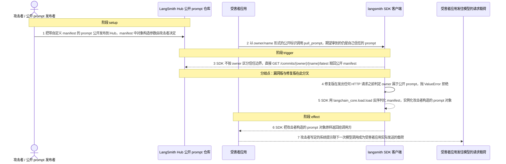
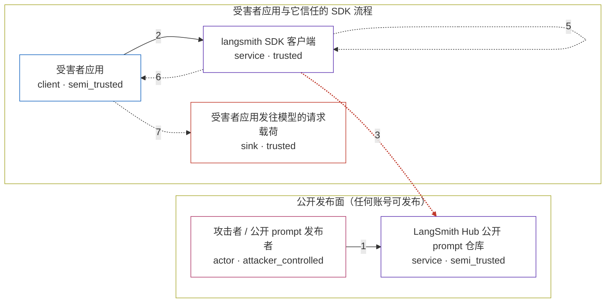

# langsmith-sdk / CVE-2026-45134

状态：草稿，未完成环境和复现。这个目录由模板生成，不构成漏洞确认。

图解的唯一来源是 `diagram.toml`：编辑后运行 `python3 -m runner diagram langsmith-sdk/CVE-2026-45134` 重新生成下方的图解区块。图解必须覆盖漏洞涉及的每个主体，并标出漏洞版/修复版的分歧步骤。

<!-- diagram:begin (generated from diagram.toml by `python3 -m runner diagram`; edit diagram.toml, not this block) -->
## 漏洞图解 — langsmith-sdk / CVE-2026-45134 公开 prompt 反序列化

langsmith SDK 的 pull_prompt_commit 不区分同组织 prompt（name 形式，owner 解析为 -）与外部账号的公开 prompt（owner/name 形式），两者共用同一条拉取与反序列化路径。受害者应用按 owner/name 拉取公开 prompt 时，SDK 直接把响应交给 langchain_core.load.load 反序列化，manifest 里攻击者可控的 LangChain 构造参数因此被实例化。漏洞版把攻击者构造的 prompt 对象交给调用方，修复版在发出任何请求之前用 ValueError 拒绝公开 prompt。

### 涉及主体

| 主体 | 类型 | 信任级别 | 在漏洞里的作用 | 来源 |
| --- | --- | --- | --- | --- |
| 攻击者 / 公开 prompt 发布者 (`attacker`) | `actor` | `attacker_controlled` | 在公开发布面上发布 prompt commit；manifest 里对象构造参数与系统提示由攻击者完全决定。 | fixtures/attack_public_prompt.json |
| LangSmith Hub 公开 prompt 仓库 (`hub`) | `service` | `semi_trusted` | 按 owner/name 返回 prompt commit 的仓库服务。它只按标识查内容，不判断调用方是否信任该 owner；环境里这一接口由本地 HTTP 服务应答。 | — |
| 受害者应用 (`app`) | `client` | `semi_trusted` | 把用户或配置提供的 prompt 标识直接交给 SDK 拉取，并默认返回的就是自己信任的 prompt；拉取结果进入它下一次模型调用。 | — |
| langsmith SDK 客户端 (`sdk`) | `service` | `trusted` | pull_prompt_commit 解析标识后直接 GET 对应 commit，pull_prompt 再用 langchain_core.load.load 反序列化 manifest；缺少 owner 信任边界检查是根因。 | — |
| 受害者应用发往模型的请求载荷 (`model_payload`) | `sink` | `trusted` | 漏洞效果落点：系统提示与模型配置由拉取到的 manifest 决定，攻击者因此能改写受害者应用实际发送给模型的内容。 | — |

**信任边界**

- **公开发布面（任何账号可发布）** (`public_surface`)：成员 `attacker`、`hub`。公开 prompt 的内容不受受害者组织控制，仓库只按 owner/name 返回它；攻击者在这里能决定 manifest 的全部内容。
- **受害者应用与它信任的 SDK 流程** (`victim_boundary`)：成员 `app`、`sdk`、`model_payload`。应用本来只该信任自己组织的 prompt；pull_prompt_commit 不按 owner 区分公开 prompt，这道边界因此没有生效。

### 触发过程

### 主体与信任边界

箭头上的数字是上面的步骤编号；方框只标主体和信任级别，具体动作见「触发过程」。

**分歧点**：第 3 步（`vulnerable_only`）SDK 不按 owner 区分信任边界，直接 GET /commits/{owner}/{name}/latest 取回公开 manifest。
**分歧点**：第 4 步（`patched_only`）修复版在发出任何 HTTP 请求之前判定 owner 属于公开 prompt，抛 ValueError 拒绝。
<!-- diagram:end -->

## 公告与机制

TODO：官方公告、漏洞根因、Agent 信任边界、受影响范围和修复来源。

## 前提

TODO：认证要求、用户交互、已有批准、工具权限、攻击者能控制的内容。

## 版本与启动

TODO：补全 metadata、Dockerfile/镜像 digest 和 Compose，再写出精确启动命令。

Compose 中 `vulnerable` 与 `patched` profiles 分开使用；未指定 profile 不启动服务。镜像变量未配置时 Compose 会明确报错。此模板不暴露宿主端口，也不挂载主机数据。

## 机制复现

TODO：实现 `reproduce.py`，固定输入并执行真实漏洞路径，注明运行位置、参数和超时。

完成实现后使用 `python3 -m runner reproduce langsmith-sdk/CVE-2026-45134 --build --rounds 3`。
两脚本统一接受 `--context <context.json> --output <目录>`，详细字段见仓库 `docs/environment-contract.md`。
PoC 输出 `facts.json` 和效果文件；验证器只读证据，输出含 `target_ready` 及对应效果断言的 `verdict.json`。
镜像必须包含 Python 3 和 `/lab/` 下的脚本、fixtures；`runtime.mode` 选择 `oneshot` 或有 healthcheck 的 `service`。

## 端到端复现

TODO：实现 `end_to_end.py`；若不需要模型，明确写出不适用原因。真实模型的结果与机制复现分开统计。

## 验证与修复对照

TODO：实现 `verify.py`。记录漏洞版无害效果、修复版阻断和正常任务成功的证据，不能把服务启动失败当成阻断。

## 清理

默认运行器按每个测试的唯一 Compose project 清理容器、网络和 volume。
`--keep-on-failure` 保留失败项目，项目标识和 Compose 配置在结果目录中；仅清理该项目，不能使用全局 prune。

## 失败诊断

TODO：为本漏洞写出预期效果缺失、修复版仍有越界效果、正常任务失败及前提不满足时的具体排查路径。
启动失败、健康检查失败和超时都不能当作修复阻断。报告中应能定位到阶段、预期、实际和受控证据。

## 构建与输入

TODO：填写两版源码 archive、完整 commit，记录 `build.inputs` 中每个下载的 SHA-256；依赖安装必须支持禁网构建。
固定攻击和正常输入放入 `fixtures/` 并登记到 `fixtures/manifest.toml`。固定 seed、环境变量，说明无害效果与真实影响的关系。

## 隔离例外

默认无例外。确需例外时同时填写 `runtime.exceptions`、理由及最小范围，晋升由两位维护者审阅。

## 来源与许可

TODO：列出引用代码、fixtures 和镜像的来源及许可。
