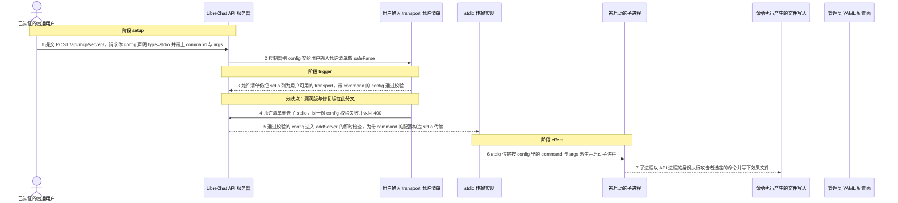
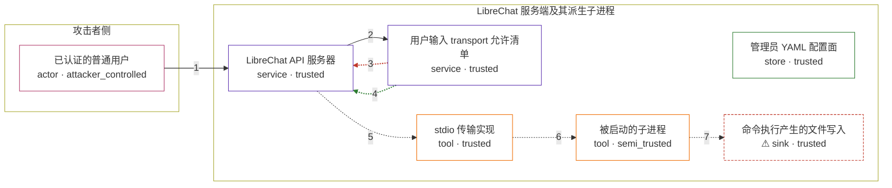

# librechat / CVE-2026-22252

状态：草稿，未完成环境和复现。这个目录由模板生成，不构成漏洞确认。

图解的唯一来源是 `diagram.toml`：编辑后运行 `python3 -m runner diagram librechat/CVE-2026-22252` 重新生成下方的图解区块。图解必须覆盖漏洞涉及的每个主体，并标出漏洞版/修复版的分歧步骤。

<!-- diagram:begin (generated from diagram.toml by `python3 -m runner diagram`; edit diagram.toml, not this block) -->
## 漏洞图解 — librechat / CVE-2026-22252 漏洞图解

LibreChat 用 MCPServerUserInputSchema 校验用户提交的 MCP server 配置，但在 v0.8.2-rc2 之前这份允许清单里仍然包含 stdio transport，而 stdio 配置只约束形状，它的 command 与 args 会原样进入 StdioClientTransport 并派生子进程。管理员本应在 librechat.yaml 中配置 stdio，用户请求体只应接受远程 transport，所以漏洞绕过的是“用户输入不得决定执行哪条命令”这道授权边界（CWE-285）。注册表的 addServer 会在同一个请求内做 inspector 即时检查并建立连接，因此漏洞版只需一次 API 请求就能以 API 进程的身份执行攻击者选定的命令，修复版把 stdio 移出允许清单后同一请求在校验阶段失败并返回 400。

### 涉及主体

| 主体 | 类型 | 信任级别 | 在漏洞里的作用 | 来源 |
| --- | --- | --- | --- | --- |
| 已认证的普通用户 (`attacker`) | `actor` | `attacker_controlled` | 向 POST /api/mcp/servers 提交配置的调用方；唯一可控的是请求体 config 里的 type、command、args 与 env，不能改服务端代码，也不能绕开路由上的 JWT 与权限检查。 | fixtures/attack-stdio-config.json |
| LibreChat API 服务器 (`mcp_api`) | `service` | `trusted` | Express 路由与 createMCPServerController：先用 MCPServerUserInputSchema 校验 config，再把结果交给 MCP servers registry 的 addServer，由 inspector 在同一请求内建连。 | api/server/controllers/mcp.js |
| 用户输入 transport 允许清单 (`user_input_schema`) | `service` | `trusted` | MCPServerUserInputSchema 本应只接受远程 transport；缺陷是它的 union 里包含了 omitServerManagedFields(StdioOptionsSchema)，而该 schema 只约束形状、不限制命令，于是任意 command 都被当成合法用户输入。 | packages/data-provider/src/mcp.ts |
| 管理员 YAML 配置面 (`admin_config`) | `store` | `trusted` | librechat.yaml 是唯一允许声明 stdio transport 的入口；MCPOptionsSchema 至今仍包含 StdioOptionsSchema，修复只是把 stdio 从用户输入面收回，而不是删掉 stdio 功能。 | — |
| stdio 传输实现 (`stdio_transport`) | `tool` | `trusted` | constructTransport 发现配置里有 command 就走 stdio 分支，构造 StdioClientTransport；该实现最终用 child_process.spawn 启动 command 与 args。 | packages/api/src/mcp/connection.ts |
| 被启动的子进程 (`command_process`) | `tool` | `semi_trusted` | 由攻击者请求体里的 command 与 args 决定的进程，它继承了 API 进程的身份，把攻击者选定的命令带进服务端进程域。 | — |
| ⚠ 命令执行产生的文件写入 (`effect_marker`) | `sink` | `trusted` | 命令执行的可观察落点：子进程写下的固定标记文件。它证明命令确实被执行，本身不是真实的外部目标。 | — |

**信任边界**

- **攻击者侧** (`attacker_side`)：成员 `attacker`。攻击者只能控制一次 API 请求的请求体，不能控制服务端代码与权限判断，也不能凭空在容器里创建进程。
- **LibreChat 服务端及其派生子进程** (`service_side`)：成员 `mcp_api`、`user_input_schema`、`admin_config`、`stdio_transport`、`command_process`、`effect_marker`。边界内是可信的 API 代码、registry/inspector 与它们派生出的子进程；管理员 YAML 是声明 stdio 的唯一入口，用户的请求体本不应直接决定要执行哪条命令。

标 ⚠ 的主体是本仓库合成的替身或无害效果载体，不代表真实外部目标。

### 触发过程

### 主体与信任边界

箭头上的数字是上面的步骤编号；方框只标主体和信任级别，具体动作见「触发过程」。

**分歧点**：第 3 步（`vulnerable_only`）允许清单仍把 stdio 列为用户可用的 transport，带 command 的 config 通过校验。
**分歧点**：第 4 步（`patched_only`）允许清单删去了 stdio，同一份 config 校验失败并返回 400。
<!-- diagram:end -->

## 公告与机制

TODO：官方公告、漏洞根因、Agent 信任边界、受影响范围和修复来源。

## 前提

TODO：认证要求、用户交互、已有批准、工具权限、攻击者能控制的内容。

## 版本与启动

TODO：补全 metadata、Dockerfile/镜像 digest 和 Compose，再写出精确启动命令。

Compose 中 `vulnerable` 与 `patched` profiles 分开使用；未指定 profile 不启动服务。镜像变量未配置时 Compose 会明确报错。此模板不暴露宿主端口，也不挂载主机数据。

## 机制复现

TODO：实现 `reproduce.py`，固定输入并执行真实漏洞路径，注明运行位置、参数和超时。

完成实现后使用 `python3 -m runner reproduce librechat/CVE-2026-22252 --build --rounds 3`。
两脚本统一接受 `--context <context.json> --output <目录>`，详细字段见仓库 `docs/environment-contract.md`。
PoC 输出 `facts.json` 和效果文件；验证器只读证据，输出含 `target_ready` 及对应效果断言的 `verdict.json`。
镜像必须包含 Python 3 和 `/lab/` 下的脚本、fixtures；`runtime.mode` 选择 `oneshot` 或有 healthcheck 的 `service`。

## 端到端复现

TODO：实现 `end_to_end.py`；若不需要模型，明确写出不适用原因。真实模型的结果与机制复现分开统计。

## 验证与修复对照

TODO：实现 `verify.py`。记录漏洞版无害效果、修复版阻断和正常任务成功的证据，不能把服务启动失败当成阻断。

## 清理

默认运行器按每个测试的唯一 Compose project 清理容器、网络和 volume。
`--keep-on-failure` 保留失败项目，项目标识和 Compose 配置在结果目录中；仅清理该项目，不能使用全局 prune。

## 失败诊断

TODO：为本漏洞写出预期效果缺失、修复版仍有越界效果、正常任务失败及前提不满足时的具体排查路径。
启动失败、健康检查失败和超时都不能当作修复阻断。报告中应能定位到阶段、预期、实际和受控证据。

## 构建与输入

TODO：填写两版源码 archive、完整 commit，记录 `build.inputs` 中每个下载的 SHA-256；依赖安装必须支持禁网构建。
固定攻击和正常输入放入 `fixtures/` 并登记到 `fixtures/manifest.toml`。固定 seed、环境变量，说明无害效果与真实影响的关系。

## 隔离例外

默认无例外。确需例外时同时填写 `runtime.exceptions`、理由及最小范围，晋升由两位维护者审阅。

## 来源与许可

TODO：列出引用代码、fixtures 和镜像的来源及许可。
