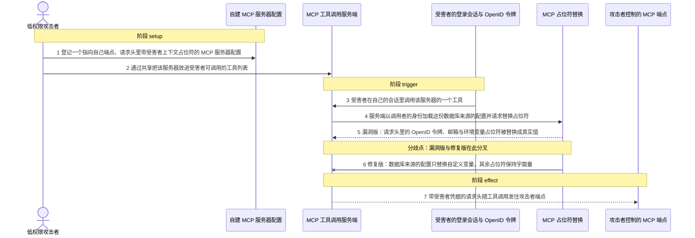
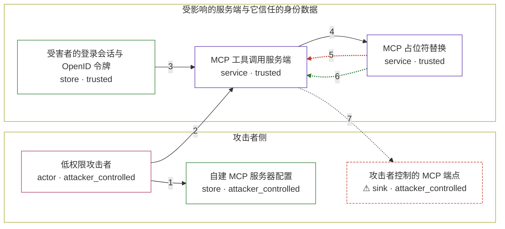

# librechat / CVE-2026-31951

状态：草稿，未完成环境和复现。这个目录由模板生成，不构成漏洞确认。

图解的唯一来源是 `diagram.toml`：编辑后运行 `python3 -m runner diagram librechat/CVE-2026-31951` 重新生成下方的图解区块。图解必须覆盖漏洞涉及的每个主体，并标出漏洞版/修复版的分歧步骤。

<!-- diagram:begin (generated from diagram.toml by `python3 -m runner diagram`; edit diagram.toml, not this block) -->
## 漏洞图解 — LibreChat 自建 MCP 服务器请求头占位符注入（CVE-2026-31951）

低权限用户可以把自建 MCP 服务器的请求头写成调用者上下文占位符；工具调用时，服务端用调用者（受害者）的身份解析这份数据库来源的配置，把受害者的 OpenID 访问令牌、邮箱和服务端环境变量替换进请求头。修复版对数据库来源的配置只解析自定义变量，其余占位符保持字面量，凭据不再进入发往攻击者端点的请求。

### 涉及主体

| 主体 | 类型 | 信任级别 | 在漏洞里的作用 | 来源 |
| --- | --- | --- | --- | --- |
| 低权限攻击者 (`attacker`) | `actor` | `attacker_controlled` | 已登录的普通用户；他能决定自己提交的 MCP 服务器地址与请求头内容，但拿不到受害者的会话和令牌。 | fixtures/attack.json |
| 自建 MCP 服务器配置 (`mcp_server_config`) | `store` | `attacker_controlled` | 攻击者提交并共享的服务器配置，带 dbId 标识其来自数据库，请求头里写着调用者上下文占位符。 | packages/api/src/mcp/registry/db/ServerConfigsDB.ts |
| MCP 工具调用服务端 (`mcp_manager`) | `service` | `trusted` | 工具调用时以调用者的身份加载目标服务器配置，并把配置里的请求头写入该服务器的连接。 | packages/api/src/mcp/MCPManager.ts |
| MCP 占位符替换 (`env_resolver`) | `service` | `trusted` | 把配置中 env、args、headers、url、oauth 的占位符替换成调用者上下文的值；修复在这里为数据库来源的配置加了提前返回。 | packages/api/src/utils/env.ts |
| 受害者的登录会话与 OpenID 令牌 (`victim_session`) | `store` | `trusted` | 受害者的账号身份、邮箱和 OpenID 访问令牌，攻击者本来够不着。 | packages/api/src/utils/oidc.ts |
| ⚠ 攻击者控制的 MCP 端点 (`attacker_endpoint`) | `sink` | `attacker_controlled` | 接收工具调用请求，从而拿到被替换进请求头的受害者凭据。 | fixtures/attack.json |

**信任边界**

- **攻击者侧** (`attacker_side`)：成员 `attacker`、`mcp_server_config`、`attacker_endpoint`。攻击者能控制自己的账号、提交的服务器配置和自己的端点地址；受害者的会话与令牌不在这里。
- **受影响的服务端与它信任的身份数据** (`product`)：成员 `mcp_manager`、`env_resolver`、`victim_session`。服务端本应只把管理端配置里的占位符解析成调用者身份；漏洞让用户自建的配置也走同一条替换路径。

标 ⚠ 的主体是本仓库合成的替身或无害效果载体，不代表真实外部目标。

### 触发过程

### 主体与信任边界

箭头上的数字是上面的步骤编号；方框只标主体和信任级别，具体动作见「触发过程」。

**分歧点**：第 5 步（`vulnerable_only`）漏洞版：请求头里的 OpenID 令牌、邮箱与环境变量占位符被替换成真实值。
**分歧点**：第 6 步（`patched_only`）修复版：数据库来源的配置只替换自定义变量，其余占位符保持字面量。
<!-- diagram:end -->

## 公告与机制

TODO：官方公告、漏洞根因、Agent 信任边界、受影响范围和修复来源。

## 前提

TODO：认证要求、用户交互、已有批准、工具权限、攻击者能控制的内容。

## 版本与启动

TODO：补全 metadata、Dockerfile/镜像 digest 和 Compose，再写出精确启动命令。

Compose 中 `vulnerable` 与 `patched` profiles 分开使用；未指定 profile 不启动服务。镜像变量未配置时 Compose 会明确报错。此模板不暴露宿主端口，也不挂载主机数据。

## 机制复现

TODO：实现 `reproduce.py`，固定输入并执行真实漏洞路径，注明运行位置、参数和超时。

完成实现后使用 `python3 -m runner reproduce librechat/CVE-2026-31951 --build --rounds 3`。
两脚本统一接受 `--context <context.json> --output <目录>`，详细字段见仓库 `docs/environment-contract.md`。
PoC 输出 `facts.json` 和效果文件；验证器只读证据，输出含 `target_ready` 及对应效果断言的 `verdict.json`。
镜像必须包含 Python 3 和 `/lab/` 下的脚本、fixtures；`runtime.mode` 选择 `oneshot` 或有 healthcheck 的 `service`。

## 端到端复现

TODO：实现 `end_to_end.py`；若不需要模型，明确写出不适用原因。真实模型的结果与机制复现分开统计。

## 验证与修复对照

TODO：实现 `verify.py`。记录漏洞版无害效果、修复版阻断和正常任务成功的证据，不能把服务启动失败当成阻断。

## 清理

默认运行器按每个测试的唯一 Compose project 清理容器、网络和 volume。
`--keep-on-failure` 保留失败项目，项目标识和 Compose 配置在结果目录中；仅清理该项目，不能使用全局 prune。

## 失败诊断

TODO：为本漏洞写出预期效果缺失、修复版仍有越界效果、正常任务失败及前提不满足时的具体排查路径。
启动失败、健康检查失败和超时都不能当作修复阻断。报告中应能定位到阶段、预期、实际和受控证据。

## 构建与输入

TODO：填写两版源码 archive、完整 commit，记录 `build.inputs` 中每个下载的 SHA-256；依赖安装必须支持禁网构建。
固定攻击和正常输入放入 `fixtures/` 并登记到 `fixtures/manifest.toml`。固定 seed、环境变量，说明无害效果与真实影响的关系。

## 隔离例外

默认无例外。确需例外时同时填写 `runtime.exceptions`、理由及最小范围，晋升由两位维护者审阅。

## 来源与许可

TODO：列出引用代码、fixtures 和镜像的来源及许可。
