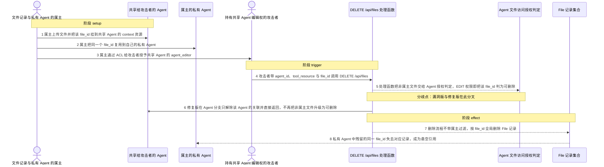
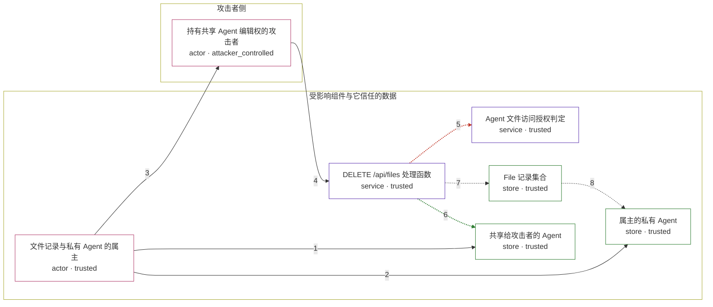

# librechat / CVE-2026-44654

状态：草稿，未完成环境和复现。这个目录由模板生成，不构成漏洞确认。

图解的唯一来源是 `diagram.toml`：编辑后运行 `python3 -m runner diagram librechat/CVE-2026-44654` 重新生成下方的图解区块。图解必须覆盖漏洞涉及的每个主体，并标出漏洞版/修复版的分歧步骤。

<!-- diagram:begin (generated from diagram.toml by `python3 -m runner diagram`; edit diagram.toml, not this block) -->
## 漏洞图解 — librechat / CVE-2026-44654 跨 Agent 全局删除文件记录

共享 Agent 的 agent_editor 只是对挂载在该 Agent 上文件的协作使用权，却被 DELETE /api/files 当成删除他人文件记录的授权：处理函数把非属主文件交给基于 Agent EDIT 的判定，判定放行后不带属主过滤地按 file_id 全局删除 File 记录。属主把同一 file_id 复用到私有 Agent 后，记录被删使私有 Agent 的引用变成悬空。修复版在 Agent 分支只解除关联，全局删除仅限请求者自己拥有的文件。

### 涉及主体

| 主体 | 类型 | 信任级别 | 在漏洞里的作用 | 来源 |
| --- | --- | --- | --- | --- |
| 持有共享 Agent 编辑权的攻击者 (`attacker`) | `actor` | `attacker_controlled` | 对共享 Agent 持有 agent_editor 的用户。它只能构造这一次 DELETE /api/files 的请求体（file_id、filepath、agent_id、tool_resource），无法直接写数据库或读取属主文件。 | — |
| 文件记录与私有 Agent 的属主 (`owner`) | `actor` | `trusted` | 上传文件、把同一 file_id 同时挂到共享 Agent 与私有 Agent 的正常用户。这些挂载是漏洞前提，不是攻击动作。 | — |
| DELETE /api/files 处理函数 (`files_api`) | `service` | `trusted` | 删除入口。它把请求者对该 Agent 的 EDIT 权限当作可删除该 Agent 上他人文件记录的授权，并把通过判定的文件交给删除流程。 | — |
| Agent 文件访问授权判定 (`agent_access`) | `service` | `trusted` | hasAccessToFilesViaAgent 判定。isDelete 时只要求请求者对 Agent 有 EDIT，然后把 Agent 全部挂载 file_ids 中命中入参的文件标为可访问；文件属主是谁不参与判定。 | — |
| File 记录集合 (`file_store`) | `store` | `trusted` | 存放文件记录的集合。删除流程以 deleteFiles(file_ids) 调用它，未传属主过滤，因此按 file_id 删除所有匹配记录，而不是只删请求者自己的。 | — |
| 共享给攻击者的 Agent (`shared_agent`) | `store` | `trusted` | 被属主共享给攻击者的 Agent 文档，其 context 资源引用属主上传的 file_id。攻击者对它的编辑权只应影响它自己的关联。 | — |
| 属主的私有 Agent (`private_agent`) | `store` | `trusted` | 属主复用了同一 file_id 的私有 Agent 文档。它不在共享范围内，却是全局删除的最终受害者。 | — |

**信任边界**

- **攻击者侧** (`attacker_side`)：成员 `attacker`。攻击者只有一个普通账号和共享 Agent 的编辑权；它既不拥有文件记录，也不在私有 Agent 的共享范围内，只能提交这一次删除请求。
- **受影响组件与它信任的数据** (`product`)：成员 `owner`、`files_api`、`agent_access`、`file_store`、`shared_agent`、`private_agent`。这道边界应把“对某个 Agent 的协作编辑权”限制在该 Agent 自己的关联上，并把文件记录的删除限定为属主。漏洞让 EDIT 权限越界成了对他人 file_id 的全局删除权。

### 触发过程

### 主体与信任边界

箭头上的数字是上面的步骤编号；方框只标主体和信任级别，具体动作见「触发过程」。

**分歧点**：第 5 步（`vulnerable_only`）处理函数把非属主文件交给 Agent 授权判定，EDIT 权限即把该 file_id 判为可删除。
**分歧点**：第 6 步（`patched_only`）修复版在 Agent 分支只解除该 Agent 的关联并直接返回，不再把非属主文件升级为可删除。
<!-- diagram:end -->

## 公告与机制

TODO：官方公告、漏洞根因、Agent 信任边界、受影响范围和修复来源。

## 前提

TODO：认证要求、用户交互、已有批准、工具权限、攻击者能控制的内容。

## 版本与启动

TODO：补全 metadata、Dockerfile/镜像 digest 和 Compose，再写出精确启动命令。

Compose 中 `vulnerable` 与 `patched` profiles 分开使用；未指定 profile 不启动服务。镜像变量未配置时 Compose 会明确报错。此模板不暴露宿主端口，也不挂载主机数据。

## 机制复现

TODO：实现 `reproduce.py`，固定输入并执行真实漏洞路径，注明运行位置、参数和超时。

完成实现后使用 `python3 -m runner reproduce librechat/CVE-2026-44654 --build --rounds 3`。
两脚本统一接受 `--context <context.json> --output <目录>`，详细字段见仓库 `docs/environment-contract.md`。
PoC 输出 `facts.json` 和效果文件；验证器只读证据，输出含 `target_ready` 及对应效果断言的 `verdict.json`。
镜像必须包含 Python 3 和 `/lab/` 下的脚本、fixtures；`runtime.mode` 选择 `oneshot` 或有 healthcheck 的 `service`。

## 端到端复现

TODO：实现 `end_to_end.py`；若不需要模型，明确写出不适用原因。真实模型的结果与机制复现分开统计。

## 验证与修复对照

TODO：实现 `verify.py`。记录漏洞版无害效果、修复版阻断和正常任务成功的证据，不能把服务启动失败当成阻断。

## 清理

默认运行器按每个测试的唯一 Compose project 清理容器、网络和 volume。
`--keep-on-failure` 保留失败项目，项目标识和 Compose 配置在结果目录中；仅清理该项目，不能使用全局 prune。

## 失败诊断

TODO：为本漏洞写出预期效果缺失、修复版仍有越界效果、正常任务失败及前提不满足时的具体排查路径。
启动失败、健康检查失败和超时都不能当作修复阻断。报告中应能定位到阶段、预期、实际和受控证据。

## 构建与输入

TODO：填写两版源码 archive、完整 commit，记录 `build.inputs` 中每个下载的 SHA-256；依赖安装必须支持禁网构建。
固定攻击和正常输入放入 `fixtures/` 并登记到 `fixtures/manifest.toml`。固定 seed、环境变量，说明无害效果与真实影响的关系。

## 隔离例外

默认无例外。确需例外时同时填写 `runtime.exceptions`、理由及最小范围，晋升由两位维护者审阅。

## 来源与许可

TODO：列出引用代码、fixtures 和镜像的来源及许可。
