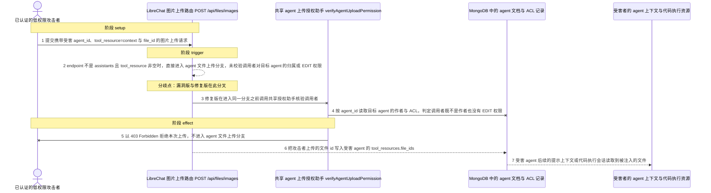
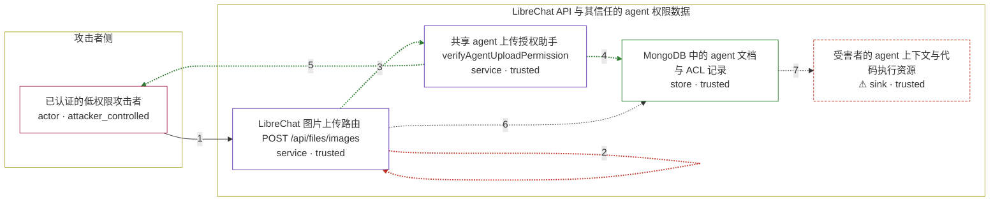

# librechat / CVE-2026-54027

状态：草稿，未完成环境和复现。这个目录由模板生成，不构成漏洞确认。

图解的唯一来源是 `diagram.toml`：编辑后运行 `python3 -m runner diagram librechat/CVE-2026-54027` 重新生成下方的图解区块。图解必须覆盖漏洞涉及的每个主体，并标出漏洞版/修复版的分歧步骤。

<!-- diagram:begin (generated from diagram.toml by `python3 -m runner diagram`; edit diagram.toml, not this block) -->
## 漏洞图解 — librechat / CVE-2026-54027 漏洞图解

POST /api/files/images 只要求调用者已登录；当上传 metadata 的 endpoint 不是 assistants 且 tool_resource 非空时，路由直接进入 agent 文件上传分支，既不确认 agent_id 指向的 agent 属于谁，也不检查 EDIT 权限。同一版本里 POST /api/files 已经把“归属或 EDIT 权限”内联在路由中，修复提交把这段判断抽成 verifyAgentUploadPermission 并补到图片路由的同一分支之前。任何已认证用户因此能把自选文件登记进他人 agent 的 tool_resources，影响该 agent 后续的提示上下文与代码执行资源。

### 涉及主体

| 主体 | 类型 | 信任级别 | 在漏洞里的作用 | 来源 |
| --- | --- | --- | --- | --- |
| 已认证的低权限攻击者 (`attacker`) | `actor` | `attacker_controlled` | 持有普通账号和 JWT，能控制这次上传的 endpoint、agent_id、tool_resource、file_id 等 metadata，以及要上传的文件内容；它拿不到受害 agent 的归属或 EDIT 权限。 | fixtures/attack_request.json |
| LibreChat 图片上传路由 POST /api/files/images (`images_route`) | `service` | `trusted` | 受影响的上游组件。requireJwtAuth 只确认已登录，路由再按 metadata.endpoint 与 tool_resource 分流；漏洞版在进入 agent 文件上传分支前没有任何授权判断。 | api/server/routes/files/images.js |
| 共享 agent 上传授权助手 verifyAgentUploadPermission (`upload_auth`) | `service` | `trusted` | 修复新增的判断：按 agent_id 读取目标 agent，依次处理 message_file 与管理员旁路、作者本人、EDIT 权限，不满足时写回 404 或 403。 | packages/api/src/files/agents/auth.ts |
| MongoDB 中的 agent 文档与 ACL 记录 (`agent_store`) | `store` | `trusted` | 保存每个 agent 的作者、tool_resources.file_ids 以及按用户授予的访问角色；调用者本应凭归属或 EDIT 权限才能写入。 | fixtures/victim_agent.json |
| ⚠ 受害者的 agent 上下文与代码执行资源 (`victim_agent`) | `sink` | `trusted` | 漏洞效果的落点。被注入的文件 id 留在受害 agent 的 tool_resources 中，该 agent 后续的提示上下文或代码执行会话会读到攻击者选定的文件。 | fixtures/victim_agent.json |

**信任边界**

- **攻击者侧** (`attacker_side`)：成员 `attacker`。攻击者只能控制本次请求的 metadata、上传文件和有权限访问的账号；受害 agent 的归属与 ACL 不在其中。
- **LibreChat API 与其信任的 agent 权限数据** (`product`)：成员 `images_route`、`upload_auth`、`agent_store`、`victim_agent`。这道边界靠“只有作者或拥有 EDIT 权限的用户才能写 agent 的 tool_resources”维持；漏洞版跳过了唯一能执行该判断的调用。

标 ⚠ 的主体是本仓库合成的替身或无害效果载体，不代表真实外部目标。

### 触发过程

### 主体与信任边界

箭头上的数字是上面的步骤编号；方框只标主体和信任级别，具体动作见「触发过程」。

**分歧点**：第 2 步（`vulnerable_only`）endpoint 不是 assistants 且 tool_resource 非空时，直接进入 agent 文件上传分支，未校验调用者对目标 agent 的归属或 EDIT 权限。
**分歧点**：第 3 步（`patched_only`）修复版在进入同一分支之前调用共享授权助手核验调用者。
<!-- diagram:end -->

## 公告与机制

TODO：官方公告、漏洞根因、Agent 信任边界、受影响范围和修复来源。

## 前提

TODO：认证要求、用户交互、已有批准、工具权限、攻击者能控制的内容。

## 版本与启动

TODO：补全 metadata、Dockerfile/镜像 digest 和 Compose，再写出精确启动命令。

Compose 中 `vulnerable` 与 `patched` profiles 分开使用；未指定 profile 不启动服务。镜像变量未配置时 Compose 会明确报错。此模板不暴露宿主端口，也不挂载主机数据。

## 机制复现

TODO：实现 `reproduce.py`，固定输入并执行真实漏洞路径，注明运行位置、参数和超时。

完成实现后使用 `python3 -m runner reproduce librechat/CVE-2026-54027 --build --rounds 3`。
两脚本统一接受 `--context <context.json> --output <目录>`，详细字段见仓库 `docs/environment-contract.md`。
PoC 输出 `facts.json` 和效果文件；验证器只读证据，输出含 `target_ready` 及对应效果断言的 `verdict.json`。
镜像必须包含 Python 3 和 `/lab/` 下的脚本、fixtures；`runtime.mode` 选择 `oneshot` 或有 healthcheck 的 `service`。

## 端到端复现

TODO：实现 `end_to_end.py`；若不需要模型，明确写出不适用原因。真实模型的结果与机制复现分开统计。

## 验证与修复对照

TODO：实现 `verify.py`。记录漏洞版无害效果、修复版阻断和正常任务成功的证据，不能把服务启动失败当成阻断。

## 清理

默认运行器按每个测试的唯一 Compose project 清理容器、网络和 volume。
`--keep-on-failure` 保留失败项目，项目标识和 Compose 配置在结果目录中；仅清理该项目，不能使用全局 prune。

## 失败诊断

TODO：为本漏洞写出预期效果缺失、修复版仍有越界效果、正常任务失败及前提不满足时的具体排查路径。
启动失败、健康检查失败和超时都不能当作修复阻断。报告中应能定位到阶段、预期、实际和受控证据。

## 构建与输入

TODO：填写两版源码 archive、完整 commit，记录 `build.inputs` 中每个下载的 SHA-256；依赖安装必须支持禁网构建。
固定攻击和正常输入放入 `fixtures/` 并登记到 `fixtures/manifest.toml`。固定 seed、环境变量，说明无害效果与真实影响的关系。

## 隔离例外

默认无例外。确需例外时同时填写 `runtime.exceptions`、理由及最小范围，晋升由两位维护者审阅。

## 来源与许可

TODO：列出引用代码、fixtures 和镜像的来源及许可。
