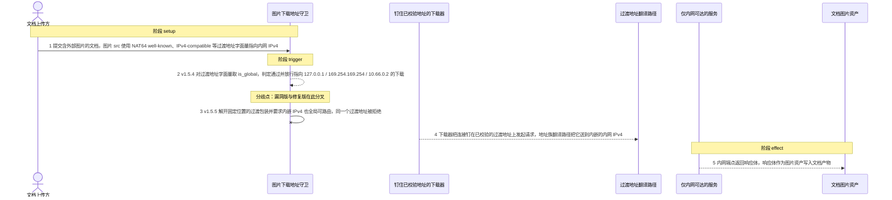
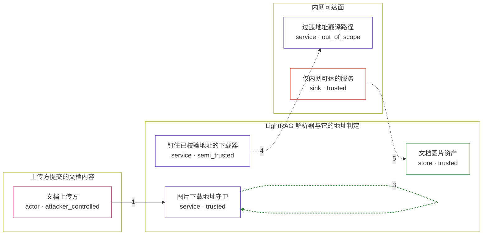

# lightrag / CVE-2026-85740

状态：草稿，未完成环境和复现。这个目录由模板生成，不构成漏洞确认。

图解的唯一来源是 `diagram.toml`：编辑后运行 `python3 -m runner diagram lightrag/CVE-2026-85740` 重新生成下方的图解区块。图解必须覆盖漏洞涉及的每个主体，并标出漏洞版/修复版的分歧步骤。

<!-- diagram:begin (generated from diagram.toml by `python3 -m runner diagram`; edit diagram.toml, not this block) -->
## 漏洞图解 — lightrag / CVE-2026-85740 漏洞图解

LightRAG 原生 markdown 解析器默认下载文档里的外部图片，下载前只用 ipaddress.is_global 判定解析出的字面地址是否全局可路由。IPv6 过渡地址（NAT64 well-known 64:ff9b::/96、IPv4-compatible ::/96）内嵌的内网 IPv4 从未被解码，字面地址却被判为 global，于是指向回环、RFC1918 与云元数据的图片 URL 通过守卫，被钉在同一个已校验地址上的连接把请求发往内网目标，响应体被当作文档图片资产摄入。修复后的判定先解开固定位置的过渡包装、并要求内嵌 IPv4 本身 global，同样的字面地址被拒绝。

### 涉及主体

| 主体 | 类型 | 信任级别 | 在漏洞里的作用 | 来源 |
| --- | --- | --- | --- | --- |
| 文档上传方 (`uploader`) | `actor` | `attacker_controlled` | 提交一份文档，内容里的外部图片 src 是攻击者唯一可控的输入：这些 src 用 IPv6 过渡地址字面量指向内网 IPv4。 | fixtures/markdown-attack.md |
| 图片下载地址守卫 (`image_guard`) | `service` | `trusted` | 解析图片主机后判定地址是否全局可路由。v1.5.4 直接对字面地址取 is_global，不解码过渡包装里的内网 IPv4，因此放行；v1.5.5 先解开固定位置的包装并要求内嵌 IPv4 也 global。 | inputs/vulnerable/parser.py |
| 钉住已校验地址的下载器 (`pinned_downloader`) | `service` | `semi_trusted` | 只连接守卫校验过的那个字面地址，避免 DNS 重绑定；一旦守卫放行，它就把请求发往该过渡地址，不做第二层内网判定。 | — |
| 过渡地址翻译路径 (`transition_path`) | `service` | `out_of_scope` | 部署侧把 NAT64 well-known 过渡地址翻译成内嵌 IPv4 目标的地址族翻译路径。它是漏洞成立的环境前提，不是攻击者的动作。 | — |
| 仅内网可达的服务 (`internal_service`) | `sink` | `trusted` | 回环、RFC1918 或云元数据端点。它本不该被文档上传方触达，守卫失效后却收到下载请求并返回响应体。 | — |
| 文档图片资产 (`asset_store`) | `store` | `trusted` | 解析器把下载回来的响应体校验成图片后写入的资产，内网响应由此进入文档产物。 | — |

**信任边界**

- **上传方提交的文档内容** (`untrusted_document`)：成员 `uploader`。上传方可控的只有文档正文与图片 src；它对服务器进程和网络位置没有写权限。
- **LightRAG 解析器与它的地址判定** (`lightrag_service`)：成员 `image_guard`、`pinned_downloader`、`asset_store`。守卫的意图是默认拒绝：只有全局可路由的地址才允许下载。漏洞让它对过渡包装内的内网 IPv4 失效。
- **内网可达面** (`internal_reach`)：成员 `transition_path`、`internal_service`。地址族翻译与内网端点本应在文档上传方够不着的范围内；守卫放行后翻译路径把已校验的过渡地址送到这里。

### 触发过程

### 主体与信任边界

箭头上的数字是上面的步骤编号；方框只标主体和信任级别，具体动作见「触发过程」。

**分歧点**：第 2 步（`vulnerable_only`）v1.5.4 对过渡地址字面量取 is_global，判定通过并放行指向 127.0.0.1 / 169.254.169.254 / 10.66.0.2 的下载。
**分歧点**：第 3 步（`patched_only`）v1.5.5 解开固定位置的过渡包装并要求内嵌 IPv4 也全局可路由，同一个过渡地址被拒绝。
<!-- diagram:end -->

## 公告与机制

TODO：官方公告、漏洞根因、Agent 信任边界、受影响范围和修复来源。

## 前提

TODO：认证要求、用户交互、已有批准、工具权限、攻击者能控制的内容。

## 版本与启动

TODO：补全 metadata、Dockerfile/镜像 digest 和 Compose，再写出精确启动命令。

Compose 中 `vulnerable` 与 `patched` profiles 分开使用；未指定 profile 不启动服务。镜像变量未配置时 Compose 会明确报错。此模板不暴露宿主端口，也不挂载主机数据。

## 机制复现

TODO：实现 `reproduce.py`，固定输入并执行真实漏洞路径，注明运行位置、参数和超时。

完成实现后使用 `python3 -m runner reproduce lightrag/CVE-2026-85740 --build --rounds 3`。
两脚本统一接受 `--context <context.json> --output <目录>`，详细字段见仓库 `docs/environment-contract.md`。
PoC 输出 `facts.json` 和效果文件；验证器只读证据，输出含 `target_ready` 及对应效果断言的 `verdict.json`。
镜像必须包含 Python 3 和 `/lab/` 下的脚本、fixtures；`runtime.mode` 选择 `oneshot` 或有 healthcheck 的 `service`。

## 端到端复现

TODO：实现 `end_to_end.py`；若不需要模型，明确写出不适用原因。真实模型的结果与机制复现分开统计。

## 验证与修复对照

TODO：实现 `verify.py`。记录漏洞版无害效果、修复版阻断和正常任务成功的证据，不能把服务启动失败当成阻断。

## 清理

默认运行器按每个测试的唯一 Compose project 清理容器、网络和 volume。
`--keep-on-failure` 保留失败项目，项目标识和 Compose 配置在结果目录中；仅清理该项目，不能使用全局 prune。

## 失败诊断

TODO：为本漏洞写出预期效果缺失、修复版仍有越界效果、正常任务失败及前提不满足时的具体排查路径。
启动失败、健康检查失败和超时都不能当作修复阻断。报告中应能定位到阶段、预期、实际和受控证据。

## 构建与输入

TODO：填写两版源码 archive、完整 commit，记录 `build.inputs` 中每个下载的 SHA-256；依赖安装必须支持禁网构建。
固定攻击和正常输入放入 `fixtures/` 并登记到 `fixtures/manifest.toml`。固定 seed、环境变量，说明无害效果与真实影响的关系。

## 隔离例外

默认无例外。确需例外时同时填写 `runtime.exceptions`、理由及最小范围，晋升由两位维护者审阅。

## 来源与许可

TODO：列出引用代码、fixtures 和镜像的来源及许可。
