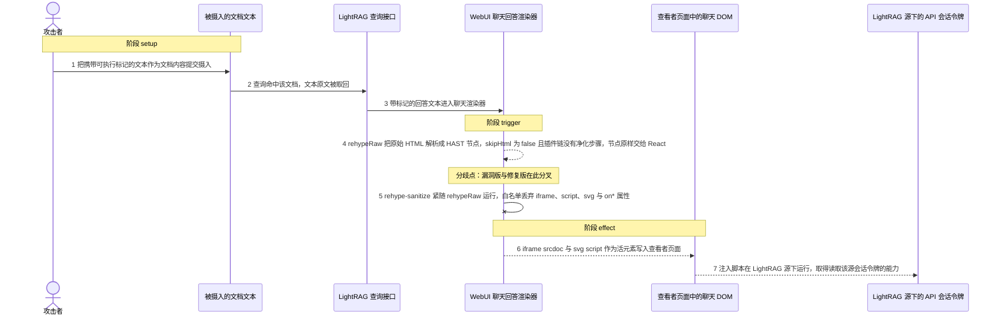
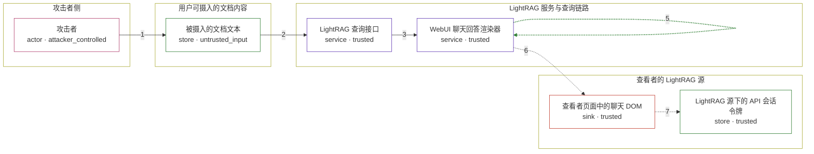

# lightrag / CVE-2026-86062

状态：草稿，未完成环境和复现。这个目录由模板生成，不构成漏洞确认。

图解的唯一来源是 `diagram.toml`：编辑后运行 `python3 -m runner diagram lightrag/CVE-2026-86062` 重新生成下方的图解区块。图解必须覆盖漏洞涉及的每个主体，并标出漏洞版/修复版的分歧步骤。

<!-- diagram:begin (generated from diagram.toml by `python3 -m runner diagram`; edit diagram.toml, not this block) -->
## 漏洞图解 — lightrag / CVE-2026-86062 存储型 XSS 漏洞图解

LightRAG 把用户摄入的文档文本原样带进助手回答，而 WebUI 的回答与思考渲染器用 rehypeRaw 解析其中的原始 HTML、 skipHtml=false，插件链里却没有净化步骤，浏览器可执行元素因此被当作可信内容渲染。 被绕过的边界是“不可信文档内容到受信聊天渲染层”：同一段文本在漏洞版直接变成活 DOM， 修复版在 rehypeRaw 之后紧跟 rehype-sanitize 白名单把它丢弃。 效果落在查看者的 LightRAG 源内，注入脚本可在该源下运行并读取该源保存的 API 会话令牌。

### 涉及主体

| 主体 | 类型 | 信任级别 | 在漏洞里的作用 | 来源 |
| --- | --- | --- | --- | --- |
| 攻击者 (`attacker`) | `actor` | `attacker_controlled` | 构造携带原始 HTML 的文档文本并提交摄入；它能控制的只有这段文本，够不到查看者的浏览器会话。 | — |
| 被摄入的文档文本 (`ingested_content`) | `store` | `untrusted_input` | 保存攻击者提交的原文，其中包含 iframe srcdoc、svg script 等可执行标记；它未经编码就进入回答链路。 | fixtures/attack_ingested_answer.md |
| LightRAG 查询接口 (`query_api`) | `service` | `trusted` | 查询时把命中的文档文本作为回答内容返回，回答里原样带着攻击者写入的标记。 | — |
| WebUI 聊天回答渲染器 (`chat_renderer`) | `service` | `trusted` | 用 rehypeRaw 把回答中的原始 HTML 解析成 HAST 节点并交给 React；漏洞版没有净化步骤，边界在这里失效。 | — |
| 查看者页面中的聊天 DOM (`viewer_dom`) | `sink` | `trusted` | 渲染结果最终注入的页面节点；漏洞版里 iframe srcdoc 与 svg script 在这里成为可执行元素。 | — |
| LightRAG 源下的 API 会话令牌 (`session_token`) | `store` | `trusted` | WebUI 为当前源保存的访问令牌，原本只有该源的脚本能读到；注入脚本在同一源下运行后即可读取它。 | — |

**信任边界**

- **攻击者侧** (`attacker_side`)：成员 `attacker`。攻击者只能决定提交的文档文本内容，无法直接访问查看者的浏览器或服务端存储。
- **用户可摄入的文档内容** (`untrusted_content`)：成员 `ingested_content`。这里是不可信区：文档内容由用户提供，永远不应被下游当作可信页面内容。
- **LightRAG 服务与查询链路** (`lightrag_service`)：成员 `query_api`、`chat_renderer`。服务端本可以编码或过滤回答内容；它选择原样返回，并把净化责任推给渲染器。
- **查看者的 LightRAG 源** (`viewer_origin`)：成员 `viewer_dom`、`session_token`。这道边界靠同源策略保护令牌：只有本源的脚本能读它。漏洞让文档内容变成了本源的脚本。

### 触发过程

### 主体与信任边界

箭头上的数字是上面的步骤编号；方框只标主体和信任级别，具体动作见「触发过程」。

**分歧点**：第 4 步（`vulnerable_only`）rehypeRaw 把原始 HTML 解析成 HAST 节点，skipHtml 为 false 且插件链没有净化步骤，节点原样交给 React。
**分歧点**：第 5 步（`patched_only`）rehype-sanitize 紧随 rehypeRaw 运行，白名单丢弃 iframe、script、svg 与 on* 属性。
<!-- diagram:end -->

## 公告与机制

TODO：官方公告、漏洞根因、Agent 信任边界、受影响范围和修复来源。

## 前提

TODO：认证要求、用户交互、已有批准、工具权限、攻击者能控制的内容。

## 版本与启动

TODO：补全 metadata、Dockerfile/镜像 digest 和 Compose，再写出精确启动命令。

Compose 中 `vulnerable` 与 `patched` profiles 分开使用；未指定 profile 不启动服务。镜像变量未配置时 Compose 会明确报错。此模板不暴露宿主端口，也不挂载主机数据。

## 机制复现

TODO：实现 `reproduce.py`，固定输入并执行真实漏洞路径，注明运行位置、参数和超时。

完成实现后使用 `python3 -m runner reproduce lightrag/CVE-2026-86062 --build --rounds 3`。
两脚本统一接受 `--context <context.json> --output <目录>`，详细字段见仓库 `docs/environment-contract.md`。
PoC 输出 `facts.json` 和效果文件；验证器只读证据，输出含 `target_ready` 及对应效果断言的 `verdict.json`。
镜像必须包含 Python 3 和 `/lab/` 下的脚本、fixtures；`runtime.mode` 选择 `oneshot` 或有 healthcheck 的 `service`。

## 端到端复现

TODO：实现 `end_to_end.py`；若不需要模型，明确写出不适用原因。真实模型的结果与机制复现分开统计。

## 验证与修复对照

TODO：实现 `verify.py`。记录漏洞版无害效果、修复版阻断和正常任务成功的证据，不能把服务启动失败当成阻断。

## 清理

默认运行器按每个测试的唯一 Compose project 清理容器、网络和 volume。
`--keep-on-failure` 保留失败项目，项目标识和 Compose 配置在结果目录中；仅清理该项目，不能使用全局 prune。

## 失败诊断

TODO：为本漏洞写出预期效果缺失、修复版仍有越界效果、正常任务失败及前提不满足时的具体排查路径。
启动失败、健康检查失败和超时都不能当作修复阻断。报告中应能定位到阶段、预期、实际和受控证据。

## 构建与输入

TODO：填写两版源码 archive、完整 commit，记录 `build.inputs` 中每个下载的 SHA-256；依赖安装必须支持禁网构建。
固定攻击和正常输入放入 `fixtures/` 并登记到 `fixtures/manifest.toml`。固定 seed、环境变量，说明无害效果与真实影响的关系。

## 隔离例外

默认无例外。确需例外时同时填写 `runtime.exceptions`、理由及最小范围，晋升由两位维护者审阅。

## 来源与许可

TODO：列出引用代码、fixtures 和镜像的来源及许可。
