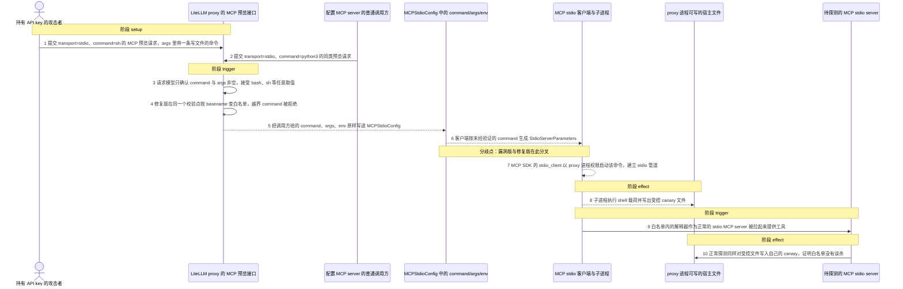
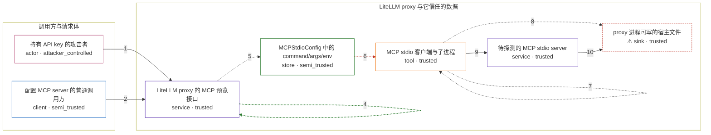

# litellm / CVE-2026-30623

状态：草稿，未完成环境和复现。这个目录由模板生成，不构成漏洞确认。

图解的唯一来源是 `diagram.toml`：编辑后运行 `python3 -m runner diagram litellm/CVE-2026-30623` 重新生成下方的图解区块。图解必须覆盖漏洞涉及的每个主体，并标出漏洞版/修复版的分歧步骤。

<!-- diagram:begin (generated from diagram.toml by `python3 -m runner diagram`; edit diagram.toml, not this block) -->
## 漏洞图解 — litellm / CVE-2026-30623 漏洞图解

LiteLLM 的 MCP 预览接口允许调用方在请求体里自带 stdio transport 的 command 字段。漏洞版只校验该字段存在，不校验取值，于是 bash、sh 等任意可执行文件被原样写进 MCPStdioConfig，并由 MCP 客户端以 proxy 进程权限拉起子进程，把一次连接测试变成任意命令执行。修复版在请求模型里按 os.path.basename 对 command 做白名单校验，越界命令在解析阶段即被拒绝。

### 涉及主体

| 主体 | 类型 | 信任级别 | 在漏洞里的作用 | 来源 |
| --- | --- | --- | --- | --- |
| 持有 API key 的攻击者 (`attacker`) | `actor` | `attacker_controlled` | 构造 POST /mcp-rest/test/connection 的请求体，唯一可控的是 server_name、transport、command、args、env 这些字段；它拿不到宿主 shell，只能要求 LiteLLM 替它把 command 跑起来。 | fixtures/mcp_test_connection_command_injection.json |
| 配置 MCP server 的普通调用方 (`benign_client`) | `client` | `semi_trusted` | 走同一条 stdio 预览路径，但 command 取白名单内的解释器，用来证明修复版的白名单没有误杀正常的 stdio MCP server 配置。 | fixtures/mcp_test_connection_allowed_command.json |
| LiteLLM proxy 的 MCP 预览接口 (`proxy`) | `service` | `trusted` | 受影响的上游组件：请求模型只检查 command 非空，接口把请求体转成 MCPServer 后立刻构造客户端。修复版在这里新增 os.path.basename 白名单校验，越界取值在请求解析阶段就抛错。 | litellm/proxy/_types.py |
| MCPStdioConfig 中的 command/args/env (`stdio_config`) | `store` | `semi_trusted` | 由请求体原样导出的 stdio 启动配置。漏洞版把调用方给的 command 与 args 直接写入，没有任何来源校验或取值校验。 | litellm/proxy/_experimental/mcp_server/mcp_server_manager.py |
| MCP stdio 客户端与子进程 (`mcp_client`) | `tool` | `trusted` | MCPClient 按 stdio_config 生成 StdioServerParameters 并交给 MCP SDK 的 stdio_client 拉起子进程；它只负责执行，不判断 command 是否该被执行。 | litellm/experimental_mcp_client/client.py |
| ⚠ proxy 进程可写的宿主文件 (`host_file`) | `sink` | `trusted` | 受控效果落点：被拉起的子进程以 proxy 的权限在宿主上写出的文件。这里是无害的 canary 载荷，代表任意命令执行能力，不是真实的外部目标。 | litellm/experimental_mcp_client/client.py |
| 待探测的 MCP stdio server (`mcp_probe`) | `service` | `trusted` | 漏洞前提：一个真正实现 MCP 协议的 stdio server，可以是被白名单接受的解释器启动的进程。它是连接测试接口本来要连上的对象，与命令注入无关。 | litellm/proxy/_experimental/mcp_server/mcp_server_manager.py |

**信任边界**

- **调用方与请求体** (`caller`)：成员 `attacker`、`benign_client`。边界外的调用方只有一个已签发的 API key 和这次请求的字段，既读不到宿主文件，也不能指定 LiteLLM 进程执行什么；它必须借 proxy 自己的权限才能落地。
- **LiteLLM proxy 与它信任的数据** (`product`)：成员 `proxy`、`stdio_config`、`mcp_client`、`host_file`、`mcp_probe`。边界内侧是 proxy 进程、由它构造的 stdio 配置、它拉起的 MCP 子进程、子进程能写到的宿主文件，以及待探测的 MCP server。命令白名单本该决定哪些可执行文件能穿过这道边界，漏洞版让任意 command 直接穿过。

标 ⚠ 的主体是本仓库合成的替身或无害效果载体，不代表真实外部目标。

### 触发过程

### 主体与信任边界

箭头上的数字是上面的步骤编号；方框只标主体和信任级别，具体动作见「触发过程」。

**分歧点**：第 6 步（`vulnerable_only`）客户端按未经验证的 command 生成 StdioServerParameters。
<!-- diagram:end -->

## 公告与机制

- canonical：`CVE-2026-30623`，alias `GHSA-GW7C-8JFV-4MJ2`（Unreviewed），CWE-77；NVD 给出 CVSS 3.1 `9.8`
  的 CISA-ADP 二级评分（`PR:N`，与厂商公告和源码不符，见「前提」）。
- 根因：`litellm/proxy/_types.py` 的 `NewMCPServerRequest.validate_transport_fields` 对 `transport=stdio`
  只检查 `command`/`args` 非空，不检查取值；`mcp_server_manager._create_mcp_client` 把调用方给的
  `command`/`args` 原样写进 `MCPStdioConfig`；`litellm/experimental_mcp_client/client.py` 用
  `StdioServerParameters` + MCP SDK 的 `stdio_client` 拉起子进程，于是预览接口变成任意命令执行。
- 攻击面：`POST /mcp-rest/test/connection` 与 `POST /mcp-rest/test/tools/list`（router 前缀 `/mcp-rest`，
  在 `proxy_server.py` 中无条件挂载，不需要数据库）。
- 修复：commit `7b7f30467599a52bb028c3c98cbae4f45b4779f3`（PR #25343）。四处改动：`constants.py` 新增
  `MCP_STDIO_ALLOWED_COMMANDS`；`_types.py` 的两个请求模型按 `os.path.basename` 查白名单；
  `mcp_server_manager.py` 在 spawn 前做同样的纵深防御；`rest_endpoints.py` 把两个预览接口收紧到
  `PROXY_ADMIN`。sink 本身（`experimental_mcp_client/client.py`）两个 revision 的 blob 完全相同，
  说明修复是在构造 stdio 配置之前拦截。
- 公告来源：https://github.com/advisories/GHSA-gw7c-8jfv-4mj2、
  https://docs.litellm.ai/blog/mcp-stdio-command-injection-april-2026、
  https://nvd.nist.gov/vuln/detail/CVE-2026-30623。

## 前提

- 需要一个有效的 LiteLLM API key；厂商公告与源码一致（两个预览接口都有 `Depends(user_api_key_auth)`），
  因此 NVD 的 `PR:N` 不应被引用为「无需认证」。攻击者只需要能提交一次请求体，不需要写权限、不需要
  PROXY_ADMIN（漏洞版不检查角色）、不需要已有 MCP server 记录、不需要数据库。
- 攻击者可控的内容只有请求体的 `server_name`/`transport`/`command`/`args`/`env` 字段。
- 环境前提：已签发的 proxy key（`proxy_admin` 角色，用于在修复版上隔离出白名单这一处分歧、
  同时让正常任务不被「非管理员 403」掩盖）、一个实现 MCP 协议的 stdio server 作为正常探测目标。
  两者都不是攻击者的动作。

## 版本与启动

- vulnerable：tag `v1.83.5-nightly`，commit `62757ff48f59d74c0ca681feb85522f9d003a9e7`（修复提交的直接父节点）。
- patched：commit `7b7f30467599a52bb028c3c98cbae4f45b4779f3`（首个含修复的 tag 为 `v1.83.6-nightly`
  = `9e4352afb42a870a70f572121d6c39a32c48b3f8`，ancestry 已在 analyze 阶段实测）。
- 注意：NVD 标题写作「LiteLLM 1.18.10」，但 `v1.18.10` 源码树中不存在任何 `mcp_server` 路径，
  1.18.x 不含本漏洞代码，**不得**按该版本 pin。真实受影响代码在 `1.83.x` 系列。
- 依赖必须与源码匹配：上游 `requirements.txt` 固定 `mcp==1.26.0`；更新的 MCP SDK 会在
  `mcp_server/server.py` 导入期就抛 `AttributeError`，与漏洞无关。

Compose 中 `vulnerable` 与 `patched` profiles 分开使用；未指定 profile 不启动服务。镜像变量未配置时 Compose 会明确报错。此模板不暴露宿主端口，也不挂载主机数据。

## 机制复现

`reproduce.py` 在镜像内运行（`python3 /lab/reproduce.py --context <context.json> --output /lab/results`），
按 `context["scenario"]` 选择固定请求体：

1. 解析被固定的上游源码树（`/lab/src`，否则从 `/inputs/` 的 archive 解包），把它加入 `sys.path`；
2. 导入上游 `litellm.proxy._experimental.mcp_server.rest_endpoints`，把真实 router 挂到一个空 FastAPI 上，
   用 `dependency_overrides` 提供一张已签发的 proxy key 与 `proxy_admin` 角色；
3. 向真实路由 `POST /mcp-rest/test/connection` 发送固定请求体，链路为
   请求模型校验 → `_execute_with_mcp_client` → `_create_mcp_client` → `MCPClient.run_with_session`
   → MCP SDK `stdio_client` 子进程；
4. 把 HTTP 状态、响应体与子进程写出的 canary 落到 `--output`。

预期观测（本地在两棵固定源码树上实测）：`sh` 载荷在漏洞版得到 `200` 且 canary 存在；在修复版得到
`422 "Command 'sh' is not in the allowed commands list ..."` 且没有 canary；`python3` 正常任务在两版
都得到 `200` 且 canary 存在。「连不上 MCP server」的 200 错误响应是预期结果——MCP 握手失败发生在
命令已经被拉起之后，canary 就是该次拉起的证据。超时按 `runner reproduce` 的默认值执行。

已知覆盖边界（不夸大结论）：修复只对**可执行文件名**做白名单，`python3 -c` 这类白名单解释器仍会执行
调用方提供的代码；因此攻击用例使用 `sh`，且图中不宣称修复覆盖了参数面。

## 端到端复现

不适用：漏洞效果是 proxy 进程拉起的本地子进程副作用，不经过任何模型或供应商 API，
`metadata.toml` 因此保持 `requires_model = false`、`verification.end_to_end.status = "not_applicable"`。
真实模型的结果若日后补做，必须与机制复现分开统计。

## 验证与修复对照

`verify.py`（由 validate 阶段产出首版、solve 阶段加固）只读 `facts.json`、`observation.json`
与效果文件，不重跑攻击。三个断言：

- `vulnerable_effect_observed`：漏洞版攻击的 canary 内容为攻击载荷写出的确定性 JSON，且 HTTP 为 200；
- `patched_effect_blocked`：修复版同一请求被白名单拒绝（422 且响应含 `allowed commands list`），没有 canary；
- `benign_task_passed`：`python3` 正常任务在两版都得到 canary，未被白名单误杀。

## 清理

默认运行器按每个测试的唯一 Compose project 清理容器、网络和 volume。
`--keep-on-failure` 保留失败项目，项目标识和 Compose 配置在结果目录中；仅清理该项目，不能使用全局 prune。

## 失败诊断

- 漏洞版没有 canary：先看 `observation.json` 的 `server_error` 与 `response_text`。常见原因是镜像里
  源码树缺失（`/lab/src` 与 `/inputs/` 都没有可解包的 archive）或依赖版本不匹配（MCP SDK 必须是
  `1.26.0`，否则导入期就失败）。
- 漏洞版 canary 存在但 `http_status` 不是 200：说明请求没走到真实路由，检查 FastAPI/fastapi 版本与
  `dependency_overrides` 是否生效。
- 修复版仍有 canary 或没有 422：确认 patched 镜像用的是 `7b7f3046…` 的源码树，且没有设置
  `LITELLM_MCP_STDIO_EXTRA_COMMANDS`（该变量会扩展白名单）。
- 正常任务被拒：确认 benign 请求用的是白名单内的 `python3`，且角色是 `proxy_admin`
  （修复版对非管理员返回 403，那是权限收紧而不是白名单误杀）。
- 启动失败、导入失败、超时都不能当作修复阻断：`verify.py` 只有在 `execution_status = completed`
  且证据哈希匹配时才给出结论。

## 构建与输入

- 两版源码 archive 与完整 commit 由 build 阶段写入 `metadata.toml` 的 `[vulnerable]`/`[patched]` 和
  `build.inputs`（URL + SHA256），Dockerfile 必须在 `--network none` 下装齐运行依赖。已在 Python 3.12 上
  实测跑通本入口的最小依赖集（版本需在 build 阶段按 URL+SHA256 固定）：`mcp==1.26.0`、`fastapi`、
  `starlette`、`httpx`、`httpx-sse`、`pydantic`、`pydantic-settings`、`python-dotenv`、`openai`、
  `tiktoken`、`tokenizers`、`orjson`、`fastuuid`、`anyio`、`aiohttp`、`jsonschema`、`python-multipart`、
  `backoff`、`PyYAML`、`requests`、`Jinja2`、`opentelemetry-api`。
- 固定攻击与正常输入在 `fixtures/`，SHA-256 记录在 `fixtures/manifest.toml`。
- 无固定 seed；唯一相关的环境变量是刻意**不设置**的 `LITELLM_MCP_STDIO_EXTRA_COMMANDS`。
  canary 文件是无害效果载体，代表「以 proxy 权限执行任意命令」这一能力，不代表真实外部目标。

## 隔离例外

默认无例外。本漏洞的 PoC 会在容器内拉起一个子进程并写一个受控文件，这是被复现机制本身；
不需要宿主端口、宿主挂载或额外 capability。

## 来源与许可

- 上游源码：https://github.com/BerriAI/litellm（MIT），固定在 `62757ff4…`（vulnerable）与
  `7b7f3046…`（patched）两个 commit；镜像基础镜像 digest 由 build 阶段固定。
- fixtures 为本目录自写的合成请求体与 canary 载荷，无第三方内容、无真实凭据。
- 公告与修复来源见「公告与机制」；原始披露方为 OX Security。
