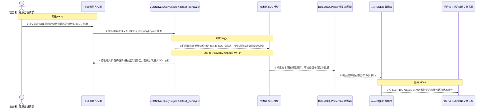

# llama-index / CVE-2024-12911

状态：草稿，未完成环境和复现。这个目录由模板生成，不构成漏洞确认。

图解的唯一来源是 `diagram.toml`：编辑后运行 `python3 -m runner diagram llama-index/CVE-2024-12911` 重新生成下方的图解区块。图解必须覆盖漏洞涉及的每个主体，并标出漏洞版/修复版的分歧步骤。

<!-- diagram:begin (generated from diagram.toml by `python3 -m runner diagram`; edit diagram.toml, not this block) -->
## 漏洞图解 — llama-index JSONalyzeQueryEngine 未校验模型输出导致 SQL 注入

上游 JSONalyzeQueryEngine 把文本到 SQL 模型的返回值当作可执行 SQL：默认解析器只裁剪 SQLQuery: 标记，既不限制单语句也不做只读约束。攻击者只要通过用户问题或数据内容做提示注入，让模型返回 ATTACH DATABASE 之类的语句，SQLite 就会在运行该工具的机器上创建攻击者指定路径的文件，实现任意文件创建；同一路径也可用于资源耗尽查询造成拒绝服务。修复版把该引擎移出 core 公开入口并在构造期弃用，注入语句不再被执行，但没有加入任何 SQL 校验。

### 涉及主体

| 主体 | 类型 | 信任级别 | 在漏洞里的作用 | 来源 |
| --- | --- | --- | --- | --- |
| 攻击者 / 恶意分析请求 (`attacker`) | `actor` | `attacker_controlled` | 构造夹带 SQL 指令的自然语言问题与被分析的 JSON 记录；它只能影响进入提示词的文本，不能直接指定要执行的 SQL。 | fixtures/attack.json |
| 查询调用方应用 (`client`) | `client` | `semi_trusted` | 把终端用户提交的问题原样交给 JSONalyzeQueryEngine.query，不做语句白名单或其他检查。 | — |
| JSONalyzeQueryEngine / default_jsonalyzer (`jsonalyze_engine`) | `service` | `trusted` | 上游查询引擎：用内存 SQLite 装载记录，把模型返回的文本交给解析器后直接执行，没有任何语句校验或只读约束。 | llama-index-core/llama_index/core/query_engine/jsonalyze_query_engine.py |
| 文本到 SQL 模型 (`llm`) | `service` | `semi_trusted` | 接收包含攻击者问题的提示词并返回 SQL 文本；被提示注入诱导时，返回的就是攻击者指定的语句。 | — |
| DefaultSQLParser 语句裁剪器 (`sql_parser`) | `tool` | `trusted` | 只按 SQLQuery: 与 SQLResult: 标记裁剪响应文本，不校验语句类型、数量或危险性。 | — |
| 内存 SQLite 数据库 (`sqlite_db`) | `store` | `trusted` | 持有被分析记录的 sqlite_utils 内存库，同时接受注入语句对文件系统的 ATTACH。 | — |
| ⚠ 运行该工具的机器文件系统 (`host_fs`) | `sink` | `trusted` | ATTACH DATABASE 在这里创建攻击者命名的数据库文件，实现任意文件创建；同一路径也可用于资源耗尽查询。 | — |

**信任边界**

- **攻击者侧** (`attacker_side`)：成员 `attacker`。攻击者只控制提交的问题与被分析的记录内容，够不到引擎里的 SQL 变量，也够不到目标机器上的文件。
- **受影响的组件与它信任的数据** (`product`)：成员 `client`、`jsonalyze_engine`、`llm`、`sql_parser`、`sqlite_db`、`host_fs`。边界内原本只应执行模型给出的分析语句；引擎把模型输出当成可信 SQL，这道边界因此失效。

标 ⚠ 的主体是本仓库合成的替身或无害效果载体，不代表真实外部目标。

### 触发过程

### 主体与信任边界

箭头上的数字是上面的步骤编号；方框只标主体和信任级别，具体动作见「触发过程」。

```mermaid
%% llama-index JSONalyzeQueryEngine 未校验模型输出导致 SQL 注入 — generated from diagram.toml
flowchart LR
  subgraph attacker_side["攻击者侧"]
    attacker["攻击者 / 恶意分析请求<br/>actor · attacker_controlled"]
  end
  subgraph product["受影响的组件与它信任的数据"]
    client["查询调用方应用<br/>client · semi_trusted"]
    jsonalyze_engine["JSONalyzeQueryEngine / default_jsonalyzer<br/>service · trusted"]
    llm["文本到 SQL 模型<br/>service · semi_trusted"]
    sql_parser["DefaultSQLParser 语句裁剪器<br/>tool · trusted"]
    sqlite_db["内存 SQLite 数据库<br/>store · trusted"]
    host_fs["运行该工具的机器文件系统<br/>⚠ sink · trusted"]
  end
  attacker -->|"1"| client
  client -->|"2"| jsonalyze_engine
  jsonalyze_engine -.->|"3"| llm
  jsonalyze_engine -.->|"4"| client
  llm -.->|"5"| sql_parser
  sql_parser -.->|"6"| sqlite_db
  sqlite_db -.->|"7"| host_fs
  classDef actor fill:transparent,stroke:#b03a6a
  classDef client fill:transparent,stroke:#1565c0
  classDef service fill:transparent,stroke:#5e35b1
  classDef tool fill:transparent,stroke:#ef6c00
  classDef sink fill:transparent,stroke:#c0392b
  classDef store fill:transparent,stroke:#2e7d32
  classDef synthetic stroke-dasharray: 4 2
  class attacker actor
  class client client
  class jsonalyze_engine service
  class llm service
  class sql_parser tool
  class sqlite_db store
  class host_fs sink
  class host_fs synthetic
  style attacker_side fill:transparent
  style product fill:transparent
  linkStyle 2 stroke:#c0392b,stroke-width:2px
  linkStyle 3 stroke:#2e7d32,stroke-width:2px
```

**分歧点**：第 3 步（`vulnerable_only`）把问题与数据表结构拼进 text-to-SQL 提示词，模型返回攻击者指定的语句。
**分歧点**：第 4 步（`patched_only`）修复版入口在构造阶段抛出弃用警告，查询从未进入 SQL 执行。
<!-- diagram:end -->

## 公告与机制

TODO：官方公告、漏洞根因、Agent 信任边界、受影响范围和修复来源。

## 前提

TODO：认证要求、用户交互、已有批准、工具权限、攻击者能控制的内容。

## 版本与启动

TODO：补全 metadata、Dockerfile/镜像 digest 和 Compose，再写出精确启动命令。

Compose 中 `vulnerable` 与 `patched` profiles 分开使用；未指定 profile 不启动服务。镜像变量未配置时 Compose 会明确报错。此模板不暴露宿主端口，也不挂载主机数据。

## 机制复现

TODO：实现 `reproduce.py`，固定输入并执行真实漏洞路径，注明运行位置、参数和超时。

完成实现后使用 `python3 -m runner reproduce llama-index/CVE-2024-12911 --build --rounds 3`。
两脚本统一接受 `--context <context.json> --output <目录>`，详细字段见仓库 `docs/environment-contract.md`。
PoC 输出 `facts.json` 和效果文件；验证器只读证据，输出含 `target_ready` 及对应效果断言的 `verdict.json`。
镜像必须包含 Python 3 和 `/lab/` 下的脚本、fixtures；`runtime.mode` 选择 `oneshot` 或有 healthcheck 的 `service`。

## 端到端复现

TODO：实现 `end_to_end.py`；若不需要模型，明确写出不适用原因。真实模型的结果与机制复现分开统计。

## 验证与修复对照

TODO：实现 `verify.py`。记录漏洞版无害效果、修复版阻断和正常任务成功的证据，不能把服务启动失败当成阻断。

## 清理

默认运行器按每个测试的唯一 Compose project 清理容器、网络和 volume。
`--keep-on-failure` 保留失败项目，项目标识和 Compose 配置在结果目录中；仅清理该项目，不能使用全局 prune。

## 失败诊断

TODO：为本漏洞写出预期效果缺失、修复版仍有越界效果、正常任务失败及前提不满足时的具体排查路径。
启动失败、健康检查失败和超时都不能当作修复阻断。报告中应能定位到阶段、预期、实际和受控证据。

## 构建与输入

TODO：填写两版源码 archive、完整 commit，记录 `build.inputs` 中每个下载的 SHA-256；依赖安装必须支持禁网构建。
固定攻击和正常输入放入 `fixtures/` 并登记到 `fixtures/manifest.toml`。固定 seed、环境变量，说明无害效果与真实影响的关系。

## 隔离例外

默认无例外。确需例外时同时填写 `runtime.exceptions`、理由及最小范围，晋升由两位维护者审阅。

## 来源与许可

TODO：列出引用代码、fixtures 和镜像的来源及许可。
