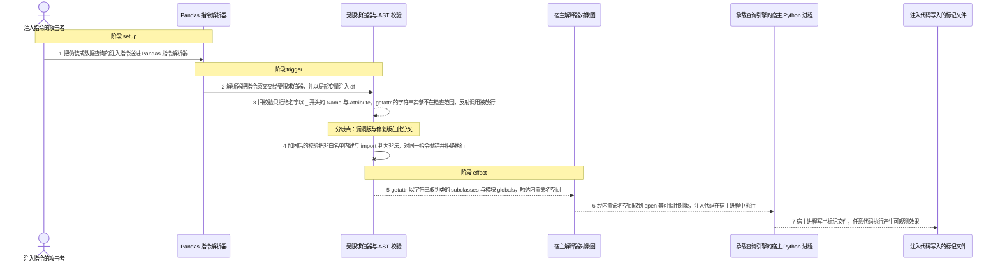
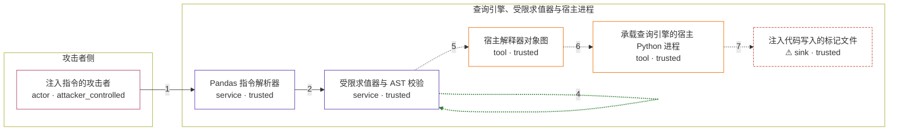

# llama-index / CVE-2024-3098

状态：草稿，未完成环境和复现。这个目录由模板生成，不构成漏洞确认。

图解的唯一来源是 `diagram.toml`：编辑后运行 `python3 -m runner diagram llama-index/CVE-2024-3098` 重新生成下方的图解区块。图解必须覆盖漏洞涉及的每个主体，并标出漏洞版/修复版的分歧步骤。

<!-- diagram:begin (generated from diagram.toml by `python3 -m runner diagram`; edit diagram.toml, not this block) -->
## 漏洞图解 — llama-index / CVE-2024-3098 漏洞图解

llama-index 的 Pandas 查询引擎把模型生成的字符串当成 Python 数据表达式执行，只靠 exec_utils 的词法级 AST 校验兜底。该校验只拒绝名字以 _ 开头的 Name 与 Attribute 节点，却看不见字符串常量，于是 getattr(df, "__class__") 这类写法可以合法地沿宿主对象图取到 dunder 属性，再用字符串下标进入内置命名空间。攻击者可控的指令因此能在宿主 Python 进程中执行任意代码，越过“只允许数据查询表达式”的信任边界。

### 涉及主体

| 主体 | 类型 | 信任级别 | 在漏洞里的作用 | 来源 |
| --- | --- | --- | --- | --- |
| 注入指令的攻击者 (`attacker`) | `actor` | `attacker_controlled` | 决定进入 Pandas 指令解析器的字符串（提示注入或被污染的模型输出是其到达路径），但够不到宿主对象图，也不能自己写文件。 | fixtures/attack_instruction.txt |
| Pandas 指令解析器 (`instruction_parser`) | `service` | `trusted` | PandasQueryEngine 的 PandasInstructionParser：把模型生成的字符串当成数据查询表达式，并以局部变量 df 交给 exec_utils 求值。它把这段字符串当作可信代码，没有区分“生成的查询”与“攻击者注入的代码”。 | — |
| 受限求值器与 AST 校验 (`safe_eval`) | `service` | `trusted` | exec_utils 的 DunderVisitor 与 safe_eval/safe_exec：本应只放行白名单内建与 df/np/pd 组成的数据表达式，实际只做名字拼写过滤。 | — |
| 宿主解释器对象图 (`object_graph`) | `tool` | `trusted` | 类的 subclasses、模块 globals 与内置命名空间。字符串反射原语可以沿它取到本不该暴露的任意可调用对象。 | — |
| 承载查询引擎的宿主 Python 进程 (`host_process`) | `tool` | `trusted` | 漏洞把这个本应只做数据查询求值的进程变成攻击者代码的执行点。 | — |
| ⚠ 注入代码写入的标记文件 (`canary_file`) | `sink` | `trusted` | 任意代码执行在受控运行里的无害落点：注入代码于宿主进程内写出的标记文件，内容只用于确认代码确实执行，不代表真实外部目标。 | — |

**信任边界**

- **攻击者侧** (`attacker_side`)：成员 `attacker`。攻击者只能决定进入解析器的指令文本，拿不到宿主对象图，也没有对宿主文件系统的直接写权限。
- **查询引擎、受限求值器与宿主进程** (`product`)：成员 `instruction_parser`、`safe_eval`、`object_graph`、`host_process`、`canary_file`。这道边界本应把求值限制在 df/np/pd 的数据表达式内；词法级校验拦不住字符串反射，边界因此失效。

标 ⚠ 的主体是本仓库合成的替身或无害效果载体，不代表真实外部目标。

### 触发过程

### 主体与信任边界

箭头上的数字是上面的步骤编号；方框只标主体和信任级别，具体动作见「触发过程」。

**分歧点**：第 3 步（`vulnerable_only`）旧校验只拒绝名字以 _ 开头的 Name 与 Attribute，getattr 的字符串实参不在检查范围，反射调用被放行。
**分歧点**：第 4 步（`patched_only`）加固后的校验把非白名单内建与 import 判为非法，对同一指令抛错并拒绝执行。
<!-- diagram:end -->

## 公告与机制

TODO：官方公告、漏洞根因、Agent 信任边界、受影响范围和修复来源。

## 前提

TODO：认证要求、用户交互、已有批准、工具权限、攻击者能控制的内容。

## 版本与启动

TODO：补全 metadata、Dockerfile/镜像 digest 和 Compose，再写出精确启动命令。

Compose 中 `vulnerable` 与 `patched` profiles 分开使用；未指定 profile 不启动服务。镜像变量未配置时 Compose 会明确报错。此模板不暴露宿主端口，也不挂载主机数据。

## 机制复现

TODO：实现 `reproduce.py`，固定输入并执行真实漏洞路径，注明运行位置、参数和超时。

完成实现后使用 `python3 -m runner reproduce llama-index/CVE-2024-3098 --build --rounds 3`。
两脚本统一接受 `--context <context.json> --output <目录>`，详细字段见仓库 `docs/environment-contract.md`。
PoC 输出 `facts.json` 和效果文件；验证器只读证据，输出含 `target_ready` 及对应效果断言的 `verdict.json`。
镜像必须包含 Python 3 和 `/lab/` 下的脚本、fixtures；`runtime.mode` 选择 `oneshot` 或有 healthcheck 的 `service`。

## 端到端复现

TODO：实现 `end_to_end.py`；若不需要模型，明确写出不适用原因。真实模型的结果与机制复现分开统计。

## 验证与修复对照

TODO：实现 `verify.py`。记录漏洞版无害效果、修复版阻断和正常任务成功的证据，不能把服务启动失败当成阻断。

## 清理

默认运行器按每个测试的唯一 Compose project 清理容器、网络和 volume。
`--keep-on-failure` 保留失败项目，项目标识和 Compose 配置在结果目录中；仅清理该项目，不能使用全局 prune。

## 失败诊断

TODO：为本漏洞写出预期效果缺失、修复版仍有越界效果、正常任务失败及前提不满足时的具体排查路径。
启动失败、健康检查失败和超时都不能当作修复阻断。报告中应能定位到阶段、预期、实际和受控证据。

## 构建与输入

TODO：填写两版源码 archive、完整 commit，记录 `build.inputs` 中每个下载的 SHA-256；依赖安装必须支持禁网构建。
固定攻击和正常输入放入 `fixtures/` 并登记到 `fixtures/manifest.toml`。固定 seed、环境变量，说明无害效果与真实影响的关系。

## 隔离例外

默认无例外。确需例外时同时填写 `runtime.exceptions`、理由及最小范围，晋升由两位维护者审阅。

## 来源与许可

TODO：列出引用代码、fixtures 和镜像的来源及许可。
