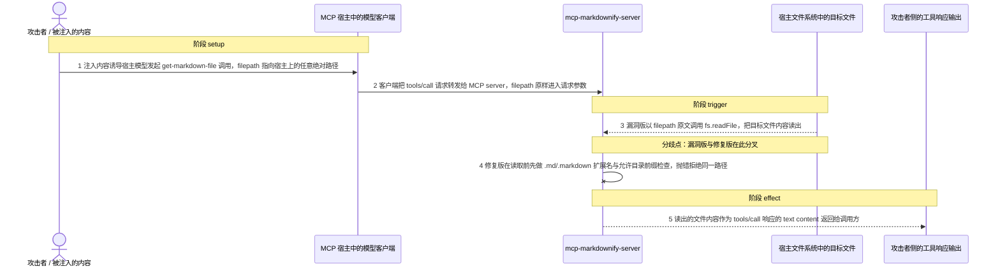
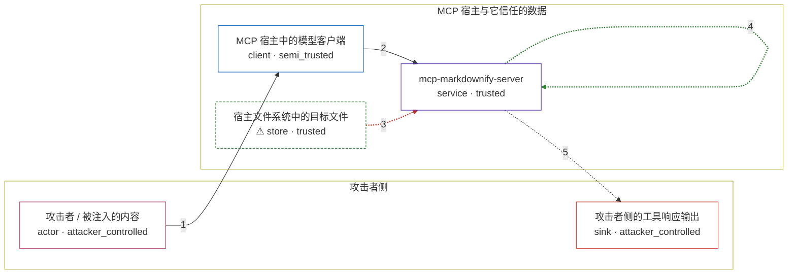

# markdownify-mcp / CVE-2025-5273

状态：草稿，未完成环境和复现。这个目录由模板生成，不构成漏洞确认。

图解的唯一来源是 `diagram.toml`：编辑后运行 `python3 -m runner diagram markdownify-mcp/CVE-2025-5273` 重新生成下方的图解区块。图解必须覆盖漏洞涉及的每个主体，并标出漏洞版/修复版的分歧步骤。

<!-- diagram:begin (generated from diagram.toml by `python3 -m runner diagram`; edit diagram.toml, not this block) -->
## 漏洞图解 — markdownify-mcp / CVE-2025-5273 任意文件读取

mcp-markdownify-server 的 get-markdown-file 工具把调用方传入的 filepath 原样交给 fs.readFile，没有路径规范化、扩展名白名单或允许目录检查。宿主模型一旦被注入内容诱导，就能让 MCP server 以自身进程权限读出宿主上的任意文件。读出的内容原样进入 tools/call 响应的 text content 并返回给调用方。修复版在读取前加入 .md/.markdown 扩展名白名单与可选的 MD_SHARE_DIR 前缀检查，同一路径被拒绝。

### 涉及主体

| 主体 | 类型 | 信任级别 | 在漏洞里的作用 | 来源 |
| --- | --- | --- | --- | --- |
| 攻击者 / 被注入的内容 (`attacker`) | `actor` | `attacker_controlled` | 通过模型可读到的内容实施提示注入，决定这一次 get-markdown-file 调用的 filepath 取值，使其指向宿主上的任意绝对路径。 | fixtures/attack/tool-call.json |
| MCP 宿主中的模型客户端 (`mcp_host`) | `client` | `semi_trusted` | 按注入内容选择工具，把 filepath 参数原样转发给 MCP server，并信任工具响应里的文本内容。 | — |
| mcp-markdownify-server (`mcp_server`) | `service` | `trusted` | get-markdown-file 工具的提供方：Markdownify.get() 以进程权限直接读 filepath 指向的文件，未做规范化、扩展名或允许目录校验。 | — |
| ⚠ 宿主文件系统中的目标文件 (`host_file`) | `store` | `trusted` | 攻击者本来够不着的被保护数据，内容为无害 canary；漏洞触发后被 MCP server 以自身进程权限读出。 | — |
| 攻击者侧的工具响应输出 (`response_sink`) | `sink` | `attacker_controlled` | tools/call 响应中 text content 的落点，读出的文件内容在这里被攻击者看到。 | — |

**信任边界**

- **攻击者侧** (`attacker_side`)：成员 `attacker`、`response_sink`。攻击者只控制注入内容引出的这一次工具调用参数，以及它自己读到的工具响应文本，没有对宿主文件系统的直接访问权限。
- **MCP 宿主与它信任的数据** (`host_side`)：成员 `mcp_host`、`mcp_server`、`host_file`。宿主模型会把不可信内容诱导出的工具调用转发进受信流程；MCP server 以进程权限读文件，修复版在读取前加入扩展名白名单与可选的允许目录前缀校验。

标 ⚠ 的主体是本仓库合成的替身或无害效果载体，不代表真实外部目标。

### 触发过程

### 主体与信任边界

箭头上的数字是上面的步骤编号；方框只标主体和信任级别，具体动作见「触发过程」。

**分歧点**：第 3 步（`vulnerable_only`）漏洞版以 filepath 原文调用 fs.readFile，把目标文件内容读出。
**分歧点**：第 4 步（`patched_only`）修复版在读取前先做 .md/.markdown 扩展名与允许目录前缀检查，抛错拒绝同一路径。
<!-- diagram:end -->

## 公告与机制

TODO：官方公告、漏洞根因、Agent 信任边界、受影响范围和修复来源。

## 前提

TODO：认证要求、用户交互、已有批准、工具权限、攻击者能控制的内容。

## 版本与启动

TODO：补全 metadata、Dockerfile/镜像 digest 和 Compose，再写出精确启动命令。

Compose 中 `vulnerable` 与 `patched` profiles 分开使用；未指定 profile 不启动服务。镜像变量未配置时 Compose 会明确报错。此模板不暴露宿主端口，也不挂载主机数据。

## 机制复现

TODO：实现 `reproduce.py`，固定输入并执行真实漏洞路径，注明运行位置、参数和超时。

完成实现后使用 `python3 -m runner reproduce markdownify-mcp/CVE-2025-5273 --build --rounds 3`。
两脚本统一接受 `--context <context.json> --output <目录>`，详细字段见仓库 `docs/environment-contract.md`。
PoC 输出 `facts.json` 和效果文件；验证器只读证据，输出含 `target_ready` 及对应效果断言的 `verdict.json`。
镜像必须包含 Python 3 和 `/lab/` 下的脚本、fixtures；`runtime.mode` 选择 `oneshot` 或有 healthcheck 的 `service`。

## 端到端复现

TODO：实现 `end_to_end.py`；若不需要模型，明确写出不适用原因。真实模型的结果与机制复现分开统计。

## 验证与修复对照

TODO：实现 `verify.py`。记录漏洞版无害效果、修复版阻断和正常任务成功的证据，不能把服务启动失败当成阻断。

## 清理

默认运行器按每个测试的唯一 Compose project 清理容器、网络和 volume。
`--keep-on-failure` 保留失败项目，项目标识和 Compose 配置在结果目录中；仅清理该项目，不能使用全局 prune。

## 失败诊断

TODO：为本漏洞写出预期效果缺失、修复版仍有越界效果、正常任务失败及前提不满足时的具体排查路径。
启动失败、健康检查失败和超时都不能当作修复阻断。报告中应能定位到阶段、预期、实际和受控证据。

## 构建与输入

TODO：填写两版源码 archive、完整 commit，记录 `build.inputs` 中每个下载的 SHA-256；依赖安装必须支持禁网构建。
固定攻击和正常输入放入 `fixtures/` 并登记到 `fixtures/manifest.toml`。固定 seed、环境变量，说明无害效果与真实影响的关系。

## 隔离例外

默认无例外。确需例外时同时填写 `runtime.exceptions`、理由及最小范围，晋升由两位维护者审阅。

## 来源与许可

TODO：列出引用代码、fixtures 和镜像的来源及许可。
