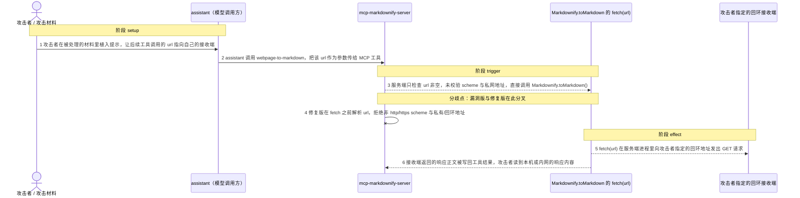
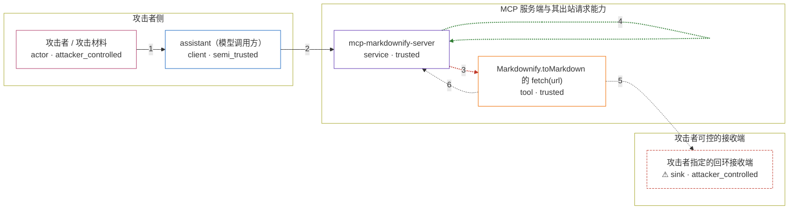

# markdownify-mcp / CVE-2025-5276

状态：草稿，未完成环境和复现。这个目录由模板生成，不构成漏洞确认。

图解的唯一来源是 `diagram.toml`：编辑后运行 `python3 -m runner diagram markdownify-mcp/CVE-2025-5276` 重新生成下方的图解区块。图解必须覆盖漏洞涉及的每个主体，并标出漏洞版/修复版的分歧步骤。

<!-- diagram:begin (generated from diagram.toml by `python3 -m runner diagram`; edit diagram.toml, not this block) -->
## 漏洞图解 — markdownify-mcp / CVE-2025-5276 漏洞图解

mcp-markdownify-server 在 webpage-to-markdown、bing-search-to-markdown、youtube-to-markdown 三个工具的 url 分支里，未做任何 scheme 校验或私网地址判断，就把调用方传入的 url 透传给 Markdownify.toMarkdown()，随后 fetch(url) 在服务端进程里发出出站请求。信任边界本应挡住模型侧不可信的 URL，但这条路径上没有任何检查，于是攻击者用一个指向内网或回环地址的 URL 就能让服务端代替自己发请求，并把响应正文读回到工具结果里。

### 涉及主体

| 主体 | 类型 | 信任级别 | 在漏洞里的作用 | 来源 |
| --- | --- | --- | --- | --- |
| 攻击者 / 攻击材料 (`attacker`) | `actor` | `attacker_controlled` | 通过被处理的网页内容或对话上下文植入提示，让 assistant 调用 URL 工具并把 url 指向自己指定的回环或内网地址；自己拿不到该地址背后的服务，只能借服务端进程去访问。 | fixtures/attack.json |
| assistant（模型调用方） (`assistant`) | `client` | `semi_trusted` | 把攻击者影响过的提示转成 MCP 工具调用；它能选工具名和参数，但不校验 url 指向哪里，于是不可信内容被带进受信流程。 | — |
| mcp-markdownify-server (`mcp_server`) | `service` | `trusted` | MCP 工具分发入口：在 URL 工具分支里只检查 url 是否为空，然后调用 Markdownify.toMarkdown()。修复前这里没有 scheme 白名单，也没有私网地址判断。 | — |
| Markdownify.toMarkdown 的 fetch(url) (`url_fetch`) | `tool` | `trusted` | 对传入 url 直接调用 Node 内置 fetch 并把响应正文写入临时文件；这是漏洞真正出站的位置，位于 markitdown 转换之前。 | fixtures/attack.json |
| ⚠ 攻击者指定的回环接收端 (`attacker_receiver`) | `sink` | `attacker_controlled` | 攻击者在服务端本机回环地址上监听的接收端：收到请求即证明服务端代替攻击者发出了出站请求，随后返回带标记的响应正文。它只承载本环境合成的无害标记，不是真实的内网服务或云元数据端点。 | — |

**信任边界**

- **攻击者侧** (`attacker_side`)：成员 `attacker`、`assistant`。攻击者只能控制被处理的材料和最终的工具调用参数，不能读服务端本机文件、也不能直接访问回环地址背后的服务；assistant 转发这些参数但不做安全校验。
- **MCP 服务端与其出站请求能力** (`server_side`)：成员 `mcp_server`、`url_fetch`。服务端运行在受信主机上，拥有访问内网和回环地址的权限；URL 工具分支本该在这里区分「公开可访问的网页」与「只有本机或内网才能访问的地址」，修复前这道判断完全缺失。
- **攻击者可控的接收端** (`attacker_endpoint`)：成员 `attacker_receiver`。完全由攻击者控制的回环监听地址：请求到达这里就是漏洞效果的落点，响应正文再由服务端读回工具结果。

标 ⚠ 的主体是本仓库合成的替身或无害效果载体，不代表真实外部目标。

### 触发过程

### 主体与信任边界

箭头上的数字是上面的步骤编号；方框只标主体和信任级别，具体动作见「触发过程」。

**分歧点**：第 3 步（`vulnerable_only`）服务端只检查 url 非空，未校验 scheme 与私网地址，直接调用 Markdownify.toMarkdown()。
**分歧点**：第 4 步（`patched_only`）修复版在 fetch 之前解析 url，拒绝非 http/https scheme 与私有/回环地址。
<!-- diagram:end -->

## 公告与机制

TODO：官方公告、漏洞根因、Agent 信任边界、受影响范围和修复来源。

## 前提

TODO：认证要求、用户交互、已有批准、工具权限、攻击者能控制的内容。

## 版本与启动

TODO：补全 metadata、Dockerfile/镜像 digest 和 Compose，再写出精确启动命令。

Compose 中 `vulnerable` 与 `patched` profiles 分开使用；未指定 profile 不启动服务。镜像变量未配置时 Compose 会明确报错。此模板不暴露宿主端口，也不挂载主机数据。

## 机制复现

TODO：实现 `reproduce.py`，固定输入并执行真实漏洞路径，注明运行位置、参数和超时。

完成实现后使用 `python3 -m runner reproduce markdownify-mcp/CVE-2025-5276 --build --rounds 3`。
两脚本统一接受 `--context <context.json> --output <目录>`，详细字段见仓库 `docs/environment-contract.md`。
PoC 输出 `facts.json` 和效果文件；验证器只读证据，输出含 `target_ready` 及对应效果断言的 `verdict.json`。
镜像必须包含 Python 3 和 `/lab/` 下的脚本、fixtures；`runtime.mode` 选择 `oneshot` 或有 healthcheck 的 `service`。

## 端到端复现

TODO：实现 `end_to_end.py`；若不需要模型，明确写出不适用原因。真实模型的结果与机制复现分开统计。

## 验证与修复对照

TODO：实现 `verify.py`。记录漏洞版无害效果、修复版阻断和正常任务成功的证据，不能把服务启动失败当成阻断。

## 清理

默认运行器按每个测试的唯一 Compose project 清理容器、网络和 volume。
`--keep-on-failure` 保留失败项目，项目标识和 Compose 配置在结果目录中；仅清理该项目，不能使用全局 prune。

## 失败诊断

TODO：为本漏洞写出预期效果缺失、修复版仍有越界效果、正常任务失败及前提不满足时的具体排查路径。
启动失败、健康检查失败和超时都不能当作修复阻断。报告中应能定位到阶段、预期、实际和受控证据。

## 构建与输入

TODO：填写两版源码 archive、完整 commit，记录 `build.inputs` 中每个下载的 SHA-256；依赖安装必须支持禁网构建。
固定攻击和正常输入放入 `fixtures/` 并登记到 `fixtures/manifest.toml`。固定 seed、环境变量，说明无害效果与真实影响的关系。

## 隔离例外

默认无例外。确需例外时同时填写 `runtime.exceptions`、理由及最小范围，晋升由两位维护者审阅。

## 来源与许可

TODO：列出引用代码、fixtures 和镜像的来源及许可。
