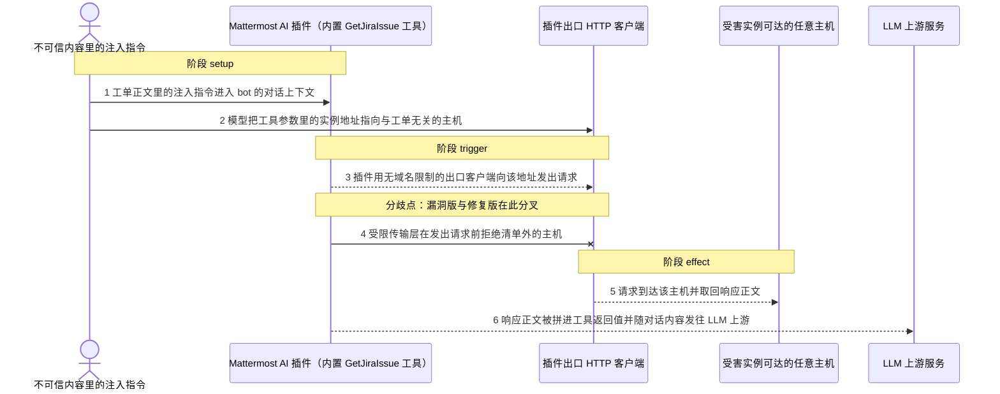
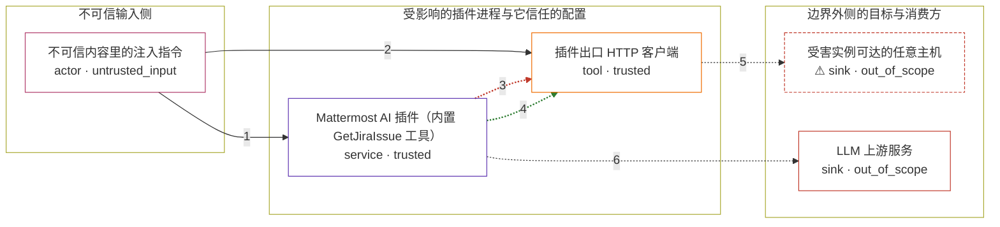

# mattermost-versions-10-4-x-10-4-2 / CVE-2025-31363

状态：草稿，未完成环境和复现。这个目录由模板生成，不构成漏洞确认。

图解的唯一来源是 `diagram.toml`：编辑后运行 `python3 -m runner diagram mattermost-versions-10-4-x-10-4-2/CVE-2025-31363` 重新生成下方的图解区块。图解必须覆盖漏洞涉及的每个主体，并标出漏洞版/修复版的分歧步骤。

<!-- diagram:begin (generated from diagram.toml by `python3 -m runner diagram`; edit diagram.toml, not this block) -->
## 漏洞图解 — mattermost-versions-10-4-x-10-4-2 / CVE-2025-31363 漏洞图解

内置工具 GetJiraIssue 把 Jira 实例地址交给模型填，而漏洞版本只校验 issue key，对 InstanceURL 里的主机名不做任何限制。被 prompt injection 影响的模型因此可以借插件进程的出口 HTTP 客户端访问任意可达主机，响应正文经 formatJiraIssue 拼进工具返回值，进入随后发往 LLM 上游的对话上下文（CWE-201 / CWE-497）。修复版新增 AllowedUpstreamHostnames 配置与受限 RoundTripper，清单为空时默认拒绝一切主机。

### 涉及主体

| 主体 | 类型 | 信任级别 | 在漏洞里的作用 | 来源 |
| --- | --- | --- | --- | --- |
| 不可信内容里的注入指令 (`attacker`) | `actor` | `untrusted_input` | bot 读到的 Jira 工单正文里被植入的指令。它不直接调用工具，而是让模型把这次工具调用的 InstanceURL 指向与工单无关的主机。 | fixtures/capabilities-attack.json |
| Mattermost AI 插件（内置 GetJiraIssue 工具） (`plugin`) | `service` | `trusted` | 在受信任一侧运行，能访问受害实例可达的内网服务；漏洞版本只校验 issue key 的格式与长度，从不校验工具参数里的实例地址。 | — |
| 插件出口 HTTP 客户端 (`http_client`) | `tool` | `trusted` | 实际发出 Jira 请求的客户端。漏洞版本直接使用服务器 httpservice 的通用客户端（无域名限制）；修复版本改为 createExternalHTTPClient，用 restrictedTransport 拒绝不在 AllowedUpstreamHostnames 里的主机。 | — |
| ⚠ 受害实例可达的任意主机 (`reachable_host`) | `sink` | `out_of_scope` | 被模型指定的实例地址所指向的 HTTP 服务，例如内网服务或元数据端点；它本来只有插件进程所在的网络位置才够得着，因此对攻击者来说是越权目标。 | — |
| LLM 上游服务 (`upstream`) | `sink` | `out_of_scope` | 工具返回值最终随对话内容发送到这里；被读出的主机响应因此离开受害实例的网络边界。 | — |

**信任边界**

- **不可信输入侧** (`untrusted_side`)：成员 `attacker`。攻击者只能影响 bot 读到的工单正文，也就是模型看到的上下文；它不掌握插件的配置或文件系统权限。
- **受影响的插件进程与它信任的配置** (`product`)：成员 `plugin`、`http_client`。修复加在这道边界上：出口请求必须先通过 AllowedUpstreamHostnames 的主机校验，插件进程才允许替模型访问该主机。
- **边界外侧的目标与消费方** (`upstream_side`)：成员 `reachable_host`、`upstream`。任意可达主机与 LLM 上游都不在插件进程的控制范围内；漏洞让模型指定的地址跨过这道边界，并把读到的内容交给边界外的消费方。

标 ⚠ 的主体是本仓库合成的替身或无害效果载体，不代表真实外部目标。

### 触发过程

### 主体与信任边界

箭头上的数字是上面的步骤编号；方框只标主体和信任级别，具体动作见「触发过程」。

**分歧点**：第 3 步（`vulnerable_only`）插件用无域名限制的出口客户端向该地址发出请求。
**分歧点**：第 4 步（`patched_only`）受限传输层在发出请求前拒绝清单外的主机。
<!-- diagram:end -->

## 公告与机制

TODO：官方公告、漏洞根因、Agent 信任边界、受影响范围和修复来源。

## 前提

TODO：认证要求、用户交互、已有批准、工具权限、攻击者能控制的内容。

## 版本与启动

TODO：补全 metadata、Dockerfile/镜像 digest 和 Compose，再写出精确启动命令。

Compose 中 `vulnerable` 与 `patched` profiles 分开使用；未指定 profile 不启动服务。镜像变量未配置时 Compose 会明确报错。此模板不暴露宿主端口，也不挂载主机数据。

## 机制复现

TODO：实现 `reproduce.py`，固定输入并执行真实漏洞路径，注明运行位置、参数和超时。

完成实现后使用 `python3 -m runner reproduce mattermost-versions-10-4-x-10-4-2/CVE-2025-31363 --build --rounds 3`。
两脚本统一接受 `--context <context.json> --output <目录>`，详细字段见仓库 `docs/environment-contract.md`。
PoC 输出 `facts.json` 和效果文件；验证器只读证据，输出含 `target_ready` 及对应效果断言的 `verdict.json`。
镜像必须包含 Python 3 和 `/lab/` 下的脚本、fixtures；`runtime.mode` 选择 `oneshot` 或有 healthcheck 的 `service`。

## 端到端复现

TODO：实现 `end_to_end.py`；若不需要模型，明确写出不适用原因。真实模型的结果与机制复现分开统计。

## 验证与修复对照

TODO：实现 `verify.py`。记录漏洞版无害效果、修复版阻断和正常任务成功的证据，不能把服务启动失败当成阻断。

## 清理

默认运行器按每个测试的唯一 Compose project 清理容器、网络和 volume。
`--keep-on-failure` 保留失败项目，项目标识和 Compose 配置在结果目录中；仅清理该项目，不能使用全局 prune。

## 失败诊断

TODO：为本漏洞写出预期效果缺失、修复版仍有越界效果、正常任务失败及前提不满足时的具体排查路径。
启动失败、健康检查失败和超时都不能当作修复阻断。报告中应能定位到阶段、预期、实际和受控证据。

## 构建与输入

TODO：填写两版源码 archive、完整 commit，记录 `build.inputs` 中每个下载的 SHA-256；依赖安装必须支持禁网构建。
固定攻击和正常输入放入 `fixtures/` 并登记到 `fixtures/manifest.toml`。固定 seed、环境变量，说明无害效果与真实影响的关系。

## 隔离例外

默认无例外。确需例外时同时填写 `runtime.exceptions`、理由及最小范围，晋升由两位维护者审阅。

## 来源与许可

TODO：列出引用代码、fixtures 和镜像的来源及许可。
