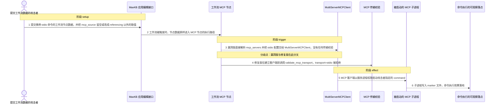
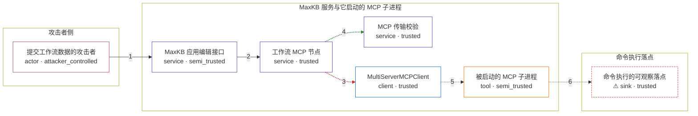

# maxkb / CVE-2026-39417

状态：草稿，未完成环境和复现。这个目录由模板生成，不构成漏洞确认。

图解的唯一来源是 `diagram.toml`：编辑后运行 `python3 -m runner diagram maxkb/CVE-2026-39417` 重新生成下方的图解区块。图解必须覆盖漏洞涉及的每个主体，并标出漏洞版/修复版的分歧步骤。

<!-- diagram:begin (generated from diagram.toml by `python3 -m runner diagram`; edit diagram.toml, not this block) -->
## 漏洞图解 — maxkb / CVE-2026-39417 漏洞图解

MaxKB 工作流 MCP 节点在 mcp_source 不是 referencing 时，把用户提交的 mcp_servers JSON 解析后直接交给 MultiServerMCPClient，过程中没有任何传输校验。当配置里的 transport 为 stdio 时，MCP 客户端会以 command 启动子进程，命令就在 MaxKB 服务进程权限下执行。修复版在创建客户端之前调用 validate_mcp_transport，只放行 sse 与 streamable_http，同一份 stdio 配置因此被拒绝。

### 涉及主体

| 主体 | 类型 | 信任级别 | 在漏洞里的作用 | 来源 |
| --- | --- | --- | --- | --- |
| 提交工作流数据的攻击者 (`attacker`) | `actor` | `attacker_controlled` | 构造应用工作流节点的 mcp_servers 配置，指定 stdio 传输与要启动的 command，并通过应用编辑接口写入。 | fixtures/attack/mcp_servers.json |
| MaxKB 应用编辑接口 (`application_api`) | `service` | `semi_trusted` | 把请求体中的 work_flow 直接写入 Application；节点内部的 mcp_servers 与 mcp_source 不经过该接口的结构校验。 | — |
| 工作流 MCP 节点 (`mcp_node`) | `service` | `trusted` | BaseMcpNode.execute 消费节点数据：漏洞版把解析后的 mcp_servers 直接交给 MCP 客户端，修复版先调用 validate_mcp_transport。 | — |
| MCP 传输校验 (`transport_gate`) | `service` | `trusted` | ToolExecutor.validate_mcp_transport 逐项检查每个 server 的 transport，只接受 sse 与 streamable_http，否则抛异常终止执行。 | — |
| MultiServerMCPClient (`mcp_client`) | `client` | `trusted` | 按 server 配置建立 MCP 会话；transport 为 stdio 时以 command 作为可执行文件启动子进程。 | — |
| 被启动的 MCP 子进程 (`stdio_process`) | `tool` | `semi_trusted` | 由可信的 MCP 客户端按攻击者给出的 command 启动，继承 MaxKB 服务进程的权限。 | — |
| ⚠ 命令执行的可观察落点 (`effect`) | `sink` | `trusted` | 命令执行后落地的无害 marker 文件；它不是真实的外部目标，只用来证明 command 确实被执行。 | — |

**信任边界**

- **攻击者侧** (`attacker_side`)：成员 `attacker`。攻击者能控制的只有提交的工作流节点数据与其中指定的 command，不能直接操作服务进程或宿主机文件。
- **MaxKB 服务与它启动的 MCP 子进程** (`product`)：成员 `application_api`、`mcp_node`、`transport_gate`、`mcp_client`、`stdio_process`。这道边界只允许远程 MCP 传输；修复版在边界内拒绝 stdio，漏洞版让攻击者的 stdio 配置穿过边界启动子进程。
- **命令执行落点** (`host`)：成员 `effect`。效果落在服务进程权限下的文件系统；这里记录的是无害 marker，而不是攻击者真正想要的外部目标。

标 ⚠ 的主体是本仓库合成的替身或无害效果载体，不代表真实外部目标。

### 触发过程

### 主体与信任边界

箭头上的数字是上面的步骤编号；方框只标主体和信任级别，具体动作见「触发过程」。

**分歧点**：第 3 步（`vulnerable_only`）漏洞版直接解析 mcp_servers 并把 stdio 配置交给 MultiServerMCPClient，没有任何传输校验。
**分歧点**：第 4 步（`patched_only`）修复版在建立客户端前调用 validate_mcp_transport，transport=stdio 被拒绝。
<!-- diagram:end -->

## 公告与机制

TODO：官方公告、漏洞根因、Agent 信任边界、受影响范围和修复来源。

## 前提

TODO：认证要求、用户交互、已有批准、工具权限、攻击者能控制的内容。

## 版本与启动

TODO：补全 metadata、Dockerfile/镜像 digest 和 Compose，再写出精确启动命令。

Compose 中 `vulnerable` 与 `patched` profiles 分开使用；未指定 profile 不启动服务。镜像变量未配置时 Compose 会明确报错。此模板不暴露宿主端口，也不挂载主机数据。

## 机制复现

TODO：实现 `reproduce.py`，固定输入并执行真实漏洞路径，注明运行位置、参数和超时。

完成实现后使用 `python3 -m runner reproduce maxkb/CVE-2026-39417 --build --rounds 3`。
两脚本统一接受 `--context <context.json> --output <目录>`，详细字段见仓库 `docs/environment-contract.md`。
PoC 输出 `facts.json` 和效果文件；验证器只读证据，输出含 `target_ready` 及对应效果断言的 `verdict.json`。
镜像必须包含 Python 3 和 `/lab/` 下的脚本、fixtures；`runtime.mode` 选择 `oneshot` 或有 healthcheck 的 `service`。

## 端到端复现

TODO：实现 `end_to_end.py`；若不需要模型，明确写出不适用原因。真实模型的结果与机制复现分开统计。

## 验证与修复对照

TODO：实现 `verify.py`。记录漏洞版无害效果、修复版阻断和正常任务成功的证据，不能把服务启动失败当成阻断。

## 清理

默认运行器按每个测试的唯一 Compose project 清理容器、网络和 volume。
`--keep-on-failure` 保留失败项目，项目标识和 Compose 配置在结果目录中；仅清理该项目，不能使用全局 prune。

## 失败诊断

TODO：为本漏洞写出预期效果缺失、修复版仍有越界效果、正常任务失败及前提不满足时的具体排查路径。
启动失败、健康检查失败和超时都不能当作修复阻断。报告中应能定位到阶段、预期、实际和受控证据。

## 构建与输入

TODO：填写两版源码 archive、完整 commit，记录 `build.inputs` 中每个下载的 SHA-256；依赖安装必须支持禁网构建。
固定攻击和正常输入放入 `fixtures/` 并登记到 `fixtures/manifest.toml`。固定 seed、环境变量，说明无害效果与真实影响的关系。

## 隔离例外

默认无例外。确需例外时同时填写 `runtime.exceptions`、理由及最小范围，晋升由两位维护者审阅。

## 来源与许可

TODO：列出引用代码、fixtures 和镜像的来源及许可。
