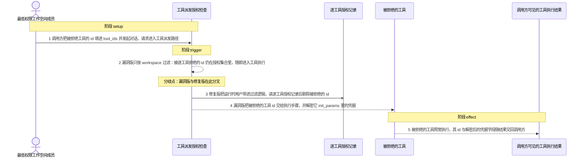
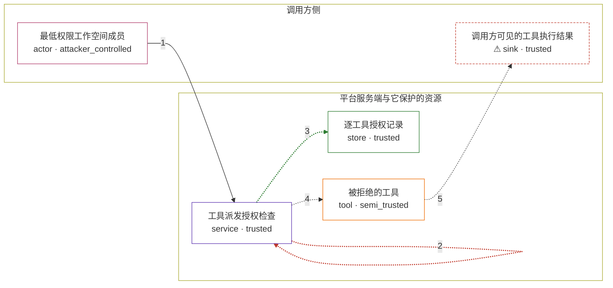

# maxkb / CVE-2026-77516

状态：草稿，未完成环境和复现。这个目录由模板生成，不构成漏洞确认。

图解的唯一来源是 `diagram.toml`：编辑后运行 `python3 -m runner diagram maxkb/CVE-2026-77516` 重新生成下方的图解区块。图解必须覆盖漏洞涉及的每个主体，并标出漏洞版/修复版的分歧步骤。

<!-- diagram:begin (generated from diagram.toml by `python3 -m runner diagram`; edit diagram.toml, not this block) -->
## 漏洞图解 — maxkb / CVE-2026-77516 漏洞图解

MaxKB 的智能体与应用对话在派发工具前只调用 filter_authorized_ids('tool', ids, workspace_id)：它仅判断工具是否与调用方同属一个 workspace，既不接收 user_id，也从不查询 WorkspaceUserResourcePermission。于是被逐工具拒绝的最低权限工作空间成员，只要把该工具的 id 填进 tool_ids，id 仍会通过这道检查进入执行，服务端随后解密该工具存储的 init_params 凭据并交给调用方。专用工具路由本来执行的逐工具授权被这条派发路径绕过；修复版把运行时用户传给过滤逻辑，拒绝的工具被剔除。

### 涉及主体

| 主体 | 类型 | 信任级别 | 在漏洞里的作用 | 来源 |
| --- | --- | --- | --- | --- |
| 最低权限工作空间成员 (`attacker`) | `actor` | `attacker_controlled` | 只能控制自己发起的那次调用：在应用或对话配置里填 tool_ids，指定一个被逐工具拒绝但与自己同 workspace 的工具 id。它无法新建工具、无法改动工作空间，也无法为自己补上授权记录。 | fixtures/tool_dispatch_binding.json |
| 工具派发授权检查 (`guard`) | `service` | `trusted` | 上游的 filter_authorized_ids 及调用它的派发路径。它负责在工具执行前判定调用方是否可以使用这些工具；本 CVE 中它的签名里没有 user_id，因此只做同 workspace 判定，逐工具授权被整体漏掉。 | fixtures/tool_dispatch.json |
| 逐工具授权记录 (`store`) | `store` | `trusted` | WorkspaceUserResourcePermission 逐工具授权表与工具自带的 init_params 凭据。表里存在一条 permission_list 为空的记录，表示该成员被明确拒绝；派发路径从不读这张表，而专用工具路由正是靠它拦住同一个成员。 | — |
| 被拒绝的工具 (`tool`) | `tool` | `semi_trusted` | 与调用方同属一个 workspace、但被逐工具拒绝的自定义工具。它的 init_params 里存着服务端凭据，一旦 id 通过授权检查，执行步骤就会解密这些凭据并据此调用外部接口。 | fixtures/tool_dispatch.json |
| ⚠ 调用方可见的工具执行结果 (`effect`) | `sink` | `trusted` | 被拒绝工具的执行结果与随执行一并解密的凭据字段，最终回到发起这次调用的调用方手里。这正是漏洞要达到的效果：调用方拿到了自己本来无权使用的工具及其凭据。 | — |

**信任边界**

- **调用方侧** (`caller_side`)：成员 `attacker`、`effect`。攻击者在这里只能提交一次带 tool_ids 的调用，并接收返回结果；它既改不了工作空间的成员关系，也补不上自己的逐工具授权。
- **平台服务端与它保护的资源** (`product`)：成员 `guard`、`store`、`tool`。这道边界本该拦住未被逐工具授权的调用：专用工具路由用 WorkspaceUserResourcePermission 判定再放行，而工具派发路径漏掉了这一层，只要工具与自己同 workspace 就放行，因此边界在此失效。

标 ⚠ 的主体是本仓库合成的替身或无害效果载体，不代表真实外部目标。

### 触发过程

### 主体与信任边界

箭头上的数字是上面的步骤编号；方框只标主体和信任级别，具体动作见「触发过程」。

**分歧点**：第 2 步（`vulnerable_only`）漏洞版只按 workspace 过滤：被逐工具拒绝的 id 仍在授权集合里，随即进入工具执行。
**分歧点**：第 3 步（`patched_only`）修复版把运行时用户带进过滤逻辑，读逐工具授权记录后剔除被拒绝的 id。
<!-- diagram:end -->

## 公告与机制

TODO：官方公告、漏洞根因、Agent 信任边界、受影响范围和修复来源。

## 前提

TODO：认证要求、用户交互、已有批准、工具权限、攻击者能控制的内容。

## 版本与启动

TODO：补全 metadata、Dockerfile/镜像 digest 和 Compose，再写出精确启动命令。

Compose 中 `vulnerable` 与 `patched` profiles 分开使用；未指定 profile 不启动服务。镜像变量未配置时 Compose 会明确报错。此模板不暴露宿主端口，也不挂载主机数据。

## 机制复现

TODO：实现 `reproduce.py`，固定输入并执行真实漏洞路径，注明运行位置、参数和超时。

完成实现后使用 `python3 -m runner reproduce maxkb/CVE-2026-77516 --build --rounds 3`。
两脚本统一接受 `--context <context.json> --output <目录>`，详细字段见仓库 `docs/environment-contract.md`。
PoC 输出 `facts.json` 和效果文件；验证器只读证据，输出含 `target_ready` 及对应效果断言的 `verdict.json`。
镜像必须包含 Python 3 和 `/lab/` 下的脚本、fixtures；`runtime.mode` 选择 `oneshot` 或有 healthcheck 的 `service`。

## 端到端复现

TODO：实现 `end_to_end.py`；若不需要模型，明确写出不适用原因。真实模型的结果与机制复现分开统计。

## 验证与修复对照

TODO：实现 `verify.py`。记录漏洞版无害效果、修复版阻断和正常任务成功的证据，不能把服务启动失败当成阻断。

## 清理

默认运行器按每个测试的唯一 Compose project 清理容器、网络和 volume。
`--keep-on-failure` 保留失败项目，项目标识和 Compose 配置在结果目录中；仅清理该项目，不能使用全局 prune。

## 失败诊断

TODO：为本漏洞写出预期效果缺失、修复版仍有越界效果、正常任务失败及前提不满足时的具体排查路径。
启动失败、健康检查失败和超时都不能当作修复阻断。报告中应能定位到阶段、预期、实际和受控证据。

## 构建与输入

TODO：填写两版源码 archive、完整 commit，记录 `build.inputs` 中每个下载的 SHA-256；依赖安装必须支持禁网构建。
固定攻击和正常输入放入 `fixtures/` 并登记到 `fixtures/manifest.toml`。固定 seed、环境变量，说明无害效果与真实影响的关系。

## 隔离例外

默认无例外。确需例外时同时填写 `runtime.exceptions`、理由及最小范围，晋升由两位维护者审阅。

## 来源与许可

TODO：列出引用代码、fixtures 和镜像的来源及许可。
