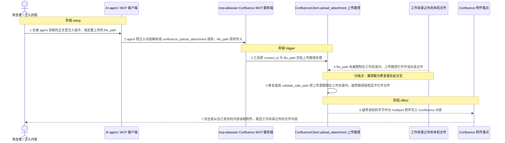
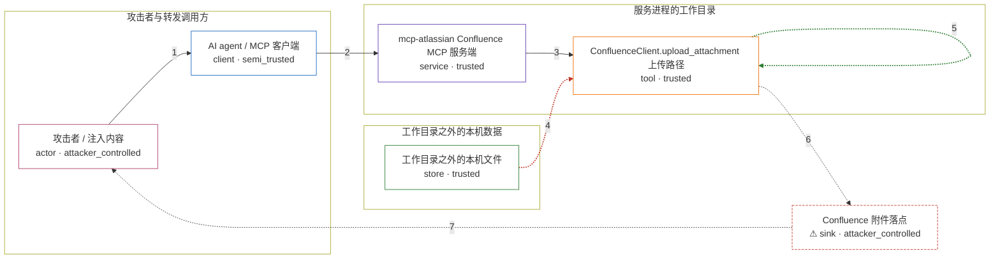

# mcp-atlassian / CVE-2026-73498

状态：草稿，未完成环境和复现。这个目录由模板生成，不构成漏洞确认。

图解的唯一来源是 `diagram.toml`：编辑后运行 `python3 -m runner diagram mcp-atlassian/CVE-2026-73498` 重新生成下方的图解区块。图解必须覆盖漏洞涉及的每个主体，并标出漏洞版/修复版的分歧步骤。

<!-- diagram:begin (generated from diagram.toml by `python3 -m runner diagram`; edit diagram.toml, not this block) -->
## 漏洞图解 — mcp-atlassian / CVE-2026-73498 漏洞图解

mcp-atlassian 0.22.0 之前的 confluence_upload_attachment 只把相对的 file_path 转成绝对路径并检查文件是否存在，从未把它限制在服务进程的工作目录内。MCP 客户端转发的 file_path 是攻击者可控数据，而服务进程可读的宿主文件系统属于受信任边界，上传路径因此能直接打开工作目录之外的任意文件。0.22.0 在同一位置改用 validate_safe_path，把上传源限制在工作目录内，越界路径抛错且不再打开文件。漏洞版会把越界读到的字节作为 multipart 附件写到 Confluence 内容上，构成只影响机密性的读取型外泄。

### 涉及主体

| 主体 | 类型 | 信任级别 | 在漏洞里的作用 | 来源 |
| --- | --- | --- | --- | --- |
| 攻击者 / 注入内容 (`attacker`) | `actor` | `attacker_controlled` | 在 agent 会读取的 Confluence 页面或 Jira 工单正文里放入指令，指定要上传的 file_path。它只能控制这一次工具调用的参数，控制不了服务进程，也读不到工作目录之外的文件，所以才需要借上传通道把文件取走。 | fixtures/attack.json |
| AI agent / MCP 客户端 (`mcp_client`) | `client` | `semi_trusted` | 把读到的正文解析成 confluence_upload_attachment 调用，并把注入内容指定的 file_path 原样转发给服务端。它自身没有独立的路径边界校验，攻击者的参数因此原封不动进入受信流程。 | — |
| mcp-atlassian Confluence MCP 服务端 (`mcp_server`) | `service` | `trusted` | 注册 confluence_upload_attachment 工具；写权限门禁 check_write_access 只判断读写模式，不涉及路径，随后把 content_id 与 file_path 交给 ConfluenceClient.upload_attachment。 | src/mcp_atlassian/servers/confluence.py |
| ConfluenceClient.upload_attachment 上传路径 (`upload_tool`) | `tool` | `trusted` | 0.21.0 的实现只把相对 file_path 转成绝对路径，再做 os.path.exists 存在性检查，没有把路径限制在工作目录内；随后 _upload_attachment_direct 打开该路径并以 multipart 发出。0.22.0 在打开文件之前先调用 validate_safe_path。 | src/mcp_atlassian/confluence/attachments.py |
| 工作目录之外的本机文件 (`host_files`) | `store` | `trusted` | 服务进程可读但本不应外传的文件，例如 /proc/self/environ 中的 CONFLUENCE_API_TOKEN 与云密钥、~/.ssh/id_ed25519。它们位于工作目录之外，正是这道边界要保护的数据。 | — |
| ⚠ Confluence 附件落点 (`confluence_api`) | `sink` | `attacker_controlled` | 上传请求的最终落点：越界读到的字节作为附件写到服务进程配置的 Confluence 内容上，而这块内容由攻击者发布、攻击者也能读回，因此是攻击者收得到货的接收端。机制复现中以本地无害接收端代表这个落点。 | — |

**信任边界**

- **攻击者与转发调用方** (`attacker_side`)：成员 `attacker`、`mcp_client`。攻击者能控制的只有注入正文和由它派生出的 file_path 参数；MCP 客户端只是把参数原样转发。两者都无法直接读写服务进程的宿主文件系统。
- **服务进程的工作目录** (`workspace`)：成员 `mcp_server`、`upload_tool`。上传源本应被限制在这个工作目录内。0.21.0 只做绝对化与存在性检查，这道边界对上传路径完全失效；0.22.0 用 validate_safe_path 把越界路径挡在打开文件之前。
- **工作目录之外的本机数据** (`host_data`)：成员 `host_files`。这里的文件在工作目录之外，服务进程有读权限但本不应经上传外流；漏洞版会把它们读出并发送到附件落点。
- 未列入上述边界：`confluence_api`。

标 ⚠ 的主体是本仓库合成的替身或无害效果载体，不代表真实外部目标。

### 触发过程

### 主体与信任边界

箭头上的数字是上面的步骤编号；方框只标主体和信任级别，具体动作见「触发过程」。

**分歧点**：第 4 步（`vulnerable_only`）file_path 未被限制在工作目录内，上传路径打开并读出该文件。
**分歧点**：第 5 步（`patched_only`）修复版用 validate_safe_path 把上传源限制在工作目录内，越界路径抛错且不打开文件。
<!-- diagram:end -->

## 公告与机制

TODO：官方公告、漏洞根因、Agent 信任边界、受影响范围和修复来源。

## 前提

TODO：认证要求、用户交互、已有批准、工具权限、攻击者能控制的内容。

## 版本与启动

TODO：补全 metadata、Dockerfile/镜像 digest 和 Compose，再写出精确启动命令。

Compose 中 `vulnerable` 与 `patched` profiles 分开使用；未指定 profile 不启动服务。镜像变量未配置时 Compose 会明确报错。此模板不暴露宿主端口，也不挂载主机数据。

## 机制复现

TODO：实现 `reproduce.py`，固定输入并执行真实漏洞路径，注明运行位置、参数和超时。

完成实现后使用 `python3 -m runner reproduce mcp-atlassian/CVE-2026-73498 --build --rounds 3`。
两脚本统一接受 `--context <context.json> --output <目录>`，详细字段见仓库 `docs/environment-contract.md`。
PoC 输出 `facts.json` 和效果文件；验证器只读证据，输出含 `target_ready` 及对应效果断言的 `verdict.json`。
镜像必须包含 Python 3 和 `/lab/` 下的脚本、fixtures；`runtime.mode` 选择 `oneshot` 或有 healthcheck 的 `service`。

## 端到端复现

TODO：实现 `end_to_end.py`；若不需要模型，明确写出不适用原因。真实模型的结果与机制复现分开统计。

## 验证与修复对照

TODO：实现 `verify.py`。记录漏洞版无害效果、修复版阻断和正常任务成功的证据，不能把服务启动失败当成阻断。

## 清理

默认运行器按每个测试的唯一 Compose project 清理容器、网络和 volume。
`--keep-on-failure` 保留失败项目，项目标识和 Compose 配置在结果目录中；仅清理该项目，不能使用全局 prune。

## 失败诊断

TODO：为本漏洞写出预期效果缺失、修复版仍有越界效果、正常任务失败及前提不满足时的具体排查路径。
启动失败、健康检查失败和超时都不能当作修复阻断。报告中应能定位到阶段、预期、实际和受控证据。

## 构建与输入

TODO：填写两版源码 archive、完整 commit，记录 `build.inputs` 中每个下载的 SHA-256；依赖安装必须支持禁网构建。
固定攻击和正常输入放入 `fixtures/` 并登记到 `fixtures/manifest.toml`。固定 seed、环境变量，说明无害效果与真实影响的关系。

## 隔离例外

默认无例外。确需例外时同时填写 `runtime.exceptions`、理由及最小范围，晋升由两位维护者审阅。

## 来源与许可

TODO：列出引用代码、fixtures 和镜像的来源及许可。
