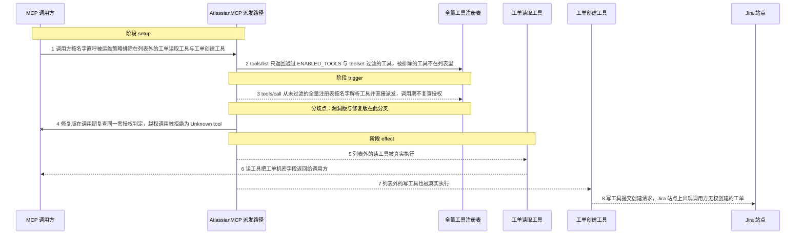
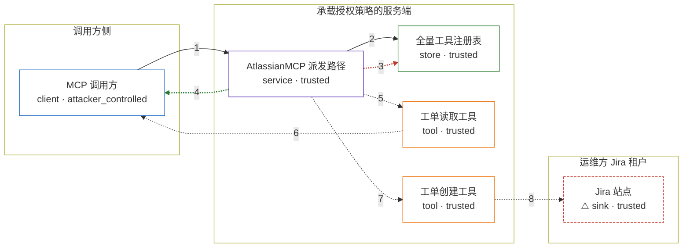

# mcp-atlassian / CVE-2026-77243

状态：草稿，未完成环境和复现。这个目录由模板生成，不构成漏洞确认。

图解的唯一来源是 `diagram.toml`：编辑后运行 `python3 -m runner diagram mcp-atlassian/CVE-2026-77243` 重新生成下方的图解区块。图解必须覆盖漏洞涉及的每个主体，并标出漏洞版/修复版的分歧步骤。

<!-- diagram:begin (generated from diagram.toml by `python3 -m runner diagram`; edit diagram.toml, not this block) -->
## 漏洞图解 — mcp-atlassian / CVE-2026-77243 漏洞图解

Atlassian MCP 服务把 ENABLED_TOOLS、toolset 与只读模式三层授权判定只实现在 tools/list 的过滤里；tools/call 派发时按名字从全量工具注册表解析并直接执行，从不复查这些边界。于是任何能访问 MCP 端点的调用方只要知道工具名，就能调用运维策略明确排除的读工具与写工具：机密工单字段经读工具外泄，写工具还会在 Jira 站点上真实创建工单。修复版把同一套授权判定提到调用期复查，把越权调用拒绝成与未知工具完全相同的 Unknown tool。

### 涉及主体

| 主体 | 类型 | 信任级别 | 在漏洞里的作用 | 来源 |
| --- | --- | --- | --- | --- |
| MCP 调用方 (`client`) | `client` | `attacker_controlled` | 持有 MCP 端点访问权的调用方；它控制 tools/call 请求里的工具名与参数，并知道自己想调用的工具叫什么。 | fixtures/attack_requests.json |
| AtlassianMCP 派发路径 (`mcp_server`) | `service` | `trusted` | 受影响的上游组件；列表期按 ENABLED_TOOLS / toolset / 只读模式过滤，调用期却不复查，直接按名字派发。 | src/mcp_atlassian/servers/main.py |
| 全量工具注册表 (`tool_registry`) | `store` | `trusted` | 挂载 jira 与 confluence 子服务后形成的完整工具表；tools/list 过滤它，tools/call 无过滤地查它。 | — |
| 工单读取工具 (`jira_get_issue`) | `tool` | `trusted` | 读取 Jira 工单字段的读工具（toolset:jira_issues）；被运维策略排除在列表外，却仍可被按名调用。 | — |
| 工单创建工具 (`jira_create_issue`) | `tool` | `trusted` | 创建 Jira 工单的写工具（toolset:jira_issues，带 write 标签）；被运维策略排除在列表外，却仍可被按名调用。 | — |
| ⚠ Jira 站点 (`jira_site`) | `sink` | `trusted` | 运维方真实 Jira 实例的 REST 端点，调用方无权经 MCP 触碰；复现时由本机无公害接收端扮演，只记录请求并返回固定工单数据。 | fixtures/jira_issue_sec1.json |

**信任边界**

- **调用方侧** (`caller_side`)：成员 `client`。调用方只能控制一次 tools/call 的工具名与参数，拿不到注册表之外的任何东西，也看不到被过滤工具的列表项。
- **承载授权策略的服务端** (`product`)：成员 `mcp_server`、`tool_registry`、`jira_get_issue`、`jira_create_issue`。运维方通过 ENABLED_TOOLS 与 toolset 表达的 least-privilege 策略在这里生效；漏洞让这道边界只在列表期起作用。
- **运维方 Jira 租户** (`operator_tenant`)：成员 `jira_site`。运维方的真实数据与写入目标，本应只有被授权工具才能触达。

标 ⚠ 的主体是本仓库合成的替身或无害效果载体，不代表真实外部目标。

### 触发过程

### 主体与信任边界

箭头上的数字是上面的步骤编号；方框只标主体和信任级别，具体动作见「触发过程」。

**分歧点**：第 3 步（`vulnerable_only`）tools/call 从未过滤的全量注册表按名字解析工具并直接派发，调用期不复查授权。
**分歧点**：第 4 步（`patched_only`）修复版在调用期复查同一套授权判定，越权调用被拒绝为 Unknown tool。
<!-- diagram:end -->

## 公告与机制

TODO：官方公告、漏洞根因、Agent 信任边界、受影响范围和修复来源。

## 前提

TODO：认证要求、用户交互、已有批准、工具权限、攻击者能控制的内容。

## 版本与启动

TODO：补全 metadata、Dockerfile/镜像 digest 和 Compose，再写出精确启动命令。

Compose 中 `vulnerable` 与 `patched` profiles 分开使用；未指定 profile 不启动服务。镜像变量未配置时 Compose 会明确报错。此模板不暴露宿主端口，也不挂载主机数据。

## 机制复现

TODO：实现 `reproduce.py`，固定输入并执行真实漏洞路径，注明运行位置、参数和超时。

完成实现后使用 `python3 -m runner reproduce mcp-atlassian/CVE-2026-77243 --build --rounds 3`。
两脚本统一接受 `--context <context.json> --output <目录>`，详细字段见仓库 `docs/environment-contract.md`。
PoC 输出 `facts.json` 和效果文件；验证器只读证据，输出含 `target_ready` 及对应效果断言的 `verdict.json`。
镜像必须包含 Python 3 和 `/lab/` 下的脚本、fixtures；`runtime.mode` 选择 `oneshot` 或有 healthcheck 的 `service`。

## 端到端复现

TODO：实现 `end_to_end.py`；若不需要模型，明确写出不适用原因。真实模型的结果与机制复现分开统计。

## 验证与修复对照

TODO：实现 `verify.py`。记录漏洞版无害效果、修复版阻断和正常任务成功的证据，不能把服务启动失败当成阻断。

## 清理

默认运行器按每个测试的唯一 Compose project 清理容器、网络和 volume。
`--keep-on-failure` 保留失败项目，项目标识和 Compose 配置在结果目录中；仅清理该项目，不能使用全局 prune。

## 失败诊断

TODO：为本漏洞写出预期效果缺失、修复版仍有越界效果、正常任务失败及前提不满足时的具体排查路径。
启动失败、健康检查失败和超时都不能当作修复阻断。报告中应能定位到阶段、预期、实际和受控证据。

## 构建与输入

TODO：填写两版源码 archive、完整 commit，记录 `build.inputs` 中每个下载的 SHA-256；依赖安装必须支持禁网构建。
固定攻击和正常输入放入 `fixtures/` 并登记到 `fixtures/manifest.toml`。固定 seed、环境变量，说明无害效果与真实影响的关系。

## 隔离例外

默认无例外。确需例外时同时填写 `runtime.exceptions`、理由及最小范围，晋升由两位维护者审阅。

## 来源与许可

TODO：列出引用代码、fixtures 和镜像的来源及许可。
