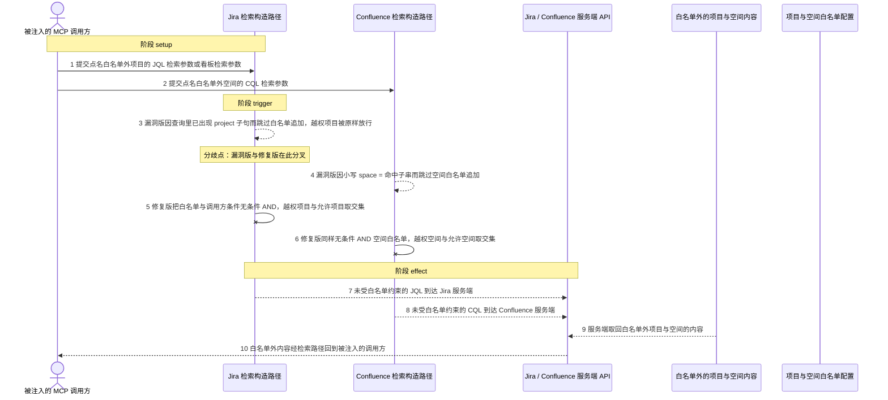
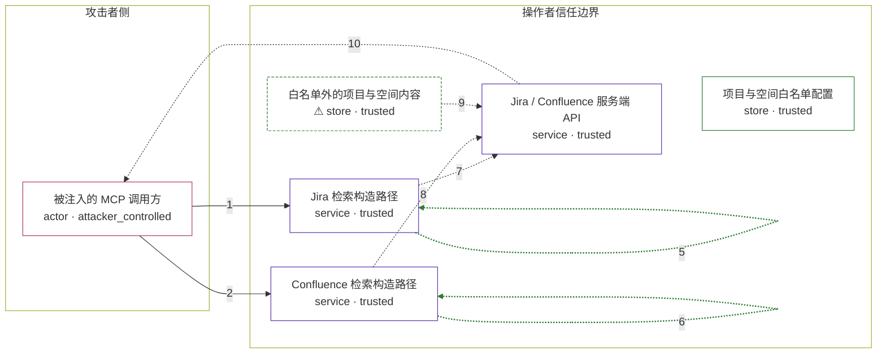

# mcp-atlassian / CVE-2026-77251

状态：草稿，未完成环境和复现。这个目录由模板生成，不构成漏洞确认。

图解的唯一来源是 `diagram.toml`：编辑后运行 `python3 -m runner diagram mcp-atlassian/CVE-2026-77251` 重新生成下方的图解区块。图解必须覆盖漏洞涉及的每个主体，并标出漏洞版/修复版的分歧步骤。

<!-- diagram:begin (generated from diagram.toml by `python3 -m runner diagram`; edit diagram.toml, not this block) -->
## 漏洞图解 — mcp-atlassian / CVE-2026-77251 漏洞图解

mcp-atlassian 把操作者的项目/空间白名单当成可选的查询补充：Jira 搜索只在查询完全没有 project 子句时才追加白名单，看板 issue 路径在修复前根本不过滤；Confluence 搜索用大小写敏感的子串判断决定是否追加空间白名单。被提示注入的调用方只要在 jql 或 cql 里显式点名白名单外的项目/空间，白名单就被整条跳过；操作者 PAT 的权限通常宽于白名单，服务端鉴权因此通过，白名单外内容被读回调用方。修复版把白名单改成始终 AND 的硬边界，越权条件与允许范围取交集后结果为空。

### 涉及主体

| 主体 | 类型 | 信任级别 | 在漏洞里的作用 | 来源 |
| --- | --- | --- | --- | --- |
| 被注入的 MCP 调用方 (`attacker`) | `actor` | `attacker_controlled` | 被提示注入的 MCP 调用方；只控制本次工具调用的参数（jql、cql、projects_filter、spaces_filter、board_id），不能读写工作空间数据。 | fixtures/attack.json |
| 项目与空间白名单配置 (`project_allowlist`) | `store` | `trusted` | 漏洞前提：操作者用 JIRA_PROJECTS_FILTER / CONFLUENCE_SPACES_FILTER 声明的允许项目与空间。它是调用方本不该越过、却正好被跳过的边界。 | — |
| Jira 检索构造路径 (`jira_query_tool`) | `service` | `trusted` | 受影响的上游组件：search_issues 与 get_board_issues 在本地拼出 JQL 后才发给 Jira。白名单只在查询未出现 project 子句时追加，get_board_issues 在修复前完全不过滤。 | — |
| Confluence 检索构造路径 (`confluence_query_tool`) | `service` | `trusted` | 受影响的上游组件：search 在本地拼出 CQL，用大小写敏感的 'space = ' 子串判断决定是否追加空间白名单。 | — |
| Jira / Confluence 服务端 API (`atlassian_api`) | `service` | `trusted` | 按收到的 JQL/CQL 返回内容的 Jira/Confluence 服务端；操作者 PAT 的权限宽于白名单，因此点名白名单外项目的查询在服务端鉴权通过。 | — |
| ⚠ 白名单外的项目与空间内容 (`forbidden_content`) | `store` | `trusted` | 攻击者想要但本来够不着的数据：白名单外项目与空间里的内容。这里承载的是无害 canary，不是真实的外部数据。 | fixtures/attack.json |

**信任边界**

- **攻击者侧** (`attacker_side`)：成员 `attacker`。被提示注入的调用方只能控制本次检索调用的参数，读不到工作空间里的任何项目或空间内容。
- **操作者信任边界** (`operator_boundary`)：成员 `project_allowlist`、`jira_query_tool`、`confluence_query_tool`、`atlassian_api`、`forbidden_content`。操作者白名单本来把调用方限制在允许的项目与空间内。检索路径在本地决定是否追加白名单，服务端只按收到的查询返回内容，于是漏掉的追加直接把边界让开。

标 ⚠ 的主体是本仓库合成的替身或无害效果载体，不代表真实外部目标。

### 触发过程

### 主体与信任边界

箭头上的数字是上面的步骤编号；方框只标主体和信任级别，具体动作见「触发过程」。

**分歧点**：第 3 步（`vulnerable_only`）漏洞版因查询里已出现 project 子句而跳过白名单追加，越权项目被原样放行。
**分歧点**：第 4 步（`vulnerable_only`）漏洞版因小写 space = 命中子串而跳过空间白名单追加。
**分歧点**：第 5 步（`patched_only`）修复版把白名单与调用方条件无条件 AND，越权项目与允许项目取交集。
**分歧点**：第 6 步（`patched_only`）修复版同样无条件 AND 空间白名单，越权空间与允许空间取交集。
<!-- diagram:end -->

## 公告与机制

TODO：官方公告、漏洞根因、Agent 信任边界、受影响范围和修复来源。

## 前提

TODO：认证要求、用户交互、已有批准、工具权限、攻击者能控制的内容。

## 版本与启动

TODO：补全 metadata、Dockerfile/镜像 digest 和 Compose，再写出精确启动命令。

Compose 中 `vulnerable` 与 `patched` profiles 分开使用；未指定 profile 不启动服务。镜像变量未配置时 Compose 会明确报错。此模板不暴露宿主端口，也不挂载主机数据。

## 机制复现

TODO：实现 `reproduce.py`，固定输入并执行真实漏洞路径，注明运行位置、参数和超时。

完成实现后使用 `python3 -m runner reproduce mcp-atlassian/CVE-2026-77251 --build --rounds 3`。
两脚本统一接受 `--context <context.json> --output <目录>`，详细字段见仓库 `docs/environment-contract.md`。
PoC 输出 `facts.json` 和效果文件；验证器只读证据，输出含 `target_ready` 及对应效果断言的 `verdict.json`。
镜像必须包含 Python 3 和 `/lab/` 下的脚本、fixtures；`runtime.mode` 选择 `oneshot` 或有 healthcheck 的 `service`。

## 端到端复现

TODO：实现 `end_to_end.py`；若不需要模型，明确写出不适用原因。真实模型的结果与机制复现分开统计。

## 验证与修复对照

TODO：实现 `verify.py`。记录漏洞版无害效果、修复版阻断和正常任务成功的证据，不能把服务启动失败当成阻断。

## 清理

默认运行器按每个测试的唯一 Compose project 清理容器、网络和 volume。
`--keep-on-failure` 保留失败项目，项目标识和 Compose 配置在结果目录中；仅清理该项目，不能使用全局 prune。

## 失败诊断

TODO：为本漏洞写出预期效果缺失、修复版仍有越界效果、正常任务失败及前提不满足时的具体排查路径。
启动失败、健康检查失败和超时都不能当作修复阻断。报告中应能定位到阶段、预期、实际和受控证据。

## 构建与输入

TODO：填写两版源码 archive、完整 commit，记录 `build.inputs` 中每个下载的 SHA-256；依赖安装必须支持禁网构建。
固定攻击和正常输入放入 `fixtures/` 并登记到 `fixtures/manifest.toml`。固定 seed、环境变量，说明无害效果与真实影响的关系。

## 隔离例外

默认无例外。确需例外时同时填写 `runtime.exceptions`、理由及最小范围，晋升由两位维护者审阅。

## 来源与许可

TODO：列出引用代码、fixtures 和镜像的来源及许可。
