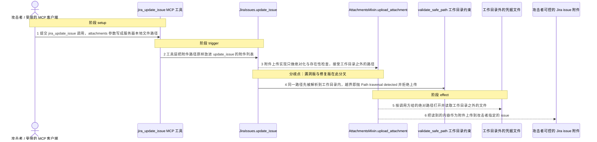
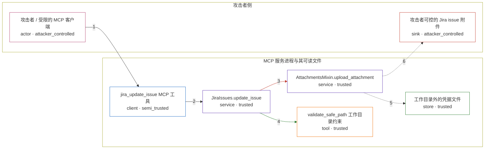

# mcp-atlassian / CVE-2026-77255

状态：草稿，未完成环境和复现。这个目录由模板生成，不构成漏洞确认。

图解的唯一来源是 `diagram.toml`：编辑后运行 `python3 -m runner diagram mcp-atlassian/CVE-2026-77255` 重新生成下方的图解区块。图解必须覆盖漏洞涉及的每个主体，并标出漏洞版/修复版的分歧步骤。

<!-- diagram:begin (generated from diagram.toml by `python3 -m runner diagram`; edit diagram.toml, not this block) -->
## 漏洞图解 — mcp-atlassian / CVE-2026-77255 漏洞图解

MCP 的 jira_update_issue 工具把 attachments 参数当作服务器本地文件路径处理，却在服务进程的工作目录里解析并打开它。v0.21.1 的 upload_attachment 只做绝对化与存在性检查，既不拒绝绝对路径也不拦 ../ 穿越，攻击者只要在攻击者自己的 Jira issue 上带上一条指向工作目录之外的路径，工具层就会以服务进程的高权限读取该文件并把它作为附件上传到该 issue。v0.22.0 改用它本已存在的 validate_safe_path 把路径限制在工作目录内，同一输入在打开文件之前就被拒绝。

### 涉及主体

| 主体 | 类型 | 信任级别 | 在漏洞里的作用 | 来源 |
| --- | --- | --- | --- | --- |
| 攻击者 / 受限的 MCP 客户端 (`attacker`) | `actor` | `attacker_controlled` | 构造 jira_update_issue 调用，并用 attachments 参数指定服务器本地文件路径；读取端是攻击者自己的 Jira 项目。 | — |
| jira_update_issue MCP 工具 (`mcp_tool`) | `client` | `semi_trusted` | 把 attachments 参数解析成文件路径列表后原样转发，不做任何工作目录约束。 | — |
| JiraIssues.update_issue (`issues`) | `service` | `trusted` | 收到 attachments 后交给附件上传实现，并保留其余 issue 更新语义。 | — |
| AttachmentsMixin.upload_attachment (`jira_client`) | `service` | `trusted` | 上游唯一收口点：先决定调用方给的路径是否可接受，再打开该文件并交给 Jira 的 add_attachment。 | src/mcp_atlassian/jira/attachments.py |
| validate_safe_path 工作目录约束 (`workspace_guard`) | `tool` | `trusted` | 把路径解析到服务进程的工作目录内；解析结果越界即抛 Path traversal detected。下载侧早已接上这道检查，上传侧直到 v0.22.0 才接上。 | src/mcp_atlassian/utils/io.py |
| 工作目录外的凭据文件 (`outside_file`) | `store` | `trusted` | 服务进程可读、攻击者够不着的受保护数据，例如进程环境文件或 SSH 私钥；它是攻击目标，不是攻击者的资产。 | — |
| 攻击者可控的 Jira issue 附件 (`issue_sink`) | `sink` | `attacker_controlled` | 外传落点：被读取的字节作为附件挂到攻击者自己指定的 issue 上，攻击者随后从该 issue 取回内容。 | — |

**信任边界**

- **攻击者侧** (`attacker_side`)：成员 `attacker`、`issue_sink`。攻击者只能构造工具调用参数，并读取自己 issue 上的附件；它没有宿主机文件系统访问权。
- **MCP 服务进程与其可读文件** (`host_process`)：成员 `mcp_tool`、`issues`、`jira_client`、`workspace_guard`、`outside_file`。服务进程持有 Jira 凭据并拥有宿主机文件系统访问权，本来只该读写工作目录内的文件；上传路径缺少工作目录约束让这道边界形同虚设。

### 触发过程

### 主体与信任边界

箭头上的数字是上面的步骤编号；方框只标主体和信任级别，具体动作见「触发过程」。

**分歧点**：第 3 步（`vulnerable_only`）附件上传实现只做绝对化与存在性检查，接受工作目录之外的路径。
**分歧点**：第 4 步（`patched_only`）同一路径先被解析到工作目录内，越界即抛 Path traversal detected 并拒绝上传。
<!-- diagram:end -->

## 公告与机制

- 公告：`GHSA-2xj6-xx86-cwwc`（GitHub Advisory，`database_specific.severity = HIGH`，已人工复核）。
- CWE-22（路径穿越）+ CWE-441（Confused Deputy）。
- 受影响范围：OSV 记录 `introduced: "0"`，最后一个受影响发布为 `0.21.1`；修复版本 `0.22.0`。
- 信任边界：MCP 客户端（AI agent）通过工具参数只提供本地文件路径；MCP server 进程持有
  `JIRA_API_TOKEN` 并拥有宿主机文件系统访问权。受限的 agent 借用服务进程的高权限读取文件，
  再把内容作为附件挂到攻击者可控的 Jira issue 上取回。
- 根因：`jira_update_issue` 的 `attachments` 参数被当作服务器本地路径，`upload_attachment`
  在服务进程工作目录里解析并打开它，但 v0.21.1 只做绝对化与存在性检查，不拒绝绝对路径与
  `../` 穿越。同一仓库的下载侧早已使用 `validate_safe_path`，上传侧遗漏。
- 修复：v0.22.0 把 `if not os.path.isabs(file_path): file_path = os.path.abspath(file_path)`
  换成 `file_path = str(validate_safe_path(file_path))`，解析结果离开工作目录即抛
  `ValueError("Path traversal detected: ...")`，永远到不了 `add_attachment`。

## 前提

- 服务进程可读工作目录之外的目标文件（容器内为 `/opt/avh-canary/host.env`，真实部署中对应
  `/proc/self/environ`、`~/.ssh/id_rsa`、`/etc/passwd` 等）。
- 攻击者能指定一个自己可读回的 Jira issue 作为外传落点，并能提交 `jira_update_issue` 调用。
- 攻击者能控制的只有这次调用的参数（issue key 与附件路径），没有宿主机文件系统写权限，
  不参与目标文件的创建。
- 攻击者不需要认证绕过：这是服务进程的权限被借用，不是凭据窃取。

## 版本与启动

- vulnerable：`v0.21.1`，commit `4e2b836a89dca2fc374133acca0d793f6b29f50c`。
- patched：`v0.22.0`，commit `b041733473f95119dd539542a43c280737a8e460`（= 修复提交 / PR #1448）。

Compose 中 `vulnerable` 与 `patched` profiles 分开使用；未指定 profile 不启动服务。镜像变量未配置时 Compose 会明确报错。此模板不暴露宿主端口，也不挂载主机数据。

## 机制复现

`reproduce.py` 在固定工作目录 `/lab/workspace` 下调用被固定的上游代码本体
`mcp_atlassian.jira.attachments.AttachmentsMixin.upload_attachments`（即
`JiraIssues.update_issue` 在 `attachments` 非空时派发的那个方法），只把 Jira 会话换成
记录型协作者 `RecordingJira.add_attachment` —— 它读取产品交给它的文件并记下字节数。
路径是否被接受、是否打开文件，全部由上游代码决定，没有重写漏洞函数。

- `scenario = "attack"`：附件参数为 `/opt/avh-canary/host.env`（工作目录之外）。
  漏洞版把该文件读进 sink；修复版返回 `{"success": false, "error": "Path traversal detected: ..."}` 且不调用 sink。
- `scenario = "benign"`：附件参数为工作目录内的 `planning-notes.txt`，两版都必须正常上传。

完成实现后使用 `python3 -m runner reproduce mcp-atlassian/CVE-2026-77255 --build --rounds 3`。
两脚本统一接受 `--context <context.json> --output <目录>`，详细字段见仓库 `docs/environment-contract.md`。
PoC 输出 `facts.json` 和效果文件；验证器只读证据，输出含 `target_ready` 及对应效果断言的 `verdict.json`。
镜像必须包含 Python 3 和 `/lab/` 下的脚本、fixtures；`runtime.mode` 选择 `oneshot` 或有 healthcheck 的 `service`。

## 端到端复现

不适用。该机制是纯进程内路径校验缺失，判定点是 `add_attachment` 是否被调用，不需要真实模型或
真实 Jira 服务；`verification.end_to_end` 保持 `not_applicable`。真实模型 / 真实 Jira 的结果
不能与机制复现混为一谈。

## 验证与修复对照

`verify.py` 只读 `facts.json`、`observation.json` 与哈希校验后的效果文件，不重跑攻击：

- 漏洞版攻击 → `vulnerable_effect_observed`：sink 恰好被调用一次，收到的字节与
  `fixtures/canary/host.env` 的标记内容逐字节相同。
- 修复版攻击 → `patched_effect_blocked`：sink 零次调用、`uploaded` 为空、
  `failed` 中带 `Path traversal detected`、且没有外传效果文件。
- 正常任务（两版）→ `benign_task_passed`：工作目录内的文件上传成功且无失败项。

服务启动失败、超时、缺证据都不算修复阻断。

## 清理

默认运行器按每个测试的唯一 Compose project 清理容器、网络和 volume。
`--keep-on-failure` 保留失败项目，项目标识和 Compose 配置在结果目录中；仅清理该项目，不能使用全局 prune。

## 失败诊断

- 漏洞版缺少外传效果：先确认 `/opt/avh-canary/host.env` 是否在镜像里、`/lab/workspace` 是否为
  进程工作目录；再确认 `mcp_atlassian` 装的是 v0.21.1 而不是被缓存的别的版本。
- 修复版仍有越界效果：确认镜像装的是 `b041733473f95119dd539542a43c280737a8e460`，
  并检查 `validate_safe_path` 的 `base_dir` 是否随 CWD 漂移。
- 正常任务失败：说明工作目录内的正常上传路径也被破坏，整轮不通过。
- 前提不满足（sink 从未被调用且漏洞版返回 `File not found`）：修复版结论无效，不能据此判定阻断。

启动失败、健康检查失败和超时都不能当作修复阻断。报告中应能定位到阶段、预期、实际和受控证据。

## 构建与输入

源码固定在上表两个完整 commit；构建阶段按 PyPI 官方 JSON API（`https://pypi.org/pypi/mcp-atlassian/<version>/json`）
实测的 SHA-256 下载并校验 `mcp_atlassian-0.21.1-py3-none-any.whl`
（`8ef9f5a68a58ac264aa6c98c891e7df14a02edde724f06ac5ea869b0be60b666`）与
`mcp_atlassian-0.22.0-py3-none-any.whl`
（`1c19db7e2eb3ba67d17a4a2fcfbe42abd97f13dd1c7d6d001d803980e0594d89`），
或对应的 sdist。`build.inputs` 必须逐项登记 URL 与 SHA-256，依赖安装必须支持禁网构建。
固定攻击和正常输入放入 `fixtures/` 并登记到 `fixtures/manifest.toml`。固定 seed、环境变量，说明无害效果与真实影响的关系。

## 隔离例外

默认无例外。确需例外时同时填写 `runtime.exceptions`、理由及最小范围，晋升由两位维护者审阅。

## 来源与许可

- `sooperset/mcp-atlassian`，MIT License，`Copyright (c) 2024 Hyeonsoo Lee`。
- 引用代码：`src/mcp_atlassian/jira/attachments.py`（`upload_attachment` / `upload_attachments`）、
  `src/mcp_atlassian/utils/io.py`（`validate_safe_path`）、
  `src/mcp_atlassian/jira/issues.py`（`update_issue` 的 attachments 派发）、
  `src/mcp_atlassian/servers/jira.py`（`update_issue` 工具的 attachments 解析）。
- 上游回归测试：`tests/unit/jira/test_attachments.py::TestUploadPathTraversalRegression`。
- 输入来源：GitHub Advisory `GHSA-2xj6-xx86-cwwc`、修复提交
  `b041733473f95119dd539542a43c280737a8e460`、PR #1448、release `v0.22.0`。
- `fixtures/` 内容全部为本目录虚构的标记数据，不含真实凭据、真实用户数据或宿主路径。
