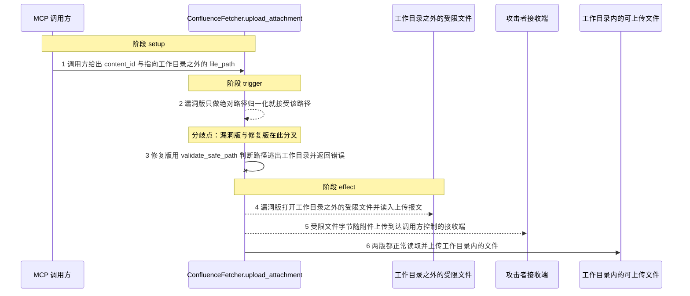
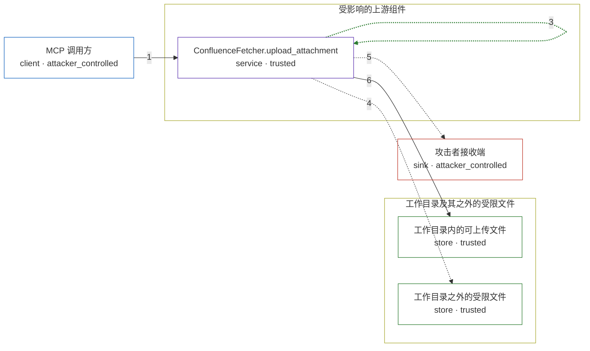

# mcp-atlassian / CVE-2026-77258

状态：草稿，未完成环境和复现。这个目录由模板生成，不构成漏洞确认。

图解的唯一来源是 `diagram.toml`：编辑后运行 `python3 -m runner diagram mcp-atlassian/CVE-2026-77258` 重新生成下方的图解区块。图解必须覆盖漏洞涉及的每个主体，并标出漏洞版/修复版的分歧步骤。

<!-- diagram:begin (generated from diagram.toml by `python3 -m runner diagram`; edit diagram.toml, not this block) -->
## 漏洞图解 — mcp-atlassian / CVE-2026-77258 漏洞图解

Confluence 附件上传路径 upload_attachment 只做 os.path.isabs / os.path.abspath 归一化，没有调用同文件已导入的 validate_safe_path，因此 MCP 调用方给出的 file_path 可以指向工作目录之外的任意文件。文件被 open() 读入 multipart 附件并随上传报文离开主机，落在远端 Confluence 附件里；同一个工作目录之外的受限文件本应不可读。修复版在 open() 之前改用 validate_safe_path(file_path) 约束路径，越界输入被拒，外传不会发生。

### 涉及主体

| 主体 | 类型 | 信任级别 | 在漏洞里的作用 | 来源 |
| --- | --- | --- | --- | --- |
| MCP 调用方 (`attacker`) | `client` | `attacker_controlled` | 完全控制 confluence_upload_attachment 的 content_id 与 file_path 参数：既可以给出工作目录内的正常文件，也可以给出绝对路径或 ../ 穿越路径指向目录之外。 | — |
| ConfluenceFetcher.upload_attachment (`uploader`) | `service` | `trusted` | 受影响的上游组件。它对 file_path 只做 isabs / abspath 归一化与 exists 检查，没有目录约束就交给 _upload_attachment_direct 读取并上传。 | src/mcp_atlassian/confluence/attachments.py |
| 工作目录内的可上传文件 (`workspace_file`) | `store` | `trusted` | 正常业务需要上传的附件，位于工作目录内；两版都会读取并上传它，用来确认修复没有把上传功能整体打死。 | fixtures/benign/input.json |
| 工作目录之外的受限文件 (`secret_file`) | `store` | `trusted` | MCP 服务进程可读但本不该被调用方取走的文件（应用密钥、云凭证一类）。它位于工作目录之外，是攻击者的目标而不是它自己可控的数据。 | fixtures/attack/secret.txt |
| 攻击者接收端 (`receiver`) | `sink` | `attacker_controlled` | 接收上传报文里的文件字节。目录之外的受限文件内容随附件到达这里，任意文件读取与外传由此成立。 | — |

**信任边界**

- **工作目录及其之外的受限文件** (`protected`)：成员 `workspace_file`、`secret_file`。上传来源本应被限制在工作目录内，工作目录之外的受限文件不应该被上传路径读到。
- **受影响的上游组件** (`product`)：成员 `uploader`。upload_attachment 是唯一决定读哪个文件的组件，它缺少目录约束，这道边界在漏洞版里失效。
- 未列入上述边界：`attacker`、`receiver`。

### 触发过程

### 主体与信任边界

箭头上的数字是上面的步骤编号；方框只标主体和信任级别，具体动作见「触发过程」。

**分歧点**：第 2 步（`vulnerable_only`）漏洞版只做绝对路径归一化就接受该路径。
**分歧点**：第 3 步（`patched_only`）修复版用 validate_safe_path 判断路径逃出工作目录并返回错误。
<!-- diagram:end -->

## 公告与机制

TODO：官方公告、漏洞根因、Agent 信任边界、受影响范围和修复来源。

## 前提

TODO：认证要求、用户交互、已有批准、工具权限、攻击者能控制的内容。

## 版本与启动

TODO：补全 metadata、Dockerfile/镜像 digest 和 Compose，再写出精确启动命令。

Compose 中 `vulnerable` 与 `patched` profiles 分开使用；未指定 profile 不启动服务。镜像变量未配置时 Compose 会明确报错。此模板不暴露宿主端口，也不挂载主机数据。

## 机制复现

TODO：实现 `reproduce.py`，固定输入并执行真实漏洞路径，注明运行位置、参数和超时。

完成实现后使用 `python3 -m runner reproduce mcp-atlassian/CVE-2026-77258 --build --rounds 3`。
两脚本统一接受 `--context <context.json> --output <目录>`，详细字段见仓库 `docs/environment-contract.md`。
PoC 输出 `facts.json` 和效果文件；验证器只读证据，输出含 `target_ready` 及对应效果断言的 `verdict.json`。
镜像必须包含 Python 3 和 `/lab/` 下的脚本、fixtures；`runtime.mode` 选择 `oneshot` 或有 healthcheck 的 `service`。

## 端到端复现

TODO：实现 `end_to_end.py`；若不需要模型，明确写出不适用原因。真实模型的结果与机制复现分开统计。

## 验证与修复对照

TODO：实现 `verify.py`。记录漏洞版无害效果、修复版阻断和正常任务成功的证据，不能把服务启动失败当成阻断。

## 清理

默认运行器按每个测试的唯一 Compose project 清理容器、网络和 volume。
`--keep-on-failure` 保留失败项目，项目标识和 Compose 配置在结果目录中；仅清理该项目，不能使用全局 prune。

## 失败诊断

TODO：为本漏洞写出预期效果缺失、修复版仍有越界效果、正常任务失败及前提不满足时的具体排查路径。
启动失败、健康检查失败和超时都不能当作修复阻断。报告中应能定位到阶段、预期、实际和受控证据。

## 构建与输入

TODO：填写两版源码 archive、完整 commit，记录 `build.inputs` 中每个下载的 SHA-256；依赖安装必须支持禁网构建。
固定攻击和正常输入放入 `fixtures/` 并登记到 `fixtures/manifest.toml`。固定 seed、环境变量，说明无害效果与真实影响的关系。

## 隔离例外

默认无例外。确需例外时同时填写 `runtime.exceptions`、理由及最小范围，晋升由两位维护者审阅。

## 来源与许可

TODO：列出引用代码、fixtures 和镜像的来源及许可。
