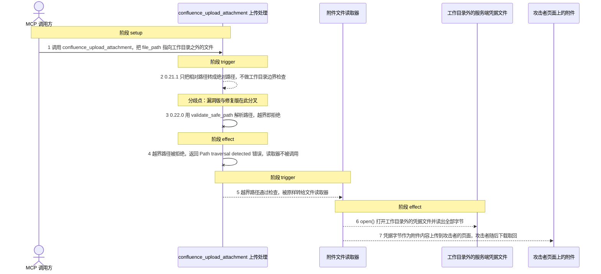
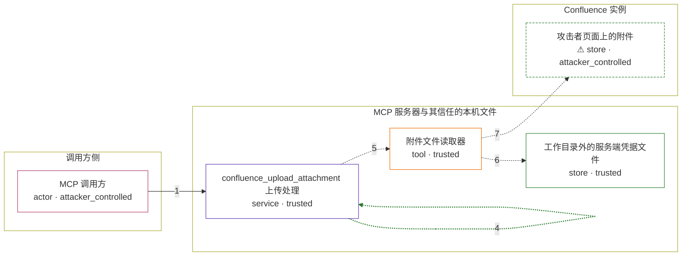

# mcp-atlassian / CVE-2026-77259

状态：草稿。`generate` 阶段的产物（图解、攻击/正常输入、机制复现脚本）已完成，尚未构建镜像、未跑过容器，因此不宣称任何复现成功。

图解的唯一来源是 `diagram.toml`：编辑后运行 `python3 -m runner diagram mcp-atlassian/CVE-2026-77259` 重新生成下方的图解区块。图解必须覆盖漏洞涉及的每个主体，并标出漏洞版/修复版的分歧步骤。

<!-- diagram:begin (generated from diagram.toml by `python3 -m runner diagram`; edit diagram.toml, not this block) -->
## 漏洞图解 — mcp-atlassian / CVE-2026-77259 漏洞图解

confluence_upload_attachment 把调用方给出的 file_path 直接当作上传源，0.21.1 只做相对转绝对就交给 open() 读取，从不校验该路径是否仍在工作目录内。于是越出工作目录的绝对路径与 ../ 相对路径都能被读成附件内容。0.22.0 在读取前调用 validate_safe_path，越界路径抛出 Path traversal detected 并被外层 except 转成 error dict，文件不再被打开。攻击者由此把 MCP 服务器进程可读的任意文件（例如 /proc/self/environ 里的运行时密钥）复制到自己能下载的 Confluence 附件里。

### 涉及主体

| 主体 | 类型 | 信任级别 | 在漏洞里的作用 | 来源 |
| --- | --- | --- | --- | --- |
| MCP 调用方 (`attacker`) | `actor` | `attacker_controlled` | 对某个 Confluence 页面有编辑权限的已认证调用方，完全控制 confluence_upload_attachment 的 content_id 与 file_path 参数，并在自己的页面上取回生成的附件。 | — |
| confluence_upload_attachment 上传处理 (`upload_tool`) | `service` | `trusted` | 上游 AttachmentsMixin.upload_attachment：把调用方路径归一为绝对路径后交给读取器，自身没有任何工作目录边界检查，因此信任了不可信的 file_path。 | — |
| 附件文件读取器 (`file_reader`) | `tool` | `trusted` | 上游 _upload_attachment_direct，用 open(file_path, rb) 打开调用方指定的文件，并把文件句柄作为 multipart 的 file 字段上传。 | — |
| 工作目录外的服务端凭据文件 (`credential_file`) | `store` | `trusted` | MCP 服务器运行时可读、但工作目录之外的秘密文件，例如进程环境 /proc/self/environ 或凭据文件；是攻击者想要却够不着的目标，按外部输入解析的路径才会到达它。 | — |
| ⚠ 攻击者页面上的附件 (`confluence_page`) | `store` | `attacker_controlled` | 上传落点：越界文件的原始字节成为攻击者可下载的附件，数据由此回到攻击者手里。 | — |

**信任边界**

- **调用方侧** (`caller_side`)：成员 `attacker`。这里只有一次工具调用参数：content_id 与 file_path。攻击者能改写这两个值，但不能直接读写 MCP 服务器的文件系统。
- **MCP 服务器与其信任的本机文件** (`server_side`)：成员 `upload_tool`、`file_reader`、`credential_file`。上传处理本来只应读取调用方工作目录里的文件；漏洞让它把整条路径原样转给 open()，工作目录边界不再拦住越界的绝对路径与 ../ 穿越。
- **Confluence 实例** (`confluence_side`)：成员 `confluence_page`。附件最终存放在攻击者有权编辑并下载的 Confluence 页面上，因此被读出的字节对攻击者完全可见。

标 ⚠ 的主体是本仓库合成的替身或无害效果载体，不代表真实外部目标。

### 触发过程

### 主体与信任边界

箭头上的数字是上面的步骤编号；方框只标主体和信任级别，具体动作见「触发过程」。

**分歧点**：第 2 步（`vulnerable_only`）0.21.1 只把相对路径转成绝对路径，不做工作目录边界检查。
**分歧点**：第 3 步（`patched_only`）0.22.0 用 validate_safe_path 解析路径，越界即拒绝。
<!-- diagram:end -->

## 公告与机制

- GHSA-6cr4-ccf3-x7h4 / CVE-2026-77259（HIGH，CWE-22、CWE-552）。
- 根因：`confluence_upload_attachment` 把调用方提供的 `file_path` 当作可信的本地上传源。`AttachmentsMixin.upload_attachment`（`src/mcp_atlassian/confluence/attachments.py`）在 0.21.1 只做 `os.path.isabs` → `os.path.abspath`，随后 `_upload_attachment_direct` 用 `open(file_path, "rb")` 读取并作为 multipart 上传。整个过程中没有任何工作目录边界检查。
- 信任边界：MCP 客户端（任何对某页面有编辑权限的已认证调用者）能控制的只有这次调用的 `content_id` 与 `file_path` 参数；它想要的是 MCP 服务器进程可读、但位于工作目录之外的文件。
- 修复：v0.22.0（commit `b041733473f95119dd539542a43c280737a8e460`，PR #1448）把该处替换为 `file_path = str(validate_safe_path(file_path))`；`validate_safe_path` 以调用时的 `os.getcwd()` 为硬边界，`Path.resolve` 解析 `..` 与符号链接，越界抛 `ValueError("Path traversal detected: ...")`，被 `upload_attachment` 外层 `except Exception` 转成 `{"success": False, "error": ...}`，读取器不再被调用。
- 这是下载侧修复（CVE-2026-27825 / GHSA-xjgw-4wvw-rgm4 引入的 `validate_safe_path`）遗漏的对称路径：下载侧 0.21.1 已经调用它，上传侧从未调用。
- 受影响范围：所有 < 0.22.0 的发布版；本环境对照 `v0.21.1`（`4e2b836a89dca2fc374133acca0d793f6b29f50c`）与 `v0.22.0`（`b041733473f95119dd539542a43c280737a8e460`）。

## 前提

- 调用方已认证，并对目标 Confluence 页面有编辑权限（advisory 的 CVSS 向量为 `PR:L`）。
- 上传处理的工作目录（`os.getcwd()`）就是允许上传的边界；目标文件位于它之外，是环境本来就有的事实，不是攻击者的动作。
- 攻击者只控制本次工具调用的 `file_path` 参数。机制复现里它是固定输入，不是对宿主机的写权限。
- 不需要真实 Confluence 实例，也不需要网络出口：`_upload_attachment_direct` 的 PUT/POST 与下载侧的 GET 都指向本容器内的受控接收器。

## 版本与启动

机制复现使用的两个固定 revision（`build` 阶段把它们装进对应镜像）：

| variant | 版本 | 完整 commit | 源码 URL |
| --- | --- | --- | --- |
| vulnerable | `v0.21.1` | `4e2b836a89dca2fc374133acca0d793f6b29f50c` | https://github.com/sooperset/mcp-atlassian/archive/4e2b836a89dca2fc374133acca0d793f6b29f50c.tar.gz |
| patched | `v0.22.0` | `b041733473f95119dd539542a43c280737a8e460` | https://github.com/sooperset/mcp-atlassian/archive/b041733473f95119dd539542a43c280737a8e460.tar.gz |

`metadata.toml` 的 `build.inputs` 尚未补齐（源码归档与离线依赖的 URL + SHA-256），镜像 digest 也尚未发布；这两项由 `build` 阶段完成。

Compose 中 `vulnerable` 与 `patched` profiles 分开使用；未指定 profile 不启动服务。镜像变量未配置时 Compose 会明确报错。此模板不暴露宿主端口，也不挂载主机数据。

## 机制复现

`reproduce.py`（配合 `lab_harness.py`）在镜像内 `/lab` 下运行，只调用已安装的上游包本体：

- 用 SHA-256 校验 `mcp_atlassian/confluence/attachments.py` 是否等于该 variant 对应 revision 的发布字节（`v0.21.1` = `35a98dba…`，`v0.22.0` = `0f32292c…`），不匹配即判 `target_ready = false`；
- 把 cwd 切到 `/lab/sandbox/workspace`，其兄弟位置放固定秘密文件 `/lab/sandbox/secret.txt`（内容为合成标记）；
- 攻击场景调用两次 `upload_attachment(content_id="77259001", file_path=...)`：`../secret.txt`（相对穿越）与 `/lab/sandbox/secret.txt` 的绝对形式；正常场景调用 `notes.txt`（位于工作目录内）；
- 用容器内 127.0.0.1 上的受控接收器承接 multipart，再用上游自己的 `download_attachment` 把该附件取回，验证读出的字节可被攻击者下载；
- 效果文件写入 `--output` 下的 `sink/<attempt>/capture-*.bin` 与 `sink/<attempt>/published-*.bin`，并记录 `target_ready` 与 `execution_status`。

工作目录用固定路径 `/lab/sandbox`，攻击输入里的越界绝对路径由 `lab_harness.resolve_requested_path()` 按当次沙箱位置生成，因此 fixtures 不含任何宿主路径。

完成实现后使用 `python3 -m runner reproduce mcp-atlassian/CVE-2026-77259 --build --rounds 3`。
两脚本统一接受 `--context <context.json> --output <目录>`，详细字段见仓库 `docs/environment-contract.md`。
PoC 输出 `facts.json` 和效果文件；验证器只读证据，输出含 `target_ready` 及对应效果断言的 `verdict.json`。
镜像必须包含 Python 3 和 `/lab/` 下的脚本、fixtures；`runtime.mode` 选择 `oneshot` 或有 healthcheck 的 `service`。

## 端到端复现

不适用：本漏洞是被固定工具调用参数触发的确定性路径穿越，机制复现不经过模型，`metadata.toml` 中 `requires_model = false`、`[verification.end_to_end].status = "not_applicable"`。真实模型的结果与机制复现分开统计。

## 验证与修复对照

`verify.py` 只读 `facts.json`、`observation.json` 与效果文件，不重跑攻击，并自行重算哈希：

- 漏洞版攻击 → `vulnerable_effect_observed`：两条越界路径的上传 payload 与下载回读内容都包含秘密文件字节；
- 修复版攻击 → `patched_effect_blocked`：两次调用都返回 `{"success": False, "error": "Path traversal detected: …"}`，且没有任何 capture/download 效果文件；
- 正常任务（两版）→ `benign_task_passed`：`notes.txt` 被完整读出并上传，回读字节与 fixture 逐字节一致。

`verify.py` 不信任 PoC 自报的 `success`/`contains_secret_marker` 字段，秘密标记由 verifier 自己从 fixture 读出并在效果文件里查找。

## 清理

默认运行器按每个测试的唯一 Compose project 清理容器、网络和 volume。
`--keep-on-failure` 保留失败项目，项目标识和 Compose 配置在结果目录中；仅清理该项目，不能使用全局 prune。

## 失败诊断

- `target_ready = false`：镜像里安装的不是固定 revision（源码哈希不符），或 `mcp_atlassian` 未安装、`requests` 缺失。
- 漏洞版没有 capture：确认 cwd 是 `/lab/sandbox/workspace`、秘密文件在 `/lab/sandbox/secret.txt`、接收器端口可用；先看 `observation.json` 的 `attempts[].result`。
- 修复版仍有 capture：说明安装的是 0.21.1；检查两版镜像的 `org.opencontainers.image.revision` 与源码哈希。
- 正常任务失败：`notes.txt` 缺失或上传路径被拒，无法排除服务整体不可用，整轮不通过。
- `execution_status = failed`：`observation.json` 的 `notes` 里记录了具体异常，verifier 会返回 `not_run`(2)。
- 启动失败、健康检查失败和超时都不能当作修复阻断。报告中应能定位到阶段、预期、实际和受控证据。

## 构建与输入

两版源码 archive 与完整 commit 见上面「版本与启动」表；`build.inputs` 中源码归档与全部离线依赖的 URL + SHA-256 由 `build` 阶段填写，`Dockerfile` 必须在 `--network none` 下可构建。
固定攻击和正常输入放入 `fixtures/` 并登记到 `fixtures/manifest.toml`。固定 seed、环境变量，说明无害效果与真实影响的关系。

## 隔离例外

默认无例外。确需例外时同时填写 `runtime.exceptions`、理由及最小范围，晋升由两位维护者审阅。

## 来源与许可

- 上游代码：`sooperset/mcp-atlassian`（MIT），本环境只从 PyPI/源码归档安装，不复制或重写漏洞函数。
- fixtures：全部为本仓库合成的输入与标记（`AVH-EXFIL-77259-…`），不含真实凭据、真实用户数据或宿主路径。
- 接收器只监听容器内 `127.0.0.1`，不接触外部服务。
